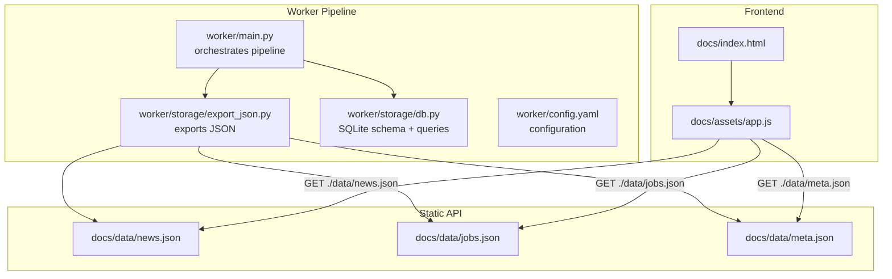
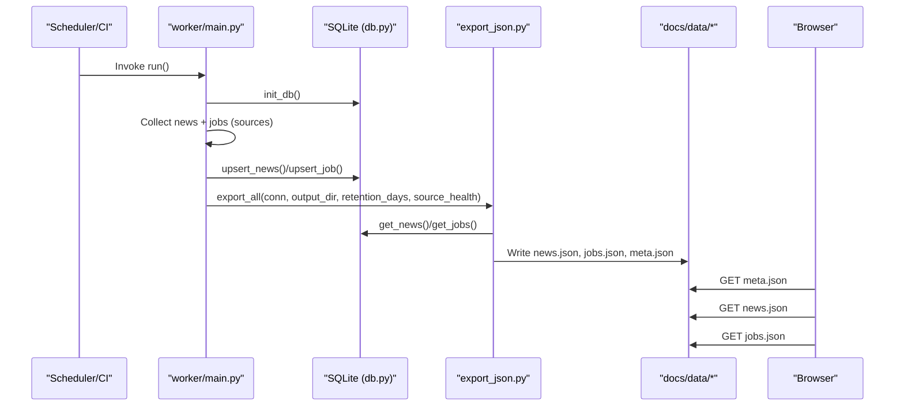
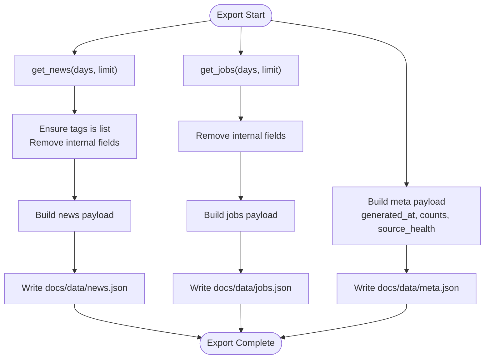
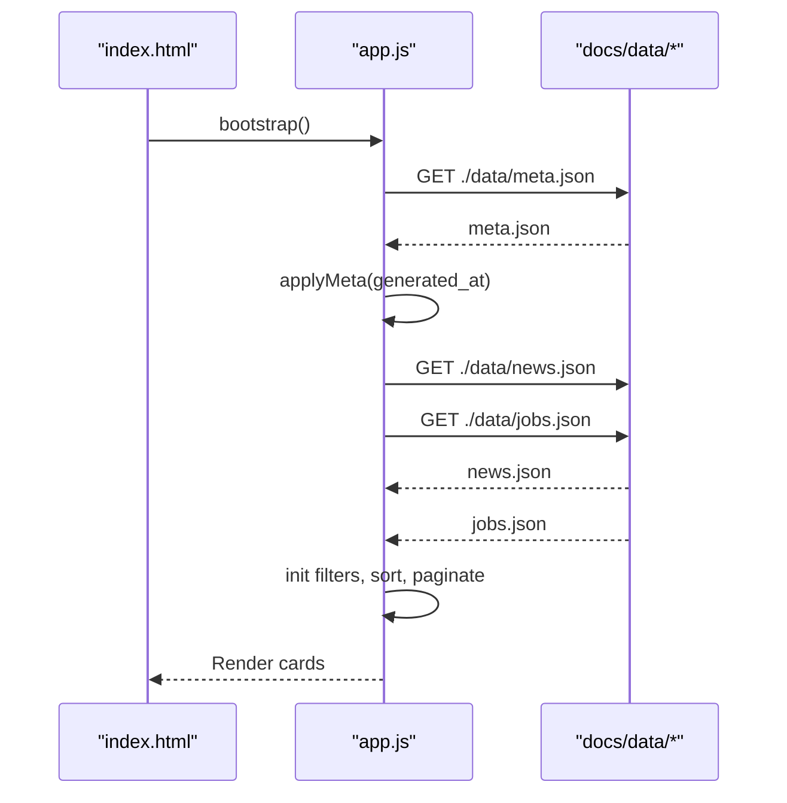
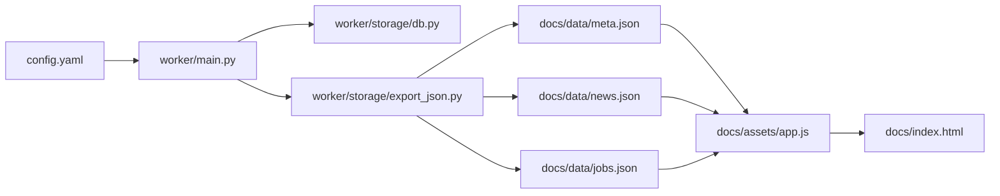

# API Reference

<cite>
**Referenced Files in This Document**
- [main.py](file://worker/main.py)
- [export_json.py](file://worker/storage/export_json.py)
- [db.py](file://worker/storage/db.py)
- [config.yaml](file://worker/config.yaml)
- [meta.json](file://docs/data/meta.json)
- [news.json](file://docs/data/news.json)
- [jobs.json](file://docs/data/jobs.json)
- [app.js](file://docs/assets/app.js)
- [index.html](file://docs/index.html)
- [test_schema.py](file://tests/test_schema.py)
- [devto.py](file://worker/collectors/news/devto.py)
- [lever.py](file://worker/collectors/jobs/lever.py)
</cite>

## Table of Contents
1. [Introduction](#introduction)
2. [Project Structure](#project-structure)
3. [Core Components](#core-components)
4. [Architecture Overview](#architecture-overview)
5. [Detailed Component Analysis](#detailed-component-analysis)
6. [Dependency Analysis](#dependency-analysis)
7. [Performance Considerations](#performance-considerations)
8. [Troubleshooting Guide](#troubleshooting-guide)
9. [Conclusion](#conclusion)
10. [Appendices](#appendices)

## Introduction
This document provides a comprehensive API reference for the DevOps & AI Hub static JSON API. It defines the JSON schema for news and jobs content, describes data validation rules, and explains the data export process that generates static files consumed by the frontend. It also covers versioning strategies, backward compatibility, migration guidance, rate limiting, caching headers, and performance optimization recommendations for API consumers.

## Project Structure
The API surface is a static JSON dataset hosted under docs/data/. The worker orchestrates collection, deduplication, scoring, persistence, and export to produce three files:
- docs/data/news.json
- docs/data/jobs.json
- docs/data/meta.json

The frontend (docs/index.html + docs/assets/app.js) consumes these files to render the news and jobs tabs.

**Diagram sources**
- [main.py:127-292](file://worker/main.py#L127-L292)
- [export_json.py:32-92](file://worker/storage/export_json.py#L32-L92)
- [db.py:22-67](file://worker/storage/db.py#L22-L67)
- [config.yaml:1-244](file://worker/config.yaml#L1-L244)
- [news.json:1-5](file://docs/data/news.json#L1-L5)
- [jobs.json:1-5](file://docs/data/jobs.json#L1-L5)
- [meta.json:1-7](file://docs/data/meta.json#L1-L7)
- [index.html:1-86](file://docs/index.html#L1-L86)
- [app.js:101-129](file://docs/assets/app.js#L101-L129)

**Section sources**
- [main.py:127-292](file://worker/main.py#L127-L292)
- [export_json.py:32-92](file://worker/storage/export_json.py#L32-L92)
- [db.py:22-67](file://worker/storage/db.py#L22-L67)
- [config.yaml:1-244](file://worker/config.yaml#L1-L244)
- [news.json:1-5](file://docs/data/news.json#L1-L5)
- [jobs.json:1-5](file://docs/data/jobs.json#L1-L5)
- [meta.json:1-7](file://docs/data/meta.json#L1-L7)
- [index.html:1-86](file://docs/index.html#L1-L86)
- [app.js:101-129](file://docs/assets/app.js#L101-L129)

## Core Components
- Static JSON API
  - news.json: Top-level keys generated_at and items; items are news entries.
  - jobs.json: Top-level keys generated_at and items; items are job listings.
  - meta.json: Top-level keys generated_at, news_count, jobs_count, source_health.
- Data Validation Rules
  - Required top-level keys present in each file.
  - Items arrays contain objects with required fields.
  - Fields such as relevance_score are numeric and in [0.0, 1.0].
  - Tags fields are lists.
  - No duplicate IDs within each items array.
- Export Process
  - Worker exports to docs/data/ with generated_at timestamp and counts.
  - Internal timestamps first_seen_at and last_seen_at are excluded from JSON output.
- Frontend Consumption
  - Frontend loads meta.json first, then concurrently loads news.json and jobs.json.
  - Uses query parameters to avoid cache interference during reloads.

**Section sources**
- [test_schema.py:28-51](file://tests/test_schema.py#L28-L51)
- [test_schema.py:53-97](file://tests/test_schema.py#L53-L97)
- [test_schema.py:99-136](file://tests/test_schema.py#L99-L136)
- [export_json.py:32-92](file://worker/storage/export_json.py#L32-L92)
- [db.py:163-179](file://worker/storage/db.py#L163-L179)
- [app.js:101-129](file://docs/assets/app.js#L101-L129)

## Architecture Overview
The system follows a batch-oriented pipeline that produces static JSON files consumed by a static frontend.

**Diagram sources**
- [main.py:127-292](file://worker/main.py#L127-L292)
- [export_json.py:32-92](file://worker/storage/export_json.py#L32-L92)
- [db.py:116-242](file://worker/storage/db.py#L116-L242)
- [news.json:1-5](file://docs/data/news.json#L1-L5)
- [jobs.json:1-5](file://docs/data/jobs.json#L1-L5)
- [meta.json:1-7](file://docs/data/meta.json#L1-L7)

## Detailed Component Analysis

### Static JSON API Endpoints
- Endpoint: GET /data/meta.json
  - Description: Provides metadata about the dataset, including generation timestamp, counts, and source health.
  - Response shape:
    - generated_at: ISO 8601 UTC timestamp string.
    - news_count: Non-negative integer.
    - jobs_count: Non-negative integer.
    - source_health: Object mapping source identifiers to status strings.
  - Example payload path: [meta.json:1-7](file://docs/data/meta.json#L1-L7)
- Endpoint: GET /data/news.json
  - Description: Provides paginated news items with filtering and sorting capabilities handled client-side.
  - Response shape:
    - generated_at: ISO 8601 UTC timestamp string.
    - items: Array of news objects.
  - Example payload path: [news.json:1-5](file://docs/data/news.json#L1-L5)
- Endpoint: GET /data/jobs.json
  - Description: Provides job listings with client-side filtering and sorting.
  - Response shape:
    - generated_at: ISO 8601 UTC timestamp string.
    - items: Array of job objects.
  - Example payload path: [jobs.json:1-5](file://docs/data/jobs.json#L1-L5)

**Section sources**
- [meta.json:1-7](file://docs/data/meta.json#L1-L7)
- [news.json:1-5](file://docs/data/news.json#L1-L5)
- [jobs.json:1-5](file://docs/data/jobs.json#L1-L5)
- [app.js:101-129](file://docs/assets/app.js#L101-L129)

### Data Schemas and Field Definitions

#### Meta Schema
- generated_at: String (ISO 8601 UTC).
- news_count: Integer (≥ 0).
- jobs_count: Integer (≥ 0).
- source_health: Object<String, String>.

Validation rules:
- All required keys present.
- Counts are non-negative integers.
- source_health is an object.

**Section sources**
- [test_schema.py:28-51](file://tests/test_schema.py#L28-L51)
- [meta.json:1-7](file://docs/data/meta.json#L1-L7)

#### News Item Schema
- id: String (unique within items).
- title: String.
- url: String (absolute URL).
- source: String (source identifier).
- published_at: String (ISO 8601 UTC or fallback timestamp).
- summary: String (optional).
- tags: Array<String> (optional, defaults to empty list).
- relevance_score: Number (0.0 ≤ x ≤ 1.0).

Validation rules:
- Required fields: id, title, url, source, published_at.
- tags is a list.
- relevance_score is numeric and within [0, 1].
- No duplicate IDs.

**Section sources**
- [test_schema.py:53-97](file://tests/test_schema.py#L53-L97)
- [export_json.py:49-63](file://worker/storage/export_json.py#L49-L63)
- [db.py:163-179](file://worker/storage/db.py#L163-L179)

#### Jobs Item Schema
- id: String (unique within items).
- title: String.
- company: String.
- url: String (absolute URL).
- source: String (source identifier).
- location: String (optional).
- posted_at: String (ISO 8601 UTC or fallback timestamp).
- category: String (optional).
- relevance_score: Number (0.0 ≤ x ≤ 1.0).
- salary_range: String or null (optional).

Validation rules:
- Required fields: id, title, company, url, source, posted_at.
- relevance_score is numeric and within [0, 1].
- No duplicate IDs.

**Section sources**
- [test_schema.py:99-136](file://tests/test_schema.py#L99-L136)
- [export_json.py:65-75](file://worker/storage/export_json.py#L65-L75)
- [db.py:232-242](file://worker/storage/db.py#L232-L242)

### Data Export Process and File Generation Patterns
- Export function:
  - Reads items from SQLite using get_news() and get_jobs().
  - Ensures tags is a list for news items.
  - Removes internal timestamps (first_seen_at, last_seen_at) from exported items.
  - Writes news.json, jobs.json, and meta.json with generated_at timestamp and counts.
- Retention window:
  - Export respects retention_days from configuration.
- Source health:
  - Optional source_health dictionary passed to export_all() and written to meta.json.

**Diagram sources**
- [export_json.py:32-92](file://worker/storage/export_json.py#L32-L92)
- [db.py:163-179](file://worker/storage/db.py#L163-L179)
- [db.py:232-242](file://worker/storage/db.py#L232-L242)

**Section sources**
- [export_json.py:32-92](file://worker/storage/export_json.py#L32-L92)
- [db.py:163-179](file://worker/storage/db.py#L163-L179)
- [db.py:232-242](file://worker/storage/db.py#L232-L242)

### Frontend Consumption Methods
- Loading order:
  - Load meta.json first to determine last update and staleness.
  - Concurrently load news.json and jobs.json.
- Caching behavior:
  - Frontend appends a cache-busting query parameter (_=Date.now()) to fetch calls.
- Filtering and pagination:
  - Client-side filtering by tags, sources, date windows, and free-text search.
  - Pagination with fixed page size.

**Diagram sources**
- [index.html:1-86](file://docs/index.html#L1-L86)
- [app.js:101-129](file://docs/assets/app.js#L101-L129)
- [app.js:132-145](file://docs/assets/app.js#L132-L145)
- [app.js:241-254](file://docs/assets/app.js#L241-L254)

**Section sources**
- [index.html:1-86](file://docs/index.html#L1-L86)
- [app.js:101-129](file://docs/assets/app.js#L101-L129)
- [app.js:132-145](file://docs/assets/app.js#L132-L145)
- [app.js:241-254](file://docs/assets/app.js#L241-L254)

### Versioning Strategies, Backward Compatibility, and Migration
- Versioning
  - The API is static JSON with top-level keys generated_at, items, and counts. There is no explicit version field in the current schema.
- Backward Compatibility
  - Consumers should treat missing optional fields gracefully (e.g., summary, tags, category, salary_range).
  - Arrays like tags and items should be checked for presence before iteration.
- Migration Guidance
  - If adding new optional fields, ensure consumers default to safe values (empty string/array/null).
  - Maintain stable sorting and filtering semantics on the client side to avoid breaking changes.

[No sources needed since this section provides general guidance]

### Rate Limiting and Caching Headers
- Rate Limiting
  - Some upstream sources impose rate limits (e.g., Reddit public JSON requires a minimum delay between requests).
- Caching Headers
  - The static JSON files are served as static assets. To prevent stale reads, the frontend app injects a cache-busting query parameter on each fetch.
  - Recommendation: Configure CDN/proxy to honor cache-control headers; otherwise, rely on the client’s cache-busting strategy.

**Section sources**
- [config.yaml:114-115](file://worker/config.yaml#L114-L115)
- [app.js:102-106](file://docs/assets/app.js#L102-L106)

## Dependency Analysis
The static JSON API depends on the worker pipeline and configuration. The frontend depends on the presence of docs/data/* and applies client-side logic for rendering and filtering.

**Diagram sources**
- [config.yaml:1-244](file://worker/config.yaml#L1-L244)
- [main.py:127-292](file://worker/main.py#L127-L292)
- [db.py:22-67](file://worker/storage/db.py#L22-L67)
- [export_json.py:32-92](file://worker/storage/export_json.py#L32-L92)
- [news.json:1-5](file://docs/data/news.json#L1-L5)
- [jobs.json:1-5](file://docs/data/jobs.json#L1-L5)
- [meta.json:1-7](file://docs/data/meta.json#L1-L7)
- [app.js:101-129](file://docs/assets/app.js#L101-L129)
- [index.html:1-86](file://docs/index.html#L1-L86)

**Section sources**
- [config.yaml:1-244](file://worker/config.yaml#L1-L244)
- [main.py:127-292](file://worker/main.py#L127-L292)
- [db.py:22-67](file://worker/storage/db.py#L22-L67)
- [export_json.py:32-92](file://worker/storage/export_json.py#L32-L92)
- [news.json:1-5](file://docs/data/news.json#L1-L5)
- [jobs.json:1-5](file://docs/data/jobs.json#L1-L5)
- [meta.json:1-7](file://docs/data/meta.json#L1-L7)
- [app.js:101-129](file://docs/assets/app.js#L101-L129)
- [index.html:1-86](file://docs/index.html#L1-L86)

## Performance Considerations
- Client-Side Rendering
  - Sorting and filtering are performed client-side; keep items arrays reasonably sized to maintain responsiveness.
- Pagination
  - Fixed page size reduces DOM churn; adjust PAGE_SIZE in app.js if needed.
- Network Requests
  - The app performs concurrent fetches for news.json and jobs.json after meta.json.
- Staleness Awareness
  - The UI displays a warning banner when data exceeds a configured staleness threshold.

**Section sources**
- [app.js:8-10](file://docs/assets/app.js#L8-L10)
- [app.js:120-129](file://docs/assets/app.js#L120-L129)
- [index.html:21-23](file://docs/index.html#L21-L23)

## Troubleshooting Guide
- Validation Failures
  - Use the provided tests to validate local datasets against the schema.
- Missing Keys or Types
  - Ensure generated_at is present and non-empty; verify counts are integers; confirm items are arrays.
- Duplicate IDs
  - Duplicate IDs violate the schema; re-run the pipeline to regenerate clean datasets.
- Stale Data
  - The frontend warns when data is older than a configured threshold; trigger a new export to refresh.

**Section sources**
- [test_schema.py:28-51](file://tests/test_schema.py#L28-L51)
- [test_schema.py:53-97](file://tests/test_schema.py#L53-L97)
- [test_schema.py:99-136](file://tests/test_schema.py#L99-L136)
- [index.html:21-23](file://docs/index.html#L21-L23)

## Conclusion
The DevOps & AI Hub exposes a simple, static JSON API suitable for client-side rendering and offline consumption. The worker pipeline ensures consistent schemas, validates data, and publishes stable datasets. Consumers should handle optional fields gracefully, respect upstream rate limits, and leverage the cache-busting pattern to avoid stale reads.

[No sources needed since this section summarizes without analyzing specific files]

## Appendices

### Example Payload Paths
- Meta: [meta.json:1-7](file://docs/data/meta.json#L1-L7)
- News: [news.json:1-5](file://docs/data/news.json#L1-L5)
- Jobs: [jobs.json:1-5](file://docs/data/jobs.json#L1-L5)

### Collector Data Shapes (Examples)
- News collector example (Dev.to): [devto.py:21-72](file://worker/collectors/news/devto.py#L21-L72)
- Jobs collector example (Lever): [lever.py:22-85](file://worker/collectors/jobs/lever.py#L22-L85)

**Section sources**
- [meta.json:1-7](file://docs/data/meta.json#L1-L7)
- [news.json:1-5](file://docs/data/news.json#L1-L5)
- [jobs.json:1-5](file://docs/data/jobs.json#L1-L5)
- [devto.py:21-72](file://worker/collectors/news/devto.py#L21-L72)
- [lever.py:22-85](file://worker/collectors/jobs/lever.py#L22-L85)