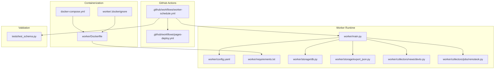
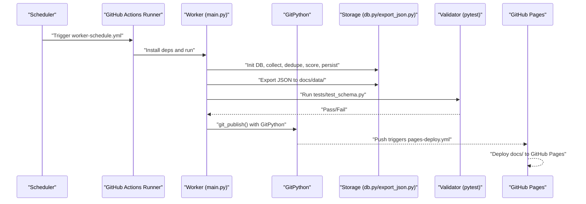
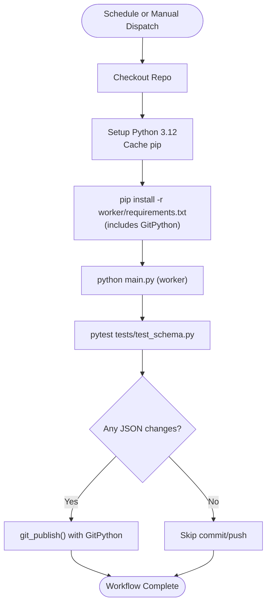
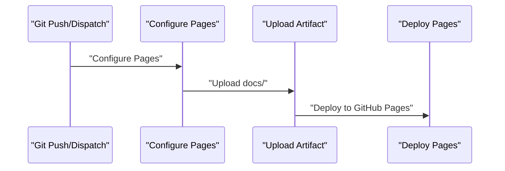
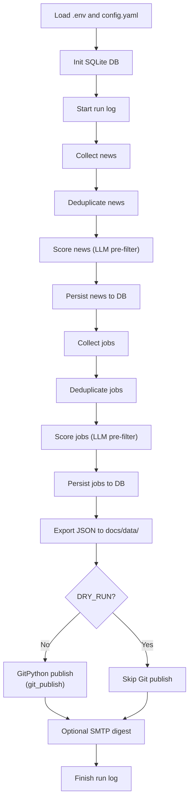
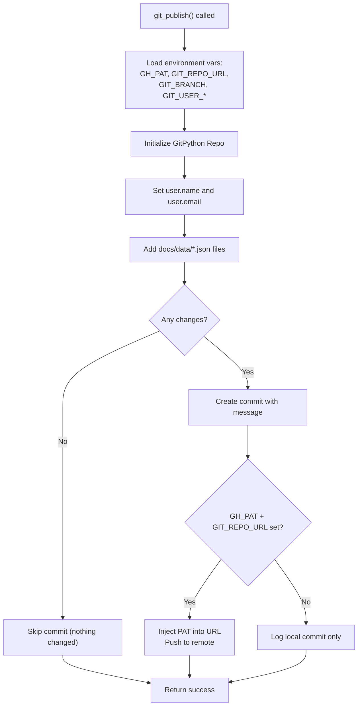
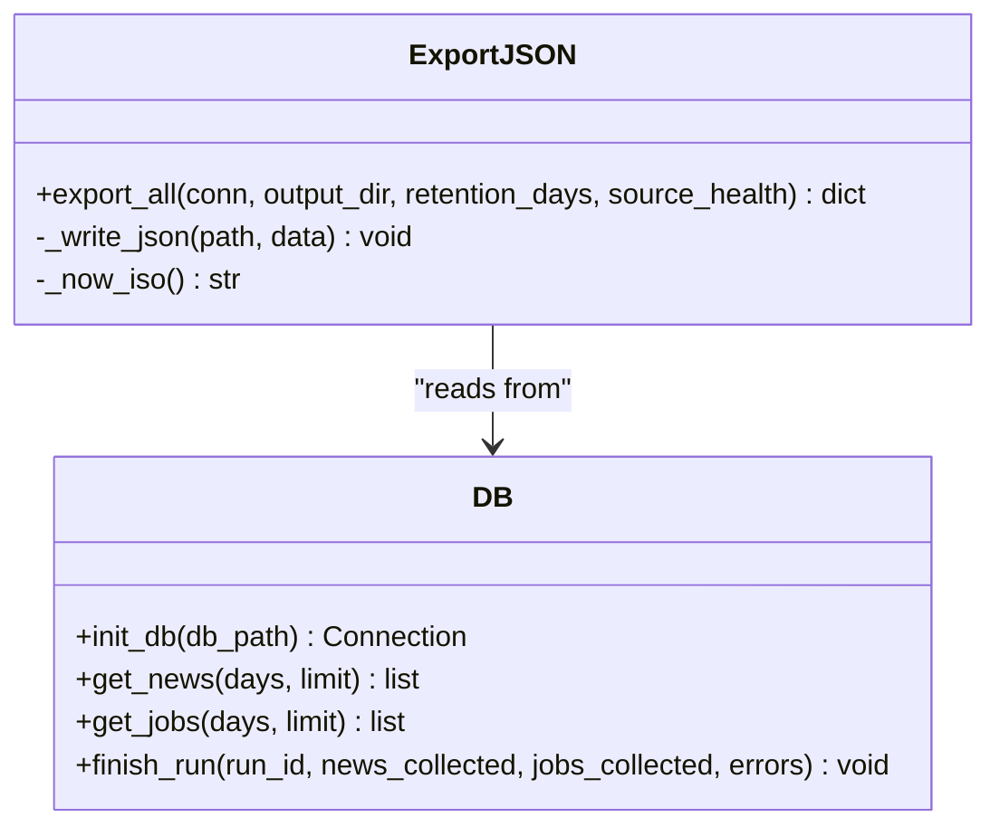
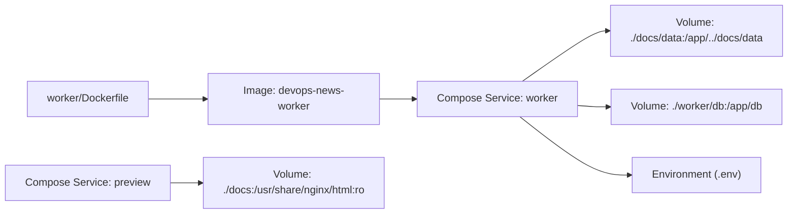
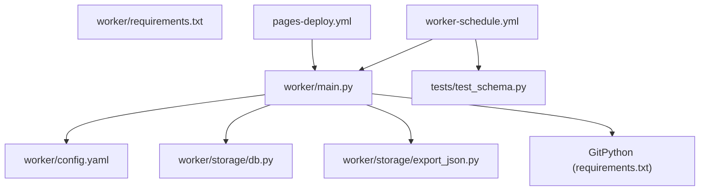

# Automation and Deployment

<cite>
**Referenced Files in This Document**
- [pages-deploy.yml](file://.github/workflows/pages-deploy.yml)
- [worker-schedule.yml](file://.github/workflows/worker-schedule.yml)
- [Dockerfile](file://worker/Dockerfile)
- [docker-compose.yml](file://docker-compose.yml)
- [main.py](file://worker/main.py)
- [config.yaml](file://worker/config.yaml)
- [requirements.txt](file://worker/requirements.txt)
- [export_json.py](file://worker/storage/export_json.py)
- [db.py](file://worker/storage/db.py)
- [.dockerignore](file://worker/.dockerignore)
- [test_schema.py](file://tests/test_schema.py)
- [devto.py](file://worker/collectors/news/devto.py)
- [remoteok.py](file://worker/collectors/jobs/remoteok.py)
</cite>

## Update Summary
**Changes Made**
- Enhanced Git-based publishing workflow documentation with GitPython implementation details
- Updated GitHub Actions improvements including dual workflow configuration and enhanced permissions
- Expanded Docker containerization documentation with GitPython dependency integration
- Added comprehensive Git publishing system explanation with PAT authentication support
- Updated environment management section to cover Git-specific variables (GH_PAT, GIT_REPO_URL)

## Table of Contents
1. [Introduction](#introduction)
2. [Project Structure](#project-structure)
3. [Core Components](#core-components)
4. [Architecture Overview](#architecture-overview)
5. [Detailed Component Analysis](#detailed-component-analysis)
6. [Dependency Analysis](#dependency-analysis)
7. [Performance Considerations](#performance-considerations)
8. [Troubleshooting Guide](#troubleshooting-guide)
9. [Conclusion](#conclusion)
10. [Appendices](#appendices)

## Introduction
This document explains the automation and deployment system that powers a static site publishing pipeline. It covers GitHub Actions workflows for scheduled data refresh and GitHub Pages publishing, Docker containerization for repeatable builds, and CI/CD pipelines that orchestrate data collection, validation, and publication. The system now features an enhanced Git-based publishing workflow using GitPython, improved GitHub Actions configurations, and comprehensive Docker containerization. It documents scheduling configuration, build processes, deployment strategies, environment management, rollback procedures, security considerations for secrets, monitoring, automated testing integration, production best practices, scaling patterns, and multi-environment management.

## Project Structure
The repository is organized around two primary automation paths:
- GitHub Actions workflows for scheduling and publishing
- Docker-based worker for local or VM-based runs

Key areas:
- Workflows: .github/workflows/pages-deploy.yml and .github/workflows/worker-schedule.yml
- Worker runtime: worker/Dockerfile, worker/main.py, worker/config.yaml, worker/requirements.txt
- Data persistence and export: worker/storage/db.py, worker/storage/export_json.py
- Validation: tests/test_schema.py
- Compose-based local run: docker-compose.yml
- Containerization controls: worker/.dockerignore

**Diagram sources**
- [worker-schedule.yml:1-137](file://.github/workflows/worker-schedule.yml#L1-L137)
- [pages-deploy.yml:1-42](file://.github/workflows/pages-deploy.yml#L1-L42)
- [main.py:1-320](file://worker/main.py#L1-L320)
- [config.yaml:1-244](file://worker/config.yaml#L1-L244)
- [requirements.txt:1-11](file://worker/requirements.txt#L1-L11)
- [db.py:1-278](file://worker/storage/db.py#L1-L278)
- [export_json.py:1-93](file://worker/storage/export_json.py#L1-L93)
- [devto.py:1-72](file://worker/collectors/news/devto.py#L1-L72)
- [remoteok.py:1-83](file://worker/collectors/jobs/remoteok.py#L1-L83)
- [Dockerfile:1-24](file://worker/Dockerfile#L1-L24)
- [docker-compose.yml:1-47](file://docker-compose.yml#L1-L47)
- [.dockerignore:1-6](file://worker/.dockerignore#L1-L6)
- [test_schema.py:1-136](file://tests/test_schema.py#L1-L136)

**Section sources**
- [pages-deploy.yml:1-42](file://.github/workflows/pages-deploy.yml#L1-L42)
- [worker-schedule.yml:1-137](file://.github/workflows/worker-schedule.yml#L1-L137)
- [Dockerfile:1-24](file://worker/Dockerfile#L1-L24)
- [docker-compose.yml:1-47](file://docker-compose.yml#L1-L47)
- [main.py:1-320](file://worker/main.py#L1-L320)
- [config.yaml:1-244](file://worker/config.yaml#L1-L244)
- [requirements.txt:1-11](file://worker/requirements.txt#L1-L11)
- [export_json.py:1-93](file://worker/storage/export_json.py#L1-L93)
- [db.py:1-278](file://worker/storage/db.py#L1-L278)
- [.dockerignore:1-6](file://worker/.dockerignore#L1-L6)
- [test_schema.py:1-136](file://tests/test_schema.py#L1-L136)

## Core Components
- GitHub Actions worker scheduler: Runs the worker on a schedule, installs dependencies, executes the worker, validates exported JSON, and optionally commits/pushes updates using GitPython.
- GitHub Pages publisher: Deploys the docs directory to GitHub Pages upon push to main or manual dispatch.
- Worker runtime: Orchestrates collection, deduplication, scoring, persistence, JSON export, Git-based publishing, and optional SMTP digest.
- Docker containerization: Builds a non-root, minimal Python image with GitPython support and runs the worker entrypoint.
- Compose-based local execution: Provides a local preview server and a worker service with persistent DB and mounted data directory.
- Validation suite: Ensures exported JSON conforms to expected schema.
- Git publishing system: Implements GitPython-based commit and push functionality with optional PAT authentication.

**Section sources**
- [worker-schedule.yml:1-137](file://.github/workflows/worker-schedule.yml#L1-L137)
- [pages-deploy.yml:1-42](file://.github/workflows/pages-deploy.yml#L1-L42)
- [main.py:107-155](file://worker/main.py#L107-L155)
- [Dockerfile:1-24](file://worker/Dockerfile#L1-L24)
- [docker-compose.yml:1-47](file://docker-compose.yml#L1-L47)
- [test_schema.py:1-136](file://tests/test_schema.py#L1-L136)

## Architecture Overview
The system follows a CI-driven refresh pattern with enhanced Git-based publishing:
- Scheduled workflow triggers the worker in a clean runner environment.
- The worker loads configuration, collects data from multiple sources, deduplicates, scores via LLM, persists to SQLite, exports static JSON, and publishes changes using GitPython.
- Publishing triggers the Pages workflow to rebuild and redeploy the static site.

**Diagram sources**
- [worker-schedule.yml:13-137](file://.github/workflows/worker-schedule.yml#L13-L137)
- [main.py:107-155](file://worker/main.py#L107-L155)
- [db.py:79-84](file://worker/storage/db.py#L79-L84)
- [export_json.py:32-93](file://worker/storage/export_json.py#L32-L93)
- [test_schema.py:1-136](file://tests/test_schema.py#L1-L136)
- [pages-deploy.yml:1-42](file://.github/workflows/pages-deploy.yml#L1-L42)

## Detailed Component Analysis

### GitHub Actions: Worker Scheduler
- Triggers: Scheduled (every 2 hours) and manual dispatch.
- Permissions: Write to contents for committing/pushing.
- Steps:
  - Checkout repository with GITHUB_TOKEN.
  - Setup Python 3.12 with pip cache.
  - Install dependencies from worker/requirements.txt (including GitPython).
  - Run worker with environment variables for API keys, SMTP, and model selection.
  - Validate exported JSON with pytest.
  - Commit and push updated docs/data/*.json using GitPython-based publishing.

**Updated** Enhanced with GitPython-based publishing system and improved error handling

**Diagram sources**
- [worker-schedule.yml:13-137](file://.github/workflows/worker-schedule.yml#L13-L137)
- [test_schema.py:1-136](file://tests/test_schema.py#L1-L136)
- [requirements.txt:9](file://worker/requirements.txt#L9)

**Section sources**
- [worker-schedule.yml:1-137](file://.github/workflows/worker-schedule.yml#L1-L137)
- [requirements.txt:1-11](file://worker/requirements.txt#L1-L11)

### GitHub Actions: Pages Publisher
- Triggers: Push to main branch affecting docs/** or manual dispatch.
- Permissions: Read contents, write Pages, write ID tokens.
- Steps:
  - Checkout.
  - Configure GitHub Pages.
  - Upload docs directory as artifact.
  - Deploy to GitHub Pages.

**Diagram sources**
- [pages-deploy.yml:1-42](file://.github/workflows/pages-deploy.yml#L1-L42)

**Section sources**
- [pages-deploy.yml:1-42](file://.github/workflows/pages-deploy.yml#L1-L42)

### Worker Runtime Orchestration
- Loads .env from worker/ and repo root fallback.
- Reads configuration from worker/config.yaml.
- Initializes SQLite database and starts a run log.
- Executes collection, deduplication, LLM scoring, persistence, and export.
- Uses GitPython-based publishing system for commit and push operations.
- Optionally sends an SMTP digest.
- Logs run metrics and errors.

**Updated** Enhanced with GitPython-based publishing system supporting PAT authentication

**Diagram sources**
- [main.py:107-155](file://worker/main.py#L107-L155)
- [config.yaml:1-244](file://worker/config.yaml#L1-L244)
- [db.py:79-84](file://worker/storage/db.py#L79-L84)
- [export_json.py:32-93](file://worker/storage/export_json.py#L32-L93)

**Section sources**
- [main.py:1-320](file://worker/main.py#L1-L320)
- [config.yaml:1-244](file://worker/config.yaml#L1-L244)
- [db.py:1-278](file://worker/storage/db.py#L1-L278)
- [export_json.py:1-93](file://worker/storage/export_json.py#L1-L93)

### Git-Based Publishing System
- GitPython integration for commit and push operations.
- Supports optional Personal Access Token (PAT) authentication.
- Configurable repository URL and branch settings.
- Automatic detection of changed files before commit.
- Fallback to local commit when PAT is not configured.

**New Section** Comprehensive Git publishing system using GitPython

**Diagram sources**
- [main.py:107-155](file://worker/main.py#L107-L155)

**Section sources**
- [main.py:107-155](file://worker/main.py#L107-L155)

### Data Export and Validation
- Exporter reads from SQLite and writes three files under docs/data/: news.json, jobs.json, meta.json.
- Validator enforces presence of required keys, types, and ranges for exported JSON.

**Diagram sources**
- [export_json.py:32-93](file://worker/storage/export_json.py#L32-L93)
- [db.py:79-278](file://worker/storage/db.py#L79-L278)

**Section sources**
- [export_json.py:1-93](file://worker/storage/export_json.py#L1-L93)
- [db.py:1-278](file://worker/storage/db.py#L1-L278)
- [test_schema.py:1-136](file://tests/test_schema.py#L1-L136)

### Containerization and Local Execution
- Dockerfile:
  - Base: python:3.12-slim
  - Non-root user and working directory
  - Installs dependencies from requirements.txt (including GitPython)
  - Copies source and ensures db directory is writable
  - Sets ENTRYPOINT to python main.py
- docker-compose.yml:
  - worker service: builds from worker/Dockerfile, mounts docs/data and db, sets LOG_LEVEL, optional restart policy, and env_file support
  - preview service: nginx serving docs for local preview
  - Optional cron sidecar approach is documented

**Updated** Enhanced with GitPython dependency integration

**Diagram sources**
- [Dockerfile:1-24](file://worker/Dockerfile#L1-L24)
- [docker-compose.yml:13-47](file://docker-compose.yml#L13-L47)
- [.dockerignore:1-6](file://worker/.dockerignore#L1-L6)

**Section sources**
- [Dockerfile:1-24](file://worker/Dockerfile#L1-L24)
- [docker-compose.yml:1-47](file://docker-compose.yml#L1-L47)
- [.dockerignore:1-6](file://worker/.dockerignore#L1-L6)

### Environment Management and Secrets
- Worker loads .env from worker/ and repo root fallback.
- Secrets and variables used by the scheduled workflow:
  - OPENROUTER_API_KEY
  - OPENROUTER_MODEL (via repository variable)
  - SMTP_* (SMTP_ENABLED, SMTP_HOST, SMTP_PORT, SMTP_USER, SMTP_PASSWORD, SMTP_TO)
  - Git publishing variables: GH_PAT, GIT_REPO_URL, GIT_BRANCH, GIT_USER_NAME, GIT_USER_EMAIL
  - Optional: DRY_RUN for testing without publishing
- docker-compose supports env_file and environment overrides.

**Updated** Added Git publishing environment variables

**Section sources**
- [main.py:23-31](file://worker/main.py#L23-L31)
- [worker-schedule.yml:44-56](file://.github/workflows/worker-schedule.yml#L44-L56)
- [docker-compose.yml:22-31](file://docker-compose.yml#L22-L31)

### Rollback Procedures
- Pages rollback: GitHub Pages deploys from the docs directory; to roll back, push previous docs content to main or use GitHub's Pages redeploy option.
- Data rollback: The worker writes to docs/data/*.json; to revert, checkout a prior commit that contained desired JSON files and push to main to trigger Pages deployment.
- Run history: The SQLite run_log table records run metadata and errors; inspect for diagnosing problematic runs.

**Section sources**
- [pages-deploy.yml:1-42](file://.github/workflows/pages-deploy.yml#L1-L42)
- [main.py:273-278](file://worker/main.py#L273-L278)
- [db.py:245-278](file://worker/storage/db.py#L245-L278)

### Monitoring and Observability
- Logging: Worker logs run progress, errors, and counts; adjust LOG_LEVEL via environment.
- Health checks: The validator ensures JSON integrity; failures halt the workflow.
- Preview: Use the preview service in docker-compose to validate local rendering.
- Git publishing logs: Detailed logging for Git operations including commit and push status.

**Updated** Added Git publishing monitoring capabilities

**Section sources**
- [main.py:58-66](file://worker/main.py#L58-L66)
- [test_schema.py:1-136](file://tests/test_schema.py#L1-L136)
- [docker-compose.yml:37-47](file://docker-compose.yml#L37-L47)

### Security Considerations
- Secrets management:
  - Store API keys and SMTP credentials in GitHub Actions secrets.
  - Git publishing requires GH_PAT for authenticated pushes; store securely.
  - Avoid committing .env or *.env files; .gitignore and .dockerignore exclude sensitive files.
  - Prefer repository variables for non-sensitive defaults (e.g., OPENROUTER_MODEL).
- Least privilege:
  - Workflow permissions are scoped (contents: write, pages: write, id-token: write).
  - Container runs as non-root user.
- Network hygiene:
  - Workers set explicit timeouts and delays when calling external APIs.
- Auditability:
  - Run logs and source health are recorded in SQLite and meta.json.
  - Git operations are logged with user identification and commit messages.

**Updated** Enhanced with Git publishing security considerations

**Section sources**
- [worker-schedule.yml:19-21](file://.github/workflows/worker-schedule.yml#L19-L21)
- [Dockerfile:4-5](file://worker/Dockerfile#L4-L5)
- [devto.py:37-39](file://worker/collectors/news/devto.py#L37-L39)
- [remoteok.py:40-43](file://worker/collectors/jobs/remoteok.py#L40-L43)
- [.dockerignore:1-6](file://worker/.dockerignore#L1-L6)

### Automated Testing Integration
- The scheduled workflow runs pytest against tests/test_schema.py to validate docs/data/*.json.
- Tests enforce:
  - Presence of required keys in meta.json and top-level keys in news/jobs.json
  - Correct types and value ranges for fields
  - Absence of duplicate IDs

**Section sources**
- [worker-schedule.yml:59-61](file://.github/workflows/worker-schedule.yml#L59-L61)
- [test_schema.py:1-136](file://tests/test_schema.py#L1-L136)

### Production Deployment Best Practices
- Keep configuration in config.yaml and environment variables; avoid hardcoding.
- Use dry-run mode during testing to preview effects without publishing.
- Monitor source health and error logs from run logs.
- Use repository variables for defaults and secrets for credentials.
- Prefer GitHub Actions for scheduling to reduce operational overhead.
- Implement Git publishing with PAT for authenticated pushes in production.
- Regularly review Git operation logs for debugging and audit trails.

**Updated** Added Git publishing best practices

**Section sources**
- [main.py:168](file://worker/main.py#L168)
- [config.yaml:1-244](file://worker/config.yaml#L1-L244)
- [worker-schedule.yml:54-56](file://.github/workflows/worker-schedule.yml#L54-L56)

### Scaling Deployment Patterns and Multi-Environment Management
- Scale worker execution:
  - Increase frequency cautiously; monitor API rate limits and LLM quotas.
  - Use concurrency groups to serialize deployments when needed.
- Multi-environment:
  - Separate branches for environments (e.g., staging/main).
  - Use separate GitHub Actions variables/secrets per environment.
  - docker-compose profiles can isolate services (preview profile is already defined).
- External scheduling:
  - Option B in docker-compose.yml describes running the worker locally or on a VM with host cron or a cron sidecar.
- Git publishing scalability:
  - Support for multiple repository URLs and branches.
  - Configurable user identification for different environments.

**Updated** Enhanced with Git publishing scalability considerations

**Section sources**
- [worker-schedule.yml:13-17](file://.github/workflows/worker-schedule.yml#L13-L17)
- [docker-compose.yml:32-34](file://docker-compose.yml#L32-L34)

## Dependency Analysis
The worker depends on configuration, storage, and exporters. The scheduled workflow depends on the worker and validation. The Pages workflow depends on the published docs directory. GitPython is now a core dependency for publishing functionality.

**Diagram sources**
- [config.yaml:1-244](file://worker/config.yaml#L1-L244)
- [requirements.txt:1-11](file://worker/requirements.txt#L1-L11)
- [main.py:1-320](file://worker/main.py#L1-L320)
- [db.py:1-278](file://worker/storage/db.py#L1-L278)
- [export_json.py:1-93](file://worker/storage/export_json.py#L1-L93)
- [test_schema.py:1-136](file://tests/test_schema.py#L1-L136)
- [worker-schedule.yml:1-137](file://.github/workflows/worker-schedule.yml#L1-L137)
- [pages-deploy.yml:1-42](file://.github/workflows/pages-deploy.yml#L1-L42)

**Section sources**
- [main.py:1-320](file://worker/main.py#L1-L320)
- [config.yaml:1-244](file://worker/config.yaml#L1-L244)
- [db.py:1-278](file://worker/storage/db.py#L1-L278)
- [export_json.py:1-93](file://worker/storage/export_json.py#L1-L93)
- [test_schema.py:1-136](file://tests/test_schema.py#L1-L136)
- [worker-schedule.yml:1-137](file://.github/workflows/worker-schedule.yml#L1-L137)
- [pages-deploy.yml:1-42](file://.github/workflows/pages-deploy.yml#L1-L42)

## Performance Considerations
- LLM pre-filtering reduces cost and latency by limiting calls to relevant items.
- Batch sizes and retention windows can be tuned in config.yaml.
- SQLite WAL mode and indices improve read/write performance.
- Network delays and rate limits are respected by collectors; consider jitter and retries where appropriate.
- Git operations are optimized with change detection to avoid unnecessary commits.
- GitPython provides efficient repository operations compared to shell command execution.

**Updated** Added Git operation performance considerations

## Troubleshooting Guide
Common issues and resolutions:
- Missing secrets or incorrect values:
  - Verify OPENROUTER_API_KEY and SMTP_* variables in GitHub Actions.
  - Confirm .env values for local/VM runs.
  - Check Git publishing variables (GH_PAT, GIT_REPO_URL) for authenticated pushes.
- JSON validation failures:
  - Review test_schema.py expectations and fix missing keys or invalid types.
- No changes detected:
  - Ensure the worker actually produced modified docs/data/*.json; check Git publish logic and commit messages.
  - Verify GitPython installation in requirements.txt.
- Rate limits or network errors:
  - Inspect collector logs and add delays or retry logic as needed.
- Pages not updating:
  - Confirm push triggered pages-deploy.yml and that docs directory was uploaded.
- Git publishing failures:
  - Check GitPython installation and version compatibility.
  - Verify PAT permissions and repository URL format.
  - Review Git operation logs for detailed error information.

**Updated** Added Git publishing troubleshooting guidance

**Section sources**
- [worker-schedule.yml:44-56](file://.github/workflows/worker-schedule.yml#L44-L56)
- [test_schema.py:1-136](file://tests/test_schema.py#L1-L136)
- [main.py:77-124](file://worker/main.py#L77-L124)
- [pages-deploy.yml:1-42](file://.github/workflows/pages-deploy.yml#L1-L42)

## Conclusion
The system combines GitHub Actions for scheduling and publishing with a robust worker runtime that collects, processes, validates, and exports data. The enhanced Git-based publishing workflow using GitPython provides reliable commit and push operations with optional PAT authentication. Dockerization and docker-compose enable repeatable local execution and previewing. With proper secrets management, validation, monitoring, and Git publishing security practices, the pipeline supports reliable, scalable, and auditable deployments across environments.

## Appendices

### Practical Examples

- Customize workflow scheduling:
  - Adjust cron expression in worker-schedule.yml to change frequency.
  - Add workflow_dispatch inputs for manual control.

- Enable SMTP digest:
  - Set SMTP_ENABLED to true and configure SMTP_* secrets.
  - Optionally set OPENROUTER_MODEL and related variables.

- Local execution with docker-compose:
  - Create .env from the example, set LOG_LEVEL and other variables.
  - Run docker compose up --build worker to execute once and exit.
  - Use the preview service to validate rendered docs.

- Extend data sources:
  - Add new collectors under worker/collectors/news or jobs.
  - Update config.yaml to enable/disable and tune new sources.

- Monitoring and alerting:
  - Use GitHub Actions logs and run logs in SQLite.
  - Optionally integrate external monitoring for API health and LLM usage.
  - Monitor Git operation logs for publishing pipeline health.

- Git publishing configuration:
  - Set GH_PAT for authenticated pushes to private repositories.
  - Configure GIT_REPO_URL for custom repository locations.
  - Set GIT_BRANCH for non-main branch deployments.
  - Configure GIT_USER_NAME and GIT_USER_EMAIL for commit attribution.

**Updated** Added Git publishing configuration examples

**Section sources**
- [worker-schedule.yml:13-17](file://.github/workflows/worker-schedule.yml#L13-L17)
- [worker-schedule.yml:44-56](file://.github/workflows/worker-schedule.yml#L44-L56)
- [docker-compose.yml:6-11](file://docker-compose.yml#L6-L11)
- [docker-compose.yml:13-47](file://docker-compose.yml#L13-L47)
- [config.yaml:77-244](file://worker/config.yaml#L77-L244)
- [main.py:107-155](file://worker/main.py#L107-L155)