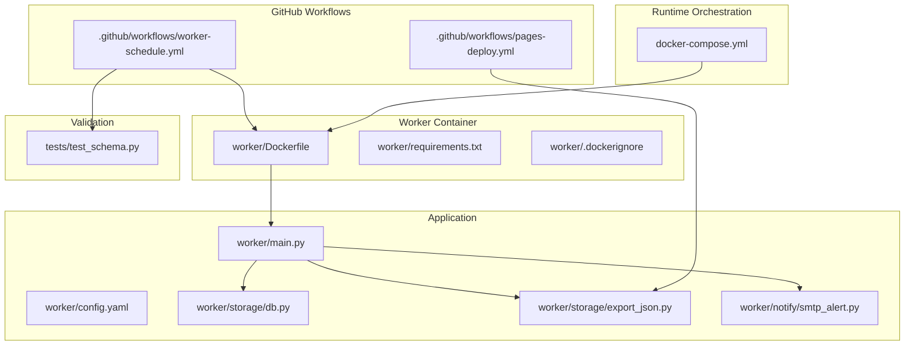
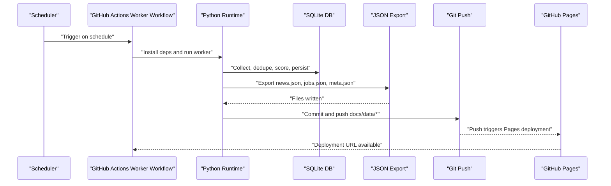
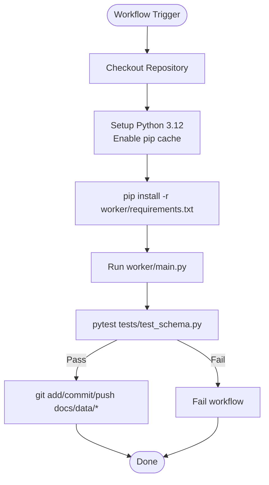
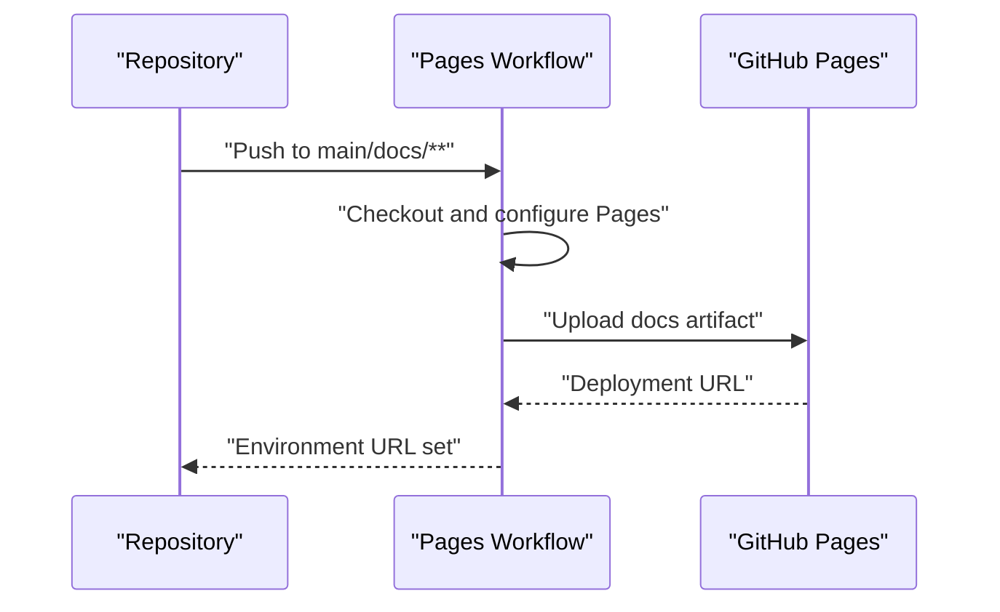
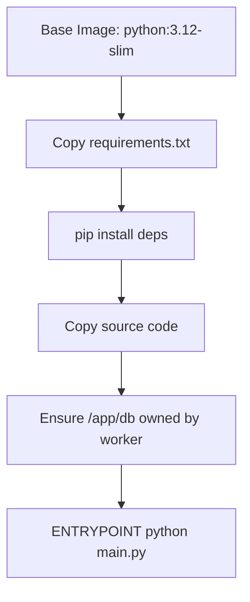
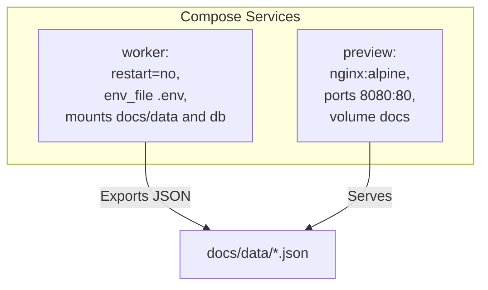
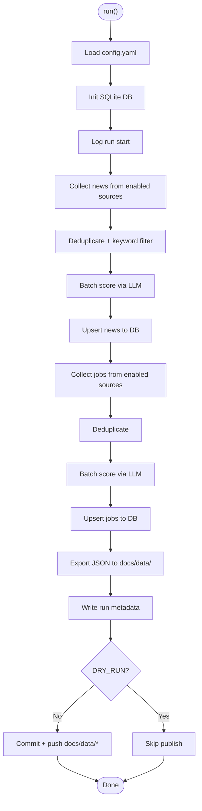
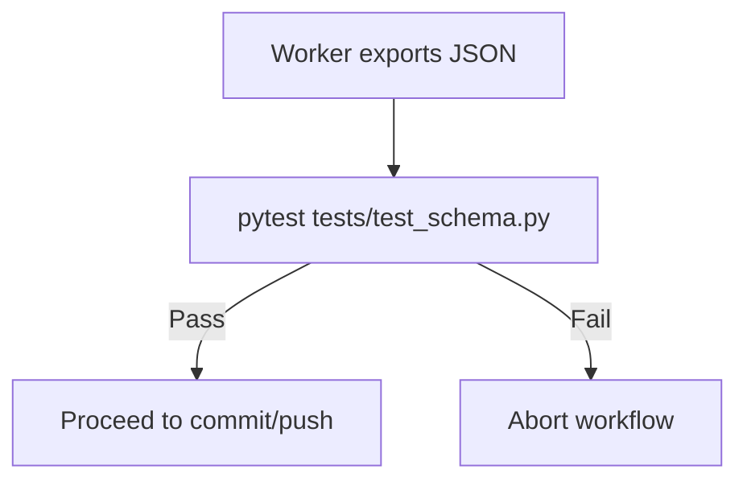
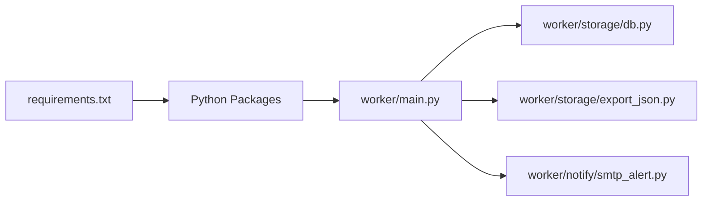

# CI/CD Pipelines

<cite>
**Referenced Files in This Document**
- [pages-deploy.yml](file://.github/workflows/pages-deploy.yml)
- [worker-schedule.yml](file://.github/workflows/worker-schedule.yml)
- [Dockerfile](file://worker/Dockerfile)
- [docker-compose.yml](file://docker-compose.yml)
- [requirements.txt](file://worker/requirements.txt)
- [config.yaml](file://worker/config.yaml)
- [main.py](file://worker/main.py)
- [export_json.py](file://worker/storage/export_json.py)
- [db.py](file://worker/storage/db.py)
- [smtp_alert.py](file://worker/notify/smtp_alert.py)
- [.dockerignore](file://worker/.dockerignore)
- [test_schema.py](file://tests/test_schema.py)
</cite>

## Table of Contents
1. [Introduction](#introduction)
2. [Project Structure](#project-structure)
3. [Core Components](#core-components)
4. [Architecture Overview](#architecture-overview)
5. [Detailed Component Analysis](#detailed-component-analysis)
6. [Dependency Analysis](#dependency-analysis)
7. [Performance Considerations](#performance-considerations)
8. [Troubleshooting Guide](#troubleshooting-guide)
9. [Conclusion](#conclusion)
10. [Appendices](#appendices)

## Introduction
This document explains the end-to-end CI/CD automation for the project, covering GitHub Actions workflows, Docker-based builds, and deployment to GitHub Pages. It documents the pipeline that:
- Builds a Python worker container
- Runs scheduled data collection and enrichment
- Validates outputs with automated tests
- Commits updated JSON artifacts to the repository
- Triggers a Pages deployment to publish the static site

It also covers environment management, secrets, quality gates, deployment validation, rollback strategies, monitoring, and multi-stage deployment workflows.

## Project Structure
The repository is organized around two primary automation paths:
- GitHub Actions workflows for scheduling and publishing
- Docker-based containerization for repeatable builds and local/VM runs

**Diagram sources**
- [pages-deploy.yml:1-42](file://.github/workflows/pages-deploy.yml#L1-L42)
- [worker-schedule.yml:1-70](file://.github/workflows/worker-schedule.yml#L1-L70)
- [Dockerfile:1-24](file://worker/Dockerfile#L1-L24)
- [docker-compose.yml:1-47](file://docker-compose.yml#L1-L47)
- [requirements.txt:1-11](file://worker/requirements.txt#L1-L11)
- [.dockerignore:1-6](file://worker/.dockerignore#L1-L6)
- [main.py:1-297](file://worker/main.py#L1-L297)
- [config.yaml:1-244](file://worker/config.yaml#L1-L244)
- [db.py:1-278](file://worker/storage/db.py#L1-L278)
- [export_json.py:1-93](file://worker/storage/export_json.py#L1-L93)
- [smtp_alert.py:1-105](file://worker/notify/smtp_alert.py#L1-L105)
- [test_schema.py:1-136](file://tests/test_schema.py#L1-L136)

**Section sources**
- [pages-deploy.yml:1-42](file://.github/workflows/pages-deploy.yml#L1-L42)
- [worker-schedule.yml:1-70](file://.github/workflows/worker-schedule.yml#L1-L70)
- [Dockerfile:1-24](file://worker/Dockerfile#L1-L24)
- [docker-compose.yml:1-47](file://docker-compose.yml#L1-L47)
- [requirements.txt:1-11](file://worker/requirements.txt#L1-L11)
- [.dockerignore:1-6](file://worker/.dockerignore#L1-L6)
- [main.py:1-297](file://worker/main.py#L1-L297)
- [config.yaml:1-244](file://worker/config.yaml#L1-L244)
- [db.py:1-278](file://worker/storage/db.py#L1-L278)
- [export_json.py:1-93](file://worker/storage/export_json.py#L1-L93)
- [smtp_alert.py:1-105](file://worker/notify/smtp_alert.py#L1-L105)
- [test_schema.py:1-136](file://tests/test_schema.py#L1-L136)

## Core Components
- GitHub Actions “Refresh Data” workflow: schedules periodic runs, installs Python dependencies, executes the worker, validates JSON outputs, and commits/pushes updates.
- GitHub Actions “Deploy to GitHub Pages” workflow: publishes the docs directory as a static site.
- Dockerized worker: reproducible build with a non-root user, layered dependency caching, and entrypoint for single-run execution.
- Compose orchestration: optional local/VM runtime with persistent DB and mounted data volume.
- Application pipeline: collects, deduplicates, scores, persists to SQLite, exports JSON, optionally emails a digest, and publishes via Git.

**Section sources**
- [worker-schedule.yml:1-70](file://.github/workflows/worker-schedule.yml#L1-L70)
- [pages-deploy.yml:1-42](file://.github/workflows/pages-deploy.yml#L1-L42)
- [Dockerfile:1-24](file://worker/Dockerfile#L1-L24)
- [docker-compose.yml:1-47](file://docker-compose.yml#L1-L47)
- [main.py:1-297](file://worker/main.py#L1-L297)

## Architecture Overview
The CI/CD architecture comprises three stages:
1. Build and test: Python dependencies installed in a containerized environment; tests validate JSON schema.
2. Data pipeline: worker runs end-to-end ingestion, deduplication, scoring, persistence, and export.
3. Deployment: updated JSON artifacts trigger a Pages deployment.

**Diagram sources**
- [worker-schedule.yml:13-70](file://.github/workflows/worker-schedule.yml#L13-L70)
- [main.py:127-297](file://worker/main.py#L127-L297)
- [db.py:116-242](file://worker/storage/db.py#L116-L242)
- [export_json.py:32-93](file://worker/storage/export_json.py#L32-L93)
- [pages-deploy.yml:20-42](file://.github/workflows/pages-deploy.yml#L20-L42)

## Detailed Component Analysis

### GitHub Actions “Refresh Data” Workflow
- Schedules runs every 2 hours and supports manual dispatch.
- Checks out the repository, sets up Python 3.12 with pip cache, installs dependencies from requirements.txt, and runs the worker.
- Environment variables are supplied from GitHub Secrets and Variables.
- Validates exported JSON with pytest; if successful, commits and pushes docs/data/*.json.
- Uses GITHUB_TOKEN with write permissions to push.

**Diagram sources**
- [worker-schedule.yml:13-70](file://.github/workflows/worker-schedule.yml#L13-L70)
- [test_schema.py:1-136](file://tests/test_schema.py#L1-L136)

**Section sources**
- [worker-schedule.yml:1-70](file://.github/workflows/worker-schedule.yml#L1-L70)
- [requirements.txt:1-11](file://worker/requirements.txt#L1-L11)
- [test_schema.py:1-136](file://tests/test_schema.py#L1-L136)

### GitHub Actions “Deploy to GitHub Pages” Workflow
- Deploys the docs directory as a static site on pushes to main that touch docs/**.
- Supports manual dispatch.
- Configures Pages, uploads the docs artifact, and deploys to GitHub Pages.

**Diagram sources**
- [pages-deploy.yml:1-42](file://.github/workflows/pages-deploy.yml#L1-L42)

**Section sources**
- [pages-deploy.yml:1-42](file://.github/workflows/pages-deploy.yml#L1-L42)

### Dockerized Worker Build
- Multi-stage base image using python:3.12-slim.
- Creates a non-root worker user and ensures /app/db ownership.
- Copies requirements.txt first for layer caching, then source.
- Sets ENTRYPOINT to run main.py on container start.
- .dockerignore excludes development artifacts and DB directory.

**Diagram sources**
- [Dockerfile:1-24](file://worker/Dockerfile#L1-L24)
- [.dockerignore:1-6](file://worker/.dockerignore#L1-L6)

**Section sources**
- [Dockerfile:1-24](file://worker/Dockerfile#L1-L24)
- [.dockerignore:1-6](file://worker/.dockerignore#L1-L6)

### Local/VM Runtime with Docker Compose
- Builds the worker image from worker/Dockerfile.
- Mounts ./docs/data into the container to write JSON directly into the repo.
- Persists SQLite DB under ./worker/db.
- Optional preview service using nginx to serve docs/.
- Environment loaded from .env via env_file.

**Diagram sources**
- [docker-compose.yml:13-47](file://docker-compose.yml#L13-L47)

**Section sources**
- [docker-compose.yml:1-47](file://docker-compose.yml#L1-L47)

### Worker Pipeline Execution
The worker orchestrates the full pipeline:
- Loads configuration from config.yaml
- Initializes SQLite DB and starts a run log
- Collects news and jobs from enabled sources
- Deduplicates and filters items
- Scores items via LLM (OpenRouter) in batches
- Upserts items into SQLite
- Exports static JSON files to docs/data/
- Writes run metadata and optionally sends SMTP digest
- Commits and pushes changes unless DRY_RUN=true

**Diagram sources**
- [main.py:127-297](file://worker/main.py#L127-L297)
- [config.yaml:1-244](file://worker/config.yaml#L1-L244)
- [db.py:116-278](file://worker/storage/db.py#L116-L278)
- [export_json.py:32-93](file://worker/storage/export_json.py#L32-L93)

**Section sources**
- [main.py:1-297](file://worker/main.py#L1-L297)
- [config.yaml:1-244](file://worker/config.yaml#L1-L244)
- [db.py:1-278](file://worker/storage/db.py#L1-L278)
- [export_json.py:1-93](file://worker/storage/export_json.py#L1-L93)

### Quality Gates and Validation
- Automated schema validation of docs/data/*.json using pytest.
- Tests enforce presence of required keys, types, and value ranges for news and jobs items.
- The workflow fails fast on validation failure to prevent publishing invalid data.

**Diagram sources**
- [test_schema.py:1-136](file://tests/test_schema.py#L1-L136)
- [worker-schedule.yml:59-61](file://.github/workflows/worker-schedule.yml#L59-L61)

**Section sources**
- [test_schema.py:1-136](file://tests/test_schema.py#L1-L136)
- [worker-schedule.yml:59-61](file://.github/workflows/worker-schedule.yml#L59-L61)

### Secrets Management and Environment Configuration
- GitHub Actions secrets and variables supply API keys and SMTP credentials.
- Worker loads environment from .env files via python-dotenv.
- SMTP digest is conditionally enabled and requires complete credential configuration.

Practical guidance:
- Store secrets in GitHub Actions Settings > Secrets and variables.
- Provide .env locally for docker-compose runs.
- Keep sensitive values out of the repository.

**Section sources**
- [worker-schedule.yml:44-56](file://.github/workflows/worker-schedule.yml#L44-L56)
- [main.py:23-25](file://worker/main.py#L23-L25)
- [smtp_alert.py:64-105](file://worker/notify/smtp_alert.py#L64-L105)

### Release Strategies and Deployment Validation
- The worker commits and pushes updated JSON files; subsequent push to main triggers the Pages workflow.
- Pages workflow publishes docs to GitHub Pages and exposes the URL in the environment.
- Validation occurs before pushing to ensure only valid JSON reaches the Pages site.

**Section sources**
- [worker-schedule.yml:63-70](file://.github/workflows/worker-schedule.yml#L63-L70)
- [pages-deploy.yml:20-42](file://.github/workflows/pages-deploy.yml#L20-L42)

### Rollback Procedures
- Since the worker pushes directly to main, a simple revert or cherry-pick can roll back problematic commits.
- Alternatively, tag releases and switch Pages to a previous commit SHA for rollback.

[No sources needed since this section provides general guidance]

### Monitoring Deployment Health
- Monitor GitHub Actions logs for the worker and Pages workflows.
- Verify GitHub Pages deployment status and URL availability.
- Optionally add health checks or alerts on the published site.

[No sources needed since this section provides general guidance]

### Maintaining Pipeline Reliability
- Pin Python version and cache pip dependencies.
- Use non-root containers and deterministic layering.
- Keep validation strict and fail-fast.
- Prefer idempotent operations (dedupe, upsert) to avoid duplication.

**Section sources**
- [worker-schedule.yml:34-42](file://.github/workflows/worker-schedule.yml#L34-L42)
- [Dockerfile:1-24](file://worker/Dockerfile#L1-L24)
- [main.py:174-181](file://worker/main.py#L174-L181)

## Dependency Analysis
The worker depends on a small set of libraries for HTTP, parsing, YAML, environment loading, and Git operations. These are declared in requirements.txt and installed during the workflow or build process.

**Diagram sources**
- [requirements.txt:1-11](file://worker/requirements.txt#L1-L11)
- [main.py:1-297](file://worker/main.py#L1-L297)
- [db.py:1-278](file://worker/storage/db.py#L1-L278)
- [export_json.py:1-93](file://worker/storage/export_json.py#L1-L93)
- [smtp_alert.py:1-105](file://worker/notify/smtp_alert.py#L1-L105)

**Section sources**
- [requirements.txt:1-11](file://worker/requirements.txt#L1-L11)
- [main.py:1-297](file://worker/main.py#L1-L297)
- [db.py:1-278](file://worker/storage/db.py#L1-L278)
- [export_json.py:1-93](file://worker/storage/export_json.py#L1-L93)
- [smtp_alert.py:1-105](file://worker/notify/smtp_alert.py#L1-L105)

## Performance Considerations
- Layered Docker build: copy requirements.txt before source to maximize cache hits.
- Batched LLM scoring reduces API calls while controlling cost and latency.
- Deduplication and keyword filtering reduce unnecessary LLM usage.
- SQLite WAL mode and indexes improve read/write performance.

[No sources needed since this section provides general guidance]

## Troubleshooting Guide
Common issues and resolutions:
- Validation failures: Ensure docs/data/*.json matches the schema enforced by tests.
- Missing secrets: Confirm GitHub Secrets and Variables are set for the worker workflow.
- SMTP digest not sent: Verify SMTP credentials and that SMTP_ENABLED is true.
- Pages not updating: Check Pages workflow logs and confirm the push occurred after data refresh.
- Permission denied in container: Confirm non-root user and proper ownership of /app/db.

**Section sources**
- [test_schema.py:1-136](file://tests/test_schema.py#L1-L136)
- [worker-schedule.yml:44-56](file://.github/workflows/worker-schedule.yml#L44-L56)
- [smtp_alert.py:64-105](file://worker/notify/smtp_alert.py#L64-L105)
- [pages-deploy.yml:20-42](file://.github/workflows/pages-deploy.yml#L20-L42)
- [Dockerfile:16-18](file://worker/Dockerfile#L16-L18)

## Conclusion
The CI/CD pipeline automates reliable data refresh and static site publishing. By combining scheduled GitHub Actions, a reproducible Docker build, strict validation, and a clear deployment flow, the system maintains data quality and site availability. Extending the pipeline with additional environments, richer monitoring, and automated rollback safeguards is straightforward given the current modular design.

[No sources needed since this section summarizes without analyzing specific files]

## Appendices

### Practical Examples and Reference Paths
- Worker workflow configuration: [worker-schedule.yml:1-70](file://.github/workflows/worker-schedule.yml#L1-L70)
- Pages deployment workflow: [pages-deploy.yml:1-42](file://.github/workflows/pages-deploy.yml#L1-L42)
- Container build definition: [Dockerfile:1-24](file://worker/Dockerfile#L1-L24)
- Local runtime with compose: [docker-compose.yml:1-47](file://docker-compose.yml#L1-L47)
- Dependencies list: [requirements.txt:1-11](file://worker/requirements.txt#L1-L11)
- Application entrypoint: [main.py:1-297](file://worker/main.py#L1-L297)
- Data export logic: [export_json.py:1-93](file://worker/storage/export_json.py#L1-L93)
- Database schema and helpers: [db.py:1-278](file://worker/storage/db.py#L1-L278)
- SMTP digest: [smtp_alert.py:1-105](file://worker/notify/smtp_alert.py#L1-L105)
- JSON schema validation: [test_schema.py:1-136](file://tests/test_schema.py#L1-L136)