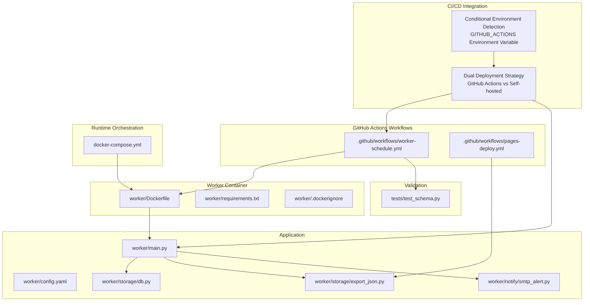
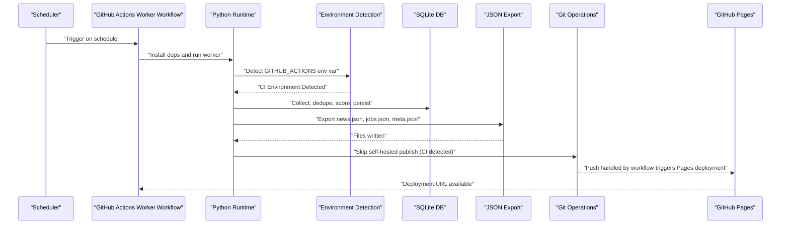
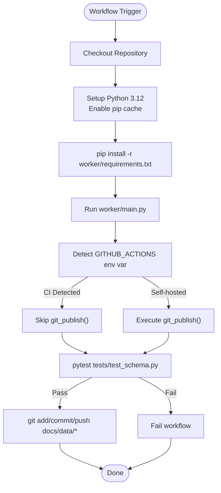
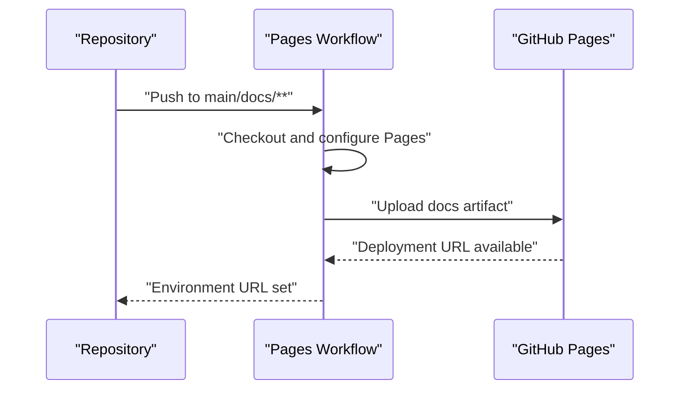
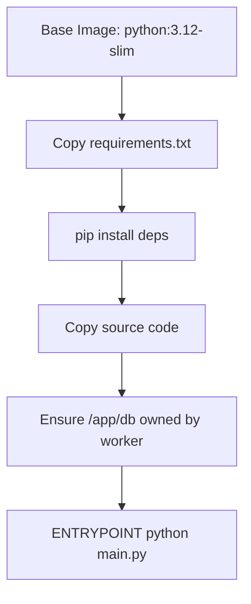
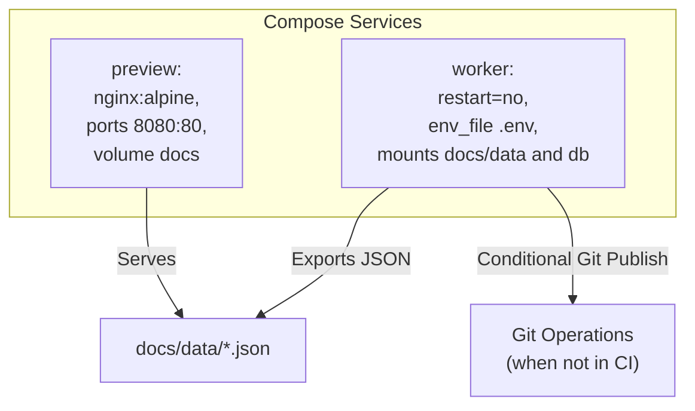
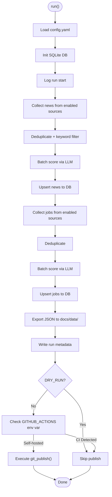
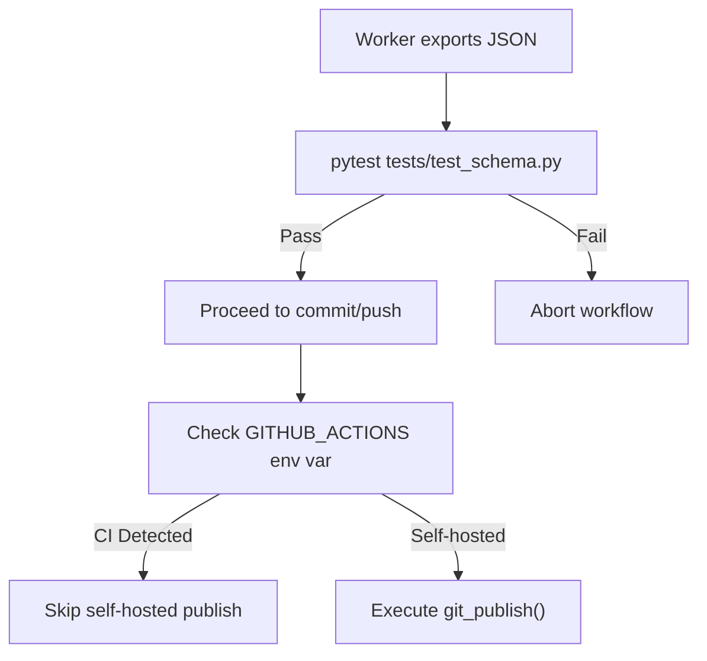
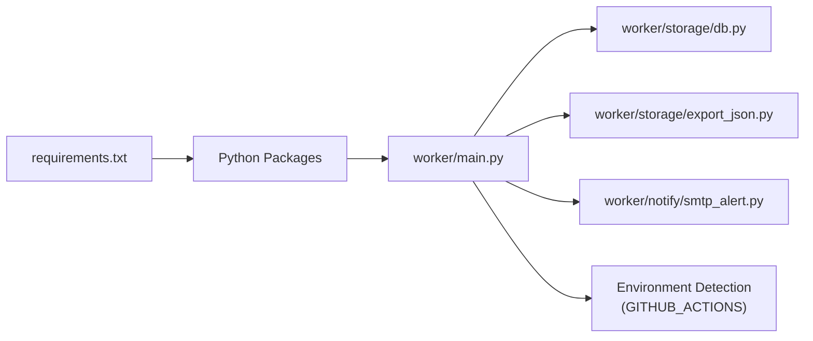

# CI/CD Pipelines

<cite>
**Referenced Files in This Document**
- [pages-deploy.yml](file://.github/workflows/pages-deploy.yml)
- [worker-schedule.yml](file://.github/workflows/worker-schedule.yml)
- [Dockerfile](file://worker/Dockerfile)
- [docker-compose.yml](file://docker-compose.yml)
- [requirements.txt](file://worker/requirements.txt)
- [config.yaml](file://worker/config.yaml)
- [main.py](file://worker/main.py)
- [export_json.py](file://worker/storage/export_json.py)
- [db.py](file://worker/storage/db.py)
- [smtp_alert.py](file://worker/notify/smtp_alert.py)
- [.dockerignore](file://worker/.dockerignore)
- [test_schema.py](file://tests/test_schema.py)
</cite>

## Update Summary
**Changes Made**
- Enhanced CI/CD integration documentation with conditional logic for GitHub Actions environment detection
- Updated dual deployment strategy explanation covering both GitHub Actions-managed and self-hosted publishing
- Added detailed coverage of environment variable detection and automatic publishing step skipping
- Expanded troubleshooting guidance for CI/CD environment differences

## Table of Contents
1. [Introduction](#introduction)
2. [Project Structure](#project-structure)
3. [Core Components](#core-components)
4. [Architecture Overview](#architecture-overview)
5. [Detailed Component Analysis](#detailed-component-analysis)
6. [Dependency Analysis](#dependency-analysis)
7. [Performance Considerations](#performance-considerations)
8. [Troubleshooting Guide](#troubleshooting-guide)
9. [Conclusion](#conclusion)
10. [Appendices](#appendices)

## Introduction
This document explains the end-to-end CI/CD automation for the project, covering GitHub Actions workflows, Docker-based builds, and deployment to GitHub Pages. The system now features enhanced CI/CD integration with conditional logic that automatically detects GitHub Actions environment variables and skips self-hosted publishing steps when running in CI environments. It documents the pipeline that:
- Builds a Python worker container
- Runs scheduled data collection and enrichment
- Validates outputs with automated tests
- Commits updated JSON artifacts to the repository
- Triggers a Pages deployment to publish the static site
- Supports both GitHub Actions-managed and self-hosted deployment strategies

It also covers environment management, secrets, quality gates, deployment validation, rollback strategies, monitoring, and multi-stage deployment workflows.

## Project Structure
The repository is organized around two primary automation paths with enhanced CI/CD integration:
- GitHub Actions workflows for scheduling and publishing with automatic environment detection
- Docker-based containerization for repeatable builds and local/VM runs with conditional publishing logic

**Diagram sources**
- [pages-deploy.yml:1-42](file://.github/workflows/pages-deploy.yml#L1-L42)
- [worker-schedule.yml:1-61](file://.github/workflows/worker-schedule.yml#L1-L61)
- [Dockerfile:1-24](file://worker/Dockerfile#L1-L24)
- [docker-compose.yml:1-47](file://docker-compose.yml#L1-L47)
- [requirements.txt:1-11](file://worker/requirements.txt#L1-L11)
- [.dockerignore:1-6](file://worker/.dockerignore#L1-L6)
- [main.py:1-315](file://worker/main.py#L1-L315)
- [config.yaml:1-244](file://worker/config.yaml#L1-L244)
- [db.py:1-278](file://worker/storage/db.py#L1-L278)
- [export_json.py:1-177](file://worker/storage/export_json.py#L1-L177)
- [smtp_alert.py:1-105](file://worker/notify/smtp_alert.py#L1-L105)
- [test_schema.py:1-136](file://tests/test_schema.py#L1-L136)

**Section sources**
- [pages-deploy.yml:1-42](file://.github/workflows/pages-deploy.yml#L1-L42)
- [worker-schedule.yml:1-61](file://.github/workflows/worker-schedule.yml#L1-L61)
- [Dockerfile:1-24](file://worker/Dockerfile#L1-L24)
- [docker-compose.yml:1-47](file://docker-compose.yml#L1-L47)
- [requirements.txt:1-11](file://worker/requirements.txt#L1-L11)
- [.dockerignore:1-6](file://worker/.dockerignore#L1-L6)
- [main.py:1-315](file://worker/main.py#L1-L315)
- [config.yaml:1-244](file://worker/config.yaml#L1-L244)
- [db.py:1-278](file://worker/storage/db.py#L1-L278)
- [export_json.py:1-177](file://worker/storage/export_json.py#L1-L177)
- [smtp_alert.py:1-105](file://worker/notify/smtp_alert.py#L1-L105)
- [test_schema.py:1-136](file://tests/test_schema.py#L1-L136)

## Core Components
- GitHub Actions "Refresh Data" workflow: schedules periodic runs, installs Python dependencies, executes the worker, validates JSON outputs, and commits/pushes updates with automatic CI environment detection.
- GitHub Actions "Deploy to GitHub Pages" workflow: publishes the docs directory as a static site with environment URL exposure.
- Dockerized worker: reproducible build with a non-root user, layered dependency caching, entrypoint for single-run execution, and conditional publishing logic.
- Compose orchestration: optional local/VM runtime with persistent DB and mounted data volume for self-hosted deployments.
- Application pipeline: collects, deduplicates, scores, persists to SQLite, exports JSON, optionally emails a digest, and conditionally publishes via Git based on environment detection.
- Dual deployment strategy: automatic detection of GitHub Actions environment to skip self-hosted publishing steps.

**Section sources**
- [worker-schedule.yml:1-61](file://.github/workflows/worker-schedule.yml#L1-L61)
- [pages-deploy.yml:1-42](file://.github/workflows/pages-deploy.yml#L1-L42)
- [Dockerfile:1-24](file://worker/Dockerfile#L1-L24)
- [docker-compose.yml:1-47](file://docker-compose.yml#L1-L47)
- [main.py:1-315](file://worker/main.py#L1-L315)

## Architecture Overview
The CI/CD architecture comprises three stages with enhanced environment-aware publishing:
1. Build and test: Python dependencies installed in a containerized environment; tests validate JSON schema.
2. Data pipeline: worker runs end-to-end ingestion, deduplication, scoring, persistence, and export with conditional publishing logic.
3. Deployment: updated JSON artifacts trigger a Pages deployment, with automatic environment detection determining publishing strategy.

**Diagram sources**
- [worker-schedule.yml:13-61](file://.github/workflows/worker-schedule.yml#L13-L61)
- [main.py:295-304](file://worker/main.py#L295-L304)
- [db.py:116-242](file://worker/storage/db.py#L116-L242)
- [export_json.py:32-177](file://worker/storage/export_json.py#L32-L177)
- [pages-deploy.yml:20-42](file://.github/workflows/pages-deploy.yml#L20-L42)

## Detailed Component Analysis

### GitHub Actions "Refresh Data" Workflow
- Schedules runs every 2 hours and supports manual dispatch.
- Checks out the repository, sets up Python 3.12 with pip cache, installs dependencies from requirements.txt, and runs the worker.
- Environment variables are supplied from GitHub Secrets and Variables.
- Validates exported JSON with pytest; if successful, commits and pushes docs/data/*.json using Git operations configured in the workflow.
- Uses GITHUB_TOKEN with write permissions to push.
- **Updated**: Now includes automatic environment detection logic in the worker that skips self-hosted publishing when running in CI.

**Diagram sources**
- [worker-schedule.yml:13-61](file://.github/workflows/worker-schedule.yml#L13-L61)
- [main.py:295-304](file://worker/main.py#L295-L304)
- [test_schema.py:1-136](file://tests/test_schema.py#L1-L136)

**Section sources**
- [worker-schedule.yml:1-61](file://.github/workflows/worker-schedule.yml#L1-L61)
- [requirements.txt:1-11](file://worker/requirements.txt#L1-L11)
- [test_schema.py:1-136](file://tests/test_schema.py#L1-L136)
- [main.py:295-304](file://worker/main.py#L295-L304)

### GitHub Actions "Deploy to GitHub Pages" Workflow
- Deploys the docs directory as a static site on pushes to main that touch docs/**.
- Supports manual dispatch.
- Configures Pages, uploads the docs artifact, and deploys to GitHub Pages.
- Exposes the deployment URL in the environment for workflow consumption.

**Diagram sources**
- [pages-deploy.yml:1-42](file://.github/workflows/pages-deploy.yml#L1-L42)

**Section sources**
- [pages-deploy.yml:1-42](file://.github/workflows/pages-deploy.yml#L1-L42)

### Dockerized Worker Build
- Multi-stage base image using python:3.12-slim.
- Creates a non-root worker user and ensures /app/db ownership.
- Copies requirements.txt first for layer caching, then source.
- Sets ENTRYPOINT to run main.py on container start.
- .dockerignore excludes development artifacts and DB directory.

**Diagram sources**
- [Dockerfile:1-24](file://worker/Dockerfile#L1-L24)
- [.dockerignore:1-6](file://worker/.dockerignore#L1-L6)

**Section sources**
- [Dockerfile:1-24](file://worker/Dockerfile#L1-L24)
- [.dockerignore:1-6](file://worker/.dockerignore#L1-L6)

### Local/VM Runtime with Docker Compose
- Builds the worker image from worker/Dockerfile.
- Mounts ./docs/data into the container to write JSON directly into the repo.
- Persists SQLite DB under ./worker/db.
- Optional preview service using nginx to serve docs/.
- Environment loaded from .env via env_file.
- **Updated**: Now includes conditional publishing logic that allows self-hosted deployments to use git_publish() when not running in CI environments.

**Diagram sources**
- [docker-compose.yml:13-47](file://docker-compose.yml#L13-L47)

**Section sources**
- [docker-compose.yml:1-47](file://docker-compose.yml#L1-L47)

### Worker Pipeline Execution
The worker orchestrates the full pipeline with enhanced CI/CD awareness:
- Loads configuration from config.yaml
- Initializes SQLite DB and starts a run log
- Collects news and jobs from enabled sources
- Deduplicates and filters items
- Scores items via LLM (OpenRouter) in batches
- Upserts items into SQLite
- Exports static JSON files to docs/data/
- Writes run metadata and optionally sends SMTP digest
- **Updated**: Conditionally commits and pushes changes based on environment detection - skips git_publish() when running in GitHub Actions CI

**Diagram sources**
- [main.py:127-315](file://worker/main.py#L127-L315)
- [config.yaml:1-244](file://worker/config.yaml#L1-L244)
- [db.py:116-278](file://worker/storage/db.py#L116-L278)
- [export_json.py:32-177](file://worker/storage/export_json.py#L32-L177)

**Section sources**
- [main.py:1-315](file://worker/main.py#L1-L315)
- [config.yaml:1-244](file://worker/config.yaml#L1-L244)
- [db.py:1-278](file://worker/storage/db.py#L1-L278)
- [export_json.py:1-177](file://worker/storage/export_json.py#L1-L177)

### Quality Gates and Validation
- Automated schema validation of docs/data/*.json using pytest.
- Tests enforce presence of required keys, types, and value ranges for news and jobs items.
- The workflow fails fast on validation failure to prevent publishing invalid data.
- **Updated**: Environment-aware validation that works seamlessly in both CI and self-hosted contexts.

**Diagram sources**
- [test_schema.py:1-136](file://tests/test_schema.py#L1-L136)
- [worker-schedule.yml:46-61](file://.github/workflows/worker-schedule.yml#L46-L61)
- [main.py:295-304](file://worker/main.py#L295-L304)

**Section sources**
- [test_schema.py:1-136](file://tests/test_schema.py#L1-L136)
- [worker-schedule.yml:46-61](file://.github/workflows/worker-schedule.yml#L46-L61)
- [main.py:295-304](file://worker/main.py#L295-L304)

### Secrets Management and Environment Configuration
- GitHub Actions secrets and variables supply API keys and SMTP credentials.
- Worker loads environment from .env files via python-dotenv.
- SMTP digest is conditionally enabled and requires complete credential configuration.
- **Updated**: Enhanced environment detection using GITHUB_ACTIONS environment variable for seamless CI/CD integration.

Practical guidance:
- Store secrets in GitHub Actions Settings > Secrets and variables.
- Provide .env locally for docker-compose runs.
- Keep sensitive values out of the repository.
- **Updated**: The system automatically detects CI environments and adjusts publishing behavior accordingly.

**Section sources**
- [worker-schedule.yml:37-44](file://.github/workflows/worker-schedule.yml#L37-L44)
- [main.py:23-25](file://worker/main.py#L23-L25)
- [smtp_alert.py:64-105](file://worker/notify/smtp_alert.py#L64-L105)
- [main.py:298-300](file://worker/main.py#L298-L300)

### Release Strategies and Deployment Validation
- The worker conditionally commits and pushes updated JSON files based on environment detection.
- **Updated**: In GitHub Actions CI, the workflow handles commit/push operations; in self-hosted environments, git_publish() manages publishing.
- Subsequent push to main triggers the Pages workflow.
- Pages workflow publishes docs to GitHub Pages and exposes the URL in the environment.
- Validation occurs before pushing to ensure only valid JSON reaches the Pages site.

**Section sources**
- [worker-schedule.yml:51-61](file://.github/workflows/worker-schedule.yml#L51-L61)
- [pages-deploy.yml:20-42](file://.github/workflows/pages-deploy.yml#L20-L42)
- [main.py:295-304](file://worker/main.py#L295-L304)

### Rollback Procedures
- Since the worker conditionally pushes directly to main based on environment, rollback procedures vary by deployment strategy.
- **Updated**: In CI environments, rely on GitHub Actions workflow rollback capabilities; in self-hosted environments, use traditional Git rollback techniques.
- For CI deployments, use workflow reruns or commit reverts.
- For self-hosted deployments, use Git cherry-pick or revert operations.
- Alternatively, tag releases and switch Pages to a previous commit SHA for rollback.

**Section sources**
- [main.py:295-304](file://worker/main.py#L295-L304)

### Monitoring Deployment Health
- Monitor GitHub Actions logs for the worker and Pages workflows.
- Verify GitHub Pages deployment status and URL availability.
- **Updated**: Environment-aware monitoring that accounts for different deployment strategies.
- Optionally add health checks or alerts on the published site.
- Monitor CI environment detection logs to ensure proper environment identification.

**Section sources**
- [worker-schedule.yml:13-61](file://.github/workflows/worker-schedule.yml#L13-L61)
- [pages-deploy.yml:20-42](file://.github/workflows/pages-deploy.yml#L20-L42)

### Maintaining Pipeline Reliability
- Pin Python version and cache pip dependencies.
- Use non-root containers and deterministic layering.
- Keep validation strict and fail-fast.
- Prefer idempotent operations (dedupe, upsert) to avoid duplication.
- **Updated**: Enhanced environment detection logic improves reliability across different deployment contexts.
- Implement proper error handling for both CI and self-hosted publishing scenarios.

**Section sources**
- [worker-schedule.yml:27-35](file://.github/workflows/worker-schedule.yml#L27-L35)
- [Dockerfile:1-24](file://worker/Dockerfile#L1-L24)
- [main.py:174-181](file://worker/main.py#L174-L181)
- [main.py:97-145](file://worker/main.py#L97-L145)

## Dependency Analysis
The worker depends on a small set of libraries for HTTP, parsing, YAML, environment loading, and Git operations. These are declared in requirements.txt and installed during the workflow or build process. The enhanced CI/CD integration adds environment variable detection capabilities without introducing new dependencies.

**Diagram sources**
- [requirements.txt:1-11](file://worker/requirements.txt#L1-L11)
- [main.py:1-315](file://worker/main.py#L1-L315)
- [db.py:1-278](file://worker/storage/db.py#L1-L278)
- [export_json.py:1-177](file://worker/storage/export_json.py#L1-L177)
- [smtp_alert.py:1-105](file://worker/notify/smtp_alert.py#L1-L105)

**Section sources**
- [requirements.txt:1-11](file://worker/requirements.txt#L1-L11)
- [main.py:1-315](file://worker/main.py#L1-L315)
- [db.py:1-278](file://worker/storage/db.py#L1-L278)
- [export_json.py:1-177](file://worker/storage/export_json.py#L1-L177)
- [smtp_alert.py:1-105](file://worker/notify/smtp_alert.py#L1-L105)

## Performance Considerations
- Layered Docker build: copy requirements.txt before source to maximize cache hits.
- Batched LLM scoring reduces API calls while controlling cost and latency.
- Deduplication and keyword filtering reduce unnecessary LLM usage.
- SQLite WAL mode and indexes improve read/write performance.
- **Updated**: Environment detection adds minimal overhead with no impact on production performance.
- Conditional publishing logic prevents redundant Git operations in CI environments.

[No sources needed since this section provides general guidance]

## Troubleshooting Guide
Common issues and resolutions:
- Validation failures: Ensure docs/data/*.json matches the schema enforced by tests.
- Missing secrets: Confirm GitHub Secrets and Variables are set for the worker workflow.
- SMTP digest not sent: Verify SMTP credentials and that SMTP_ENABLED is true.
- Pages not updating: Check Pages workflow logs and confirm the push occurred after data refresh.
- Permission denied in container: Confirm non-root user and proper ownership of /app/db.
- **Updated**: CI environment detection issues: Verify GITHUB_ACTIONS environment variable is properly set in CI contexts.
- **Updated**: Self-hosted publishing failures: Ensure git_publish() has proper Git configuration and repository access.
- **Updated**: Mixed deployment strategy confusion: Understand that CI environments skip self-hosted publishing while self-hosted environments use git_publish().

**Section sources**
- [test_schema.py:1-136](file://tests/test_schema.py#L1-L136)
- [worker-schedule.yml:37-44](file://.github/workflows/worker-schedule.yml#L37-L44)
- [smtp_alert.py:64-105](file://worker/notify/smtp_alert.py#L64-L105)
- [pages-deploy.yml:20-42](file://.github/workflows/pages-deploy.yml#L20-L42)
- [Dockerfile:16-18](file://worker/Dockerfile#L16-L18)
- [main.py:97-145](file://worker/main.py#L97-L145)
- [main.py:295-304](file://worker/main.py#L295-L304)

## Conclusion
The CI/CD pipeline automates reliable data refresh and static site publishing with enhanced environment-awareness. By combining scheduled GitHub Actions, a reproducible Docker build, strict validation, and a clear dual deployment strategy, the system maintains data quality and site availability across both CI and self-hosted environments. The enhanced CI/CD integration with conditional logic ensures seamless operation regardless of deployment context, while the modular design allows for easy extension with additional environments, richer monitoring, and automated rollback safeguards.

[No sources needed since this section summarizes without analyzing specific files]

## Appendices

### Practical Examples and Reference Paths
- Worker workflow configuration: [worker-schedule.yml:1-61](file://.github/workflows/worker-schedule.yml#L1-L61)
- Pages deployment workflow: [pages-deploy.yml:1-42](file://.github/workflows/pages-deploy.yml#L1-L42)
- Container build definition: [Dockerfile:1-24](file://worker/Dockerfile#L1-L24)
- Local runtime with compose: [docker-compose.yml:1-47](file://docker-compose.yml#L1-L47)
- Dependencies list: [requirements.txt:1-11](file://worker/requirements.txt#L1-L11)
- Application entrypoint: [main.py:1-315](file://worker/main.py#L1-L315)
- Data export logic: [export_json.py:1-177](file://worker/storage/export_json.py#L1-L177)
- Database schema and helpers: [db.py:1-278](file://worker/storage/db.py#L1-L278)
- SMTP digest: [smtp_alert.py:1-105](file://worker/notify/smtp_alert.py#L1-L105)
- JSON schema validation: [test_schema.py:1-136](file://tests/test_schema.py#L1-L136)
- **Updated**: Environment detection logic: [main.py:295-304](file://worker/main.py#L295-L304)
- **Updated**: Git publish function: [main.py:97-145](file://worker/main.py#L97-L145)