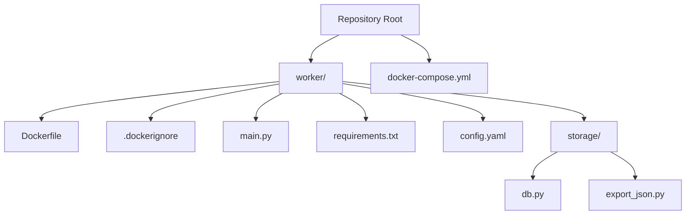
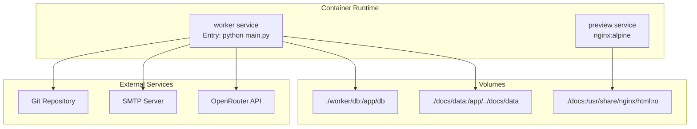
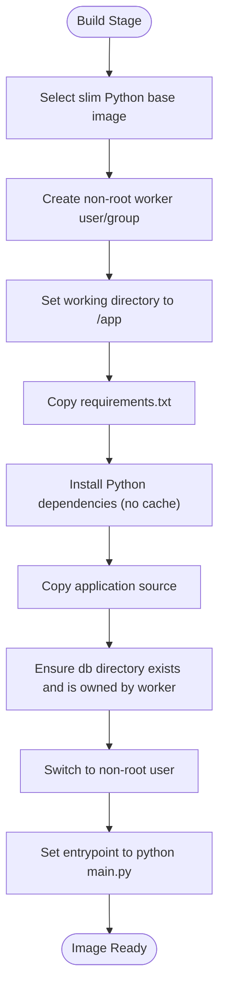
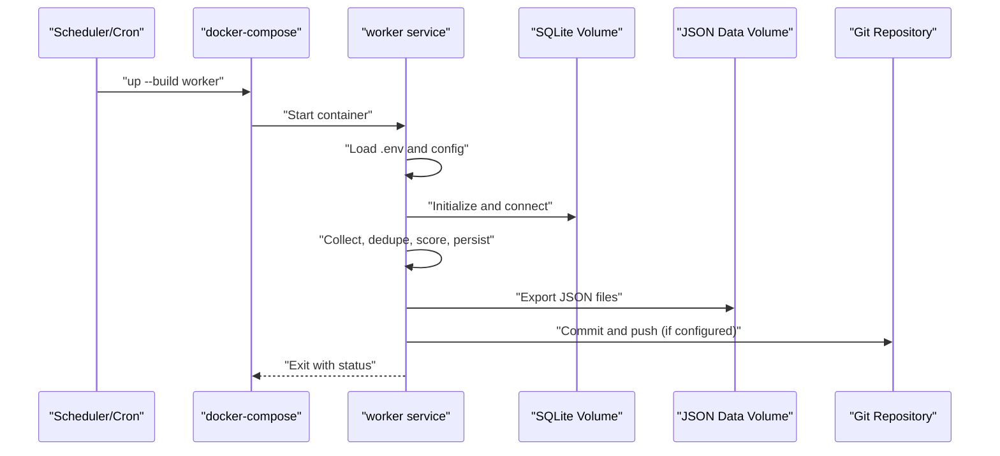
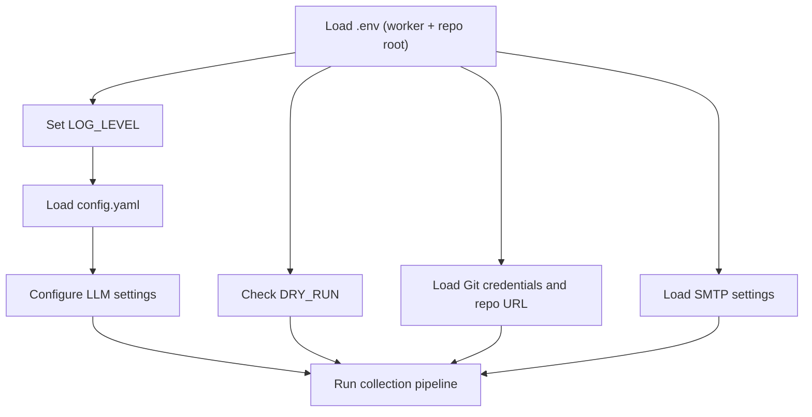
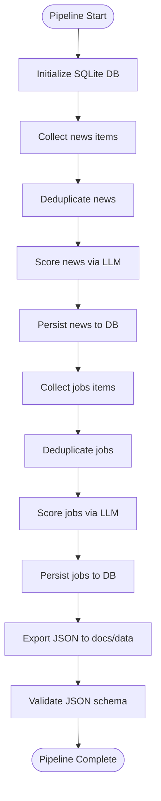
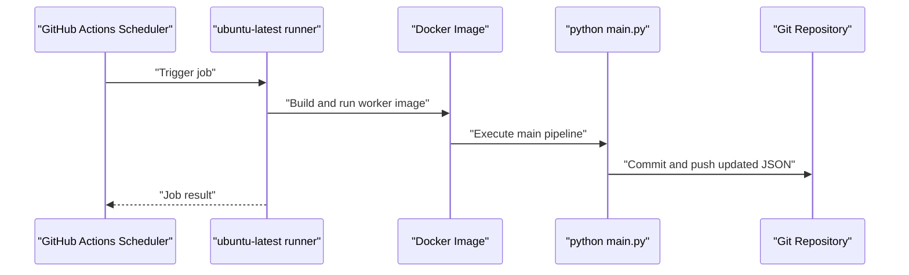
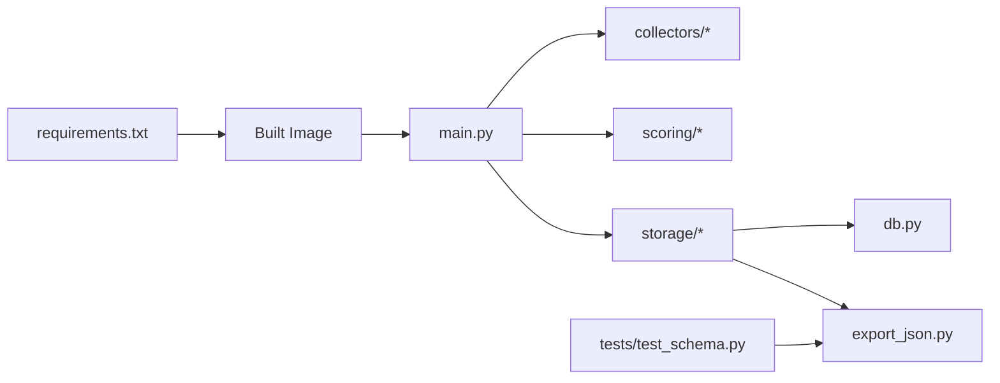

# Docker Containerization

<cite>
**Referenced Files in This Document**
- [Dockerfile](file://worker/Dockerfile)
- [docker-compose.yml](file://docker-compose.yml)
- [.dockerignore](file://worker/.dockerignore)
- [main.py](file://worker/main.py)
- [requirements.txt](file://worker/requirements.txt)
- [config.yaml](file://worker/config.yaml)
- [db.py](file://worker/storage/db.py)
- [export_json.py](file://worker/storage/export_json.py)
- [test_schema.py](file://tests/test_schema.py)
- [worker-schedule.yml](file://.github/workflows/worker-schedule.yml)
- [pages-deploy.yml](file://.github/workflows/pages-deploy.yml)
</cite>

## Table of Contents
1. [Introduction](#introduction)
2. [Project Structure](#project-structure)
3. [Core Components](#core-components)
4. [Architecture Overview](#architecture-overview)
5. [Detailed Component Analysis](#detailed-component-analysis)
6. [Dependency Analysis](#dependency-analysis)
7. [Performance Considerations](#performance-considerations)
8. [Troubleshooting Guide](#troubleshooting-guide)
9. [Conclusion](#conclusion)
10. [Appendices](#appendices)

## Introduction
This document explains how the worker application is containerized and deployed. It covers the Dockerfile configuration, base image selection, dependency installation, and runtime environment setup. It also documents the docker-compose.yml orchestration for development and production-like scenarios, including service definitions, volume mounts, and network configuration. Practical examples demonstrate building images, running containers, and managing multi-service deployments. Security, resource limits, logging configuration, and health checks are addressed alongside Docker best practices, image optimization, and troubleshooting guidance.

## Project Structure
The repository organizes the worker application under a dedicated directory with Docker-related artifacts and orchestration configuration at the repository root. The worker’s runtime behavior is designed to run a single collection cycle per invocation and exit, with scheduling handled externally (either via GitHub Actions or a local cron).

**Diagram sources**
- [Dockerfile](file://worker/Dockerfile)
- [docker-compose.yml](file://docker-compose.yml)
- [main.py](file://worker/main.py)
- [requirements.txt](file://worker/requirements.txt)
- [config.yaml](file://worker/config.yaml)
- [db.py](file://worker/storage/db.py)
- [export_json.py](file://worker/storage/export_json.py)

**Section sources**
- [Dockerfile](file://worker/Dockerfile)
- [docker-compose.yml](file://docker-compose.yml)

## Core Components
- Worker container image: Built from the worker directory using a slim Python base image, installs dependencies, copies source, sets up a non-root user, and defines an entrypoint that executes the main script.
- Orchestration: docker-compose defines a worker service and an optional preview service for local static site preview.
- Runtime behavior: The worker runs once per invocation, collects data, persists to SQLite, exports JSON files, optionally publishes changes, and exits.
- Persistence: SQLite database and exported JSON files are mounted to the host filesystem for persistence across runs.

Key runtime environment variables and configuration:
- Environment variables loaded from .env files (worker-level and repository root fallback).
- Logging level configurable via LOG_LEVEL.
- Dry-run mode via DRY_RUN.
- Git publishing controlled by GH_PAT, GIT_REPO_URL, GIT_BRANCH, and user identity variables.
- SMTP digest controlled by SMTP_ENABLED and related SMTP_* variables.
- LLM model and batch size configured via llm settings and environment overrides.

**Section sources**
- [Dockerfile](file://worker/Dockerfile)
- [docker-compose.yml](file://docker-compose.yml)
- [main.py](file://worker/main.py)
- [config.yaml](file://worker/config.yaml)

## Architecture Overview
The containerized worker is designed to run as a short-lived process. It can be scheduled externally (GitHub Actions or a local cron) and integrates with a static preview service for local development.

**Diagram sources**
- [docker-compose.yml](file://docker-compose.yml)
- [main.py](file://worker/main.py)

## Detailed Component Analysis

### Dockerfile Configuration
The Dockerfile follows a multi-stage build pattern and applies security and performance best practices:
- Base image: Python slim image for reduced footprint.
- Non-root user: Creates a dedicated worker user and group, and switches to it for the final stage.
- Layer caching: Dependencies are installed first to leverage Docker layer caching.
- Working directory: Sets /app as the working directory.
- Source copy: Copies the entire worker directory into the image.
- Permissions: Ensures the db directory is owned by the non-root user.
- Entrypoint: Runs the main script as the entrypoint.

**Diagram sources**
- [Dockerfile](file://worker/Dockerfile)

**Section sources**
- [Dockerfile](file://worker/Dockerfile)

### docker-compose Orchestration
The docker-compose file defines two primary services:
- worker: Builds from the worker directory, sets a container name, disables restart, loads environment variables from .env, mounts volumes for SQLite persistence and JSON export, and exposes LOG_LEVEL via environment.
- preview: Optional static file server using nginx, mounting docs for read-only preview on port 8080, and started via a profile flag.

Optional scheduling approaches:
- External scheduling via GitHub Actions (recommended for production).
- Local cron scheduling by invoking docker compose up --build worker periodically.
- Alternative in-compose scheduling using a looped command (commented in the compose file).

**Diagram sources**
- [docker-compose.yml](file://docker-compose.yml)
- [main.py](file://worker/main.py)

**Section sources**
- [docker-compose.yml](file://docker-compose.yml)

### Runtime Environment and Configuration
- Environment loading: The worker loads .env files from both the worker directory and repository root, enabling flexible configuration.
- Logging: Configurable via LOG_LEVEL; defaults to INFO.
- Dry-run: When enabled, the worker performs all steps except pushing to Git.
- Git publishing: Controlled by GH_PAT, GIT_REPO_URL, GIT_BRANCH, and user identity variables.
- SMTP digest: Controlled by SMTP_ENABLED and related SMTP_* variables.
- LLM configuration: Model, base URL, batch size, and pre-filter keywords are defined in config.yaml and can be overridden via environment variables.

**Diagram sources**
- [main.py](file://worker/main.py)
- [config.yaml](file://worker/config.yaml)

**Section sources**
- [main.py](file://worker/main.py)
- [config.yaml](file://worker/config.yaml)

### Data Persistence and Export
- SQLite database: Stored under worker/db and mounted to the host for persistence across runs.
- JSON export: The worker exports news.json, jobs.json, and meta.json into docs/data, which is mounted into the container’s parent directory to write directly into the repository tree.
- Validation: A test validates the exported JSON schema to ensure correctness.

**Diagram sources**
- [main.py](file://worker/main.py)
- [db.py](file://worker/storage/db.py)
- [export_json.py](file://worker/storage/export_json.py)
- [test_schema.py](file://tests/test_schema.py)

**Section sources**
- [db.py](file://worker/storage/db.py)
- [export_json.py](file://worker/storage/export_json.py)
- [test_schema.py](file://tests/test_schema.py)

### GitHub Actions Integration
- Scheduled runs: The worker runs inside the Docker-built image on a schedule, collecting data, validating JSON, and committing/pushing updates.
- Permissions: Requires write permissions for contents to commit and push.
- Optional SMTP digest: Controlled by SMTP_* secrets and variables.

**Diagram sources**
- [worker-schedule.yml](file://.github/workflows/worker-schedule.yml)
- [pages-deploy.yml](file://.github/workflows/pages-deploy.yml)

**Section sources**
- [worker-schedule.yml](file://.github/workflows/worker-schedule.yml)
- [pages-deploy.yml](file://.github/workflows/pages-deploy.yml)

## Dependency Analysis
- Python dependencies are declared in requirements.txt and installed during the build stage.
- The worker imports modules from collectors, scoring, storage, and notify packages.
- Storage components manage SQLite schema, transactions, and JSON export.
- Tests validate the schema of generated JSON files.

**Diagram sources**
- [requirements.txt](file://worker/requirements.txt)
- [main.py](file://worker/main.py)
- [db.py](file://worker/storage/db.py)
- [export_json.py](file://worker/storage/export_json.py)
- [test_schema.py](file://tests/test_schema.py)

**Section sources**
- [requirements.txt](file://worker/requirements.txt)
- [main.py](file://worker/main.py)
- [db.py](file://worker/storage/db.py)
- [export_json.py](file://worker/storage/export_json.py)
- [test_schema.py](file://tests/test_schema.py)

## Performance Considerations
- Base image choice: Using a slim Python base reduces image size and attack surface.
- Layer caching: Installing dependencies before copying source improves rebuild performance.
- Non-root user: Reduces privilege exposure and aligns with security best practices.
- Volume mounts: Persisting SQLite and JSON data avoids repeated downloads and recomputation.
- Batch processing: LLM batch size is configurable to balance throughput and cost.
- Logging: Adjust LOG_LEVEL to reduce verbosity in production.

[No sources needed since this section provides general guidance]

## Troubleshooting Guide
Common issues and resolutions:
- Permission denied writing to db or docs/data:
  - Ensure the non-root user owns the mounted directories. The Dockerfile creates and owns the db directory; verify host permissions for the mounted volumes.
- Missing .env variables:
  - Confirm .env files exist in the worker directory and/or repository root. The worker attempts to load from both locations.
- Git push failures:
  - Verify GH_PAT and GIT_REPO_URL are set. The worker injects the PAT into the remote URL for push.
- SMTP digest not sent:
  - Ensure SMTP_ENABLED is set to true and all SMTP_* variables are configured.
- JSON schema validation failure:
  - Run the test suite to identify missing keys or invalid types in generated JSON files.
- Health checks:
  - The worker is designed to run once and exit. For long-running services, consider adding a health endpoint or process monitoring outside the container.

**Section sources**
- [main.py](file://worker/main.py)
- [test_schema.py](file://tests/test_schema.py)

## Conclusion
The worker application is containerized with a focus on security, reproducibility, and operational simplicity. The Dockerfile establishes a minimal base image, installs dependencies efficiently, and runs as a non-root user. The docker-compose configuration enables local development with persistent volumes and optional preview capabilities. Scheduling is externalized—either via GitHub Actions or a local cron—ensuring predictable execution and easy maintenance. Adhering to the best practices outlined here will help maintain a robust, secure, and efficient containerized deployment.

[No sources needed since this section summarizes without analyzing specific files]

## Appendices

### Building and Running Images
- Build the worker image:
  - docker build -t devops-news-worker:latest -f worker/Dockerfile ./worker
- Run the worker once:
  - docker run --rm --env-file .env devops-news-worker:latest
- Use docker-compose for orchestrated runs:
  - docker compose up --build worker
  - docker compose --profile preview up preview

**Section sources**
- [Dockerfile](file://worker/Dockerfile)
- [docker-compose.yml](file://docker-compose.yml)

### Security Best Practices
- Non-root user: The image runs as a non-root user to minimize risk.
- Minimal base image: Uses a slim Python image to reduce attack surface.
- Volume permissions: Ensure host directories are writable by the non-root user.
- Secrets management: Store sensitive variables in .env files and avoid embedding secrets in images.

**Section sources**
- [Dockerfile](file://worker/Dockerfile)
- [main.py](file://worker/main.py)

### Resource Limits and Monitoring
- CPU/memory limits: Configure via docker run flags or docker-compose deploy section.
- Logging: Set LOG_LEVEL to control verbosity; stdout is used for logs.
- Health checks: For long-running services, add a simple HTTP health endpoint or process monitoring.

[No sources needed since this section provides general guidance]

### Image Optimization Tips
- Multi-stage builds: Consider separating build-time dependencies from runtime.
- Dependency pinning: Pin versions in requirements.txt to ensure reproducible builds.
- .dockerignore: Exclude unnecessary files and directories to reduce image size.

**Section sources**
- [Dockerfile](file://worker/Dockerfile)
- [.dockerignore](file://worker/.dockerignore)
- [requirements.txt](file://worker/requirements.txt)