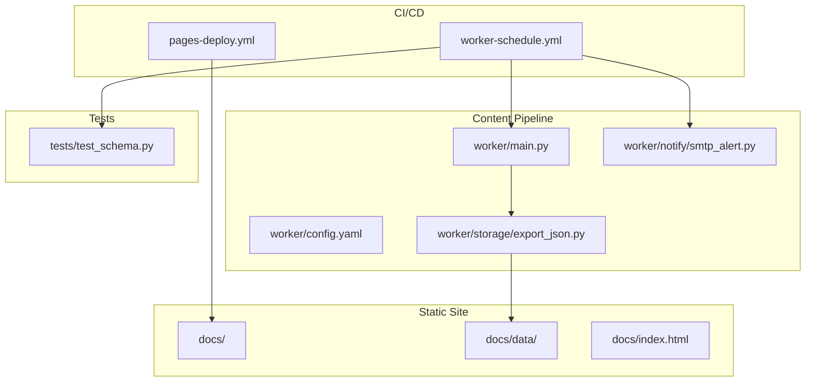
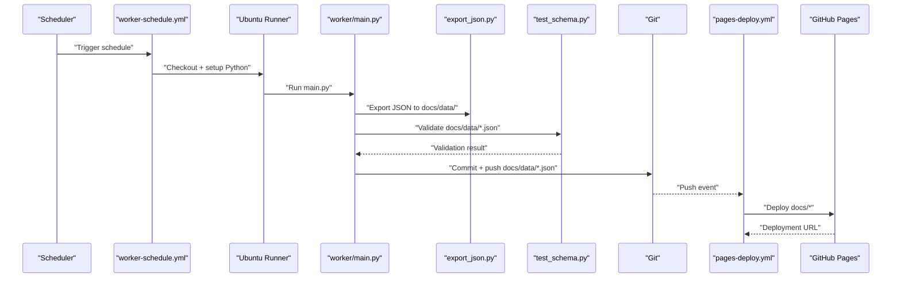
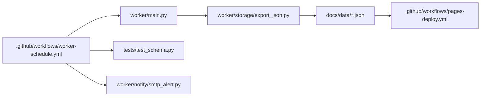

# GitHub Actions Workflows

<cite>
**Referenced Files in This Document**
- [pages-deploy.yml](file://.github/workflows/pages-deploy.yml)
- [worker-schedule.yml](file://.github/workflows/worker-schedule.yml)
- [main.py](file://worker/main.py)
- [config.yaml](file://worker/config.yaml)
- [export_json.py](file://worker/storage/export_json.py)
- [test_schema.py](file://tests/test_schema.py)
- [smtp_alert.py](file://worker/notify/smtp_alert.py)
- [devto.py](file://worker/collectors/news/devto.py)
- [remoteok.py](file://worker/collectors/jobs/remoteok.py)
</cite>

## Table of Contents
1. [Introduction](#introduction)
2. [Project Structure](#project-structure)
3. [Core Components](#core-components)
4. [Architecture Overview](#architecture-overview)
5. [Detailed Component Analysis](#detailed-component-analysis)
6. [Dependency Analysis](#dependency-analysis)
7. [Performance Considerations](#performance-considerations)
8. [Troubleshooting Guide](#troubleshooting-guide)
9. [Conclusion](#conclusion)

## Introduction
This document provides comprehensive documentation for the GitHub Actions workflows that power the deployment pipeline and automated content collection for a static site publishing system. It covers:
- The pages-deploy.yml workflow for publishing static content to GitHub Pages
- The worker-schedule.yml workflow for automated content refresh and publication
- Practical customization tips for triggers, secrets, and monitoring
- Workflow optimization, error handling, and debugging techniques

## Project Structure
The repository organizes CI/CD logic under `.github/workflows` and the content collection pipeline under `worker`. The static site content resides under `docs`, while tests validate the exported JSON schema.

**Diagram sources**
- [pages-deploy.yml:1-42](file://.github/workflows/pages-deploy.yml#L1-L42)
- [worker-schedule.yml:1-70](file://.github/workflows/worker-schedule.yml#L1-L70)
- [main.py:1-297](file://worker/main.py#L1-L297)
- [export_json.py:1-93](file://worker/storage/export_json.py#L1-L93)
- [test_schema.py:1-136](file://tests/test_schema.py#L1-L136)
- [smtp_alert.py:1-105](file://worker/notify/smtp_alert.py#L1-L105)

**Section sources**
- [.github/workflows/pages-deploy.yml:1-42](file://.github/workflows/pages-deploy.yml#L1-L42)
- [.github/workflows/worker-schedule.yml:1-70](file://.github/workflows/worker-schedule.yml#L1-L70)
- [worker/main.py:1-297](file://worker/main.py#L1-L297)
- [worker/config.yaml:1-244](file://worker/config.yaml#L1-L244)
- [worker/storage/export_json.py:1-93](file://worker/storage/export_json.py#L1-L93)
- [tests/test_schema.py:1-136](file://tests/test_schema.py#L1-L136)
- [worker/notify/smtp_alert.py:1-105](file://worker/notify/smtp_alert.py#L1-L105)

## Core Components
- pages-deploy.yml: Deploys the static site content located under docs to GitHub Pages upon push to main or manual dispatch. It manages concurrency, permissions, artifact upload, and deployment.
- worker-schedule.yml: Schedules periodic content refresh, runs the worker pipeline, validates JSON output, and commits/pushes updates to trigger the pages-deploy workflow.

Key capabilities:
- Branch-triggered deployment for static content
- Scheduled execution with cron
- Environment variable-driven configuration and optional SMTP notifications
- Automated JSON schema validation
- Git-based publishing of generated content

**Section sources**
- [.github/workflows/pages-deploy.yml:1-42](file://.github/workflows/pages-deploy.yml#L1-L42)
- [.github/workflows/worker-schedule.yml:1-70](file://.github/workflows/worker-schedule.yml#L1-L70)

## Architecture Overview
The system operates as two coordinated workflows:
- worker-schedule.yml executes periodically and on demand, running the worker pipeline to collect, deduplicate, score, persist, and export content to docs/data/*.json.
- pages-deploy.yml listens for changes to docs and deploys the static site to GitHub Pages.

**Diagram sources**
- [worker-schedule.yml:13-70](file://.github/workflows/worker-schedule.yml#L13-L70)
- [main.py:127-297](file://worker/main.py#L127-L297)
- [export_json.py:32-93](file://worker/storage/export_json.py#L32-L93)
- [test_schema.py:1-136](file://tests/test_schema.py#L1-L136)
- [pages-deploy.yml:3-42](file://.github/workflows/pages-deploy.yml#L3-L42)

## Detailed Component Analysis

### pages-deploy.yml: Static Site Publishing
- Triggers:
  - Push to main branch affecting docs/** files
  - Manual dispatch via workflow_dispatch
- Permissions:
  - Read repository contents
  - Write to GitHub Pages
  - Issue ID tokens for authentication
- Concurrency:
  - Single concurrent deployment with group "pages"
- Job steps:
  - Checkout repository
  - Configure GitHub Pages
  - Upload docs directory as artifact
  - Deploy artifact to GitHub Pages

Customization examples:
- Change branch trigger: Modify the branch list under push.branches
- Restrict paths: Adjust paths under push.paths to target specific directories
- Environment URL: Reference the deployment URL in the environment configuration

Operational notes:
- The workflow sets an environment URL pointing to the deployment output, enabling easy access to the published site.

**Section sources**
- [.github/workflows/pages-deploy.yml:1-42](file://.github/workflows/pages-deploy.yml#L1-L42)

### worker-schedule.yml: Automated Content Collection and Publication
- Triggers:
  - Scheduled execution using cron
  - Manual dispatch via workflow_dispatch
- Permissions:
  - Write access to repository contents for committing and pushing updated JSON files
- Job steps:
  - Checkout repository with GITHUB_TOKEN and shallow clone
  - Set up Python 3.12 with pip caching
  - Install dependencies from worker/requirements.txt
  - Run worker/main.py with environment variables for API keys and SMTP settings
  - Validate generated JSON using pytest
  - Commit and push docs/data/*.json if changes exist

Environment variables:
- OPENROUTER_API_KEY: Required for LLM relevance scoring
- OPENROUTER_MODEL: Optional override for the model used
- SMTP_ENABLED: Enable optional SMTP digest
- SMTP_HOST, SMTP_PORT, SMTP_USER, SMTP_PASSWORD, SMTP_TO: SMTP credentials and recipient
- LOG_LEVEL: Logging verbosity
- DRY_RUN: Set to true to skip publishing and git operations

Secrets and variables:
- Secrets: OPENROUTER_API_KEY, GITHUB_TOKEN (implicit via checkout), SMTP_* credentials
- Variables: OPENROUTER_MODEL, SMTP_ENABLED

Workflow orchestration:
- The worker pipeline exports docs/data/*.json, which when committed and pushed, triggers pages-deploy.yml to publish the updated site.

**Section sources**
- [.github/workflows/worker-schedule.yml:1-70](file://.github/workflows/worker-schedule.yml#L1-L70)

### Worker Pipeline Orchestration (worker/main.py)
The worker orchestrates the end-to-end pipeline:
- Loads configuration from worker/config.yaml
- Collects news and jobs from enabled sources
- Deduplicates and applies keyword filters
- Scores items via OpenRouter LLM
- Persists to SQLite
- Exports static JSON to docs/data/
- Commits and pushes changes unless DRY_RUN is enabled
- Optionally sends an SMTP digest

Key behaviors:
- Source health tracking and error aggregation
- Batch processing with configurable batch sizes
- Dry-run mode for testing without publishing
- Git publishing with optional PAT and repository URL overrides

**Section sources**
- [worker/main.py:127-297](file://worker/main.py#L127-L297)
- [worker/config.yaml:1-244](file://worker/config.yaml#L1-L244)

### Data Export and Validation (export_json.py and test_schema.py)
- export_json.py reads from SQLite and writes docs/data/news.json, jobs.json, and meta.json with timestamps and counts.
- test_schema.py validates the exported JSON against required fields and constraints.

Validation coverage:
- meta.json: presence of keys, non-negative counts, health dictionary, and ISO timestamp
- news.json and jobs.json: top-level keys, items arrays, required fields per item, numeric relevance scores in [0,1], and uniqueness of IDs

**Section sources**
- [worker/storage/export_json.py:1-93](file://worker/storage/export_json.py#L1-L93)
- [tests/test_schema.py:1-136](file://tests/test_schema.py#L1-L136)

### Optional SMTP Digest (smtp_alert.py)
- Sends an HTML digest of high-relevance news and jobs via SMTP when enabled.
- Requires SMTP credentials and recipient; otherwise logs a warning and skips sending.

**Section sources**
- [worker/notify/smtp_alert.py:1-105](file://worker/notify/smtp_alert.py#L1-L105)

### Example Collector Modules
- devto.py: Collects articles from Dev.to filtered by tags and limits per page and total items.
- remoteok.py: Fetches jobs from RemoteOK with keyword filtering and timestamp normalization.

These illustrate how sources are integrated into the worker pipeline and how configuration controls behavior.

**Section sources**
- [worker/collectors/news/devto.py:1-72](file://worker/collectors/news/devto.py#L1-L72)
- [worker/collectors/jobs/remoteok.py:1-83](file://worker/collectors/jobs/remoteok.py#L1-L83)

## Dependency Analysis
The workflows depend on each other and on the worker pipeline:

**Diagram sources**
- [worker-schedule.yml:13-70](file://.github/workflows/worker-schedule.yml#L13-L70)
- [main.py:127-297](file://worker/main.py#L127-L297)
- [export_json.py:32-93](file://worker/storage/export_json.py#L32-L93)
- [pages-deploy.yml:3-42](file://.github/workflows/pages-deploy.yml#L3-L42)
- [test_schema.py:1-136](file://tests/test_schema.py#L1-L136)
- [smtp_alert.py:1-105](file://worker/notify/smtp_alert.py#L1-L105)

**Section sources**
- [.github/workflows/worker-schedule.yml:13-70](file://.github/workflows/worker-schedule.yml#L13-L70)
- [.github/workflows/pages-deploy.yml:3-42](file://.github/workflows/pages-deploy.yml#L3-L42)
- [worker/main.py:127-297](file://worker/main.py#L127-L297)
- [worker/storage/export_json.py:32-93](file://worker/storage/export_json.py#L32-L93)
- [tests/test_schema.py:1-136](file://tests/test_schema.py#L1-L136)
- [worker/notify/smtp_alert.py:1-105](file://worker/notify/smtp_alert.py#L1-L105)

## Performance Considerations
- Concurrency control: pages-deploy.yml uses a concurrency group to prevent overlapping deployments.
- Shallow clones: worker-schedule.yml uses a shallow fetch to reduce bandwidth and speed up checkout.
- Caching: Python dependency caching is enabled for faster installs.
- Batch processing: LLM scoring uses configurable batch sizes to balance throughput and cost.
- Pre-filtering: Keyword filters reduce unnecessary LLM calls.
- Dry-run mode: Allows testing without network or disk changes.

[No sources needed since this section provides general guidance]

## Troubleshooting Guide
Common issues and resolutions:
- Deployment not triggered:
  - Verify push paths include docs/** and that the branch matches the configured branch.
  - Use workflow_dispatch to manually trigger deployment.
- Content not updating:
  - Confirm worker-schedule.yml runs successfully and commits changes to docs/data/*.json.
  - Check that the validation step passes; failures will abort the workflow.
- Authentication failures:
  - Ensure OPENROUTER_API_KEY is set in repository secrets.
  - For SMTP, confirm SMTP_* variables/secrets are configured when SMTP_ENABLED is true.
- Git publishing issues:
  - If GH_PAT and GIT_REPO_URL are not set, the worker will commit locally without pushing.
  - When running locally, configure Git credentials and remote URL accordingly.
- Debugging:
  - Increase LOG_LEVEL to capture more verbose logs during worker execution.
  - Use DRY_RUN=true to test the pipeline without publishing.

Monitoring and verification:
- Review workflow run logs for each step’s success/failure.
- Inspect the exported JSON files in docs/data/ to confirm schema compliance.
- Validate that the GitHub Pages environment URL is populated after deployment.

**Section sources**
- [.github/workflows/pages-deploy.yml:10-18](file://.github/workflows/pages-deploy.yml#L10-L18)
- [.github/workflows/worker-schedule.yml:44-57](file://.github/workflows/worker-schedule.yml#L44-L57)
- [worker/main.py:77-124](file://worker/main.py#L77-L124)
- [tests/test_schema.py:28-136](file://tests/test_schema.py#L28-L136)

## Conclusion
The workflows provide a robust CI/CD pipeline for automated content refresh and static site publishing:
- worker-schedule.yml coordinates data collection, validation, and publication
- pages-deploy.yml ensures timely deployment of updated content to GitHub Pages
- Configuration and environment variables enable flexible customization
- Built-in validation and optional SMTP notifications improve quality and observability

By leveraging these workflows and their documented customization points, teams can maintain a reliable, automated system for content distribution.