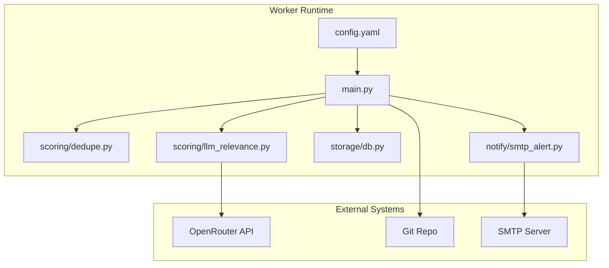
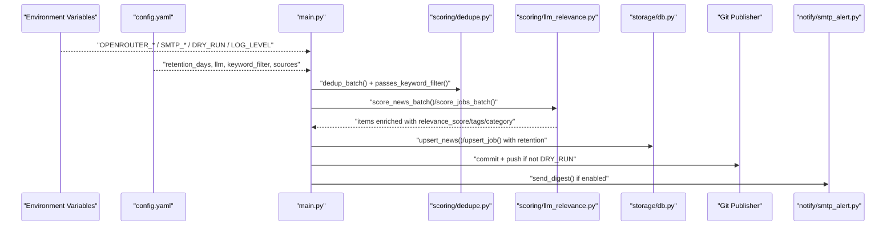
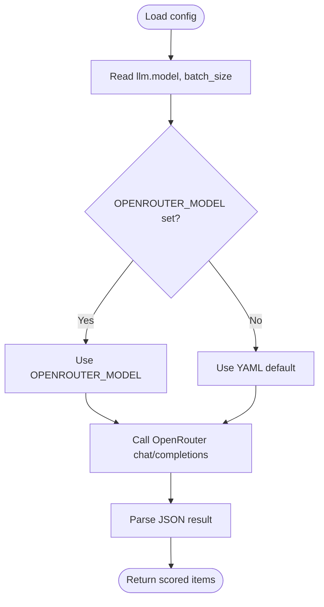
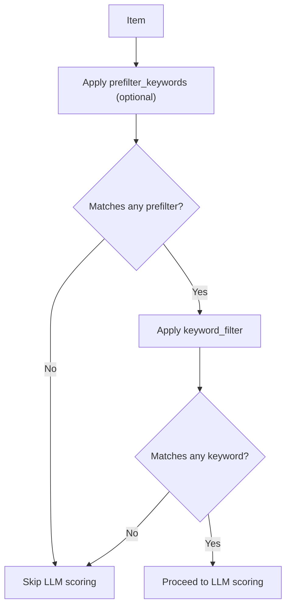
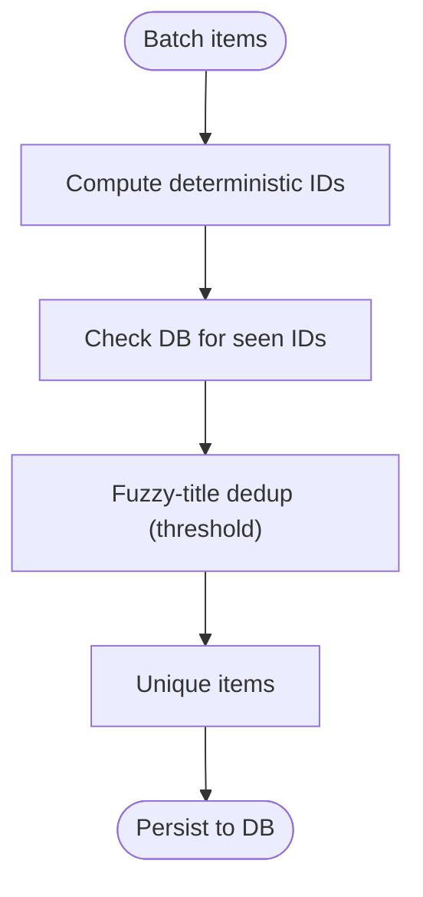
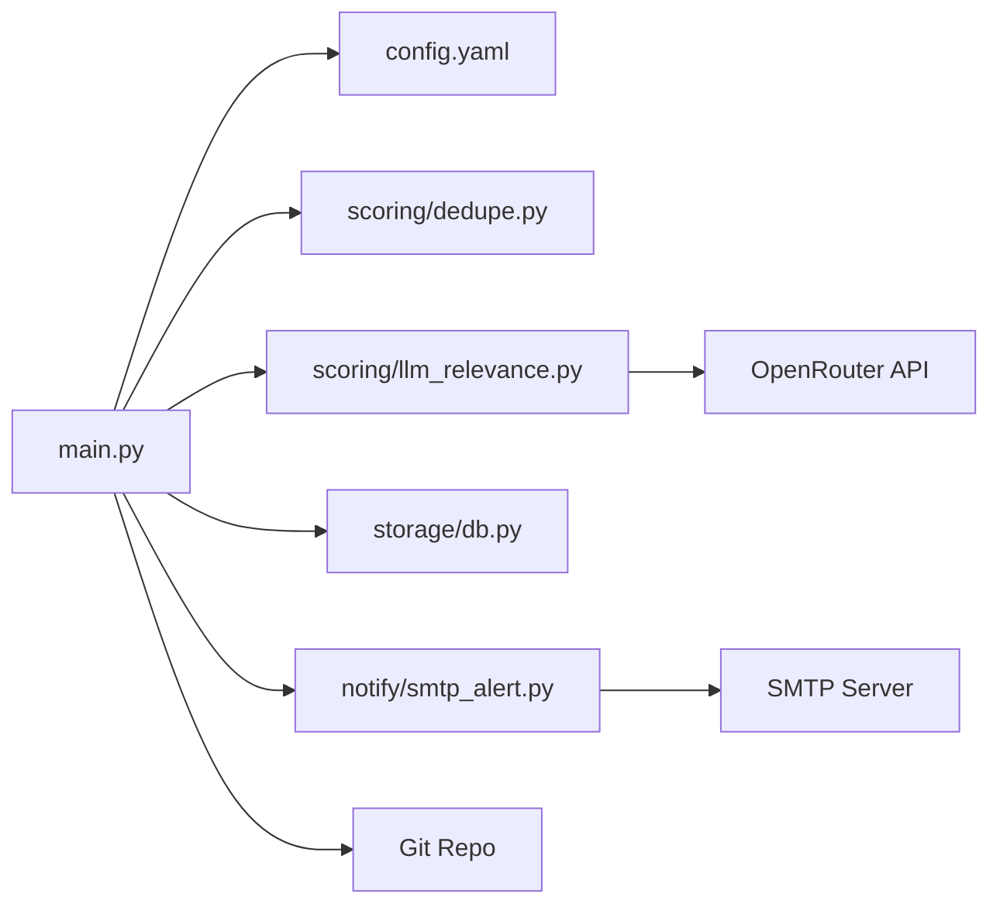

# Advanced Customization

<cite>
**Referenced Files in This Document**
- [config.yaml](file://worker/config.yaml)
- [main.py](file://worker/main.py)
- [llm_relevance.py](file://worker/scoring/llm_relevance.py)
- [dedupe.py](file://worker/scoring/dedupe.py)
- [db.py](file://worker/storage/db.py)
- [Dockerfile](file://worker/Dockerfile)
- [docker-compose.yml](file://docker-compose.yml)
- [smtp_alert.py](file://worker/notify/smtp_alert.py)
- [worker-schedule.yml](file://.github/workflows/worker-schedule.yml)
- [requirements.txt](file://worker/requirements.txt)
</cite>

## Table of Contents
1. [Introduction](#introduction)
2. [Project Structure](#project-structure)
3. [Core Components](#core-components)
4. [Architecture Overview](#architecture-overview)
5. [Detailed Component Analysis](#detailed-component-analysis)
6. [Dependency Analysis](#dependency-analysis)
7. [Performance Considerations](#performance-considerations)
8. [Troubleshooting Guide](#troubleshooting-guide)
9. [Conclusion](#conclusion)
10. [Appendices](#appendices)

## Introduction
This document explains advanced configuration and customization options for the DevOps & AI Hub system. It covers environment variable overrides, custom LLM model configuration, rate limiting strategies, performance tuning parameters, keyword filtering rules, content scoring thresholds, advanced deduplication settings, security considerations for API keys and proxies, production deployment best practices, scaling configurations for high-volume environments, and troubleshooting advanced configuration scenarios.

## Project Structure
The worker orchestrates collection, deduplication, LLM scoring, persistence, JSON export, optional Git publishing, and optional SMTP digest. Configuration is centralized in a YAML file with environment overrides applied at runtime.

**Diagram sources**
- [config.yaml](file://worker/config.yaml)
- [main.py](file://worker/main.py)
- [dedupe.py](file://worker/scoring/dedupe.py)
- [llm_relevance.py](file://worker/scoring/llm_relevance.py)
- [db.py](file://worker/storage/db.py)
- [smtp_alert.py](file://worker/notify/smtp_alert.py)

**Section sources**
- [main.py](file://worker/main.py)
- [config.yaml](file://worker/config.yaml)

## Core Components
- Configuration: Centralized in YAML with environment variable overrides for LLM and runtime controls.
- Pipeline orchestration: Collection → Deduplication → LLM scoring → Persistence → JSON export → Optional Git publish → Optional SMTP digest.
- Scoring: OpenRouter-backed relevance scoring with configurable batch size and model.
- Deduplication: Deterministic hashing and fuzzy-title deduplication with tunable threshold.
- Storage: SQLite schema and helpers with retention and indexing.
- Deployment: Containerized with Docker Compose and optional GitHub Actions scheduling.

**Section sources**
- [config.yaml](file://worker/config.yaml)
- [main.py](file://worker/main.py)
- [llm_relevance.py](file://worker/scoring/llm_relevance.py)
- [dedupe.py](file://worker/scoring/dedupe.py)
- [db.py](file://worker/storage/db.py)

## Architecture Overview
The system runs a single orchestrated pipeline per invocation. It loads configuration, collects data from enabled sources, deduplicates, applies keyword filtering, scores via LLM, persists to SQLite, exports JSON, optionally publishes via Git, and optionally sends an SMTP digest.

**Diagram sources**
- [main.py](file://worker/main.py)
- [dedupe.py](file://worker/scoring/dedupe.py)
- [llm_relevance.py](file://worker/scoring/llm_relevance.py)
- [db.py](file://worker/storage/db.py)
- [smtp_alert.py](file://worker/notify/smtp_alert.py)

## Detailed Component Analysis

### Environment Variable Overrides and Configuration
- LLM model override: The LLM model can be overridden via environment variable for both YAML defaults and runtime usage.
- LLM base URL override: The OpenRouter base URL can be customized via environment variable.
- Logging level: Controlled via environment variable.
- Dry-run mode: Skips Git publishing.
- SMTP enablement and credentials: Controlled via environment variables.
- Git publishing: Requires credentials and repository URL; otherwise logs locally.

Key override locations:
- Model and base URL: [llm_relevance.py](file://worker/scoring/llm_relevance.py)
- Dry-run and SMTP toggles: [main.py](file://worker/main.py)
- Git publishing credentials: [main.py](file://worker/main.py)
- SMTP credentials and thresholds: [smtp_alert.py](file://worker/notify/smtp_alert.py)

**Section sources**
- [llm_relevance.py](file://worker/scoring/llm_relevance.py)
- [main.py](file://worker/main.py)
- [smtp_alert.py](file://worker/notify/smtp_alert.py)

### Custom LLM Model Configuration
- Model selection: YAML defines a default model; environment variable can override it at runtime.
- Batch size: Controls how many items are sent per LLM request.
- Temperature and max tokens: Defined in YAML; the LLM module sets its own defaults for chat requests.
- API key requirement: LLM scoring is skipped if the API key is not set.

Implementation highlights:
- YAML defaults and overrides: [config.yaml](file://worker/config.yaml)
- Environment overrides and HTTP client: [llm_relevance.py](file://worker/scoring/llm_relevance.py)
- Pipeline usage of model and batch size: [main.py](file://worker/main.py)

**Diagram sources**
- [config.yaml](file://worker/config.yaml)
- [llm_relevance.py](file://worker/scoring/llm_relevance.py)
- [main.py](file://worker/main.py)

**Section sources**
- [config.yaml](file://worker/config.yaml)
- [llm_relevance.py](file://worker/scoring/llm_relevance.py)
- [main.py](file://worker/main.py)

### Rate Limiting Strategies
- Source-specific delays: Some sources define per-request delays to respect provider limits.
- LLM batching: Reduce API calls by increasing batch size.
- Retry behavior: LLM scoring continues with remaining items on failure; tune batch size to minimize partial failures.

Practical controls:
- Source delay configuration: [config.yaml](file://worker/config.yaml)
- LLM batch size: [config.yaml](file://worker/config.yaml)
- LLM retry policy: [llm_relevance.py](file://worker/scoring/llm_relevance.py)

**Section sources**
- [config.yaml](file://worker/config.yaml)
- [llm_relevance.py](file://worker/scoring/llm_relevance.py)

### Performance Tuning Parameters
- SQLite WAL mode and foreign keys: Enabled for concurrency and integrity.
- Indexes: Published timestamps and source fields are indexed for queries.
- Retention window: Limits query scope and reduces storage growth.
- Batch size: Controls memory and throughput trade-offs for LLM calls.
- Logging level: Adjust via environment variable to reduce overhead in production.

Relevant settings:
- Schema and indexes: [db.py](file://worker/storage/db.py)
- Retention control: [main.py](file://worker/main.py)
- Batch size and model: [config.yaml](file://worker/config.yaml)
- Logging level: [main.py](file://worker/main.py)

**Section sources**
- [db.py](file://worker/storage/db.py)
- [main.py](file://worker/main.py)
- [config.yaml](file://worker/config.yaml)

### Implementing Custom Keyword Filtering Rules
- Pre-filter before LLM: A dedicated pre-filter list can restrict LLM calls to items containing specific keywords.
- Keyword filter: Ensures items pass a keyword gate before scoring.
- Job-level keywords: Passed into job collectors for additional filtering.

Customization points:
- Pre-filter keywords: [config.yaml](file://worker/config.yaml)
- Keyword filter list: [config.yaml](file://worker/config.yaml)
- Job keywords: [config.yaml](file://worker/config.yaml)
- Keyword filter logic: [dedupe.py](file://worker/scoring/dedupe.py)

**Diagram sources**
- [config.yaml](file://worker/config.yaml)
- [dedupe.py](file://worker/scoring/dedupe.py)

**Section sources**
- [config.yaml](file://worker/config.yaml)
- [dedupe.py](file://worker/scoring/dedupe.py)

### Modifying Content Scoring Thresholds
- SMTP digest threshold: Items must exceed a minimum relevance score to be included in the digest.
- LLM scoring: Scores are computed regardless of threshold; filtering occurs only for notifications.

Adjustment points:
- SMTP digest threshold: [smtp_alert.py](file://worker/notify/smtp_alert.py)

Note: There is no configurable global threshold for excluding items from persistence; items are stored with scores and can be filtered downstream.

**Section sources**
- [smtp_alert.py](file://worker/notify/smtp_alert.py)

### Advanced Deduplication Settings
- Deterministic IDs: Stable hashes derived from title, URL, and source (and company for jobs).
- DB-backed seen checks: Prevents re-insertion of previously seen items.
- In-batch fuzzy deduplication: Removes near-duplicates using a configurable similarity threshold.

Tunable parameters:
- Fuzzy threshold: [dedupe.py](file://worker/scoring/dedupe.py)
- ID generation: [dedupe.py](file://worker/scoring/dedupe.py)
- Seen checks: [dedupe.py](file://worker/scoring/dedupe.py)

**Diagram sources**
- [dedupe.py](file://worker/scoring/dedupe.py)
- [db.py](file://worker/storage/db.py)

**Section sources**
- [dedupe.py](file://worker/scoring/dedupe.py)
- [db.py](file://worker/storage/db.py)

### Security Considerations
- API key management: OpenRouter API key is required for LLM scoring; supply via environment variable. The module gracefully skips scoring if the key is absent.
- SMTP credentials: All SMTP credentials are sourced from environment variables; missing values cause the digest to be skipped.
- Proxy configuration: The HTTP client supports a base URL override; configure the environment variable to route traffic through a proxy endpoint if needed.
- Git publishing: Requires credentials and repository URL; otherwise publishes locally without pushing.

Security controls:
- LLM API key presence: [llm_relevance.py](file://worker/scoring/llm_relevance.py)
- SMTP credential checks: [smtp_alert.py](file://worker/notify/smtp_alert.py)
- OpenRouter base URL override: [llm_relevance.py](file://worker/scoring/llm_relevance.py)
- Git credentials injection: [main.py](file://worker/main.py)

**Section sources**
- [llm_relevance.py](file://worker/scoring/llm_relevance.py)
- [smtp_alert.py](file://worker/notify/smtp_alert.py)
- [main.py](file://worker/main.py)

### Production Deployment Best Practices
- Containerization: Use the provided Dockerfile and Docker Compose for reproducible deployments.
- Volume mounts: Persist SQLite database and JSON output by mounting appropriate directories.
- Scheduling: Use GitHub Actions or a cron-based approach to run the worker on a schedule.
- Environment isolation: Supply secrets via environment variables or secret managers; avoid hardcoding.
- Preview server: Optional Nginx preview container for local validation.

Deployment artifacts:
- Container image build: [Dockerfile](file://worker/Dockerfile)
- Compose configuration: [docker-compose.yml](file://docker-compose.yml)
- GitHub Actions workflow: [worker-schedule.yml](file://.github/workflows/worker-schedule.yml)
- Dependencies: [requirements.txt](file://worker/requirements.txt)

**Section sources**
- [Dockerfile](file://worker/Dockerfile)
- [docker-compose.yml](file://docker-compose.yml)
- [worker-schedule.yml](file://.github/workflows/worker-schedule.yml)
- [requirements.txt](file://worker/requirements.txt)

### Scaling Configurations for High-Volume Environments
- Increase batch size: Tune the LLM batch size to balance throughput and cost.
- Parallelism: Run multiple worker instances behind a scheduler; coordinate via shared storage and Git.
- Resource limits: Configure CPU/memory requests/limits in container orchestrators.
- Database tuning: Ensure WAL mode and indexes are effective; monitor query performance.
- Network: Use a proxy base URL for OpenRouter if required by your network policy.

Scaling levers:
- Batch size: [config.yaml](file://worker/config.yaml)
- OpenRouter base URL override: [llm_relevance.py](file://worker/scoring/llm_relevance.py)
- Docker Compose volumes and restart policy: [docker-compose.yml](file://docker-compose.yml)

**Section sources**
- [config.yaml](file://worker/config.yaml)
- [llm_relevance.py](file://worker/scoring/llm_relevance.py)
- [docker-compose.yml](file://docker-compose.yml)

## Dependency Analysis
The worker depends on configuration, scoring, deduplication, storage, and optional notification and Git publishing modules. External dependencies include OpenRouter, SMTP servers, and Git hosting.

**Diagram sources**
- [main.py](file://worker/main.py)
- [config.yaml](file://worker/config.yaml)
- [dedupe.py](file://worker/scoring/dedupe.py)
- [llm_relevance.py](file://worker/scoring/llm_relevance.py)
- [db.py](file://worker/storage/db.py)
- [smtp_alert.py](file://worker/notify/smtp_alert.py)

**Section sources**
- [main.py](file://worker/main.py)
- [llm_relevance.py](file://worker/scoring/llm_relevance.py)
- [db.py](file://worker/storage/db.py)

## Performance Considerations
- Prefer keyword pre-filters to reduce LLM calls.
- Adjust batch size to match provider quotas and latency targets.
- Monitor SQLite query performance with retention windows and indexes.
- Control logging verbosity in production to reduce I/O overhead.
- Use container resource limits and separate instances for heavy workloads.

[No sources needed since this section provides general guidance]

## Troubleshooting Guide
Common issues and resolutions:
- LLM scoring disabled: Ensure the OpenRouter API key is set; otherwise scoring is skipped.
- No items exported to SMTP digest: Verify the minimum relevance threshold and that SMTP credentials are fully configured.
- Git publish not pushing: Provide both credentials and repository URL; otherwise publishing is skipped and logged.
- Excessive near-duplicates: Lower the fuzzy threshold or tighten keyword filters.
- Slow performance: Increase batch size gradually, ensure indexes are effective, and consider reducing logging level.

Diagnostic hooks:
- LLM API key presence and warnings: [llm_relevance.py](file://worker/scoring/llm_relevance.py)
- SMTP digest conditions: [smtp_alert.py](file://worker/notify/smtp_alert.py)
- Git publish credentials and behavior: [main.py](file://worker/main.py)
- Fuzzy threshold and dedup debug messages: [dedupe.py](file://worker/scoring/dedupe.py)

**Section sources**
- [llm_relevance.py](file://worker/scoring/llm_relevance.py)
- [smtp_alert.py](file://worker/notify/smtp_alert.py)
- [main.py](file://worker/main.py)
- [dedupe.py](file://worker/scoring/dedupe.py)

## Conclusion
The DevOps & AI Hub system offers flexible configuration through YAML and environment variables, robust deduplication and scoring, and secure handling of secrets. By tuning keyword filters, batch sizes, thresholds, and deployment parameters, operators can scale reliably while maintaining high signal-to-noise output.

[No sources needed since this section summarizes without analyzing specific files]

## Appendices

### Environment Variables Reference
- OPENROUTER_MODEL: Override LLM model for the run.
- OPENROUTER_BASE_URL: Override OpenRouter base URL (useful for proxy routing).
- OPENROUTER_API_KEY: Required for LLM scoring.
- DRY_RUN: When true, skips Git publishing.
- SMTP_ENABLED: Enables SMTP digest sending.
- SMTP_HOST, SMTP_PORT, SMTP_USER, SMTP_PASSWORD, SMTP_TO, SMTP_FROM: SMTP credentials and destination.
- LOG_LEVEL: Logging verbosity.
- GH_PAT, GIT_REPO_URL, GIT_BRANCH, GIT_USER_NAME, GIT_USER_EMAIL: Git publishing credentials and metadata.

**Section sources**
- [llm_relevance.py](file://worker/scoring/llm_relevance.py)
- [main.py](file://worker/main.py)
- [smtp_alert.py](file://worker/notify/smtp_alert.py)