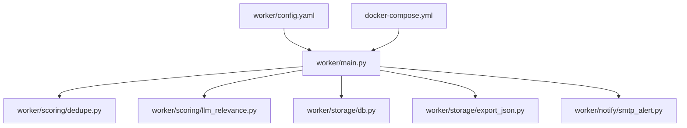
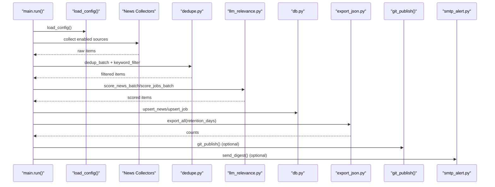
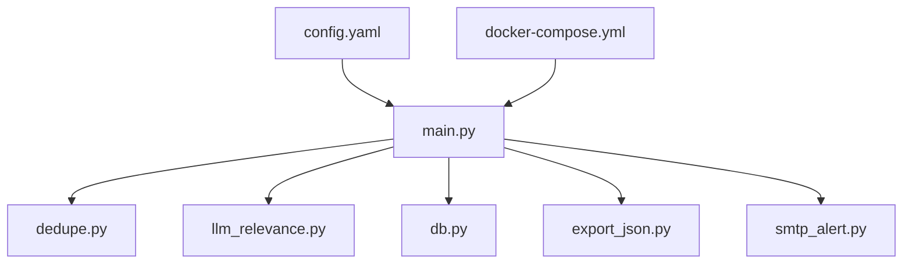

# Configuration Guide

<cite>
**Referenced Files in This Document**
- [config.yaml](file://worker/config.yaml)
- [main.py](file://worker/main.py)
- [llm_relevance.py](file://worker/scoring/llm_relevance.py)
- [dedupe.py](file://worker/scoring/dedupe.py)
- [db.py](file://worker/storage/db.py)
- [export_json.py](file://worker/storage/export_json.py)
- [smtp_alert.py](file://worker/notify/smtp_alert.py)
- [docker-compose.yml](file://docker-compose.yml)
- [.gitignore](file://.gitignore)
- [requirements.txt](file://worker/requirements.txt)
</cite>

## Table of Contents
1. [Introduction](#introduction)
2. [Project Structure](#project-structure)
3. [Core Components](#core-components)
4. [Architecture Overview](#architecture-overview)
5. [Detailed Component Analysis](#detailed-component-analysis)
6. [Dependency Analysis](#dependency-analysis)
7. [Performance Considerations](#performance-considerations)
8. [Troubleshooting Guide](#troubleshooting-guide)
9. [Conclusion](#conclusion)
10. [Appendices](#appendices)

## Introduction
This guide documents the configuration system for the DevOps & AI Hub worker. It focuses on the central configuration file, environment variable overrides, and how these settings influence ingestion, filtering, LLM scoring, persistence, and publishing. It also covers security considerations for API keys, production best practices, and troubleshooting common configuration issues.

## Project Structure
The configuration is primarily defined in a single YAML file and consumed by the orchestrator script. Supporting components include:
- Central configuration loader and runtime behavior
- LLM integration settings and environment overrides
- Keyword filtering and deduplication logic
- Persistence and export behavior
- Optional SMTP digest delivery
- Container orchestration and environment loading

**Diagram sources**
- [config.yaml](file://worker/config.yaml)
- [main.py](file://worker/main.py)
- [llm_relevance.py](file://worker/scoring/llm_relevance.py)
- [dedupe.py](file://worker/scoring/dedupe.py)
- [db.py](file://worker/storage/db.py)
- [export_json.py](file://worker/storage/export_json.py)
- [smtp_alert.py](file://worker/notify/smtp_alert.py)
- [docker-compose.yml](file://docker-compose.yml)

**Section sources**
- [config.yaml](file://worker/config.yaml)
- [main.py](file://worker/main.py)
- [docker-compose.yml](file://docker-compose.yml)

## Core Components
This section explains the central configuration file and how it is loaded and used at runtime.

- Central configuration file: [config.yaml](file://worker/config.yaml)
- Configuration loader: [load_config():70-73](file://worker/main.py#L70-L73)
- Runtime consumption: [run():127-292](file://worker/main.py#L127-L292)

Key behaviors:
- The orchestrator loads the YAML configuration and reads top-level keys such as retention_days, llm, keyword_filter, news, and jobs.
- Environment variables override specific LLM settings and global flags (e.g., OPENROUTER_API_KEY, OPENROUTER_MODEL, OPENROUTER_BASE_URL, DRY_RUN, SMTP_ENABLED, LOG_LEVEL).
- The configuration controls which sources are enabled, how many items are fetched per source, and how LLM scoring is applied.

Practical examples:
- Enable/disable a news source by toggling its enabled flag.
- Adjust the number of items fetched per source using max_items or max_items_per_*.
- Tune LLM scoring by adjusting batch_size and model selection.

Impact on system behavior:
- Enabling/disabling sources directly affects the total number of collected items.
- Keyword filters reduce LLM calls by pre-filtering items.
- Retention policy determines how long items remain in the database and exported JSON.

**Section sources**
- [config.yaml](file://worker/config.yaml)
- [main.py:70-73](file://worker/main.py#L70-L73)
- [main.py:127-292](file://worker/main.py#L127-L292)

## Architecture Overview
The configuration-driven pipeline orchestrates collection, deduplication, LLM scoring, persistence, export, and optional publishing.

**Diagram sources**
- [main.py:127-292](file://worker/main.py#L127-L292)
- [dedupe.py:48-90](file://worker/scoring/dedupe.py#L48-L90)
- [llm_relevance.py:95-178](file://worker/scoring/llm_relevance.py#L95-L178)
- [db.py:116-242](file://worker/storage/db.py#L116-L242)
- [export_json.py:32-92](file://worker/storage/export_json.py#L32-L92)
- [smtp_alert.py:64-105](file://worker/notify/smtp_alert.py#L64-L105)

## Detailed Component Analysis

### Central Configuration File: worker/config.yaml
The configuration file defines:
- Retention policy for stored items
- LLM integration settings and pre-filtering
- Keyword filtering rules
- News sources and their settings
- Job sources and their settings

Configuration sections and defaults:
- Retention: retention_days defaults to 30 days.
- LLM: model defaults to a specific OpenRouter model; base_url defaults to OpenRouter’s API endpoint; batch_size defaults to 10; max_tokens and temperature are configurable; prefilter_keywords defaults to empty list.
- Keyword filter: a curated list of DevOps/AI/Platform topics; items must match at least one keyword to proceed to LLM scoring.
- News sources: each source has an enabled flag and source-specific parameters (e.g., tags, min_points, max_items, subreddits, feeds, repos).
- Jobs sources: each source has an enabled flag and source-specific parameters (e.g., tags, categories, feed_url, boards).

Environment variable overrides:
- OPENROUTER_MODEL overrides the LLM model setting.
- OPENROUTER_BASE_URL overrides the LLM base URL.
- OPENROUTER_API_KEY is required for LLM scoring; if unset, LLM scoring is skipped.
- DRY_RUN disables Git publishing and SMTP digest sending.
- SMTP_ENABLED enables SMTP digest sending.
- LOG_LEVEL sets the logging verbosity.

Practical examples:
- To reduce LLM costs, increase prefilter_keywords to a smaller subset of domains.
- To limit API calls, lower batch_size.
- To focus on specific topics, adjust the keyword_filter list.
- To disable a noisy source, set its enabled flag to false.

Impact on system behavior:
- Retention_days controls how long items persist in the database and are included in exports.
- LLM settings control cost, latency, and quality of relevance scoring.
- Keyword filters reduce downstream processing and API usage.
- Source enablement and limits control ingestion volume and resource usage.

**Section sources**
- [config.yaml](file://worker/config.yaml)
- [main.py:127-136](file://worker/main.py#L127-L136)
- [llm_relevance.py:16-18](file://worker/scoring/llm_relevance.py#L16-L18)

### LLM Integration Settings and Overrides
LLM integration is powered by OpenRouter and controlled by both configuration and environment variables.

Key settings:
- Model selection: configured in YAML; overridden by OPENROUTER_MODEL.
- Base URL: configured in YAML; overridden by OPENROUTER_BASE_URL.
- API key: required; configured via OPENROUTER_API_KEY.
- Batch size: configured in YAML; influences throughput and cost.
- Temperature and max tokens: configured in YAML; affect determinism and output length.

Behavior:
- If OPENROUTER_API_KEY is not set, LLM scoring is skipped for both news and jobs.
- The orchestrator passes the model and batch_size to scoring functions.
- Scoring functions validate presence of the API key and handle failures gracefully by keeping unscored items.

Security considerations:
- Store API keys in environment variables, not in code or YAML.
- Restrict API key permissions to the minimal required scope.
- Rotate keys regularly and monitor usage.

Best practices:
- Use a smaller batch_size for testing and larger batches for production.
- Keep temperature low for deterministic outputs.
- Monitor rate limits and adjust batch_size accordingly.

**Section sources**
- [config.yaml:10-18](file://worker/config.yaml#L10-L18)
- [llm_relevance.py:16-18](file://worker/scoring/llm_relevance.py#L16-L18)
- [llm_relevance.py:95-178](file://worker/scoring/llm_relevance.py#L95-L178)
- [main.py:184-189](file://worker/main.py#L184-L189)

### Keyword Filtering Rules
Keyword filtering acts as a pre-filter to reduce LLM calls.

Rules:
- Items must contain at least one keyword from the configured list to proceed to LLM scoring.
- The filter checks title, summary, and company fields depending on item type.
- If the keyword list is empty, all items pass the filter.

Impact:
- Reduces LLM API usage and cost.
- Improves throughput by limiting scoring scope.
- Can be tuned to focus on specific domains (e.g., DevOps, SRE, Kubernetes, AI/LLM).

**Section sources**
- [config.yaml:20-76](file://worker/config.yaml#L20-L76)
- [dedupe.py:80-90](file://worker/scoring/dedupe.py#L80-L90)
- [main.py:179-181](file://worker/main.py#L179-L181)

### Retention Policies
Retention controls how long items remain in the database and are included in exported JSON.

Settings:
- retention_days: number of days to retain items.
- Export respects retention_days when reading from the database.
- Database schema stores timestamps for first_seen_at and last_seen_at.

Behavior:
- Older items are excluded from exports.
- Database growth is bounded by the retention window.

**Section sources**
- [config.yaml:6-7](file://worker/config.yaml#L6-L7)
- [export_json.py:32-92](file://worker/storage/export_json.py#L32-L92)
- [db.py:163-174](file://worker/storage/db.py#L163-L174)

### Environment Variable Overrides and Flags
Runtime flags and overrides are read from environment variables.

Key variables:
- OPENROUTER_MODEL: overrides the LLM model.
- OPENROUTER_BASE_URL: overrides the LLM base URL.
- OPENROUTER_API_KEY: required for LLM scoring.
- DRY_RUN: disables Git publishing and SMTP digest sending.
- SMTP_ENABLED: enables SMTP digest sending.
- LOG_LEVEL: sets logging verbosity.
- GH_PAT, GIT_REPO_URL, GIT_BRANCH, GIT_USER_NAME, GIT_USER_EMAIL: configure Git publishing.
- SMTP_HOST, SMTP_PORT, SMTP_USER, SMTP_PASSWORD, SMTP_TO, SMTP_FROM: configure SMTP digest.

Behavior:
- The orchestrator loads .env files from worker and repo root.
- Variables override configuration values where applicable.
- Missing required variables cause graceful skipping of optional features.

**Section sources**
- [main.py:23-25](file://worker/main.py#L23-L25)
- [main.py:28-35](file://worker/main.py#L28-L35)
- [main.py:82-86](file://worker/main.py#L82-L86)
- [main.py:136-136](file://worker/main.py#L136-L136)
- [main.py:280-286](file://worker/main.py#L280-L286)
- [llm_relevance.py:16-18](file://worker/scoring/llm_relevance.py#L16-L18)
- [smtp_alert.py:69-74](file://worker/notify/smtp_alert.py#L69-L74)

### News Sources Configuration
Each news source has an enabled flag and source-specific parameters.

Common patterns:
- Tags: filter items by topic tags.
- Min points: minimum upvotes or engagement threshold (e.g., Hacker News).
- Max items: limit number of items fetched per source.
- Subreddits: list of subreddit names to include.
- Feeds: list of named RSS/Atom feeds.
- Repositories: list of repositories to track releases.

Examples:
- Hacker News: requires tags and minimum points; limits items.
- Dev.to: limits items per source.
- Reddit: limits items per subreddit and applies a delay to respect rate limits.
- RSS feeds: limits items per feed.
- GitHub releases: limits items per repository.

**Section sources**
- [config.yaml:77-169](file://worker/config.yaml#L77-L169)

### Job Sources Configuration
Job sources mirror the news configuration with job-specific parameters.

Common patterns:
- Keywords: list of job-related keywords passed to collectors.
- Tags/categories: filter by job categories.
- Feed URLs: RSS feeds for job listings.
- Boards: company-specific boards (e.g., Greenhouse, Lever).

Examples:
- RemoteOK, Remotive, We Work Remotely: enable/disable and configure tags/categories.
- ArbeitenNOW, Who Is Hiring (Hacker News), Greenhouse, Lever: enable/disable and configure boards/tags.

**Section sources**
- [config.yaml:170-244](file://worker/config.yaml#L170-L244)

### Publishing and SMTP Digest
Publishing and SMTP digest are optional features controlled by environment variables.

Git publishing:
- Enabled when GH_PAT and GIT_REPO_URL are set.
- Commits and pushes docs/data updates to the configured repository and branch.
- DRY_RUN disables publishing.

SMTP digest:
- Enabled when SMTP_ENABLED is true and credentials are provided.
- Sends an HTML digest of high-relevance items (threshold-based filtering).
- DRY_RUN disables sending.

**Section sources**
- [main.py:77-124](file://worker/main.py#L77-L124)
- [main.py:274-287](file://worker/main.py#L274-L287)
- [smtp_alert.py:64-105](file://worker/notify/smtp_alert.py#L64-L105)

## Dependency Analysis
Configuration dependencies and runtime interactions:

**Diagram sources**
- [config.yaml](file://worker/config.yaml)
- [main.py:127-292](file://worker/main.py#L127-L292)
- [dedupe.py:48-90](file://worker/scoring/dedupe.py#L48-L90)
- [llm_relevance.py:95-178](file://worker/scoring/llm_relevance.py#L95-L178)
- [db.py:116-242](file://worker/storage/db.py#L116-L242)
- [export_json.py:32-92](file://worker/storage/export_json.py#L32-L92)
- [smtp_alert.py:64-105](file://worker/notify/smtp_alert.py#L64-L105)
- [docker-compose.yml](file://docker-compose.yml)

**Section sources**
- [main.py:127-292](file://worker/main.py#L127-L292)
- [llm_relevance.py:95-178](file://worker/scoring/llm_relevance.py#L95-L178)
- [db.py:116-242](file://worker/storage/db.py#L116-L242)
- [export_json.py:32-92](file://worker/storage/export_json.py#L32-L92)
- [smtp_alert.py:64-105](file://worker/notify/smtp_alert.py#L64-L105)

## Performance Considerations
- Reduce LLM API costs and latency by tuning keyword filters and prefilter_keywords.
- Lower batch_size to reduce memory pressure and improve stability; increase for throughput.
- Limit max_items per source to control ingestion volume.
- Use retention_days to bound database size and export time.
- Respect external rate limits (e.g., Reddit) by configuring delays and limits.
- Monitor logs via LOG_LEVEL to detect bottlenecks and errors early.

[No sources needed since this section provides general guidance]

## Troubleshooting Guide
Common configuration issues and resolutions:

- LLM scoring not applied:
  - Cause: OPENROUTER_API_KEY not set.
  - Resolution: Set OPENROUTER_API_KEY in environment variables.
  - Impact: Items skip LLM scoring; relevance_score remains unset.

- No Git publishing:
  - Cause: Missing GH_PAT or GIT_REPO_URL.
  - Resolution: Provide both variables; optionally set GIT_BRANCH, GIT_USER_NAME, GIT_USER_EMAIL.
  - Impact: Changes remain local; DRY_RUN also disables publishing.

- SMTP digest not sent:
  - Cause: Missing SMTP_ENABLED or incomplete SMTP credentials.
  - Resolution: Set SMTP_ENABLED=true and provide SMTP_HOST, SMTP_PORT, SMTP_USER, SMTP_PASSWORD, SMTP_TO; optionally set SMTP_FROM.
  - Impact: No digest emails; DRY_RUN also disables sending.

- Excessive LLM usage:
  - Cause: Empty keyword_filter or prefilter_keywords.
  - Resolution: Add targeted keywords to reduce LLM calls.
  - Impact: Higher API costs and slower runs.

- Too few items collected:
  - Cause: Strict keyword_filter or overly restrictive source limits.
  - Resolution: Relax filters or increase max_items per source.
  - Impact: Reduced coverage of relevant content.

- Rate limit errors from external sources:
  - Cause: Rapid fetching without respecting delays.
  - Resolution: Increase delay_seconds for Reddit and tune max_items_per_*.
  - Impact: Temporary failures or IP bans.

Validation techniques:
- Verify environment variables are loaded by checking LOG_LEVEL and startup logs.
- Confirm source enablement flags and limits in config.yaml.
- Review run logs for error messages indicating configuration issues.
- Test with DRY_RUN=true to validate pipeline without publishing or SMTP.

**Section sources**
- [llm_relevance.py:105-107](file://worker/scoring/llm_relevance.py#L105-L107)
- [main.py:106-120](file://worker/main.py#L106-L120)
- [smtp_alert.py:76-78](file://worker/notify/smtp_alert.py#L76-L78)
- [main.py:136-136](file://worker/main.py#L136-L136)

## Conclusion
The DevOps & AI Hub configuration system centers on a single YAML file augmented by environment variables. By carefully tuning keyword filters, LLM settings, source limits, and retention policies, operators can balance cost, performance, and coverage. Security best practices—especially around API key management—ensure safe production deployments. The provided troubleshooting guidance helps diagnose and resolve common configuration pitfalls quickly.

[No sources needed since this section summarizes without analyzing specific files]

## Appendices

### Appendix A: Environment Variables Reference
- OPENROUTER_MODEL: Overrides the LLM model.
- OPENROUTER_BASE_URL: Overrides the LLM base URL.
- OPENROUTER_API_KEY: Required for LLM scoring.
- DRY_RUN: Disables Git publishing and SMTP digest.
- SMTP_ENABLED: Enables SMTP digest.
- LOG_LEVEL: Sets logging verbosity.
- GH_PAT, GIT_REPO_URL, GIT_BRANCH, GIT_USER_NAME, GIT_USER_EMAIL: Configure Git publishing.
- SMTP_HOST, SMTP_PORT, SMTP_USER, SMTP_PASSWORD, SMTP_TO, SMTP_FROM: Configure SMTP digest.

**Section sources**
- [main.py:28-35](file://worker/main.py#L28-L35)
- [main.py:82-86](file://worker/main.py#L82-L86)
- [main.py:136-136](file://worker/main.py#L136-L136)
- [main.py:280-286](file://worker/main.py#L280-L286)
- [llm_relevance.py:16-18](file://worker/scoring/llm_relevance.py#L16-L18)
- [smtp_alert.py:69-74](file://worker/notify/smtp_alert.py#L69-L74)

### Appendix B: Security Best Practices
- Never commit secrets to version control; use environment files and CI secret managers.
- Scope API keys to minimal required permissions.
- Rotate keys periodically and monitor usage.
- Prefer ephemeral environments for development and restrict access to production variables.
- Use .gitignore to prevent accidental commits of sensitive files.

**Section sources**
- [.gitignore:13-15](file://.gitignore#L13-L15)
- [requirements.txt:1-11](file://worker/requirements.txt#L1-L11)