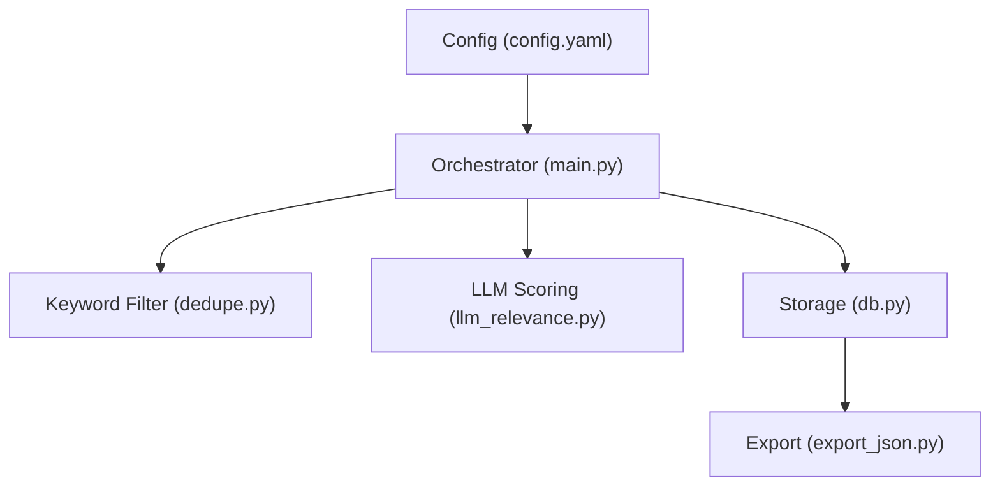
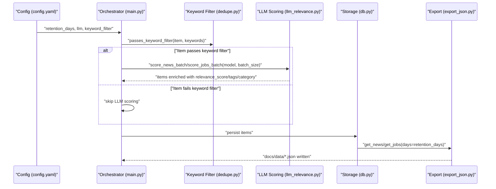
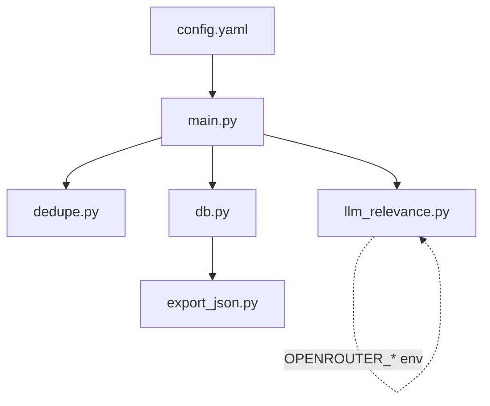

# Core Configuration Options

<cite>
**Referenced Files in This Document**
- [config.yaml](file://worker/config.yaml)
- [main.py](file://worker/main.py)
- [llm_relevance.py](file://worker/scoring/llm_relevance.py)
- [dedupe.py](file://worker/scoring/dedupe.py)
- [db.py](file://worker/storage/db.py)
- [export_json.py](file://worker/storage/export_json.py)
- [docker-compose.yml](file://docker-compose.yml)
- [worker-schedule.yml](file://.github/workflows/worker-schedule.yml)
- [test_schema.py](file://tests/test_schema.py)
</cite>

## Table of Contents
1. [Introduction](#introduction)
2. [Project Structure](#project-structure)
3. [Core Components](#core-components)
4. [Architecture Overview](#architecture-overview)
5. [Detailed Component Analysis](#detailed-component-analysis)
6. [Dependency Analysis](#dependency-analysis)
7. [Performance Considerations](#performance-considerations)
8. [Troubleshooting Guide](#troubleshooting-guide)
9. [Conclusion](#conclusion)

## Introduction
This document explains the core configuration options that govern the DevOps & AI Hub system’s data lifecycle and AI-driven content scoring. It focuses on:
- Retention_days for data lifecycle management
- LLM configuration parameters (model selection, batch_size, max_tokens, temperature)
- Keyword_filter pre-processing and its integration with LLM scoring
- Environment variable overrides (OPENROUTER_MODEL, OPENROUTER_API_KEY, OPENROUTER_BASE_URL)
- Practical examples, performance and cost impacts, and troubleshooting guidance

## Project Structure
The configuration system spans a small set of focused modules:
- Central configuration: YAML-based configuration file
- Orchestrator: loads configuration and coordinates collection, deduplication, scoring, persistence, and export
- Scoring: OpenRouter-backed LLM scoring with keyword pre-filtering
- Storage: SQLite persistence and JSON export with retention-based filtering
- Workflows: GitHub Actions and Docker Compose orchestrate environment variables and scheduling

**Diagram sources**
- [config.yaml:1-244](file://worker/config.yaml#L1-L244)
- [main.py:127-297](file://worker/main.py#L127-L297)
- [dedupe.py:79-90](file://worker/scoring/dedupe.py#L79-L90)
- [llm_relevance.py:95-178](file://worker/scoring/llm_relevance.py#L95-L178)
- [db.py:21-67](file://worker/storage/db.py#L21-L67)
- [export_json.py:32-93](file://worker/storage/export_json.py#L32-L93)

**Section sources**
- [config.yaml:1-244](file://worker/config.yaml#L1-L244)
- [main.py:127-297](file://worker/main.py#L127-L297)

## Core Components
This section documents the primary configuration options and their effects on system behavior.

- Retention_days
  - Purpose: Controls how long items remain in the database and are included in exported JSON.
  - Default: 30 days.
  - Behavior: Export filters items older than retention_days when writing docs/data/*.json.
  - Impact: Reduces storage footprint and keeps datasets current; affects downstream analytics and dashboards.

- LLM Configuration (OpenRouter)
  - model: Model identifier passed to OpenRouter. Can be overridden via environment variable OPENROUTER_MODEL.
  - base_url: OpenRouter API endpoint. Can be overridden via OPENROUTER_BASE_URL.
  - batch_size: Number of items processed per OpenRouter request.
  - max_tokens: Maximum tokens per LLM response (internal default in scoring module).
  - temperature: Sampling randomness (internal default in scoring module).
  - Notes:
    - OPENROUTER_API_KEY must be set to enable LLM scoring; otherwise scoring is skipped.
    - The orchestrator reads model and batch_size from config.yaml, while the scoring module reads model from environment variables.

- Keyword Filter (Pre-processing Gate)
  - Purpose: Reduce LLM calls by pre-filtering items that contain at least one configured keyword.
  - Configuration: keyword_filter list defines required terms.
  - Integration: Items passing keyword_filter are eligible for LLM scoring; otherwise they are skipped.

- Environment Variables
  - OPENROUTER_API_KEY: Required to enable LLM scoring.
  - OPENROUTER_MODEL: Overrides model selection in the scoring module.
  - OPENROUTER_BASE_URL: Overrides OpenRouter endpoint.
  - SMTP_* and SMTP_ENABLED: Optional SMTP digest configuration.
  - DRY_RUN: Skips publishing to Git and SMTP digest.

**Section sources**
- [config.yaml:6-76](file://worker/config.yaml#L6-L76)
- [llm_relevance.py:16-18](file://worker/scoring/llm_relevance.py#L16-L18)
- [llm_relevance.py:95-178](file://worker/scoring/llm_relevance.py#L95-L178)
- [main.py:127-190](file://worker/main.py#L127-L190)
- [dedupe.py:79-90](file://worker/scoring/dedupe.py#L79-L90)
- [export_json.py:32-93](file://worker/storage/export_json.py#L32-L93)
- [worker-schedule.yml:45-57](file://.github/workflows/worker-schedule.yml#L45-L57)
- [docker-compose.yml:22-31](file://docker-compose.yml#L22-L31)

## Architecture Overview
The configuration influences the end-to-end pipeline from collection to export:

**Diagram sources**
- [config.yaml:6-76](file://worker/config.yaml#L6-L76)
- [main.py:127-297](file://worker/main.py#L127-L297)
- [dedupe.py:79-90](file://worker/scoring/dedupe.py#L79-L90)
- [llm_relevance.py:95-178](file://worker/scoring/llm_relevance.py#L95-L178)
- [db.py:163-242](file://worker/storage/db.py#L163-L242)
- [export_json.py:32-93](file://worker/storage/export_json.py#L32-L93)

## Detailed Component Analysis

### Retention_days: Data Lifecycle Management
- Where configured: Top-level retention_days in config.yaml.
- How it is used:
  - Orchestrator passes retention_days to export_all.
  - Export filters items older than retention_days when writing docs/data/*.json.
  - Storage layer also supports retrieving items within a time window for reporting.

Practical example:
- Increase retention_days to 60 to retain items for two months in exports.
- Decrease retention_days to 7 to keep only recent items.

Impact:
- Larger retention increases disk usage and export sizes.
- Smaller retention reduces storage and improves freshness.

**Section sources**
- [config.yaml:7](file://worker/config.yaml#L7)
- [main.py:255-262](file://worker/main.py#L255-L262)
- [export_json.py:32-93](file://worker/storage/export_json.py#L32-L93)
- [db.py:163-173](file://worker/storage/db.py#L163-L173)

### LLM Configuration Parameters
- Model selection
  - Config: llm.model in config.yaml.
  - Override: OPENROUTER_MODEL environment variable.
  - Behavior: Orchestrator passes model to scoring functions; scoring module uses OPENROUTER_MODEL if not provided.
- Batch size
  - Config: llm.batch_size in config.yaml.
  - Behavior: Controls how many items are sent per OpenRouter request.
- Max tokens and temperature
  - Config: llm.max_tokens and llm.temperature in config.yaml.
  - Internal defaults: The scoring module sets its own defaults for max_tokens and temperature when not provided by the orchestrator.

Environment variable overrides:
- OPENROUTER_API_KEY: Enables LLM scoring; required.
- OPENROUTER_BASE_URL: Overrides OpenRouter endpoint.
- OPENROUTER_MODEL: Overrides model selection.

Practical example:
- Switch model to a cheaper or faster model by setting OPENROUTER_MODEL.
- Increase batch_size to reduce API calls and improve throughput.
- Lower temperature for more deterministic outputs.

Impact:
- Model choice affects cost and quality.
- Batch size affects latency and cost.
- Temperature affects determinism and creativity.

**Section sources**
- [config.yaml:10-18](file://worker/config.yaml#L10-L18)
- [llm_relevance.py:16-18](file://worker/scoring/llm_relevance.py#L16-L18)
- [llm_relevance.py:95-178](file://worker/scoring/llm_relevance.py#L95-L178)
- [main.py:184-189](file://worker/main.py#L184-L189)
- [main.py:240-245](file://worker/main.py#L240-L245)

### Keyword Filter: Pre-processing Content Gate
- Where configured: keyword_filter list in config.yaml.
- How it works:
  - passes_keyword_filter checks if item.title, item.summary, or item.company contains any configured keyword (case-insensitive).
  - Items that fail the filter are excluded from LLM scoring.
- Integration:
  - Orchestrator applies passes_keyword_filter during deduplication for news.
  - Jobs are deduplicated without keyword filtering in the orchestrator; LLM scoring still respects the keyword filter internally.

Practical example:
- Add “kubernetes” and “helm” to keyword_filter to focus on Kubernetes-related content.
- Clear keyword_filter to process all items (increases LLM usage).

Impact:
- Reduces LLM calls and costs when tuned appropriately.
- Improves signal-to-noise by focusing on relevant topics.

**Section sources**
- [config.yaml:20-76](file://worker/config.yaml#L20-L76)
- [dedupe.py:79-90](file://worker/scoring/dedupe.py#L79-L90)
- [main.py:174-181](file://worker/main.py#L174-L181)

### Environment Variable Overrides and Scheduling
- GitHub Actions workflow:
  - Sets OPENROUTER_API_KEY, OPENROUTER_MODEL, SMTP_* variables.
  - Runs the worker on a schedule and validates JSON output.
- Docker Compose:
  - Loads .env via env_file and mounts docs/data for persistent JSON output.
  - Exposes LOG_LEVEL override.

Practical example:
- Set OPENROUTER_MODEL to a lower-cost model for cost control.
- Enable SMTP_ENABLED to receive digest emails.

**Section sources**
- [worker-schedule.yml:45-57](file://.github/workflows/worker-schedule.yml#L45-L57)
- [docker-compose.yml:22-31](file://docker-compose.yml#L22-L31)

## Dependency Analysis
The configuration options influence several subsystems:

**Diagram sources**
- [config.yaml:6-76](file://worker/config.yaml#L6-L76)
- [main.py:127-297](file://worker/main.py#L127-L297)
- [dedupe.py:79-90](file://worker/scoring/dedupe.py#L79-L90)
- [llm_relevance.py:16-18](file://worker/scoring/llm_relevance.py#L16-L18)
- [db.py:21-67](file://worker/storage/db.py#L21-L67)
- [export_json.py:32-93](file://worker/storage/export_json.py#L32-L93)

**Section sources**
- [config.yaml:6-76](file://worker/config.yaml#L6-L76)
- [main.py:127-297](file://worker/main.py#L127-L297)
- [llm_relevance.py:16-18](file://worker/scoring/llm_relevance.py#L16-L18)
- [export_json.py:32-93](file://worker/storage/export_json.py#L32-L93)

## Performance Considerations
- Retention_days
  - Larger values increase export size and processing time.
  - Smaller values reduce storage and improve freshness.
- LLM batch_size
  - Larger batches reduce API call overhead but increase memory and processing time.
  - Smaller batches reduce memory footprint and latency.
- Model selection
  - Cheaper or smaller models reduce cost but may affect quality.
  - Deterministic models (lower temperature) improve consistency.
- Keyword filter tuning
  - Tight filters reduce LLM usage and cost.
  - Loose filters increase coverage but raise cost.

[No sources needed since this section provides general guidance]

## Troubleshooting Guide
Common configuration issues and validations:

- LLM scoring disabled
  - Symptom: Items lack relevance_score/tags/category.
  - Cause: OPENROUTER_API_KEY not set.
  - Fix: Provide OPENROUTER_API_KEY via environment or secrets.
  - Validation: Run export and confirm items contain relevance_score and tags.

- Unexpectedly low LLM usage
  - Symptom: Few items scored.
  - Cause: Keyword filter too restrictive.
  - Fix: Adjust keyword_filter or clear it temporarily to validate scoring.

- Incorrect model selected
  - Symptom: Wrong model used.
  - Cause: OPENROUTER_MODEL not set or misconfigured.
  - Fix: Set OPENROUTER_MODEL to desired model.

- Export does not reflect recent items
  - Symptom: Old items missing from docs/data/*.json.
  - Cause: retention_days too small.
  - Fix: Increase retention_days.

- Duplicate IDs in exported JSON
  - Symptom: Validation fails due to duplicates.
  - Cause: Data integrity issue.
  - Fix: Investigate upstream collection and deduplication.

Validation techniques:
- Run the JSON schema tests to ensure docs/data/*.json conforms to expected structure and constraints.
- Verify that relevance_score is a float in [0,1] for both news and jobs.

**Section sources**
- [llm_relevance.py:105-107](file://worker/scoring/llm_relevance.py#L105-L107)
- [test_schema.py:82-91](file://tests/test_schema.py#L82-L91)
- [test_schema.py:121-130](file://tests/test_schema.py#L121-L130)

## Conclusion
The DevOps & AI Hub system’s core configuration centers on retention_days, LLM parameters, and keyword filtering. By tuning these options—combined with environment variable overrides—you can balance cost, performance, and relevance. Use the provided validation techniques to ensure configuration changes produce expected outcomes.