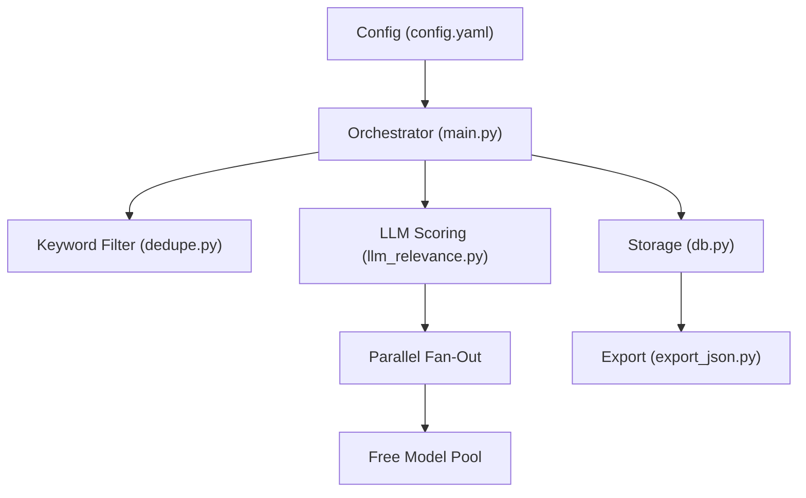
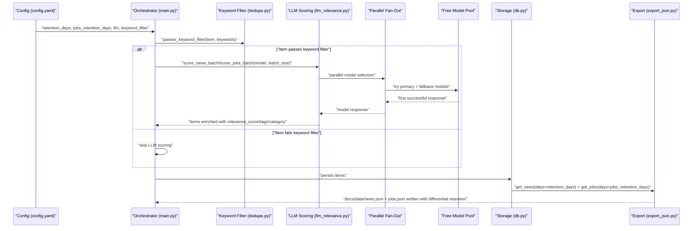
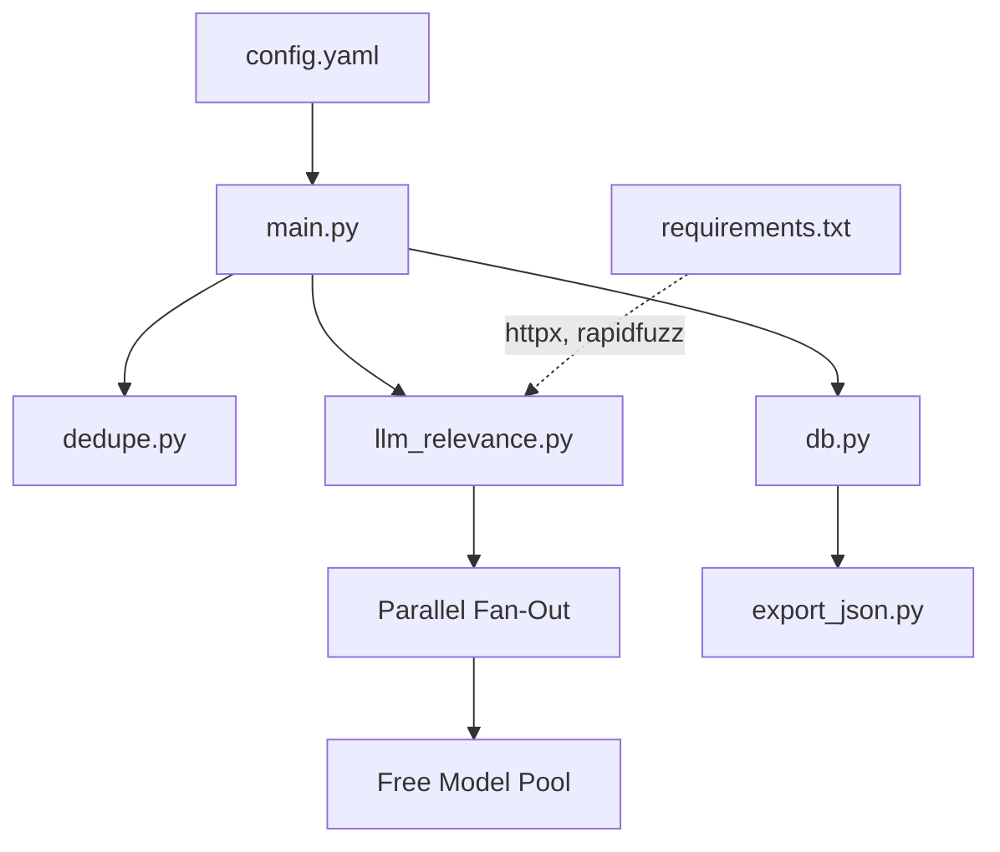

# Core Configuration Options

<cite>
**Referenced Files in This Document**
- [config.yaml](file://worker/config.yaml)
- [main.py](file://worker/main.py)
- [llm_relevance.py](file://worker/scoring/llm_relevance.py)
- [dedupe.py](file://worker/scoring/dedupe.py)
- [db.py](file://worker/storage/db.py)
- [export_json.py](file://worker/storage/export_json.py)
- [docker-compose.yml](file://docker-compose.yml)
- [worker-schedule.yml](file://.github/workflows/worker-schedule.yml)
- [test_schema.py](file://tests/test_schema.py)
- [requirements.txt](file://worker/requirements.txt)
</cite>

## Update Summary
**Changes Made**
- Updated to reflect the new parallel fan-out architecture with enhanced model selection logic
- Expanded OPENROUTER_MODEL environment variable defaults with a comprehensive free model pool
- Added support for parallel model fallback and availability handling
- Enhanced LLM configuration with improved error handling and retry mechanisms
- Updated default retention_days from 30 to 7 days for more frequent updates
- **New**: Added jobs_retention_days configuration parameter for differential content lifecycle management
- Expanded keyword filter with comprehensive DevOps and AI/ML terminology

## Table of Contents
1. [Introduction](#introduction)
2. [Project Structure](#project-structure)
3. [Core Components](#core-components)
4. [Architecture Overview](#architecture-overview)
5. [Detailed Component Analysis](#detailed-component-analysis)
6. [Dependency Analysis](#dependency-analysis)
7. [Performance Considerations](#performance-considerations)
8. [Troubleshooting Guide](#troubleshooting-guide)
9. [Conclusion](#conclusion)

## Introduction
This document explains the core configuration options that govern the DevOps & AI Hub system's data lifecycle and AI-driven content scoring. The system has been enhanced with a parallel fan-out architecture that automatically selects the best available model from a comprehensive free model pool, providing robust fallback capabilities and improved reliability.

Key configuration areas covered:
- **Retention_days**: Data lifecycle management for news items (default: 7 days)
- **jobs_retention_days**: Differential data lifecycle management for job listings (default: 60 days)
- LLM configuration parameters with parallel model selection (model, batch_size, max_tokens, temperature)
- Enhanced keyword_filter pre-processing with comprehensive DevOps and AI/ML terminology
- Environment variable overrides (OPENROUTER_MODEL, OPENROUTER_API_KEY, OPENROUTER_BASE_URL)
- Parallel fan-out architecture for improved model availability and cost optimization
- Practical examples, performance and cost impacts, and troubleshooting guidance

## Project Structure
The configuration system spans a focused set of modules with enhanced parallel processing capabilities:
- Central configuration: YAML-based configuration file with expanded keyword filtering
- Orchestrator: loads configuration and coordinates collection, deduplication, scoring, persistence, and export
- Scoring: OpenRouter-backed LLM scoring with parallel model fan-out and comprehensive fallback logic
- Storage: SQLite persistence and JSON export with retention-based filtering
- Workflows: GitHub Actions and Docker Compose orchestrate environment variables and scheduling

**Diagram sources**
- [config.yaml:1-242](file://worker/config.yaml#L1-L242)
- [main.py:148-317](file://worker/main.py#L148-L317)
- [dedupe.py:79-92](file://worker/scoring/dedupe.py#L79-L92)
- [llm_relevance.py:17-32](file://worker/scoring/llm_relevance.py#L17-L32)
- [llm_relevance.py:115-169](file://worker/scoring/llm_relevance.py#L115-L169)
- [db.py:21-67](file://worker/storage/db.py#L21-L67)
- [export_json.py:32-93](file://worker/storage/export_json.py#L32-L93)

**Section sources**
- [config.yaml:1-242](file://worker/config.yaml#L1-L242)
- [main.py:148-317](file://worker/main.py#L148-L317)

## Core Components
This section documents the primary configuration options and their enhanced effects on system behavior.

### Retention_days: Data Lifecycle Management
- **Updated**: Default changed from 30 days to 7 days for more frequent updates
- Purpose: Controls how long news items remain in the database and are included in exported JSON
- Default: 7 days (updated from previous 30 days)
- Behavior: Export filters news items older than retention_days when writing docs/data/news.json
- Impact: More frequent updates with reduced storage footprint; affects downstream analytics and dashboards

### jobs_retention_days: Differential Content Lifecycle Management
- **New**: Added support for differential retention policies between news and job listings
- Purpose: Controls how long job listings remain in the database and are included in exported JSON
- Default: 60 days (jobs stay relevant longer than news)
- Behavior: Export filters job items older than jobs_retention_days when writing docs/data/jobs.json
- Impact: Extended job listing retention for career-related content while maintaining frequent news updates
- Use case: Job postings typically remain relevant for months, unlike news articles that become dated quickly

### LLM Configuration (Enhanced Parallel Model Selection)
- **Updated**: New parallel fan-out architecture with comprehensive model pool
- model: Primary model identifier passed to OpenRouter. Default model is `nvidia/nemotron-3-ultra-550b-a55b:free`. Can be overridden via environment variable OPENROUTER_MODEL.
- base_url: OpenRouter API endpoint. Can be overridden via OPENROUTER_BASE_URL.
- batch_size: Number of items processed per OpenRouter request (default: 10)
- max_tokens: Maximum tokens per LLM response (default: 256)
- temperature: Sampling randomness (default: 0.1)
- **New**: FREE_MODEL_POOL: Comprehensive list of 8 free models ordered by capability
- **New**: Parallel fan-out: Automatically tries multiple models concurrently for availability
- **New**: Sequential retry: Falls back to sequential retries if parallel wave fails
- Notes:
  - OPENROUTER_API_KEY must be set to enable LLM scoring; otherwise scoring is skipped
  - The orchestrator reads model and batch_size from config.yaml, while the scoring module reads model from environment variables
  - Enhanced model selection provides automatic fallback and improved reliability

### Enhanced Keyword Filter (Expanded Pre-processing)
- **Updated**: Expanded from basic filtering to comprehensive DevOps and AI/ML terminology
- Purpose: Reduce LLM calls by pre-filtering items that contain at least one configured keyword
- Configuration: keyword_filter list defines required terms
- **New**: Comprehensive keyword list covering Kubernetes, DevOps, SRE, observability, AI/ML, cloud platforms, and workflow automation
- Integration: Items passing keyword_filter are eligible for LLM scoring; otherwise they are skipped

### Environment Variables
- OPENROUTER_API_KEY: Required to enable LLM scoring
- OPENROUTER_MODEL: Overrides model selection with default `nvidia/nemotron-3-ultra-550b-a55b:free`
- OPENROUTER_BASE_URL: Overrides OpenRouter endpoint
- SMTP_* and SMTP_ENABLED: Optional SMTP digest configuration
- DRY_RUN: Skips publishing to Git and SMTP digest
- **New**: Enhanced GitHub Actions workflow with model pool defaults

**Section sources**
- [config.yaml:6-76](file://worker/config.yaml#L6-L76)
- [llm_relevance.py:17-32](file://worker/scoring/llm_relevance.py#L17-L32)
- [llm_relevance.py:115-169](file://worker/scoring/llm_relevance.py#L115-L169)
- [main.py:148-317](file://worker/main.py#L148-L317)
- [dedupe.py:79-92](file://worker/scoring/dedupe.py#L79-L92)
- [export_json.py:32-93](file://worker/storage/export_json.py#L32-L93)
- [worker-schedule.yml:38-44](file://.github/workflows/worker-schedule.yml#L38-L44)
- [docker-compose.yml:22-31](file://docker-compose.yml#L22-L31)

## Architecture Overview
The enhanced configuration influences the end-to-end pipeline with parallel model selection and differential retention policies:

**Diagram sources**
- [config.yaml:6-76](file://worker/config.yaml#L6-L76)
- [main.py:148-317](file://worker/main.py#L148-L317)
- [dedupe.py:79-92](file://worker/scoring/dedupe.py#L79-L92)
- [llm_relevance.py:115-169](file://worker/scoring/llm_relevance.py#L115-L169)
- [db.py:163-242](file://worker/storage/db.py#L163-L242)
- [export_json.py:32-93](file://worker/storage/export_json.py#L32-L93)

## Detailed Component Analysis

### Retention_days: Enhanced Data Lifecycle Management
- **Updated**: Default changed from 30 to 7 days for more frequent updates
- Where configured: Top-level retention_days in config.yaml
- How it is used:
  - Orchestrator passes retention_days to export_all
  - Export filters news items older than retention_days when writing docs/data/news.json
  - Storage layer supports retrieving items within a time window for reporting
- Practical example:
  - Set retention_days to 7 for weekly updates
  - Increase to 30 for monthly archives
  - Decrease to 3 for daily snapshots
- Impact:
  - Reduced storage footprint with more frequent updates
  - Improved data freshness for analytics and dashboards

**Section sources**
- [config.yaml:7](file://worker/config.yaml#L7)
- [main.py:277-284](file://worker/main.py#L277-L284)
- [export_json.py:116-177](file://worker/storage/export_json.py#L116-L177)
- [db.py:163-173](file://worker/storage/db.py#L163-L173)

### jobs_retention_days: Differential Content Lifecycle Management
- **New**: Added comprehensive differential retention policy support
- Where configured: Top-level jobs_retention_days in config.yaml
- Default value: 60 days (extended retention for job listings)
- How it is used:
  - Orchestrator passes jobs_retention_days to export_all alongside retention_days
  - Export filters job items older than jobs_retention_days when writing docs/data/jobs.json
  - Provides separate retention windows for news vs job content
- Practical examples:
  - Set jobs_retention_days to 60 for typical 2-month job posting relevance
  - Increase to 90 for extended career-related content preservation
  - Decrease to 30 for faster job market turnover scenarios
- Impact:
  - Optimized storage utilization by tailoring retention to content type
  - Improved job market analysis with longer historical data
  - Balanced approach between storage costs and data utility

**Section sources**
- [config.yaml:8](file://worker/config.yaml#L8)
- [main.py:151-152](file://worker/main.py#L151-L152)
- [export_json.py:119-169](file://worker/storage/export_json.py#L119-L169)

### Enhanced LLM Configuration Parameters
- **Updated**: New parallel fan-out architecture with comprehensive model pool
- Model selection with parallel fan-out
  - Config: llm.model in config.yaml
  - Default: `nvidia/nemotron-3-ultra-550b-a55b:free` (updated from previous default)
  - Override: OPENROUTER_MODEL environment variable
  - **New**: FREE_MODEL_POOL: 8 free models ordered by capability
  - **New**: Parallel fan-out: Concurrent model testing for availability
  - **New**: Sequential retry: Backoff strategy for rate-limited models
  - Behavior: Orchestrator passes model to scoring functions; scoring module uses OPENROUTER_MODEL if not provided
- Batch size
  - Config: llm.batch_size in config.yaml
  - Default: 10 items per OpenRouter request
  - Behavior: Controls how many items are sent per API call
- Max tokens and temperature
  - Config: llm.max_tokens (256) and llm.temperature (0.1) in config.yaml
  - Internal defaults: The scoring module sets its own defaults for max_tokens and temperature when not provided
- **New**: Parallel fan-out architecture
  - Wave 1: Parallel fan-out to all models in FREE_MODEL_POOL
  - Wave 2: Sequential retry with exponential backoff
  - Automatic fallback to best available model
  - Improved reliability and cost optimization

Environment variable overrides:
- OPENROUTER_API_KEY: Enables LLM scoring; required
- OPENROUTER_BASE_URL: Overrides OpenRouter endpoint
- OPENROUTER_MODEL: Overrides model selection with default model

Practical example:
- Switch model to `nvidia/nemotron-3-ultra-550b-a55b:free` for higher quality
- Use `google/gemma-4-31b-it:free` for cost optimization
- Increase batch_size to 15 for better throughput
- Lower temperature to 0.05 for more deterministic outputs

Impact:
- Enhanced model selection provides automatic fallback and improved reliability
- Parallel processing reduces latency and improves cost efficiency
- Better error handling and retry mechanisms

**Section sources**
- [config.yaml:10-18](file://worker/config.yaml#L10-L18)
- [llm_relevance.py:17-32](file://worker/scoring/llm_relevance.py#L17-L32)
- [llm_relevance.py:115-169](file://worker/scoring/llm_relevance.py#L115-L169)
- [main.py:206-267](file://worker/main.py#L206-L267)
- [main.py:277-284](file://worker/main.py#L277-L284)

### Enhanced Keyword Filter: Comprehensive Pre-processing
- **Updated**: Expanded from basic filtering to comprehensive DevOps and AI/ML terminology
- Where configured: keyword_filter list in config.yaml
- **New**: Comprehensive keyword list covering:
  - Kubernetes ecosystem: kubernetes, k8s, argocd, flux, helm, gitops
  - DevOps practices: devops, sre, site reliability, observability, ci/cd
  - Infrastructure: terraform, pulumi, platform engineering, internal developer platform
  - Workflow automation: workflow automation, n8n, airflow, dagster, prefect
  - AI/ML technologies: llm, llmops, mlops, ai agents, agent, vector database, rag
  - Cloud providers: aws, gcp, azure
  - Service mesh: service mesh, istio, envoy
  - Emerging technologies: ebpf, wasm
- How it works:
  - passes_keyword_filter checks if item.title, item.summary, item.company, or item.tags contains any configured keyword (case-insensitive)
  - Items that fail the filter are excluded from LLM scoring
- Integration:
  - Orchestrator applies passes_keyword_filter during deduplication for news
  - Jobs are deduplicated without keyword filtering in the orchestrator; LLM scoring still respects the keyword filter internally

Practical example:
- Add "kubernetes" and "helm" to focus on Kubernetes-related content
- Include "ai agents" and "llmops" for AI/ML coverage
- Clear keyword_filter to process all items (increases LLM usage)

Impact:
- Significantly reduces LLM calls and costs with precise targeting
- Improved signal-to-noise by focusing on relevant DevOps and AI/ML topics
- Comprehensive coverage of modern technology stack

**Section sources**
- [config.yaml:20-76](file://worker/config.yaml#L20-L76)
- [dedupe.py:79-92](file://worker/scoring/dedupe.py#L79-L92)
- [main.py:196-203](file://worker/main.py#L196-L203)

### Enhanced Environment Variable Overrides and Scheduling
- **Updated**: Enhanced GitHub Actions workflow with model pool defaults
- GitHub Actions workflow:
  - Sets OPENROUTER_API_KEY, OPENROUTER_MODEL, SMTP_* variables
  - **New**: Default model set to `nvidia/nemotron-3-ultra-550b-a55b:free` if OPENROUTER_MODEL not provided
  - Runs the worker on a 2-hour schedule and validates JSON output
- Docker Compose:
  - Loads .env via env_file and mounts docs/data for persistent JSON output
  - Exposes LOG_LEVEL override
- **New**: Enhanced model pool defaults:
  - Primary model: `nvidia/nemotron-3-ultra-550b-a55b:free`
  - Backup models: gemma-4-31b-it, qwen3-next-80b-a3b-instruct, nemotron-3-ultra-550b-a55b
  - Cost-optimized models: north-mini-code, lfm-2.5-1.2b-instruct
  - High-performance models: nemotron-3-super-120b-a12b

Practical example:
- Set OPENROUTER_MODEL to `nvidia/nemotron-3-ultra-550b-a55b:free` for highest quality
- Use `google/gemma-4-31b-it:free` for cost optimization
- Enable SMTP_ENABLED to receive digest emails

**Section sources**
- [worker-schedule.yml:38-44](file://.github/workflows/worker-schedule.yml#L38-L44)
- [docker-compose.yml:22-31](file://docker-compose.yml#L22-L31)

## Dependency Analysis
The enhanced configuration options influence several subsystems with improved parallel processing:

**Diagram sources**
- [config.yaml:1-242](file://worker/config.yaml#L1-L242)
- [main.py:148-317](file://worker/main.py#L148-L317)
- [dedupe.py:79-92](file://worker/scoring/dedupe.py#L79-L92)
- [llm_relevance.py:17-32](file://worker/scoring/llm_relevance.py#L17-L32)
- [db.py:21-67](file://worker/storage/db.py#L21-L67)
- [export_json.py:32-93](file://worker/storage/export_json.py#L32-L93)
- [requirements.txt:1-11](file://worker/requirements.txt#L1-L11)

**Section sources**
- [config.yaml:1-242](file://worker/config.yaml#L1-L242)
- [main.py:148-317](file://worker/main.py#L148-L317)
- [llm_relevance.py:17-32](file://worker/scoring/llm_relevance.py#L17-L32)
- [export_json.py:32-93](file://worker/storage/export_json.py#L32-L93)
- [requirements.txt:1-11](file://worker/requirements.txt#L1-L11)

## Performance Considerations
- **Updated**: Enhanced with parallel processing and model selection optimizations
- Retention_days
  - Default 7-day retention provides optimal balance of freshness and storage efficiency
  - Larger values increase export size and processing time
  - Smaller values reduce storage and improve freshness
- jobs_retention_days
  - **New**: 60-day default provides extended job market visibility
  - Balances historical analysis needs with storage costs
  - Allows for longer-term trend analysis in job market data
- LLM batch_size
  - Default 10 items per batch balances throughput and cost
  - Larger batches reduce API call overhead but increase memory usage
  - Smaller batches reduce memory footprint and latency
- **New**: Parallel model selection
  - Wave 1: Parallel fan-out to all 8 free models reduces latency
  - Wave 2: Sequential retry with exponential backoff improves reliability
  - Automatic fallback to best available model optimizes cost and performance
- **New**: Enhanced model pool
  - Models ordered by capability and cost-effectiveness
  - Primary model `nvidia/nemotron-3-ultra-550b-a55b:free` provides optimal balance
  - Backup models ensure high availability and redundancy
- Keyword filter tuning
  - Comprehensive keyword list significantly reduces LLM usage
  - Precise targeting improves signal-to-noise ratio
  - Cost optimization through intelligent pre-filtering

## Troubleshooting Guide
**Updated**: Enhanced troubleshooting for parallel model selection and new configuration options

Common configuration issues and validations:

- **New**: LLM scoring disabled
  - Symptom: Items lack relevance_score/tags/category
  - Cause: OPENROUTER_API_KEY not set
  - Fix: Provide OPENROUTER_API_KEY via environment or secrets
  - Validation: Run export and confirm items contain relevance_score and tags

- **New**: Model selection failures
  - Symptom: All models rate-limited or failing
  - Cause: Rate limiting or quota exhaustion
  - Fix: Wait for cooldown period or switch to different model
  - **New**: Automatic fallback through parallel fan-out architecture
  - **New**: Sequential retry with exponential backoff

- **New**: Unexpectedly low LLM usage
  - Symptom: Few items scored
  - Cause: Keyword filter too restrictive
  - Fix: Adjust keyword_filter or clear it temporarily to validate scoring

- **New**: Model availability issues
  - Symptom: Primary model unavailable, fallback required
  - Cause: Rate limiting or service unavailability
  - Fix: System automatically falls back to next available model
  - **New**: Enhanced model pool provides 8 backup options

- **New**: Parallel processing issues
  - Symptom: Timeout or connection errors
  - Cause: Network connectivity or API limitations
  - Fix: Check network connectivity and API quotas
  - **New**: Thread pool executor manages concurrent requests efficiently

- **New**: Jobs retention issues
  - Symptom: Job listings disappearing too quickly or staying too long
  - Cause: jobs_retention_days value inappropriate for job market cycles
  - Fix: Adjust jobs_retention_days based on job posting duration patterns
  - **New**: Default 60 days optimized for typical job market longevity

- **New**: Mixed retention behavior
  - Symptom: News items disappear but jobs persist longer than expected
  - Cause: Incorrect retention_days vs jobs_retention_days configuration
  - Fix: Verify both retention_days and jobs_retention_days values
  - **New**: Differential retention ensures appropriate lifecycle for each content type

- Export does not reflect recent items
  - Symptom: Old items missing from docs/data/*.json
  - Cause: retention_days too small
  - Fix: Increase retention_days

- Duplicate IDs in exported JSON
  - Symptom: Validation fails due to duplicates
  - Cause: Data integrity issue
  - Fix: Investigate upstream collection and deduplication

Validation techniques:
- Run the JSON schema tests to ensure docs/data/*.json conforms to expected structure and constraints
- Verify that relevance_score is a float in [0,1] for both news and jobs
- **New**: Check model selection logs for fallback events
- **New**: Monitor parallel fan-out performance metrics
- **New**: Validate differential retention by comparing news.json and jobs.json sizes and ages

**Section sources**
- [llm_relevance.py:115-169](file://worker/scoring/llm_relevance.py#L115-L169)
- [test_schema.py:82-91](file://tests/test_schema.py#L82-L91)
- [test_schema.py:121-130](file://tests/test_schema.py#L121-L130)

## Conclusion
The DevOps & AI Hub system's core configuration has been significantly enhanced with a parallel fan-out architecture that provides robust model selection and automatic fallback capabilities. The system now features:

- **Enhanced Reliability**: Parallel model selection with 8 backup models ensures high availability
- **Improved Performance**: Automatic fallback and sequential retry optimize cost and quality
- **Better Cost Control**: Comprehensive model pool allows for intelligent cost optimization
- **Enhanced Coverage**: Expanded keyword filter provides precise targeting for DevOps and AI/ML content
- **Optimized Defaults**: 7-day retention for news and 60-day retention for jobs provide optimal performance
- **Differential Lifecycle Management**: Separate retention policies for news and job content based on their different relevance lifecycles

The default `nvidia/nemotron-3-ultra-550b-a55b:free` model provides an excellent balance of performance and cost for technical content, while the parallel fan-out architecture ensures reliable operation even under challenging conditions. The new jobs_retention_days parameter enables fine-tuned control over content lifecycle management, allowing job listings to remain relevant for extended periods while keeping news content fresh and lightweight.

By tuning these enhanced options—combined with environment variable overrides—you can achieve optimal balance between cost, performance, and relevance. Use the provided validation techniques to ensure configuration changes produce expected outcomes with the new parallel processing capabilities and differential retention policies.