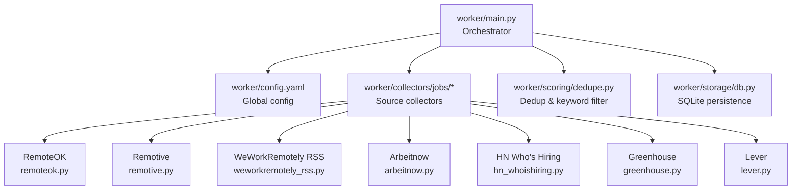
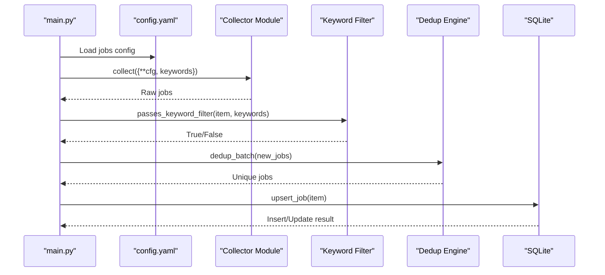
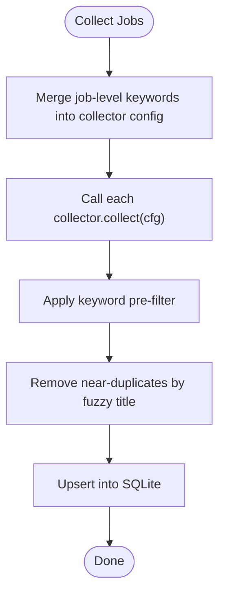
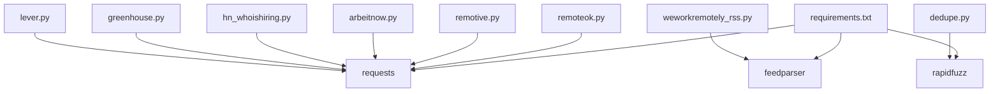

# Job Source Configuration

<cite>
**Referenced Files in This Document**
- [config.yaml](file://worker/config.yaml)
- [main.py](file://worker/main.py)
- [remoteok.py](file://worker/collectors/jobs/remoteok.py)
- [remotive.py](file://worker/collectors/jobs/remotive.py)
- [weworkremotely_rss.py](file://worker/collectors/jobs/weworkremotely_rss.py)
- [arbeitnow.py](file://worker/collectors/jobs/arbeitnow.py)
- [hn_whoishiring.py](file://worker/collectors/jobs/hn_whoishiring.py)
- [greenhouse.py](file://worker/collectors/jobs/greenhouse.py)
- [lever.py](file://worker/collectors/jobs/lever.py)
- [dedupe.py](file://worker/scoring/dedupe.py)
- [db.py](file://worker/storage/db.py)
- [requirements.txt](file://worker/requirements.txt)
- [docker-compose.yml](file://docker-compose.yml)
- [Dockerfile](file://worker/Dockerfile)
</cite>

## Update Summary
**Changes Made**
- Updated job keyword filtering section to reflect expanded FinOps and Kafka-related terms
- Added documentation for new engineering role titles including automation engineer, release engineer, production engineer, systems engineer, and reliability engineer
- Enhanced keyword filtering system documentation with comprehensive coverage of all new terms
- Updated configuration examples to show the expanded keyword list

## Table of Contents
1. [Introduction](#introduction)
2. [Project Structure](#project-structure)
3. [Core Components](#core-components)
4. [Architecture Overview](#architecture-overview)
5. [Detailed Component Analysis](#detailed-component-analysis)
6. [Dependency Analysis](#dependency-analysis)
7. [Performance Considerations](#performance-considerations)
8. [Troubleshooting Guide](#troubleshooting-guide)
9. [Conclusion](#conclusion)
10. [Appendices](#appendices)

## Introduction
This document explains how to configure and operate job sources in the DevOps & AI Hub system. It focuses on job-specific keyword filtering, configuring each job source (RemoteOK, Remotive, WeWorkRemotely RSS, Arbeitnow, HN Who's Hiring, Greenhouse, Lever), adding new job boards, optimizing job posting detection, and customizing filtering criteria. The system is designed to be configurable without code changes—most adjustments are made in a central YAML configuration file.

**Updated** Enhanced with expanded keyword filtering system covering FinOps, Kafka, and specialized engineering roles including automation engineers, release engineers, production engineers, systems engineers, and reliability engineers.

## Project Structure
The job collection pipeline is orchestrated from a single entry point and driven by a configuration file. Each job source is implemented as a small collector module that adheres to a consistent interface and data model.

**Diagram sources**
- [main.py:127-292](file://worker/main.py#L127-L292)
- [config.yaml:170-244](file://worker/config.yaml#L170-L244)

**Section sources**
- [main.py:49-57](file://worker/main.py#L49-L57)
- [config.yaml:170-244](file://worker/config.yaml#L170-L244)

## Core Components
- Central configuration: The jobs section defines global keyword filters and per-source parameters such as tags, categories, feed URLs, and company board slugs.
- Collector modules: Each job source implements a collect(cfg) function that reads its configuration and returns normalized job records.
- Keyword filtering: A pre-filter checks whether job titles/companies/tags match configured keywords before further processing.
- Deduplication: Stable IDs are generated and stored to avoid duplicate job entries across runs.
- Persistence: Collected jobs are inserted or updated in SQLite with timestamps and metadata.

Key configuration locations:
- Global job keyword filter and per-source settings: [config.yaml:170-244](file://worker/config.yaml#L170-L244)
- Keyword pre-filter logic: [dedupe.py:80-89](file://worker/scoring/dedupe.py#L80-L89)
- Job ID generation: [dedupe.py:26-29](file://worker/scoring/dedupe.py#L26-L29)
- Job schema and upsert: [db.py:39-52](file://worker/storage/db.py#L39-L52), [db.py:183-230](file://worker/storage/db.py#L183-L230)

**Section sources**
- [config.yaml:170-244](file://worker/config.yaml#L170-L244)
- [dedupe.py:26-29](file://worker/scoring/dedupe.py#L26-L29)
- [dedupe.py:80-89](file://worker/scoring/dedupe.py#L80-L89)
- [db.py:39-52](file://worker/storage/db.py#L39-L52)
- [db.py:183-230](file://worker/storage/db.py#L183-L230)

## Architecture Overview
The pipeline collects jobs from enabled sources, applies keyword filtering, deduplicates, scores, persists, exports JSON, and optionally publishes updates.

**Diagram sources**
- [main.py:202-227](file://worker/main.py#L202-L227)
- [main.py:231-237](file://worker/main.py#L231-L237)
- [dedupe.py:48-76](file://worker/scoring/dedupe.py#L48-L76)
- [db.py:183-230](file://worker/storage/db.py#L183-L230)

## Detailed Component Analysis

### RemoteOK
- Purpose: Fetches remote jobs from RemoteOK's public API.
- Configuration:
  - jobs.remoteok.enabled: toggle
  - jobs.remoteok.tags: list of tag filters applied to job tags and title/company
- Filtering behavior:
  - Uses the job-level keywords list to gate items before ingestion.
- Data normalization:
  - Builds a stable job ID combining source, company, title, and URL.
  - Converts timestamps safely to UTC ISO format.

Implementation highlights:
- API endpoint and headers: [remoteok.py:18-20](file://worker/collectors/jobs/remoteok.py#L18-L20)
- Keyword gate: [remoteok.py:55-58](file://worker/collectors/jobs/remoteok.py#L55-L58)
- ID generation: [remoteok.py:60](file://worker/collectors/jobs/remoteok.py#L60)
- Timestamp conversion: [remoteok.py:23-29](file://worker/collectors/jobs/remoteok.py#L23-L29)

**Section sources**
- [config.yaml:204-210](file://worker/config.yaml#L204-L210)
- [remoteok.py:32-82](file://worker/collectors/jobs/remoteok.py#L32-L82)

### Remotive
- Purpose: Pulls remote jobs from Remotive's public API by category.
- Configuration:
  - jobs.remotive.enabled: toggle
  - jobs.remotive.categories: list of category slugs
- Filtering behavior:
  - Applies job-level keywords against title and company.
- Deduplication:
  - Skips duplicate IDs within the same batch.

Implementation highlights:
- API endpoint and pagination: [remotive.py:17-36](file://worker/collectors/jobs/remotive.py#L17-L36)
- Keyword gate: [remotive.py:45-48](file://worker/collectors/jobs/remotive.py#L45-L48)
- Batch dedup: [remotive.py:49-53](file://worker/collectors/jobs/remotive.py#L49-L53)

**Section sources**
- [config.yaml:212-217](file://worker/config.yaml#L212-L217)
- [remotive.py:21-73](file://worker/collectors/jobs/remotive.py#L21-L73)

### WeWorkRemotely RSS
- Purpose: Parses the DevOps/Sysadmin RSS feed for remote jobs.
- Configuration:
  - jobs.weworkremotely.enabled: toggle
  - jobs.weworkremotely.feed_url: RSS URL (defaults to DevOps category)
- Filtering behavior:
  - Extracts company from title and checks against job-level keywords.
- Data normalization:
  - Parses publication dates from RSS fields.
  - Sets location to Remote by default.

Implementation highlights:
- Feed parsing: [weworkremotely_rss.py:32-35](file://worker/collectors/jobs/weworkremotely_rss.py#L32-L35)
- Title parsing and keyword gate: [weworkremotely_rss.py:43-52](file://worker/collectors/jobs/weworkremotely_rss.py#L43-L52)
- Date parsing: [weworkremotely_rss.py:54-64](file://worker/collectors/jobs/weworkremotely_rss.py#L54-L64)

**Section sources**
- [config.yaml:218-221](file://worker/config.yaml#L218-L221)
- [weworkremotely_rss.py:22-84](file://worker/collectors/jobs/weworkremotely_rss.py#L22-L84)

### Arbeitnow
- Purpose: Fetches jobs from Arbeitnow's public API.
- Configuration:
  - jobs.arbeitnow.enabled: toggle
  - jobs.arbeitnow.tags: list of tag filters
- Filtering behavior:
  - Uses job-level keywords combined with title, company, and tags.

Implementation highlights:
- API endpoint and payload: [arbeitnow.py:17-32](file://worker/collectors/jobs/arbeitnow.py#L17-L32)
- Keyword gate: [arbeitnow.py:41-43](file://worker/collectors/jobs/arbeitnow.py#L41-L43)
- Remote flag handling: [arbeitnow.py:55](file://worker/collectors/jobs/arbeitnow.py#L55)

**Section sources**
- [config.yaml:223-229](file://worker/config.yaml#L223-L229)
- [arbeitnow.py:21-73](file://worker/collectors/jobs/arbeitnow.py#L21-L73)

### HN "Who is Hiring"
- Purpose: Parses the latest Ask HN "Who is Hiring" thread and extracts job postings from comments.
- Configuration:
  - jobs.hn_whoishiring.enabled: toggle
  - jobs.hn_whoishiring.keywords: list of terms used to filter comment text
- Filtering behavior:
  - Searches Algolia for the latest thread, then filters comments by keywords.
  - Attempts to parse company/title/location from the first line of each comment.

Implementation highlights:
- Thread discovery and comment retrieval: [hn_whoishiring.py:23-73](file://worker/collectors/jobs/hn_whoishiring.py#L23-L73)
- Keyword gate on comment text: [hn_whoishiring.py:80-82](file://worker/collectors/jobs/hn_whoishiring.py#L80-L82)
- Extraction heuristic: [hn_whoishiring.py:39-52](file://worker/collectors/jobs/hn_whoishiring.py#L39-L52)

**Section sources**
- [config.yaml:230-238](file://worker/config.yaml#L230-L238)
- [hn_whoishiring.py:55-111](file://worker/collectors/jobs/hn_whoishiring.py#L55-L111)

### Greenhouse
- Purpose: Fetches jobs from Greenhouse.io public job boards using company board slugs.
- Configuration:
  - jobs.greenhouse.enabled: toggle
  - jobs.greenhouse.boards: list of company board slugs
- Filtering behavior:
  - Applies job-level keywords against title and slug.
- Error handling:
  - Logs 404 for missing boards and continues.

Implementation highlights:
- Board URL templating: [greenhouse.py:18-34](file://worker/collectors/jobs/greenhouse.py#L18-L34)
- Keyword gate: [greenhouse.py:51-53](file://worker/collectors/jobs/greenhouse.py#L51-L53)
- Slug-to-company formatting: [greenhouse.py:61](file://worker/collectors/jobs/greenhouse.py#L61)

**Section sources**
- [config.yaml:240-250](file://worker/config.yaml#L240-L250)
- [greenhouse.py:22-76](file://worker/collectors/jobs/greenhouse.py#L22-L76)

### Lever
- Purpose: Fetches jobs from Lever.co public job boards using company slugs.
- Configuration:
  - jobs.lever.enabled: toggle
  - jobs.lever.boards: list of company slugs
- Filtering behavior:
  - Applies job-level keywords against title, team, and company name.
- Data normalization:
  - Handles createdAt timestamps and location arrays.

Implementation highlights:
- Posting API endpoint: [lever.py:18-34](file://worker/collectors/jobs/lever.py#L18-L34)
- Keyword gate: [lever.py:55-57](file://worker/collectors/jobs/lever.py#L55-L57)
- Location handling: [lever.py:52-53](file://worker/collectors/jobs/lever.py#L52-L53)

**Section sources**
- [config.yaml:252-261](file://worker/config.yaml#L252-L261)
- [lever.py:22-84](file://worker/collectors/jobs/lever.py#L22-L84)

### Keyword Filtering and Pre-processing
- Global job keyword filter: [config.yaml:170-201](file://worker/config.yaml#L170-L201)
- Per-source keyword injection: [main.py:227-228](file://worker/main.py#L227-L228)
- Keyword pre-filter logic: [dedupe.py:80-89](file://worker/scoring/dedupe.py#L80-L89)
- In-batch fuzzy deduplication: [dedupe.py:48-76](file://worker/scoring/dedupe.py#L48-L76)

**Updated** The keyword filtering system has been significantly expanded to cover FinOps, Kafka, and specialized engineering roles. The expanded keyword list now includes FinOps ('finops'), Kafka ('kafka'), automation engineers ('automation engineer'), release engineers ('release engineer'), production engineers ('production engineer'), systems engineers ('systems engineer'), reliability engineers ('reliability engineer'), DevSecOps ('devsecops'), and containers ('containers').

**Diagram sources**
- [main.py:202-227](file://worker/main.py#L202-L227)
- [dedupe.py:48-76](file://worker/scoring/dedupe.py#L48-L76)
- [dedupe.py:80-89](file://worker/scoring/dedupe.py#L80-L89)

**Section sources**
- [config.yaml:170-201](file://worker/config.yaml#L170-L201)
- [main.py:227-228](file://worker/main.py#L227-L228)
- [dedupe.py:48-76](file://worker/scoring/dedupe.py#L48-L76)
- [dedupe.py:80-89](file://worker/scoring/dedupe.py#L80-L89)

## Dependency Analysis
External libraries used by job collectors:
- HTTP client: requests
- RSS parsing: feedparser
- Rapid fuzzy matching: rapidfuzz

These are declared in requirements.txt and used across collectors.

**Diagram sources**
- [requirements.txt:1-11](file://worker/requirements.txt#L1-L11)
- [remoteok.py:12](file://worker/collectors/jobs/remoteok.py#L12)
- [remotive.py:11](file://worker/collectors/jobs/remotive.py#L11)
- [weworkremotely_rss.py:12](file://worker/collectors/jobs/weworkremotely_rss.py#L12)
- [arbeitnow.py:11](file://worker/collectors/jobs/arbeitnow.py#L11)
- [hn_whoishiring.py:12](file://worker/collectors/jobs/hn_whoishiring.py#L12)
- [greenhouse.py:12](file://worker/collectors/jobs/greenhouse.py#L12)
- [lever.py:12](file://worker/collectors/jobs/lever.py#L12)
- [dedupe.py:12](file://worker/scoring/dedupe.py#L12)

**Section sources**
- [requirements.txt:1-11](file://worker/requirements.txt#L1-L11)

## Performance Considerations
- Keyword pre-filter reduces downstream processing by limiting items sent to the LLM.
- In-batch fuzzy deduplication prevents redundant work and keeps datasets lean.
- Per-source delays and rate limits:
  - RemoteOK enforces a 1-second delay in the collector.
  - Remotive and Arbeitnow use reasonable timeouts and pagination limits.
- Database indexing supports efficient queries on posted_at and source fields.

Recommendations:
- Tune the global job keyword list to reduce false positives.
- Adjust the fuzzy threshold if duplicates are being missed or overly filtered.
- Monitor collector timeouts and retry logic during network issues.

## Troubleshooting Guide
Common issues and resolutions:
- Missing or invalid credentials: Not applicable for public APIs; ensure network connectivity.
- Rate limiting or timeouts: Increase delays or reduce concurrent requests; verify timeouts in collectors.
- 404 errors for company boards: Boards may be private or removed; remove the slug from the boards list.
- Empty or malformed RSS feeds: Verify feed_url correctness; check bozo warnings.
- Duplicate jobs persisting: Confirm dedup thresholds and job ID generation logic.
- Environment variables for publishing: Set GH_PAT, GIT_REPO_URL, GIT_BRANCH, GIT_USER_NAME, GIT_USER_EMAIL for automated publishing.

Operational controls:
- Dry-run mode: Set DRY_RUN=true to skip Git publishing and SMTP alerts.
- Logging: Adjust LOG_LEVEL via environment variable.

**Section sources**
- [greenhouse.py:35-37](file://worker/collectors/jobs/greenhouse.py#L35-L37)
- [lever.py:35-37](file://worker/collectors/jobs/lever.py#L35-L37)
- [weworkremotely_rss.py:33-35](file://worker/collectors/jobs/weworkremotely_rss.py#L33-L35)
- [main.py:274-277](file://worker/main.py#L274-L277)
- [main.py:28-35](file://worker/main.py#L28-L35)

## Conclusion
The DevOps & AI Hub job collection system is highly configurable and extensible. By editing the jobs section in the configuration file, you can enable/disable sources, adjust keyword filters, and add new company boards without changing code. The pipeline ensures robust filtering, deduplication, and persistence, while supporting optional publishing and notifications.

**Updated** The enhanced keyword filtering system now comprehensively covers FinOps, Kafka, and specialized engineering roles, making it easier to discover relevant job postings across diverse technology domains.

## Appendices

### How to Add a New Job Board
Steps:
1. Add a new collector module under workers/collectors/jobs/<newboard>.py implementing collect(cfg).
2. Import the module in main.py and add it to the jobs collection block.
3. Configure the new board in config.yaml under jobs.<newboard> with appropriate parameters (e.g., boards, feed_url, tags).
4. Optionally add the board's slug to the job-level keywords list for pre-filtering.

Reference points:
- Collector interface and ID generation: [dedupe.py:26-29](file://worker/scoring/dedupe.py#L26-L29)
- Pipeline integration in main: [main.py:49-57](file://worker/main.py#L49-L57), [main.py:214-227](file://worker/main.py#L214-L227)

**Section sources**
- [main.py:49-57](file://worker/main.py#L49-L57)
- [main.py:214-227](file://worker/main.py#L214-L227)
- [dedupe.py:26-29](file://worker/scoring/dedupe.py#L26-L29)

### How to Configure Company-Specific Collections
- Greenhouse: Provide company board slugs in jobs.greenhouse.boards.
- Lever: Provide company slugs in jobs.lever.boards.
- Keyword pre-filter: Add relevant terms to jobs.keywords to gate posts early.

**Section sources**
- [config.yaml:240-250](file://worker/config.yaml#L240-L250)
- [config.yaml:252-261](file://worker/config.yaml#L252-L261)
- [config.yaml:170-201](file://worker/config.yaml#L170-L201)

### Optimizing Job Posting Detection
- Refine jobs.keywords to include domain-specific terms (e.g., roles, tools, platforms).
- Adjust fuzzy dedup threshold if needed to balance recall vs. precision.
- Monitor collector logs for repeated failures and update endpoints or parameters accordingly.

**Updated** The expanded keyword list now includes specialized engineering roles and modern technologies, improving job posting detection for FinOps professionals, Kafka developers, and various engineering specializations.

**Section sources**
- [config.yaml:170-201](file://worker/config.yaml#L170-L201)
- [dedupe.py:16](file://worker/scoring/dedupe.py#L16)

### Managing Job Board Integrations
- Enable/disable sources globally via jobs.<source>.enabled.
- Customize per-source parameters (tags, categories, feed_url, boards).
- Use Docker Compose to run the worker on a schedule and mount persistent volumes for DB and exported JSON.

**Section sources**
- [config.yaml:204-210](file://worker/config.yaml#L204-L210)
- [config.yaml:212-217](file://worker/config.yaml#L212-L217)
- [config.yaml:218-221](file://worker/config.yaml#L218-L221)
- [config.yaml:223-229](file://worker/config.yaml#L223-L229)
- [config.yaml:230-238](file://worker/config.yaml#L230-L238)
- [config.yaml:240-250](file://worker/config.yaml#L240-L250)
- [config.yaml:252-261](file://worker/config.yaml#L252-L261)
- [docker-compose.yml:13-47](file://docker-compose.yml#L13-L47)
- [Dockerfile:1-24](file://worker/Dockerfile#L1-L24)

### Expanded Keyword Filtering System
The job keyword filtering system has been enhanced with comprehensive coverage of FinOps, Kafka, and specialized engineering roles:

**FinOps and Financial Operations:**
- finops: Financial operations and financial technology roles

**Kafka and Event Streaming:**
- kafka: Apache Kafka, event streaming, message brokers, distributed systems

**Engineering Specializations:**
- automation engineer: CI/CD automation, deployment automation, infrastructure automation
- release engineer: Release management, deployment pipelines, version control
- production engineer: Production systems, operational excellence, system reliability
- systems engineer: Systems architecture, system integration, enterprise systems
- reliability engineer: System reliability, fault tolerance, resilience engineering
- devsecops: Development security operations, security integration, compliance automation
- containers: Containerization, Docker, Kubernetes, container orchestration

**Enhanced Coverage Areas:**
- Cloud engineering and platform engineering roles
- Infrastructure as code and workflow automation specialists
- Site reliability engineering and platform engineering positions
- MLOps and AI/ML operations roles
- Traditional DevOps and SRE positions

**Section sources**
- [config.yaml:170-201](file://worker/config.yaml#L170-L201)
- [dedupe.py:80-89](file://worker/scoring/dedupe.py#L80-L89)