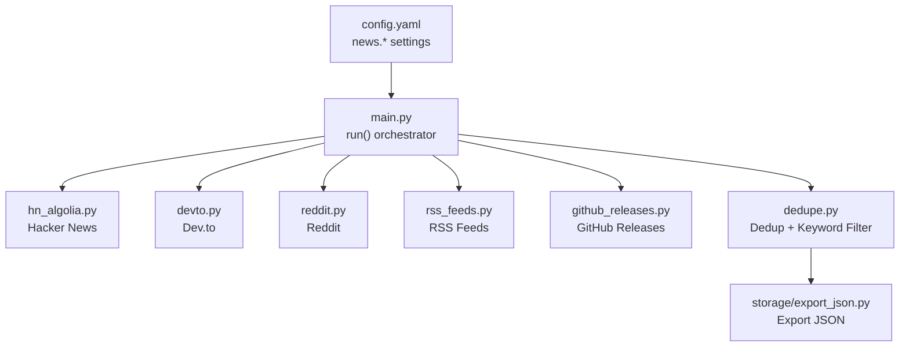
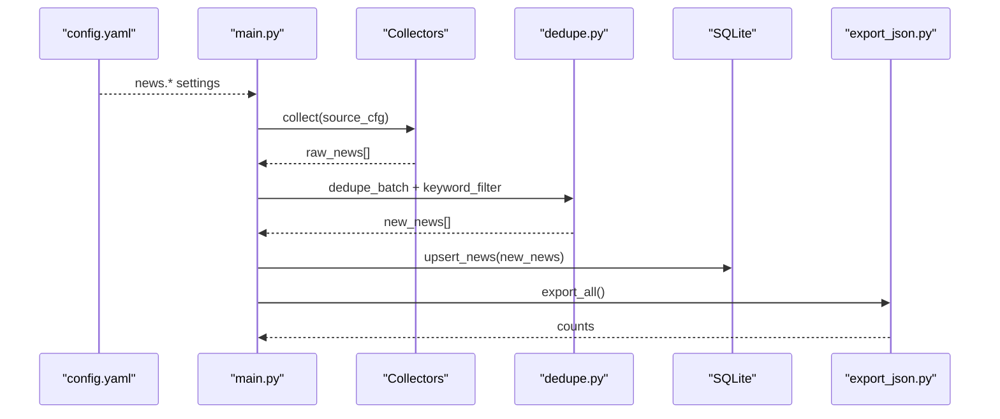
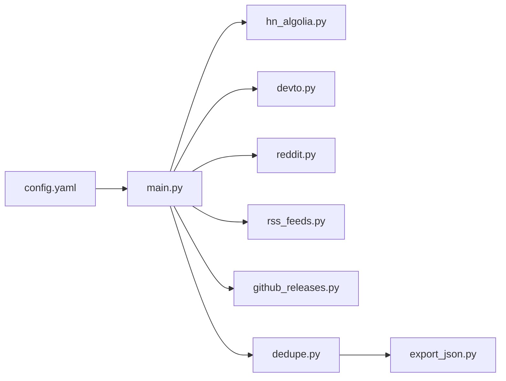

# News Source Configuration

<cite>
**Referenced Files in This Document**
- [config.yaml](file://worker/config.yaml)
- [main.py](file://worker/main.py)
- [hn_algolia.py](file://worker/collectors/news/hn_algolia.py)
- [devto.py](file://worker/collectors/news/devto.py)
- [reddit.py](file://worker/collectors/news/reddit.py)
- [rss_feeds.py](file://worker/collectors/news/rss_feeds.py)
- [github_releases.py](file://worker/collectors/news/github_releases.py)
- [dedupe.py](file://worker/scoring/dedupe.py)
- [export_json.py](file://worker/storage/export_json.py)
- [test_schema.py](file://tests/test_schema.py)
</cite>

## Table of Contents
1. [Introduction](#introduction)
2. [Project Structure](#project-structure)
3. [Core Components](#core-components)
4. [Architecture Overview](#architecture-overview)
5. [Detailed Component Analysis](#detailed-component-analysis)
6. [Dependency Analysis](#dependency-analysis)
7. [Performance Considerations](#performance-considerations)
8. [Troubleshooting Guide](#troubleshooting-guide)
9. [Conclusion](#conclusion)

## Introduction
This document explains how to configure and optimize news sources in the DevOps & AI Hub system. It focuses on the five built-in news collectors: Hacker News, Dev.to, Reddit, RSS feeds, and GitHub releases. You will learn how to enable/disable sources, tune parameters such as maximum item limits and collection delays, apply tag-based filtering, and integrate custom feeds. The guide also covers how these configurations influence content collection and how to troubleshoot common issues.

## Project Structure
The news collection pipeline is orchestrated by a central worker that loads configuration, invokes collectors, deduplicates content, applies keyword filtering, scores items, persists them to a database, exports JSON, and optionally publishes updates.

**Diagram sources**
- [config.yaml:77-169](file://worker/config.yaml#L77-L169)
- [main.py:127-297](file://worker/main.py#L127-L297)
- [hn_algolia.py:21-82](file://worker/collectors/news/hn_algolia.py#L21-L82)
- [devto.py:21-72](file://worker/collectors/news/devto.py#L21-L72)
- [reddit.py:29-79](file://worker/collectors/news/reddit.py#L29-L79)
- [rss_feeds.py:38-89](file://worker/collectors/news/rss_feeds.py#L38-L89)
- [github_releases.py:23-86](file://worker/collectors/news/github_releases.py#L23-L86)
- [dedupe.py:48-90](file://worker/scoring/dedupe.py#L48-L90)
- [export_json.py:32-93](file://worker/storage/export_json.py#L32-L93)

**Section sources**
- [config.yaml:77-169](file://worker/config.yaml#L77-L169)
- [main.py:127-297](file://worker/main.py#L127-L297)

## Core Components
- Configuration loader: Reads the YAML configuration and exposes news settings to the orchestrator.
- Collector modules: Each news source implements a collect(cfg) function that returns normalized items.
- Deduplication and keyword filtering: Removes duplicates and filters items based on configured keywords.
- Exporter: Writes normalized news and jobs to docs/data/*.json.

Key configuration locations:
- News sources: [config.yaml:77-169](file://worker/config.yaml#L77-L169)
- Orchestrator: [main.py:127-297](file://worker/main.py#L127-L297)
- Keyword filter: [config.yaml:20-76](file://worker/config.yaml#L20-L76)
- Deduplication and keyword filter: [dedupe.py:48-90](file://worker/scoring/dedupe.py#L48-L90)

**Section sources**
- [config.yaml:77-169](file://worker/config.yaml#L77-L169)
- [main.py:127-297](file://worker/main.py#L127-L297)
- [dedupe.py:48-90](file://worker/scoring/dedupe.py#L48-L90)

## Architecture Overview
The pipeline collects from enabled news sources, deduplicates and filters, scores via LLM, persists to SQLite, exports JSON, and optionally publishes.

**Diagram sources**
- [config.yaml:77-169](file://worker/config.yaml#L77-L169)
- [main.py:127-297](file://worker/main.py#L127-L297)
- [dedupe.py:48-90](file://worker/scoring/dedupe.py#L48-L90)
- [export_json.py:32-93](file://worker/storage/export_json.py#L32-L93)

## Detailed Component Analysis

### Hacker News (Algolia)
- Purpose: Fetch stories matching configured tags with a minimum points threshold.
- Enabled by default; adjust via news.hacker_news.enabled.
- Parameters:
  - tags: list of search terms used to query Algolia.
  - min_points: minimum story points/score to include.
  - max_items: global cap across all tags.
- Behavior:
  - Queries Algolia per tag with a dynamic page size.
  - Filters by min_points and deduplicates by URL/title/source.
  - Stops early once max_items is reached.
- Impact on collection:
  - Higher min_points reduces noise but may miss relevant stories.
  - Larger max_items increases LLM scoring workload.

Configuration reference:
- [config.yaml:79-91](file://worker/config.yaml#L79-L91)
- Implementation reference:
  - [hn_algolia.py:21-82](file://worker/collectors/news/hn_algolia.py#L21-L82)

**Section sources**
- [config.yaml:79-91](file://worker/config.yaml#L79-L91)
- [hn_algolia.py:21-82](file://worker/collectors/news/hn_algolia.py#L21-L82)

### Dev.to
- Purpose: Fetch articles filtered by tags from the public API.
- Enabled by default; adjust via news.devto.enabled.
- Parameters:
  - tags: list of tag slugs to query.
  - max_items: total cap across all tags.
- Behavior:
  - Requests per tag with a capped per_page.
  - Deduplicates by URL/title/source.
  - Stops early once max_items is reached.
- Impact on collection:
  - More tags increase coverage but also API calls.
  - Lower max_items reduces downstream processing.

Configuration reference:
- [config.yaml:93-102](file://worker/config.yaml#L93-L102)
- Implementation reference:
  - [devto.py:21-72](file://worker/collectors/news/devto.py#L21-L72)

**Section sources**
- [config.yaml:93-102](file://worker/config.yaml#L93-L102)
- [devto.py:21-72](file://worker/collectors/news/devto.py#L21-L72)

### Reddit
- Purpose: Fetch hot/top posts from subreddits using the public JSON API.
- Enabled by default; adjust via news.reddit.enabled.
- Parameters:
  - subreddits: list of subreddit names (without r/).
  - max_items_per_sub: per-subreddit cap.
  - delay_seconds: delay between requests to respect rate limits.
- Behavior:
  - Respects delay between subreddits.
  - Limits posts per subreddit and deduplicates by URL/title/source.
- Impact on collection:
  - Higher delay reduces risk of throttling but slows collection.
  - Many subreddits increase coverage but also rate-limit risk.

Configuration reference:
- [config.yaml:104-115](file://worker/config.yaml#L104-L115)
- Implementation reference:
  - [reddit.py:29-79](file://worker/collectors/news/reddit.py#L29-L79)

**Section sources**
- [config.yaml:104-115](file://worker/config.yaml#L104-L115)
- [reddit.py:29-79](file://worker/collectors/news/reddit.py#L29-L79)

### RSS Feeds
- Purpose: Generic RSS/Atom collector for custom feeds.
- Enabled by default; adjust via news.rss_feeds.enabled.
- Parameters:
  - feeds: list of {name, url} entries.
  - max_items_per_feed: per-feed cap.
- Behavior:
  - Parses each feed with feedparser.
  - Extracts best available publication date.
  - Deduplicates by URL/title/source.
- Impact on collection:
  - Adding many feeds increases processing time.
  - Per-feed caps prevent any single feed from dominating.

Configuration reference:
- [config.yaml:117-148](file://worker/config.yaml#L117-L148)
- Implementation reference:
  - [rss_feeds.py:38-89](file://worker/collectors/news/rss_feeds.py#L38-L89)

**Section sources**
- [config.yaml:117-148](file://worker/config.yaml#L117-L148)
- [rss_feeds.py:38-89](file://worker/collectors/news/rss_feeds.py#L38-L89)

### GitHub Releases
- Purpose: Collect release notes from public GitHub repositories via Atom feeds.
- Enabled by default; adjust via news.github_releases.enabled.
- Parameters:
  - repos: list of "owner/repo" strings.
  - max_items_per_repo: per-repository cap.
- Behavior:
  - Respects a small delay between requests.
  - Uses updated/published timestamps from Atom entries.
  - Deduplicates by URL/title/source.
- Impact on collection:
  - Many repos increase latency due to delays.
  - Lower per-repo caps reduce noise from frequent releases.

Configuration reference:
- [config.yaml:150-168](file://worker/config.yaml#L150-L168)
- Implementation reference:
  - [github_releases.py:23-86](file://worker/collectors/news/github_releases.py#L23-L86)

**Section sources**
- [config.yaml:150-168](file://worker/config.yaml#L150-L168)
- [github_releases.py:23-86](file://worker/collectors/news/github_releases.py#L23-L86)

### Tag-Based Filtering and Keyword Gate
- Keyword filter (pre-LLM relevance gate):
  - Defined under keyword_filter in config.yaml.
  - Items must contain at least one configured keyword in title/summary/company to pass.
  - Empty list allows all items to pass.
- Deduplication:
  - Stable deterministic IDs prevent duplicates across runs.
  - In-batch fuzzy dedup removes near-duplicates with a configurable threshold.
- Impact:
  - Tightening keywords reduces LLM calls and improves signal-to-noise.
  - Deduplication ensures stable historical records.

Configuration reference:
- [config.yaml:20-76](file://worker/config.yaml#L20-L76)
- Implementation reference:
  - [dedupe.py:48-90](file://worker/scoring/dedupe.py#L48-L90)

**Section sources**
- [config.yaml:20-76](file://worker/config.yaml#L20-L76)
- [dedupe.py:48-90](file://worker/scoring/dedupe.py#L48-L90)

## Dependency Analysis
- Orchestrator depends on:
  - Configuration loader to read news.* settings.
  - Individual collectors to return normalized items.
  - Deduplication and keyword filter to gate content.
  - Exporter to write docs/data/*.json.
- Collector modules depend on:
  - External APIs/feeds (Algolia, Dev.to, Reddit, RSS, GitHub Atom).
  - Scoring utilities for ID generation.
- Data flow:
  - Raw items from collectors → dedupe + keyword filter → SQLite → JSON export.

**Diagram sources**
- [config.yaml:77-169](file://worker/config.yaml#L77-L169)
- [main.py:127-297](file://worker/main.py#L127-L297)
- [hn_algolia.py:21-82](file://worker/collectors/news/hn_algolia.py#L21-L82)
- [devto.py:21-72](file://worker/collectors/news/devto.py#L21-L72)
- [reddit.py:29-79](file://worker/collectors/news/reddit.py#L29-L79)
- [rss_feeds.py:38-89](file://worker/collectors/news/rss_feeds.py#L38-L89)
- [github_releases.py:23-86](file://worker/collectors/news/github_releases.py#L23-L86)
- [dedupe.py:48-90](file://worker/scoring/dedupe.py#L48-L90)
- [export_json.py:32-93](file://worker/storage/export_json.py#L32-L93)

**Section sources**
- [main.py:127-297](file://worker/main.py#L127-L297)
- [dedupe.py:48-90](file://worker/scoring/dedupe.py#L48-L90)
- [export_json.py:32-93](file://worker/storage/export_json.py#L32-L93)

## Performance Considerations
- Rate limiting and delays:
  - Reddit: delay_seconds controls inter-request spacing to avoid throttling.
  - GitHub: a fixed delay between repository requests prevents API abuse.
- Item caps:
  - max_items (Hacker News), max_items (Dev.to), max_items_per_sub (Reddit), max_items_per_feed (RSS), max_items_per_repo (GitHub) bound processing volume.
- Keyword filtering:
  - Reduces LLM calls by pre-filtering irrelevant items.
- Deduplication:
  - Prevents repeated processing and stabilizes historical datasets.

Practical tips:
- Increase delay_seconds for Reddit if encountering rate limits.
- Reduce max_items_per_feed for noisy feeds.
- Narrow tags to improve signal and reduce LLM workload.
- Use smaller max_items_per_repo for highly active projects.

**Section sources**
- [config.yaml:104-115](file://worker/config.yaml#L104-L115)
- [config.yaml:150-168](file://worker/config.yaml#L150-L168)
- [config.yaml:79-91](file://worker/config.yaml#L79-L91)
- [config.yaml:93-102](file://worker/config.yaml#L93-L102)
- [config.yaml:117-148](file://worker/config.yaml#L117-L148)
- [reddit.py:36-43](file://worker/collectors/news/reddit.py#L36-L43)
- [github_releases.py:20](file://worker/collectors/news/github_releases.py#L20)
- [dedupe.py:48-90](file://worker/scoring/dedupe.py#L48-L90)

## Troubleshooting Guide
Common issues and resolutions:
- Source failures:
  - The orchestrator logs errors per source and continues with others. Check logs for “News source ‘X’ failed” messages.
  - Verify network connectivity and external API availability.
- Rate limiting:
  - Reddit: Increase delay_seconds to respect Reddit’s rate limits.
  - GitHub: Requests are delayed by design; consider reducing repos or increasing per-repo caps cautiously.
- Empty or malformed feeds:
  - RSS feeds may report bozo errors; review warnings and remove problematic feeds.
- Keyword filter blocking too many items:
  - Relax keyword_filter to include broader terms or temporarily disable it by leaving the list empty.
- Duplicate IDs in exported JSON:
  - Ensure deduplication is functioning; verify IDs are stable and unique.

Validation:
- The repository includes tests that validate the schema of docs/data/*.json, including required fields and numeric ranges for relevance scores.

**Section sources**
- [main.py:151-160](file://worker/main.py#L151-L160)
- [reddit.py:42-43](file://worker/collectors/news/reddit.py#L42-L43)
- [github_releases.py:34-35](file://worker/collectors/news/github_releases.py#L34-L35)
- [rss_feeds.py:54-57](file://worker/collectors/news/rss_feeds.py#L54-L57)
- [dedupe.py:48-90](file://worker/scoring/dedupe.py#L48-L90)
- [test_schema.py:53-96](file://tests/test_schema.py#L53-L96)

## Conclusion
The DevOps & AI Hub news pipeline is configurable and extensible. By tuning source-specific parameters—such as tags, min_points, max_items, delay_seconds, and per-source caps—you can balance coverage, quality, and performance. Combine these settings with keyword filtering and deduplication to produce a focused, high-quality dataset suitable for downstream analysis and publishing.