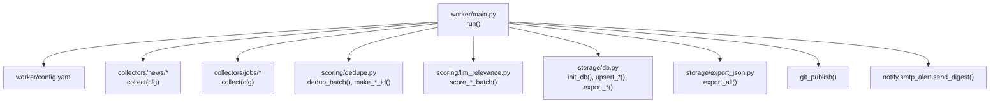
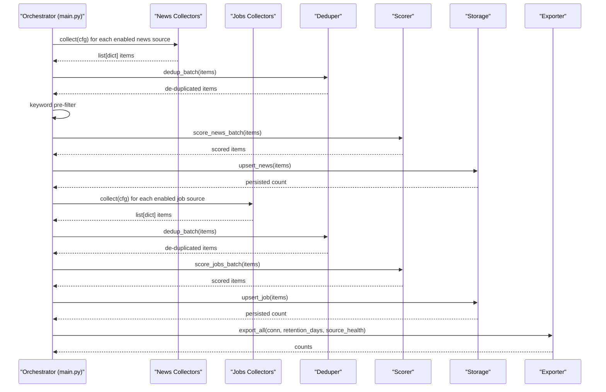
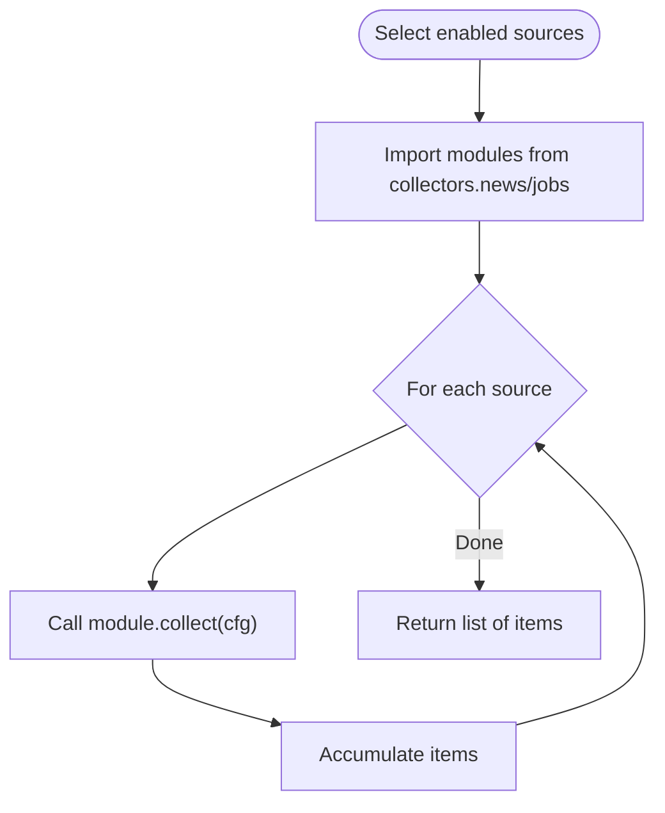
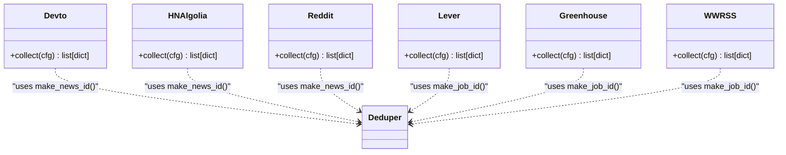
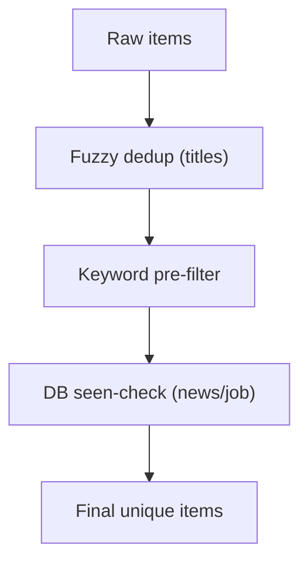
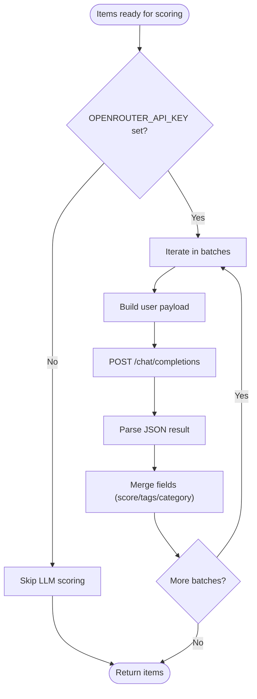
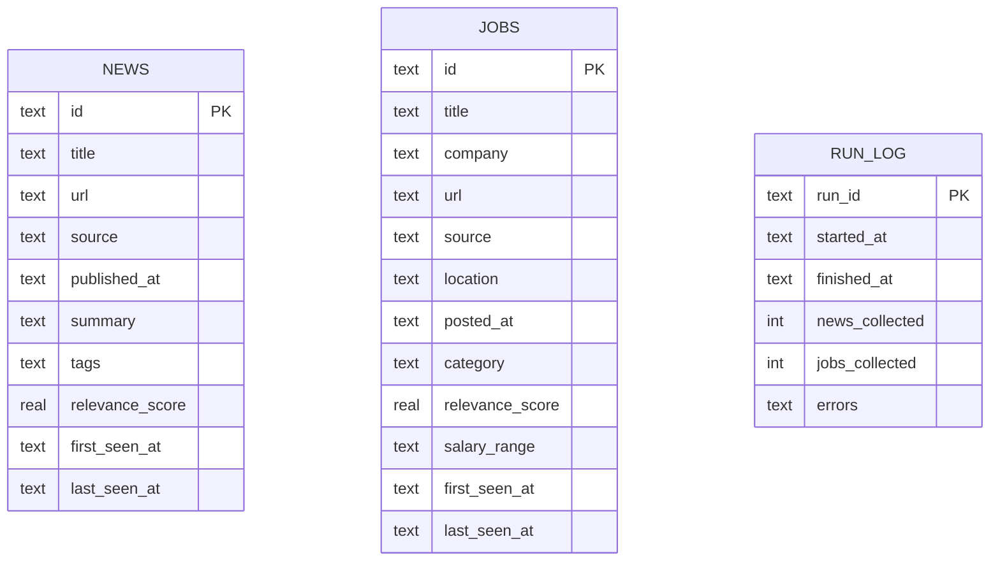
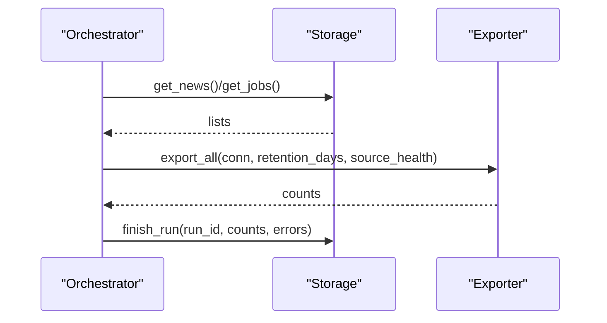
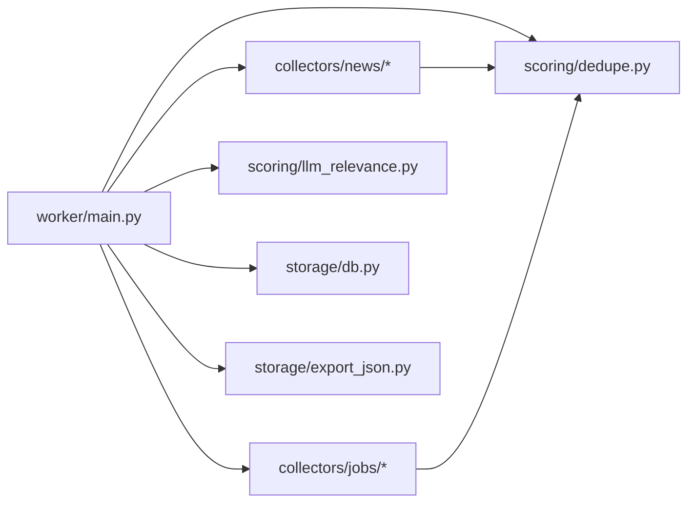

# Collector Architecture and Patterns

<cite>
**Referenced Files in This Document**
- [main.py](file://worker/main.py)
- [config.yaml](file://worker/config.yaml)
- [collectors/__init__.py](file://worker/collectors/__init__.py)
- [collectors/news/__init__.py](file://worker/collectors/news/__init__.py)
- [collectors/jobs/__init__.py](file://worker/collectors/jobs/__init__.py)
- [collectors/news/devto.py](file://worker/collectors/news/devto.py)
- [collectors/news/hn_algolia.py](file://worker/collectors/news/hn_algolia.py)
- [collectors/news/reddit.py](file://worker/collectors/news/reddit.py)
- [collectors/jobs/lever.py](file://worker/collectors/jobs/lever.py)
- [collectors/jobs/greenhouse.py](file://worker/collectors/jobs/greenhouse.py)
- [collectors/jobs/weworkremotely_rss.py](file://worker/collectors/jobs/weworkremotely_rss.py)
- [scoring/dedupe.py](file://worker/scoring/dedupe.py)
- [scoring/llm_relevance.py](file://worker/scoring/llm_relevance.py)
- [storage/db.py](file://worker/storage/db.py)
- [storage/export_json.py](file://worker/storage/export_json.py)
- [tests/test_schema.py](file://tests/test_schema.py)
</cite>

## Table of Contents
1. [Introduction](#introduction)
2. [Project Structure](#project-structure)
3. [Core Components](#core-components)
4. [Architecture Overview](#architecture-overview)
5. [Detailed Component Analysis](#detailed-component-analysis)
6. [Dependency Analysis](#dependency-analysis)
7. [Performance Considerations](#performance-considerations)
8. [Troubleshooting Guide](#troubleshooting-guide)
9. [Conclusion](#conclusion)
10. [Appendices](#appendices)

## Introduction
This document explains the collector architecture and design patterns used to gather news and jobs from multiple external sources, normalize and enrich the data, deduplicate it, persist it, and produce static JSON artifacts. It focuses on:
- The base collector interface contract and how all collectors adhere to it
- Dynamic module loading via configuration-driven orchestration
- Factory-like invocation of collectors through a central orchestrator
- Common lifecycle steps: collection, deduplication, scoring, persistence, export, health reporting, and optional publishing
- Error handling, retries, and graceful degradation strategies
- Extensibility guidelines for adding new collector types and sources
- Testing patterns and debugging techniques

## Project Structure
The worker orchestrates a pipeline that:
- Loads configuration
- Dynamically selects enabled collectors from two domains: news and jobs
- Executes each collector’s collect function with a configuration dictionary
- Applies deduplication and keyword filtering
- Scores items via an LLM service (optional)
- Persists to SQLite
- Exports JSON outputs and optionally publishes changes

**Diagram sources**
- [main.py:127-297](file://worker/main.py#L127-L297)
- [config.yaml:1-244](file://worker/config.yaml#L1-L244)
- [scoring/dedupe.py:1-90](file://worker/scoring/dedupe.py#L1-L90)
- [scoring/llm_relevance.py:1-178](file://worker/scoring/llm_relevance.py#L1-L178)
- [storage/db.py:1-278](file://worker/storage/db.py#L1-L278)
- [storage/export_json.py:1-93](file://worker/storage/export_json.py#L1-L93)

**Section sources**
- [main.py:127-297](file://worker/main.py#L127-L297)
- [config.yaml:1-244](file://worker/config.yaml#L1-L244)

## Core Components
- Base collector interface: Every collector exposes a function named collect(cfg: dict) -> list[dict]. This uniform signature enables dynamic discovery and invocation from the orchestrator.
- Dynamic module loading: The orchestrator imports modules from collectors.news and collectors.jobs and invokes their collect functions based on configuration flags.
- Common lifecycle:
  - Collection: Each source returns a list of normalized items.
  - Deduplication: Removes duplicates within a batch and checks previously seen IDs.
  - Keyword pre-filter: Skips items that do not match configured keywords.
  - Scoring: Optional LLM-based relevance scoring and tagging.
  - Persistence: Upsert into SQLite with timestamps and metadata.
  - Export: Writes docs/data/news.json, jobs.json, meta.json.
  - Health monitoring: Tracks per-source status and aggregates errors.
  - Optional publish: Commits and pushes changes to a repository.
  - Optional SMTP digest: Sends a summary email after successful runs.

**Section sources**
- [main.py:151-227](file://worker/main.py#L151-L227)
- [scoring/dedupe.py:48-90](file://worker/scoring/dedupe.py#L48-L90)
- [scoring/llm_relevance.py:95-178](file://worker/scoring/llm_relevance.py#L95-L178)
- [storage/db.py:116-278](file://worker/storage/db.py#L116-L278)
- [storage/export_json.py:32-93](file://worker/storage/export_json.py#L32-L93)

## Architecture Overview
The system follows a modular, configuration-driven design:
- Orchestrator coordinates all stages and maintains global state (run_id, errors, health).
- Collectors are isolated modules under collectors/news and collectors/jobs packages.
- Scoring and deduplication are reusable utilities.
- Storage encapsulates schema, transactions, and exports.
- Export and publish steps are decoupled from core collection logic.

**Diagram sources**
- [main.py:147-262](file://worker/main.py#L147-L262)
- [scoring/dedupe.py:48-90](file://worker/scoring/dedupe.py#L48-L90)
- [scoring/llm_relevance.py:95-178](file://worker/scoring/llm_relevance.py#L95-L178)
- [storage/db.py:116-242](file://worker/storage/db.py#L116-L242)
- [storage/export_json.py:32-93](file://worker/storage/export_json.py#L32-L93)

## Detailed Component Analysis

### Base Collector Interface and Factory Pattern
- Interface contract: Each collector implements collect(cfg) returning a list of dictionaries with standardized fields (id, title, url, source, timestamps, relevance_score, etc.).
- Factory-like invocation: The orchestrator dynamically selects modules based on configuration and calls collect with a merged configuration (including global keywords for jobs).
- No explicit factory class is used; instead, a convention-based loader and a loop over enabled sources act as a functional factory.

**Diagram sources**
- [main.py:42-57](file://worker/main.py#L42-L57)
- [main.py:151-227](file://worker/main.py#L151-L227)

**Section sources**
- [main.py:42-57](file://worker/main.py#L42-L57)
- [main.py:151-227](file://worker/main.py#L151-L227)

### Collector Implementations
- News collectors:
  - Dev.to: fetches articles by tags, enforces max_items, and normalizes fields.
  - Hacker News via Algolia: filters by score and tags, builds normalized items.
  - Reddit: respects rate-limiting delay, extracts posts, and normalizes timestamps.
- Jobs collectors:
  - Lever and Greenhouse: iterate company board slugs, apply keyword filtering, and normalize fields.
  - WeWorkRemotely RSS: parses RSS entries, infers company from title, and normalizes dates.

**Diagram sources**
- [collectors/news/devto.py:21-72](file://worker/collectors/news/devto.py#L21-L72)
- [collectors/news/hn_algolia.py:21-82](file://worker/collectors/news/hn_algolia.py#L21-L82)
- [collectors/news/reddit.py:29-79](file://worker/collectors/news/reddit.py#L29-L79)
- [collectors/jobs/lever.py:22-85](file://worker/collectors/jobs/lever.py#L22-L85)
- [collectors/jobs/greenhouse.py:22-77](file://worker/collectors/jobs/greenhouse.py#L22-L77)
- [collectors/jobs/weworkremotely_rss.py:22-85](file://worker/collectors/jobs/weworkremotely_rss.py#L22-L85)
- [scoring/dedupe.py:20-29](file://worker/scoring/dedupe.py#L20-L29)

**Section sources**
- [collectors/news/devto.py:21-72](file://worker/collectors/news/devto.py#L21-L72)
- [collectors/news/hn_algolia.py:21-82](file://worker/collectors/news/hn_algolia.py#L21-L82)
- [collectors/news/reddit.py:29-79](file://worker/collectors/news/reddit.py#L29-L79)
- [collectors/jobs/lever.py:22-85](file://worker/collectors/jobs/lever.py#L22-L85)
- [collectors/jobs/greenhouse.py:22-77](file://worker/collectors/jobs/greenhouse.py#L22-L77)
- [collectors/jobs/weworkremotely_rss.py:22-85](file://worker/collectors/jobs/weworkremotely_rss.py#L22-L85)

### Deduplication and Keyword Filtering
- Stable deterministic IDs are computed using hashing of normalized fields.
- In-batch fuzzy deduplication reduces near-duplicates using a similarity threshold.
- DB-backed seen checks prevent reprocessing known items.
- Keyword pre-filter short-circuits LLM calls by excluding irrelevant items early.

**Diagram sources**
- [scoring/dedupe.py:48-90](file://worker/scoring/dedupe.py#L48-L90)
- [main.py:174-181](file://worker/main.py#L174-L181)
- [main.py:231-237](file://worker/main.py#L231-L237)

**Section sources**
- [scoring/dedupe.py:19-90](file://worker/scoring/dedupe.py#L19-L90)
- [main.py:174-181](file://worker/main.py#L174-L181)
- [main.py:231-237](file://worker/main.py#L231-L237)

### LLM Relevance Scoring and Graceful Degradation
- Batched scoring with configurable batch size and model.
- Graceful degradation: on LLM failure, items remain unmodified rather than being dropped.
- Pre-filtering minimizes unnecessary LLM calls.

**Diagram sources**
- [scoring/llm_relevance.py:95-178](file://worker/scoring/llm_relevance.py#L95-L178)

**Section sources**
- [scoring/llm_relevance.py:95-178](file://worker/scoring/llm_relevance.py#L95-L178)

### Persistence and Transactions
- SQLite schema defines tables for news, jobs, and run logs.
- Upsert semantics preserve first_seen_at and update last_seen_at.
- Transaction context manager ensures atomicity across bulk inserts.

**Diagram sources**
- [storage/db.py:22-67](file://worker/storage/db.py#L22-L67)
- [storage/db.py:116-242](file://worker/storage/db.py#L116-L242)
- [storage/db.py:246-278](file://worker/storage/db.py#L246-L278)

**Section sources**
- [storage/db.py:22-67](file://worker/storage/db.py#L22-L67)
- [storage/db.py:116-242](file://worker/storage/db.py#L116-L242)
- [storage/db.py:246-278](file://worker/storage/db.py#L246-L278)

### Export and Health Monitoring
- Export reads from SQLite, prunes internal fields, and writes three JSON files.
- Health map tracks per-source status and errors are aggregated into run logs.

**Diagram sources**
- [main.py:255-271](file://worker/main.py#L255-L271)
- [storage/export_json.py:32-93](file://worker/storage/export_json.py#L32-L93)
- [storage/db.py:254-278](file://worker/storage/db.py#L254-L278)

**Section sources**
- [main.py:255-271](file://worker/main.py#L255-L271)
- [storage/export_json.py:32-93](file://worker/storage/export_json.py#L32-L93)
- [storage/db.py:254-278](file://worker/storage/db.py#L254-L278)

## Dependency Analysis
- Orchestrator depends on:
  - Collectors (news/jobs) via dynamic imports
  - Scoring utilities for dedup and LLM scoring
  - Storage for DB initialization, transactions, and exports
- Collectors depend on:
  - HTTP libraries and parsers (requests, feedparser)
  - Dedup utilities for stable IDs
- Exporter depends on storage getters and writes to docs/data

**Diagram sources**
- [main.py:42-66](file://worker/main.py#L42-L66)
- [collectors/news/devto.py:13](file://worker/collectors/news/devto.py#L13)
- [collectors/jobs/lever.py:14](file://worker/collectors/jobs/lever.py#L14)

**Section sources**
- [main.py:42-66](file://worker/main.py#L42-L66)

## Performance Considerations
- Network timeouts: HTTP calls specify timeouts to avoid hanging on slow endpoints.
- Rate limiting: Reddit collector respects a configurable delay between requests.
- Batching: LLM scoring uses configurable batch sizes to reduce overhead.
- Early filtering: Keyword pre-filter avoids unnecessary LLM calls.
- Deduplication cost: Fuzzy matching is O(n^2) in worst case; keep batch sizes reasonable.
- SQLite WAL mode: Improves concurrency and write throughput.
- Memory: Items are processed incrementally; avoid holding entire datasets in memory beyond necessary.

[No sources needed since this section provides general guidance]

## Troubleshooting Guide
- Collector failures:
  - Each collector’s collect is wrapped with try/except; errors are logged and recorded in the run log.
  - Per-source health status is tracked and exported in meta.json.
- LLM scoring failures:
  - On error, items remain unmodified rather than being dropped; check OPENROUTER_API_KEY and network connectivity.
- Export validation:
  - Tests assert required fields, numeric ranges, and absence of duplicates in exported JSON.
- Debugging tips:
  - Increase LOG_LEVEL to DEBUG for verbose logs.
  - Temporarily disable LLM scoring to isolate network issues.
  - Verify configuration keys for enabled sources and keyword filters.

**Section sources**
- [main.py:151-227](file://worker/main.py#L151-L227)
- [scoring/llm_relevance.py:105-107](file://worker/scoring/llm_relevance.py#L105-L107)
- [tests/test_schema.py:28-136](file://tests/test_schema.py#L28-L136)

## Conclusion
The collector system is designed around a simple, extensible pattern: a uniform collect(cfg) interface, configuration-driven selection, and a shared pipeline for deduplication, scoring, persistence, and export. This architecture supports easy addition of new sources, robust error handling, and maintainable quality gates through tests and health reporting.

[No sources needed since this section summarizes without analyzing specific files]

## Appendices

### How to Extend the Collector System
- Add a new collector module under collectors/news or collectors/jobs with a collect(cfg) function.
- Ensure the module returns normalized items with required fields.
- Register the module in the orchestrator imports and enable it in config.yaml.
- If applicable, integrate keyword filtering for jobs collectors.
- Keep error handling inside collect with appropriate logging.

**Section sources**
- [collectors/news/devto.py:21-72](file://worker/collectors/news/devto.py#L21-L72)
- [collectors/jobs/lever.py:22-85](file://worker/collectors/jobs/lever.py#L22-L85)
- [main.py:42-57](file://worker/main.py#L42-L57)
- [config.yaml:77-244](file://worker/config.yaml#L77-L244)

### Maintaining Consistency Across Implementations
- Use make_news_id or make_job_id to compute deterministic IDs.
- Normalize timestamps to ISO format.
- Include source name and URL; avoid empty or malformed records.
- Preserve relevance_score and summary/tags for news; category for jobs.
- Apply keyword pre-filter consistently for jobs.

**Section sources**
- [scoring/dedupe.py:20-29](file://worker/scoring/dedupe.py#L20-L29)
- [collectors/news/hn_algolia.py:54-69](file://worker/collectors/news/hn_algolia.py#L54-L69)
- [collectors/jobs/greenhouse.py:55-69](file://worker/collectors/jobs/greenhouse.py#L55-L69)

### Testing Patterns for Collectors
- Validate exported JSON schema and required fields.
- Assert non-negative counts and presence of source_health.
- Ensure no duplicate IDs in news.json and jobs.json.

**Section sources**
- [tests/test_schema.py:28-136](file://tests/test_schema.py#L28-L136)