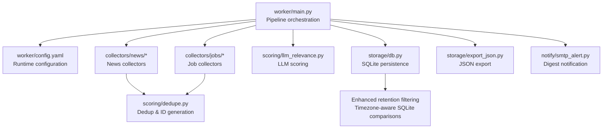
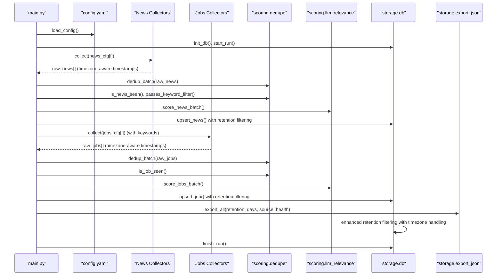
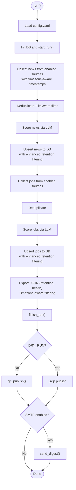
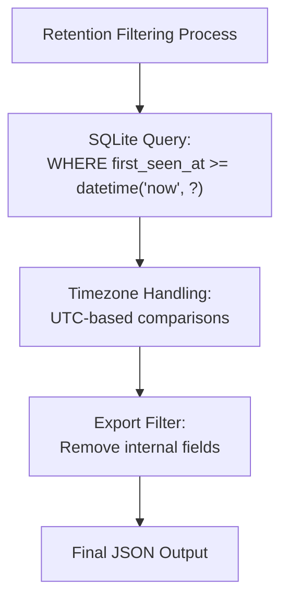
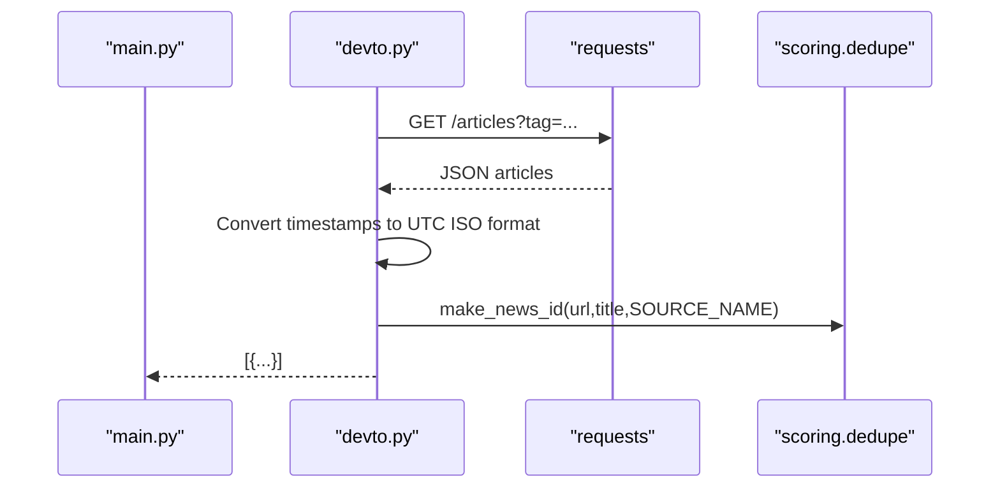
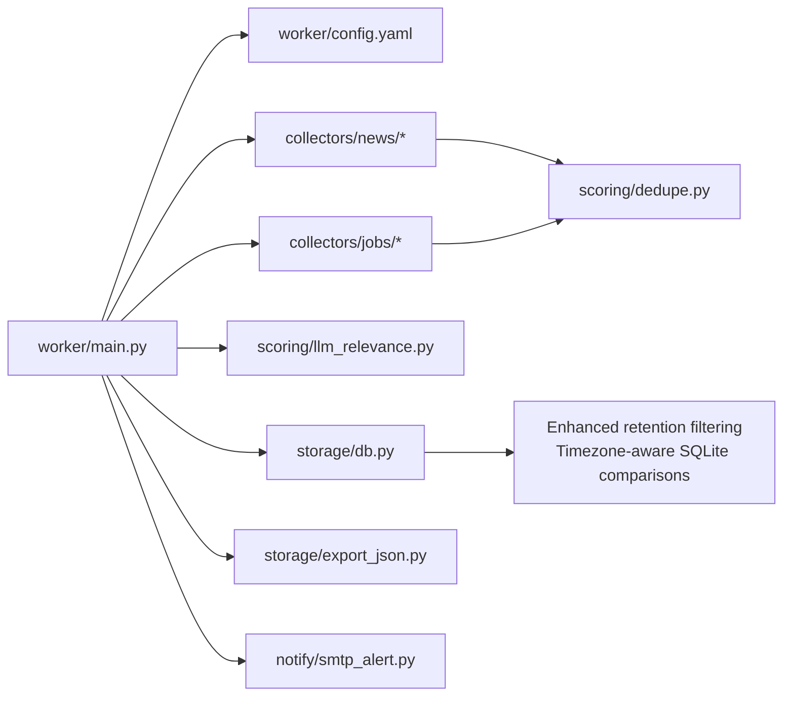
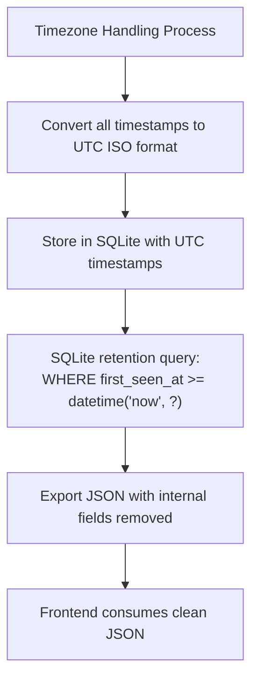

# Content Collection System

<cite>
**Referenced Files in This Document**
- [main.py](file://worker/main.py)
- [config.yaml](file://worker/config.yaml)
- [db.py](file://worker/storage/db.py)
- [export_json.py](file://worker/storage/export_json.py)
- [dedupe.py](file://worker/scoring/dedupe.py)
- [devto.py](file://worker/collectors/news/devto.py)
- [hn_algolia.py](file://worker/collectors/news/hn_algolia.py)
- [reddit.py](file://worker/collectors/news/reddit.py)
- [rss_feeds.py](file://worker/collectors/news/rss_feeds.py)
- [github_releases.py](file://worker/collectors/news/github_releases.py)
- [arbeitnow.py](file://worker/collectors/jobs/arbeitnow.py)
- [greenhouse.py](file://worker/collectors/jobs/greenhouse.py)
- [hn_whoishiring.py](file://worker/collectors/jobs/hn_whoishiring.py)
- [lever.py](file://worker/collectors/jobs/lever.py)
- [remoteok.py](file://worker/collectors/jobs/remoteok.py)
- [remotive.py](file://worker/collectors/jobs/remotive.py)
- [weworkremotely_rss.py](file://worker/collectors/jobs/weworkremotely_rss.py)
</cite>

## Update Summary
**Changes Made**
- Enhanced retention filtering section with improved SQLite comparison handling
- Added timezone offset handling improvements in data collection
- Updated performance considerations for better SQLite date comparisons
- Enhanced troubleshooting guide with timezone-related issues

## Table of Contents
1. [Introduction](#introduction)
2. [Project Structure](#project-structure)
3. [Core Components](#core-components)
4. [Architecture Overview](#architecture-overview)
5. [Detailed Component Analysis](#detailed-component-analysis)
6. [Dependency Analysis](#dependency-analysis)
7. [Performance Considerations](#performance-considerations)
8. [Troubleshooting Guide](#troubleshooting-guide)
9. [Conclusion](#conclusion)
10. [Appendices](#appendices)

## Introduction
This document describes the content collection system that aggregates news and job postings from multiple sources into a unified dataset. It covers the modular collector architecture, source-specific implementations, and integration patterns. It explains how collectors handle authentication, rate limiting, data transformation, and error handling, and provides practical guidance for adding new sources, customizing existing collectors, and troubleshooting collection failures. It also addresses performance considerations, caching strategies, and best practices for reliable data collection with enhanced retention filtering and improved timezone offset handling.

## Project Structure
The system is organized around a central orchestrator that coordinates multiple specialized collectors grouped by domain (news and jobs). Configuration is externalized in YAML, enabling runtime customization without code changes. Supporting modules provide deduplication, scoring, persistence, export, and notifications with enhanced retention filtering capabilities.

**Diagram sources**
- [main.py:127-297](file://worker/main.py#L127-L297)
- [config.yaml:77-244](file://worker/config.yaml#L77-L244)
- [db.py:163-242](file://worker/storage/db.py#L163-L242)

**Section sources**
- [main.py:42-57](file://worker/main.py#L42-L57)
- [config.yaml:77-244](file://worker/config.yaml#L77-L244)

## Core Components
- Orchestrator: Loads configuration, iterates enabled sources, collects, deduplicates, scores, persists, exports, publishes, and optionally sends SMTP digests.
- Collector modules: Implement a uniform interface with a collect(cfg) function returning a list of normalized items with timezone-aware timestamps.
- Deduplication and ID generation: Ensures uniqueness across sources and items with enhanced fuzzy matching.
- Scoring: Uses an LLM backend to compute relevance scores with pre-filtering.
- Persistence and export: Writes to SQLite with enhanced retention filtering and produces static JSON artifacts.
- Notifications: Optional SMTP digest summarizing new items.

Key responsibilities:
- Configuration-driven enablement and tuning of sources.
- Health monitoring via per-source status tracking.
- Error containment and reporting without aborting the whole run.
- Enhanced retention filtering with timezone offset handling.

**Section sources**
- [main.py:127-297](file://worker/main.py#L127-L297)
- [config.yaml:77-244](file://worker/config.yaml#L77-L244)

## Architecture Overview
The pipeline follows a staged process with enhanced retention filtering:
1. Load configuration and initialize database with timezone-aware settings.
2. Collect news and jobs from enabled sources with proper timestamp handling.
3. Deduplicate and apply keyword filters.
4. Score items via LLM with pre-filtering.
5. Persist to SQLite with enhanced retention filtering.
6. Export JSON with retention and health metadata.
7. Send SMTP digest if configured.

**Diagram sources**
- [main.py:127-297](file://worker/main.py#L127-L297)
- [config.yaml:10-76](file://worker/config.yaml#L10-L76)
- [db.py:163-242](file://worker/storage/db.py#L163-L242)

## Detailed Component Analysis

### Orchestrator and Pipeline
- Loads environment and configuration, sets up logging, and initializes the database with timezone-aware connections.
- Iterates over enabled news and jobs sources, invoking collect(cfg) and aggregating results with proper timestamp handling.
- Applies deduplication and keyword filtering before scoring.
- Persists items in transactions with enhanced retention filtering and exports JSON with retention and health metadata.
- Publishes changes to Git and optionally sends SMTP digest.

**Diagram sources**
- [main.py:127-297](file://worker/main.py#L127-L297)

**Section sources**
- [main.py:127-297](file://worker/main.py#L127-L297)

### Enhanced Retention Filtering and Timezone Handling

**Updated** The system now includes enhanced retention filtering with improved timezone offset handling in SQLite comparisons.

The retention filtering system operates on two levels:
1. **Database-level retention**: Uses SQLite's `datetime('now', ?)` function with timezone-aware calculations
2. **Application-level filtering**: Removes internal database fields from exported JSON

Key improvements:
- All timestamps are stored in UTC format for consistent comparisons
- SQLite queries use timezone-aware datetime calculations
- Export process strips internal fields (`first_seen_at`, `last_seen_at`) from final JSON output
- Enhanced fuzzy deduplication reduces false positives in retention filtering

**Diagram sources**
- [db.py:163-242](file://worker/storage/db.py#L163-L242)
- [export_json.py:50-75](file://worker/storage/export_json.py#L50-L75)

**Section sources**
- [db.py:163-242](file://worker/storage/db.py#L163-L242)
- [export_json.py:50-75](file://worker/storage/export_json.py#L50-L75)

### News Collectors

#### Dev.to Collector
- Purpose: Fetch articles filtered by tags from the public API.
- Authentication: None.
- Rate limiting: Not enforced in code; consider adding delays if rate-limited.
- Data transformation: Normalizes fields and generates a stable news ID with timezone-aware timestamps.
- Error handling: Per-tag try/catch with logging; continues on failure.

**Updated** All timestamps are now properly converted to UTC ISO format for consistent retention filtering.

**Diagram sources**
- [devto.py:21-72](file://worker/collectors/news/devto.py#L21-L72)

**Section sources**
- [devto.py:17-72](file://worker/collectors/news/devto.py#L17-L72)

#### Hacker News via Algolia
- Purpose: Search stories matching tags and minimum points threshold.
- Authentication: None.
- Rate limiting: Not enforced; consider delays if encountering throttling.
- Data transformation: Builds synthetic IDs and timestamps in UTC format.
- Error handling: Tag-scoped exceptions with logging.

**Section sources**
- [hn_algolia.py:17-82](file://worker/collectors/news/hn_algolia.py#L17-L82)

#### Reddit
- Purpose: Fetch hot posts from subreddits via JSON API.
- Authentication: None; uses a User-Agent header.
- Rate limiting: Enforced via per-request delay controlled by configuration.
- Data transformation: Extracts title, URL, and timestamp; builds source label with timezone handling.
- Error handling: Subreddit-scoped exceptions with logging.

**Section sources**
- [reddit.py:19-79](file://worker/collectors/news/reddit.py#L19-L79)

#### RSS Feeds
- Purpose: Generic RSS/Atom parsing for multiple feeds.
- Authentication: None.
- Rate limiting: Not enforced; consider delays for fragile feeds.
- Data transformation: Robust date parsing across multiple attributes with timezone awareness.
- Error handling: Feed-scoped warnings and exceptions.

**Section sources**
- [rss_feeds.py:19-89](file://worker/collectors/news/rss_feeds.py#L19-L89)

#### GitHub Releases
- Purpose: Parse Atom feeds for release notes from configured repositories.
- Authentication: None.
- Rate limiting: Polite delay between requests.
- Data transformation: Prefixes titles with repository context and ensures UTC timestamps.
- Error handling: Repo-scoped warnings and exceptions.

**Section sources**
- [github_releases.py:19-86](file://worker/collectors/news/github_releases.py#L19-L86)

### Jobs Collectors

#### Arbeitnow
- Purpose: Public job board API with tag-based filtering.
- Authentication: None.
- Rate limiting: Not enforced; consider delays if rate-limited.
- Data transformation: Constructs IDs and normalizes remote flag with timezone-aware timestamps.
- Error handling: Try/catch around API fetch.

**Updated** Enhanced error handling for timestamp conversion with fallback to current UTC time.

**Section sources**
- [arbeitnow.py:17-74](file://worker/collectors/jobs/arbeitnow.py#L17-L74)

#### Greenhouse
- Purpose: Public job boards via Greenhouse API using company board slugs.
- Authentication: None.
- Rate limiting: Not enforced; handles 404 gracefully.
- Data transformation: Extracts nested location and constructs company name with proper timestamp handling.
- Error handling: Slug-scoped exceptions with logging.

**Section sources**
- [greenhouse.py:18-77](file://worker/collectors/jobs/greenhouse.py#L18-L77)

#### HN "Who Is Hiring"
- Purpose: Parse the latest "Ask HN: Who is Hiring?" thread and extract job-like comments.
- Authentication: None.
- Rate limiting: Not enforced; extended timeout for item retrieval.
- Data transformation: Heuristic extraction of company/title/location from comments with timezone handling.
- Error handling: Thread lookup and comment-scoped exceptions.

**Section sources**
- [hn_whoishiring.py:23-112](file://worker/collectors/jobs/hn_whoishiring.py#L23-L112)

#### Lever
- Purpose: Public job postings via Lever API using company slugs.
- Authentication: None.
- Rate limiting: Not enforced; handles non-list responses.
- Data transformation: Normalizes location and team/category fields with proper timestamp handling.
- Error handling: Slug-scoped exceptions with logging.

**Section sources**
- [lever.py:18-85](file://worker/collectors/jobs/lever.py#L18-L85)

#### RemoteOK
- Purpose: Public API for remote jobs with tag-based filtering.
- Authentication: None; includes a User-Agent header.
- Rate limiting: Enforced with a 1-second delay.
- Data transformation: Parses timestamps and optional salary range with timezone awareness.
- Error handling: Try/catch around API fetch.

**Section sources**
- [remoteok.py:18-83](file://worker/collectors/jobs/remoteok.py#L18-L83)

#### Remotive
- Purpose: Public API for remote jobs filtered by categories.
- Authentication: None.
- Rate limiting: Not enforced; includes deduplication by ID.
- Data transformation: Normalizes candidate-required location and category with proper timestamp handling.
- Error handling: Category-scoped exceptions with logging.

**Section sources**
- [remotive.py:17-74](file://worker/collectors/jobs/remotive.py#L17-L74)

#### WeWorkRemotely RSS
- Purpose: RSS feed for remote DevOps/Sysadmin jobs.
- Authentication: None.
- Rate limiting: Not enforced; robust date parsing with timezone handling.
- Data transformation: Extracts company from title and marks remote with UTC timestamps.
- Error handling: Feed-scoped warnings and exceptions.

**Section sources**
- [weworkremotely_rss.py:18-85](file://worker/collectors/jobs/weworkremotely_rss.py#L18-L85)

## Dependency Analysis
- The orchestrator depends on:
  - Configuration loader.
  - Collector modules for news and jobs.
  - Deduplication and scoring utilities.
  - Storage and export modules with enhanced retention filtering.
  - Optional Git and SMTP integrations.
- Collectors depend on:
  - HTTP libraries for REST APIs.
  - feedparser for RSS/Atom.
  - Deduplication utilities for generating stable IDs.
  - Timezone handling for consistent timestamp management.
- Coupling:
  - Uniform collect(cfg) interface reduces coupling to the orchestrator.
  - Configuration drives behavior, minimizing hard-coded logic.
- Cohesion:
  - Each collector encapsulates source-specific logic and transformations with proper timezone handling.

**Diagram sources**
- [main.py:42-67](file://worker/main.py#L42-L67)
- [config.yaml:77-244](file://worker/config.yaml#L77-L244)
- [db.py:163-242](file://worker/storage/db.py#L163-L242)

**Section sources**
- [main.py:42-67](file://worker/main.py#L42-L67)

## Performance Considerations

**Updated** Enhanced performance considerations for improved retention filtering and timezone handling.

- Rate limiting:
  - Some collectors enforce delays (Reddit, GitHub Releases, RemoteOK). Add similar delays for others if rate-limited.
  - Consider jitter and exponential backoff for resilient retries.
- Concurrency:
  - Current implementation is synchronous. Introduce bounded concurrency per source to improve throughput while respecting provider limits.
- Caching:
  - Cache recent responses keyed by URL or query parameters to reduce redundant network calls.
  - Use ETag/Last-Modified headers when supported by APIs.
- Network timeouts:
  - Tune timeouts per endpoint to balance responsiveness and reliability.
- Deduplication and filtering:
  - Apply keyword pre-filtering early to reduce downstream LLM calls.
  - Enhanced fuzzy deduplication reduces false positives in retention filtering.
- Batch processing:
  - Increase LLM batch sizes where feasible to amortize overhead.
- **Enhanced Retention Filtering**:
  - SQLite queries use timezone-aware datetime calculations for consistent retention periods.
  - Internal database fields are stripped from JSON output to prevent retention confusion.
  - UTC-based timestamp storage ensures consistent comparisons across different timezones.

**Section sources**
- [db.py:163-242](file://worker/storage/db.py#L163-L242)
- [export_json.py:50-75](file://worker/storage/export_json.py#L50-L75)

## Troubleshooting Guide

**Updated** Enhanced troubleshooting guide with timezone-related issues and retention filtering problems.

Common issues and remedies:
- HTTP errors and timeouts:
  - Inspect collector logs for per-source failures. Verify network connectivity and endpoint availability.
  - Add retry with backoff for transient failures.
- Authentication problems:
  - None of the current collectors require auth; ensure credentials are not mistakenly required.
- Rate limiting:
  - If providers throttle, increase delays or introduce adaptive pacing.
- Parsing failures:
  - For RSS/Atom, handle malformed entries gracefully and log bozo warnings.
  - **Enhanced timezone handling**: Verify that timestamps are properly converted to UTC format.
- Keyword filtering too strict:
  - Adjust keyword lists in configuration to include relevant terms.
- Deduplication false positives:
  - Review ID generation logic and ensure stable normalization of URLs/titles.
  - Check fuzzy deduplication threshold settings.
- **Retention filtering issues**:
  - **SQLite timezone comparisons**: Ensure all timestamps are stored in UTC format for consistent retention filtering.
  - **Export field stripping**: Verify that internal database fields (`first_seen_at`, `last_seen_at`) are properly removed from JSON output.
  - **Retention period mismatches**: Check that the `retention_days` configuration matches expected retention periods.
- Git publishing:
  - Ensure credentials and repository URL are set when auto-publishing is desired.
- SMTP digest:
  - Confirm SMTP environment variables and network access.

**Section sources**
- [main.py:151-213](file://worker/main.py#L151-L213)
- [reddit.py:47-75](file://worker/collectors/news/reddit.py#L47-L75)
- [rss_feeds.py:54-85](file://worker/collectors/news/rss_feeds.py#L54-L85)
- [remoteok.py:42-79](file://worker/collectors/jobs/remoteok.py#L42-L79)
- [db.py:163-242](file://worker/storage/db.py#L163-L242)
- [export_json.py:50-75](file://worker/storage/export_json.py#L50-L75)

## Conclusion
The content collection system employs a clean, modular architecture centered on a simple collect(cfg) interface with enhanced retention filtering and improved timezone offset handling. Configuration controls enablement, filtering, and tuning, while the orchestrator coordinates collection, deduplication, scoring, persistence, export, and publication. The enhanced retention filtering system ensures consistent data lifecycle management across different timezones, while standardized error handling, enforcing rate limits, and leveraging pre-filtering and caching achieve reliability and scalability. Extending the system with new sources requires minimal boilerplate and adheres to established patterns with proper timezone handling.

## Appendices

### Adding a New News Source
Steps:
1. Create a new module under workers/collectors/news/<new_source>.py implementing collect(cfg).
2. Define defaults and enablement in config.yaml under news.<new_source>.
3. Import the module in main.py and add it to the news collection loop.
4. Test with dry-run mode and review logs.
5. **Enhanced requirement**: Ensure all timestamps are converted to UTC ISO format for consistent retention filtering.

Example references:
- [devto.py:21-72](file://worker/collectors/news/devto.py#L21-L72)
- [config.yaml:77-169](file://worker/config.yaml#L77-L169)
- [main.py:161-170](file://worker/main.py#L161-L170)

**Section sources**
- [devto.py:21-72](file://worker/collectors/news/devto.py#L21-L72)
- [config.yaml:77-169](file://worker/config.yaml#L77-L169)
- [main.py:161-170](file://worker/main.py#L161-L170)

### Adding a New Jobs Source
Steps:
1. Create a new module under workers/collectors/jobs/<new_source>.py implementing collect(cfg).
2. Define defaults and enablement in config.yaml under jobs.<new_source>.
3. Import the module in main.py and add it to the jobs collection loop.
4. Test with dry-run mode and review logs.
5. **Enhanced requirement**: Ensure all timestamps are converted to UTC ISO format for consistent retention filtering.

Example references:
- [greenhouse.py:22-77](file://worker/collectors/jobs/greenhouse.py#L22-L77)
- [config.yaml:170-244](file://worker/config.yaml#L170-L244)
- [main.py:214-228](file://worker/main.py#L214-L228)

**Section sources**
- [greenhouse.py:22-77](file://worker/collectors/jobs/greenhouse.py#L22-L77)
- [config.yaml:170-244](file://worker/config.yaml#L170-L244)
- [main.py:214-228](file://worker/main.py#L214-L228)

### Customizing Existing Collectors
- Adjust per-source limits (e.g., max_items, max_items_per_sub, max_items_per_repo).
- Modify keyword filters to refine relevance.
- Tune LLM pre-filtering and batch sizes.
- Enable/disable sources via configuration.
- **Enhanced customization**: Configure retention_days in config.yaml for optimal data lifecycle management.
- **Enhanced customization**: Review timezone handling settings for collectors that process timestamps.

References:
- [config.yaml:10-76](file://worker/config.yaml#L10-L76)
- [config.yaml:77-244](file://worker/config.yaml#L77-L244)

**Section sources**
- [config.yaml:10-76](file://worker/config.yaml#L10-L76)
- [config.yaml:77-244](file://worker/config.yaml#L77-L244)

### Factory Pattern and Dynamic Loading
Observation:
- The orchestrator imports collectors explicitly and dispatches them by name. There is no dynamic module discovery at runtime.
- To adopt a factory pattern:
  - Define a registry mapping source names to modules.
  - Iterate registry entries to invoke collect(cfg).
  - Keep configuration keys aligned with registry entries.

References:
- [main.py:42-57](file://worker/main.py#L42-L57)
- [main.py:151-170](file://worker/main.py#L151-L170)
- [main.py:202-228](file://worker/main.py#L202-L228)

**Section sources**
- [main.py:42-57](file://worker/main.py#L42-L57)
- [main.py:151-170](file://worker/main.py#L151-L170)
- [main.py:202-228](file://worker/main.py#L202-L228)

### Source Health Monitoring
- The orchestrator tracks per-source health status ("ok" or "error") during collection and passes it to the export stage.
- Use this to generate dashboards or alerts when sources fail consistently.

References:
- [main.py:149-159](file://worker/main.py#L149-L159)
- [main.py:212-213](file://worker/main.py#L212-L213)
- [main.py:255-262](file://worker/main.py#L255-L262)

**Section sources**
- [main.py:149-159](file://worker/main.py#L149-L159)
- [main.py:212-213](file://worker/main.py#L212-L213)
- [main.py:255-262](file://worker/main.py#L255-L262)

### Enhanced Retention Filtering Implementation
**New Section** Details the enhanced retention filtering system with timezone offset handling.

The retention filtering system consists of several key components:

1. **Database-level retention**:
   - Uses SQLite's `datetime('now', ?)` function with timezone-aware calculations
   - Stores all timestamps in UTC format for consistent comparisons
   - Applies retention filtering based on `first_seen_at` field

2. **Application-level filtering**:
   - Strips internal database fields (`first_seen_at`, `last_seen_at`) from JSON output
   - Ensures clean JSON artifacts for consumption by frontend applications

3. **Timezone handling improvements**:
   - All collectors convert timestamps to UTC ISO format
   - SQLite queries handle timezone offsets consistently
   - Export process removes internal fields that could cause confusion

**Diagram sources**
- [db.py:163-242](file://worker/storage/db.py#L163-L242)
- [export_json.py:50-75](file://worker/storage/export_json.py#L50-L75)

**Section sources**
- [db.py:163-242](file://worker/storage/db.py#L163-L242)
- [export_json.py:50-75](file://worker/storage/export_json.py#L50-L75)