# Job Sources

<cite>
**Referenced Files in This Document**
- [config.yaml](file://worker/config.yaml)
- [main.py](file://worker/main.py)
- [remoteok.py](file://worker/collectors/jobs/remoteok.py)
- [remotive.py](file://worker/collectors/jobs/remotive.py)
- [weworkremotely_rss.py](file://worker/collectors/jobs/weworkremotely_rss.py)
- [arbeitnow.py](file://worker/collectors/jobs/arbeitnow.py)
- [hn_whoishiring.py](file://worker/collectors/jobs/hn_whoishiring.py)
- [greenhouse.py](file://worker/collectors/jobs/greenhouse.py)
- [lever.py](file://worker/collectors/jobs/lever.py)
- [jobsurface.py](file://worker/collectors/jobs/jobsurface.py)
- [dedupe.py](file://worker/scoring/dedupe.py)
- [db.py](file://worker/storage/db.py)
- [export_json.py](file://worker/storage/export_json.py)
- [test_schema.py](file://tests/test_schema.py)
</cite>

## Update Summary
**Changes Made**
- Added new Job Surface collector (jobsurface.py) to expand job sourcing capabilities with weekly DevOps and Cloud job listings from jobsurface.com
- Updated configuration to include Job Surface settings with max_items parameter
- Integrated Job Surface collector into the main orchestration pipeline
- Enhanced job listing data structure with standardized tags field across all collectors
- Improved metadata organization with consistent category and salary_range fields
- Added comprehensive schema validation for job items with required fields
- Updated export processing to handle standardized tags field during JSON serialization

## Table of Contents
1. [Introduction](#introduction)
2. [Project Structure](#project-structure)
3. [Core Components](#core-components)
4. [Architecture Overview](#architecture-overview)
5. [Detailed Component Analysis](#detailed-component-analysis)
6. [Dependency Analysis](#dependency-analysis)
7. [Performance Considerations](#performance-considerations)
8. [Troubleshooting Guide](#troubleshooting-guide)
9. [Conclusion](#conclusion)

## Introduction
This document explains the job listing collection sources integrated into the worker pipeline. It covers each job board integration, including RemoteOK API, Remotive scraping, WeWorkRemotely RSS feeds, ArbeitenNOW, Hacker News Who is Hiring, Greenhouse API, Lever API, and the newly added Job Surface collector. For each source, we describe data extraction patterns, location filtering, remote work detection, company information parsing, and how posting dates are handled. We also address authentication, rate limiting strategies, and data quality validation, along with reliability considerations and handling of API changes.

**Updated** All job collectors now implement a standardized data structure with consistent fields including tags, category, and salary_range for improved metadata organization and schema validation.

## Project Structure
The job collectors live under worker/collectors/jobs and are orchestrated by the main pipeline. Configuration is centralized in worker/config.yaml. Deduplication and ID generation are handled in worker/scoring/dedupe.py. Persistence and exports are managed by worker/storage/db.py and worker/storage/export_json.py.

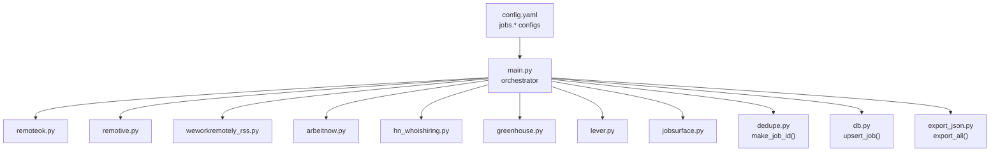

**Diagram sources**
- [main.py:127-297](file://worker/main.py#L127-L297)
- [remoteok.py:32-83](file://worker/collectors/jobs/remoteok.py#L32-L83)
- [remotive.py:21-74](file://worker/collectors/jobs/remotive.py#L21-L74)
- [weworkremotely_rss.py:22-85](file://worker/collectors/jobs/weworkremotely_rss.py#L22-L85)
- [arbeitnow.py:21-74](file://worker/collectors/jobs/arbeitnow.py#L21-L74)
- [hn_whoishiring.py:55-112](file://worker/collectors/jobs/hn_whoishiring.py#L55-L112)
- [greenhouse.py:22-77](file://worker/collectors/jobs/greenhouse.py#L22-L77)
- [lever.py:22-85](file://worker/collectors/jobs/lever.py#L22-L85)
- [jobsurface.py:108-141](file://worker/collectors/jobs/jobsurface.py#L108-L141)
- [dedupe.py:26-29](file://worker/scoring/dedupe.py#L26-L29)
- [db.py:183-230](file://worker/storage/db.py#L183-L230)
- [export_json.py:32-93](file://worker/storage/export_json.py#L32-L93)
- [config.yaml:170-268](file://worker/config.yaml#L170-L268)

**Section sources**
- [main.py:127-297](file://worker/main.py#L127-L297)
- [config.yaml:170-268](file://worker/config.yaml#L170-L268)

## Core Components
- Job collectors: Each job source implements a collect(cfg) function returning a list of normalized job items with standardized fields.
- Orchestrator: worker/main.py loads configuration, iterates enabled job sources, merges global job keywords into each collector's config, and persists results.
- Deduplication: worker/scoring/dedupe.py generates stable IDs and removes near-duplicates within batches.
- Storage and export: worker/storage/db.py persists jobs to SQLite; worker/storage/export_json.py writes docs/data/jobs.json and meta.json.

Key fields produced by collectors:
- id, title, company, url, source, location, posted_at, category, relevance_score, salary_range, tags

**Updated** All job items now include a standardized tags field (empty list by default) and consistent category/salary_range fields for improved metadata organization and schema validation.

**Section sources**
- [main.py:202-228](file://worker/main.py#L202-L228)
- [dedupe.py:26-29](file://worker/scoring/dedupe.py#L26-L29)
- [db.py:183-230](file://worker/storage/db.py#L183-L230)
- [export_json.py:110-116](file://worker/storage/export_json.py#L110-L116)

## Architecture Overview
The pipeline collects jobs from multiple sources, applies keyword filtering and deduplication, persists to SQLite, and exports JSON for the website.

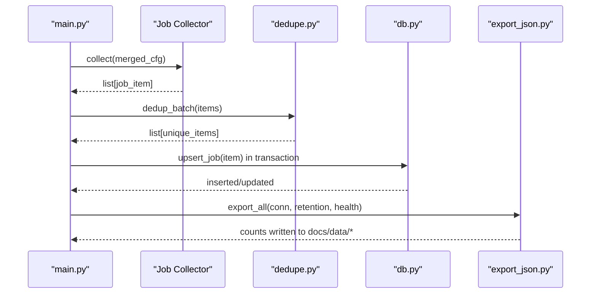

**Diagram sources**
- [main.py:202-228](file://worker/main.py#L202-L228)
- [main.py:231-237](file://worker/main.py#L231-L237)
- [main.py:248-253](file://worker/main.py#L248-L253)
- [main.py:255-262](file://worker/main.py#L255-L262)
- [dedupe.py:48-76](file://worker/scoring/dedupe.py#L48-L76)
- [db.py:183-230](file://worker/storage/db.py#L183-L230)
- [export_json.py:32-93](file://worker/storage/export_json.py#L32-L93)

## Detailed Component Analysis

### RemoteOK API
- Purpose: Public API for DevOps/SRE/Kubernetes jobs.
- Authentication: No authentication required; uses a standard User-Agent header.
- Rate limiting: Enforced via a 1-second sleep between requests.
- Data extraction:
  - Title, company, URL (fallback to apply_url), tags, date.
  - Filters by configured tags; defaults to ["devops"].
  - Normalizes missing locations to "Remote".
  - Salary field included if present.
- Posting date handling: Converts epoch timestamps to UTC ISO format; falls back to current time if invalid.
- Remote detection: Uses "Remote" as default when location is absent.
- Company parsing: Uses company field; no special parsing.
- Reliability: Logs failures and continues; robust to partial data.
- Schema compliance: Includes standardized tags field as empty string, category as empty string, and relevance_score as 0.0.

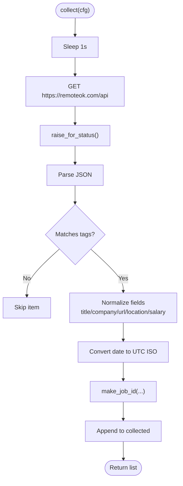

**Diagram sources**
- [remoteok.py:32-83](file://worker/collectors/jobs/remoteok.py#L32-L83)
- [dedupe.py:26-29](file://worker/scoring/dedupe.py#L26-L29)

**Section sources**
- [remoteok.py:18-20](file://worker/collectors/jobs/remoteok.py#L18-L20)
- [remoteok.py:40-44](file://worker/collectors/jobs/remoteok.py#L40-L44)
- [remoteok.py:55-58](file://worker/collectors/jobs/remoteok.py#L55-L58)
- [remoteok.py:62-63](file://worker/collectors/jobs/remoteok.py#L62-L63)
- [remoteok.py:23-29](file://worker/collectors/jobs/remoteok.py#L23-L29)
- [remoteok.py:60-76](file://worker/collectors/jobs/remoteok.py#L60-L76)

### Remotive API
- Purpose: Remote jobs via public API.
- Authentication: No authentication.
- Rate limiting: Uses a per-category limit parameter; no explicit delay enforced.
- Data extraction:
  - Title, company, URL, candidate_required_location, job_type, publication_date.
  - Filters by configured keywords; defaults to empty list.
  - Deduplicates by ID within the batch.
- Posting date handling: Uses publication_date; falls back to current time if missing.
- Remote detection: Uses candidate_required_location; defaults to "Remote" if missing.
- Company parsing: Uses company_name.
- Reliability: Logs per-category failures; continues with others.
- Schema compliance: Includes standardized tags field as empty string, category from job_type, and relevance_score as 0.0.

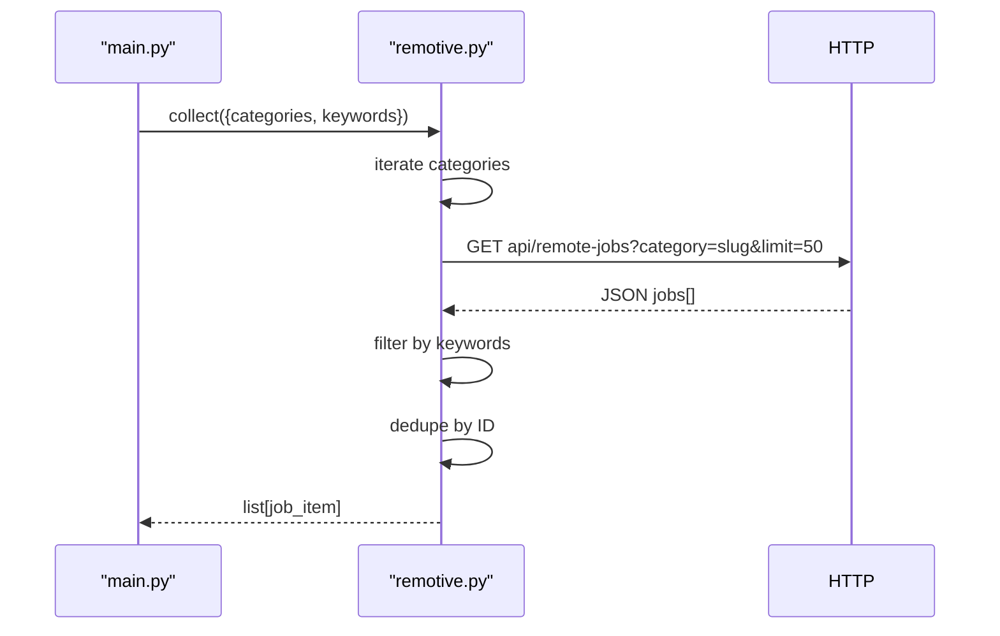

**Diagram sources**
- [remotive.py:21-74](file://worker/collectors/jobs/remotive.py#L21-L74)

**Section sources**
- [remotive.py:17-18](file://worker/collectors/jobs/remotive.py#L17-L18)
- [remotive.py:33-36](file://worker/collectors/jobs/remotive.py#L33-L36)
- [remotive.py:45-48](file://worker/collectors/jobs/remotive.py#L45-L48)
- [remotive.py:50-53](file://worker/collectors/jobs/remotive.py#L50-L53)
- [remotive.py:55-67](file://worker/collectors/jobs/remotive.py#L55-L67)

### WeWorkRemotely RSS
- Purpose: RSS feed for remote DevOps/Sysadmin jobs.
- Authentication: No authentication.
- Rate limiting: Not applicable for RSS; feedparser handles parsing.
- Data extraction:
  - Parses RSS entries; extracts title and link.
  - Extracts company from title format "Company: Job Title at Company".
  - Filters by configured keywords; defaults to empty list.
  - Sets location to "Remote".
  - Parses publication date; falls back to current time if unparsable.
- Posting date handling: Uses parsedate_to_datetime; falls back to current UTC.
- Remote detection: Hard-coded as "Remote".
- Company parsing: Splits title by ": " to extract company.
- Reliability: Logs bozo warnings; returns empty if bozo and no entries.
- Schema compliance: Includes standardized tags field as empty string, category as empty string, and relevance_score as 0.0.

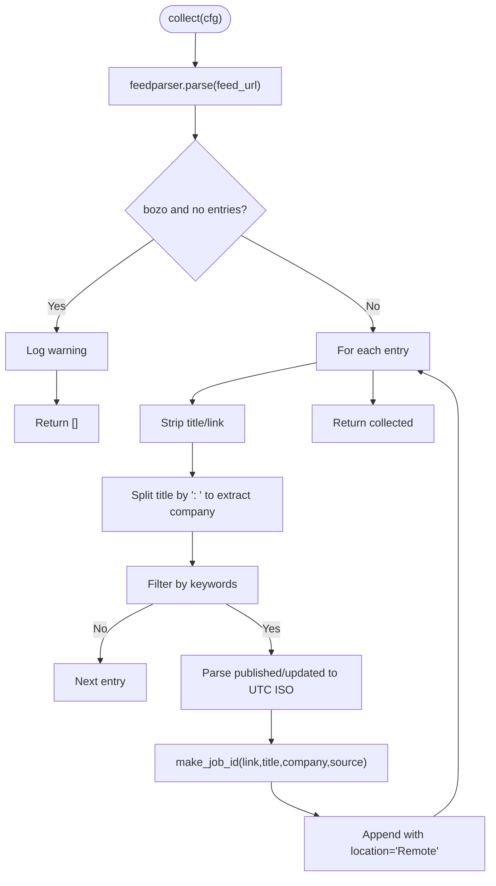

**Diagram sources**
- [weworkremotely_rss.py:22-85](file://worker/collectors/jobs/weworkremotely_rss.py#L22-L85)

**Section sources**
- [weworkremotely_rss.py:18-19](file://worker/collectors/jobs/weworkremotely_rss.py#L18-L19)
- [weworkremotely_rss.py:32-35](file://worker/collectors/jobs/weworkremotely_rss.py#L32-L35)
- [weworkremotely_rss.py:43-49](file://worker/collectors/jobs/weworkremotely_rss.py#L43-L49)
- [weworkremotely_rss.py:54-64](file://worker/collectors/jobs/weworkremotely_rss.py#L54-L64)
- [weworkremotely_rss.py:66-78](file://worker/collectors/jobs/weworkremotely_rss.py#L66-L78)

### ArbeitenNOW
- Purpose: Free public job board API.
- Authentication: No authentication.
- Rate limiting: No explicit delay; uses reasonable timeout.
- Data extraction:
  - Title, company_name, URL, tags, created_at.
  - Filters by configured tags; defaults to ["devops"].
  - Remote detection: Uses remote flag; otherwise location or empty.
  - Posting date handling: Converts Unix timestamp to UTC ISO; falls back to current time if missing/invalid.
- Remote detection: "Remote" if remote flag is true; otherwise location.
- Company parsing: Uses company_name.
- Reliability: Logs failures and continues.
- Schema compliance: Includes standardized tags field from API tags, category as empty string, and relevance_score as 0.0.

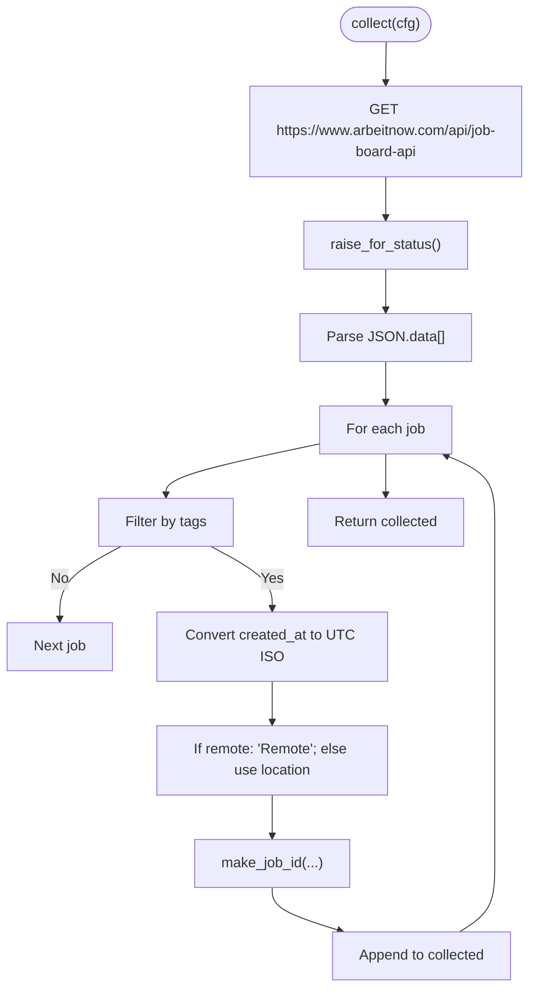

**Diagram sources**
- [arbeitnow.py:21-74](file://worker/collectors/jobs/arbeitnow.py#L21-L74)

**Section sources**
- [arbeitnow.py:17-18](file://worker/collectors/jobs/arbeitnow.py#L17-L18)
- [arbeitnow.py:30-32](file://worker/collectors/jobs/arbeitnow.py#L30-L32)
- [arbeitnow.py:41-43](file://worker/collectors/jobs/arbeitnow.py#L41-L43)
- [arbeitnow.py:46-53](file://worker/collectors/jobs/arbeitnow.py#L46-L53)
- [arbeitnow.py:55-67](file://worker/collectors/jobs/arbeitnow.py#L55-L67)

### Hacker News Who is Hiring
- Purpose: Parse the latest "Ask HN: Who is Hiring?" thread via Algolia API and extract job postings from comments.
- Authentication: No authentication.
- Rate limiting: No explicit delay; uses timeouts suitable for public APIs.
- Data extraction:
  - Searches for the latest thread by title query.
  - Parses children comments; attempts to extract company, title, location from the first line using a pipe-delimited pattern.
  - Filters by configured keywords; defaults to ["devops","sre","platform engineer","kubernetes","cloud"].
  - URL constructed from comment ID; posted_at from comment created_at.
- Remote detection: Defaults to "Remote" if location not extracted.
- Company parsing: First part of the split line; falls back to empty if not parsable.
- Reliability: Logs failure to find thread; logs extraction failures; continues.
- Schema compliance: Includes standardized tags field as empty string, category as empty string, and relevance_score as 0.0.

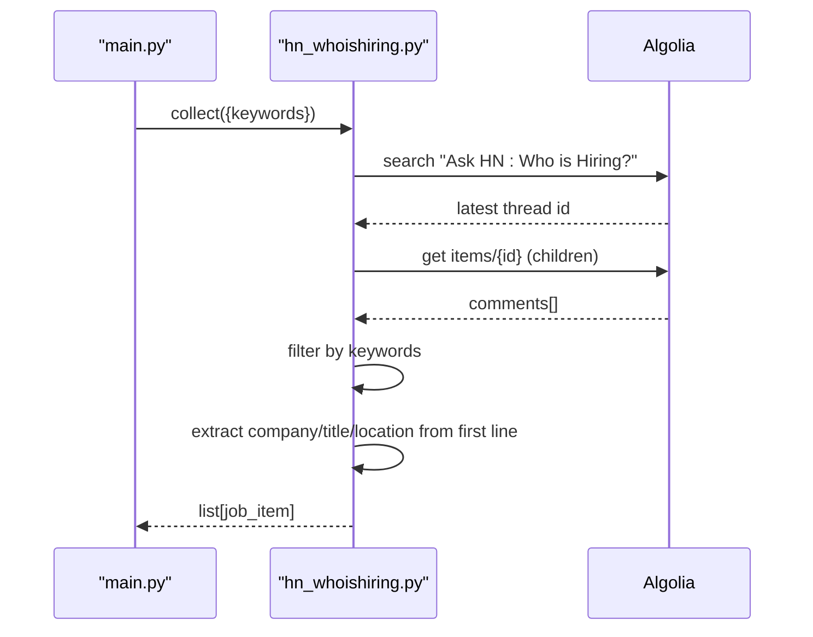

**Diagram sources**
- [hn_whoishiring.py:55-112](file://worker/collectors/jobs/hn_whoishiring.py#L55-L112)

**Section sources**
- [hn_whoishiring.py:18-20](file://worker/collectors/jobs/hn_whoishiring.py#L18-L20)
- [hn_whoishiring.py:23-36](file://worker/collectors/jobs/hn_whoishiring.py#L23-L36)
- [hn_whoishiring.py:64-67](file://worker/collectors/jobs/hn_whoishiring.py#L64-L67)
- [hn_whoishiring.py:69-72](file://worker/collectors/jobs/hn_whoishiring.py#L69-L72)
- [hn_whoishiring.py:75-82](file://worker/collectors/jobs/hn_whoishiring.py#L75-L82)
- [hn_whoishiring.py:84-87](file://worker/collectors/jobs/hn_whoishiring.py#L84-L87)
- [hn_whoishiring.py:90-105](file://worker/collectors/jobs/hn_whoishiring.py#L90-L105)

### Greenhouse API
- Purpose: Public job boards for companies using Greenhouse.
- Authentication: No authentication required.
- Rate limiting: No explicit delay; uses reasonable timeout.
- Data extraction:
  - Iterates configured company board slugs; builds URL per slug.
  - Handles 404 gracefully by logging and continuing.
  - Extracts title, absolute_url, nested location name, and updated_at.
  - Filters by configured keywords; defaults to empty list.
  - Company derived from slug (converted to title-case).
- Posting date handling: Uses updated_at; falls back to current time if missing.
- Remote detection: Uses nested location name; empty if missing.
- Company parsing: Slug-to-company conversion.
- Reliability: Logs per-board failures; continues with others.
- Schema compliance: Includes standardized tags field as empty string, category as empty string, and relevance_score as 0.0.

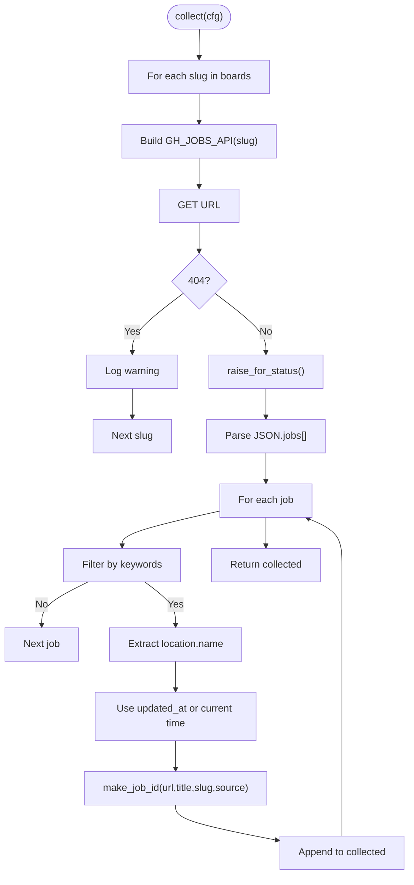

**Diagram sources**
- [greenhouse.py:22-77](file://worker/collectors/jobs/greenhouse.py#L22-L77)

**Section sources**
- [greenhouse.py:18-19](file://worker/collectors/jobs/greenhouse.py#L18-L19)
- [greenhouse.py:33-38](file://worker/collectors/jobs/greenhouse.py#L33-L38)
- [greenhouse.py:47-53](file://worker/collectors/jobs/greenhouse.py#L47-L53)
- [greenhouse.py:55-69](file://worker/collectors/jobs/greenhouse.py#L55-L69)

### Lever API
- Purpose: Public job boards for companies using Lever.
- Authentication: No authentication required.
- Rate limiting: No explicit delay; uses reasonable timeout.
- Data extraction:
  - Iterates configured company slugs; builds URL per slug.
  - Handles 404 gracefully by logging and continuing.
  - Extracts text (title), hostedUrl/applyUrl (URL), categories (location/team/allLocations).
  - Filters by configured keywords; defaults to empty list.
  - Company derived from slug (converted to title-case).
- Posting date handling: Converts createdAt (ms) to UTC ISO; falls back to current time if missing.
- Remote detection: Uses location string or joined list of locations.
- Company parsing: Slug-to-company conversion.
- Reliability: Logs per-board failures; continues with others.
- Schema compliance: Includes standardized tags field as empty string, category from team field, and relevance_score as 0.0.

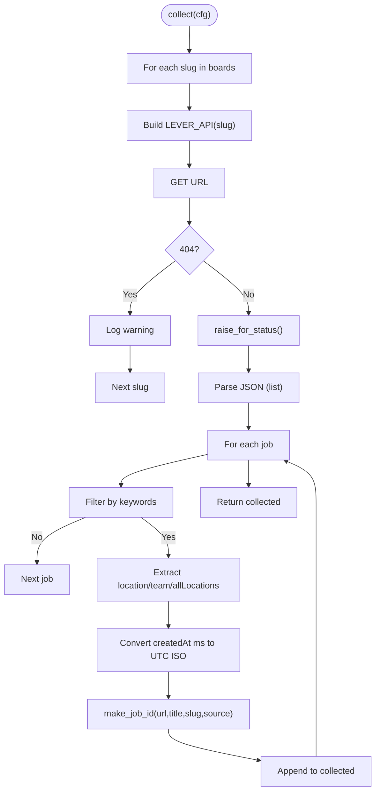

**Diagram sources**
- [lever.py:22-85](file://worker/collectors/jobs/lever.py#L22-L85)

**Section sources**
- [lever.py:18-19](file://worker/collectors/jobs/lever.py#L18-L19)
- [lever.py:33-38](file://worker/collectors/jobs/lever.py#L33-L38)
- [lever.py:50-57](file://worker/collectors/jobs/lever.py#L50-L57)
- [lever.py:59-77](file://worker/collectors/jobs/lever.py#L59-L77)

### Job Surface
- Purpose: Weekly DevOps and Cloud job listings from the Job Surface newsletter (jobsurface.com).
- Authentication: No authentication required.
- Rate limiting: No explicit delay; uses 15-second timeout for both sitemap and post requests.
- Data extraction:
  - Scrapes the latest weekly post by parsing the sitemap.xml for the most recent devops-jobs-* URL.
  - Extracts job listings from HTML list items using regex pattern matching.
  - Supports both "Company is hiring a Title Location: Location" and "Company is hiring a Title Remote Location: Location" formats.
  - Extracts company name, position title, and location (defaults to "Remote" when not specified).
  - Attempts to find apply URLs from anchor tags within job listings.
- Posting date handling: Sets current UTC time as posted_at for all collected jobs.
- Remote detection: Automatically detects "Remote" when "Remote Location:" pattern is not present.
- Company parsing: Extracts company name from the beginning of the job description text.
- Reliability: Gracefully handles missing sitemaps, parsing failures, and missing apply links; logs warnings and continues.
- Schema compliance: Includes standardized tags field as empty string, category as empty string, and relevance_score as 0.0.
- Configuration: Supports max_items parameter to limit collection volume (default: 200).

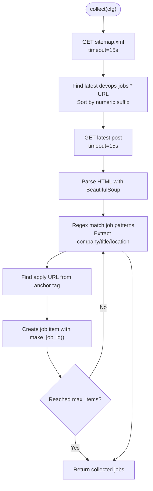

**Diagram sources**
- [jobsurface.py:27-46](file://worker/collectors/jobs/jobsurface.py#L27-L46)
- [jobsurface.py:108-141](file://worker/collectors/jobs/jobsurface.py#L108-L141)
- [jobsurface.py:49-105](file://worker/collectors/jobs/jobsurface.py#L49-L105)

**Section sources**
- [jobsurface.py:1-7](file://worker/collectors/jobs/jobsurface.py#L1-L7)
- [jobsurface.py:22-24](file://worker/collectors/jobs/jobsurface.py#L22-L24)
- [jobsurface.py:27-46](file://worker/collectors/jobs/jobsurface.py#L27-L46)
- [jobsurface.py:49-105](file://worker/collectors/jobs/jobsurface.py#L49-L105)
- [jobsurface.py:108-141](file://worker/collectors/jobs/jobsurface.py#L108-L141)

## Dependency Analysis
- Configuration-driven: Each collector reads its own section from config.yaml (e.g., jobs.remoteok, jobs.remotive, jobs.weworkremotely, jobs.arbeitnow, jobs.hn_whoishiring, jobs.greenhouse, jobs.lever, jobs.jobsurface).
- Global job keywords: The orchestrator merges the global jobs.keywords into each collector's config before calling collect().
- Deduplication: Stable IDs are generated using make_job_id(url, title, company, source); fuzzy dedup is applied within a batch.
- Persistence: upsert_job inserts or updates jobs in SQLite; export_all writes JSON files.
- Schema validation: Comprehensive validation ensures all job items contain required fields including standardized tags array.

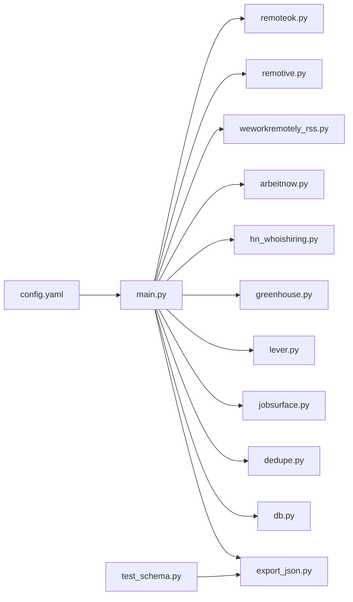

**Diagram sources**
- [config.yaml:170-268](file://worker/config.yaml#L170-L268)
- [main.py:202-228](file://worker/main.py#L202-L228)
- [dedupe.py:26-29](file://worker/scoring/dedupe.py#L26-L29)
- [db.py:183-230](file://worker/storage/db.py#L183-L230)
- [export_json.py:32-93](file://worker/storage/export_json.py#L32-L93)
- [test_schema.py:15-16](file://tests/test_schema.py#L15-L16)

**Section sources**
- [config.yaml:170-268](file://worker/config.yaml#L170-L268)
- [main.py:202-228](file://worker/main.py#L202-L228)
- [dedupe.py:26-29](file://worker/scoring/dedupe.py#L26-L29)
- [db.py:183-230](file://worker/storage/db.py#L183-L230)
- [export_json.py:32-93](file://worker/storage/export_json.py#L32-L93)
- [test_schema.py:15-16](file://tests/test_schema.py#L15-L16)

## Performance Considerations
- Rate limiting:
  - RemoteOK enforces a 1-second delay between requests.
  - Other sources do not enforce delays; consider adding delays or retries if encountering throttling.
  - Job Surface uses 15-second timeouts for both sitemap and post requests to respect server resources.
- Timeouts: All HTTP calls use conservative timeouts; adjust as needed for network conditions.
- Deduplication cost: Fuzzy dedup uses rapidfuzz; acceptable for typical job volumes.
- Export size: Retention window controlled by config; reduce retention_days to limit export size.
- Schema validation overhead: Minimal performance impact from comprehensive field validation.
- HTML parsing: Job Surface uses BeautifulSoup4 and lxml for efficient HTML parsing; ensure sufficient memory for large posts.

## Troubleshooting Guide
- API changes:
  - If response shapes change, collectors should guard against missing keys and fall back to safe defaults (e.g., current time for dates, "Remote" for locations).
  - Add logging around parsing steps to capture unexpected structures.
- Authentication:
  - All job sources documented here are public and require no authentication; if a previously public endpoint becomes private, replace with an authenticated client or switch to an alternative source.
- Rate limiting:
  - Monitor logs for HTTP 429/5xx responses; introduce delays or exponential backoff if observed.
  - Job Surface respects server resources with appropriate timeouts.
- Data quality:
  - Validate presence of required fields (title, url) before appending items.
  - Use make_job_id to prevent duplicates; rely on fuzzy dedup for near-duplicates.
  - Ensure tags field is always an array type for schema compliance.
- Health monitoring:
  - The orchestrator records source_health for jobs; inspect logs for "jobs:<name>: ..." errors.
- Schema validation:
  - All job items must include: id, title, company, url, source, posted_at.
  - Tags field must be an array type; defaults to empty array if missing.
  - Category and salary_range fields should be present with appropriate values.
- Job Surface specific issues:
  - If sitemap parsing fails, the collector will log a warning and skip collection for that run.
  - If HTML parsing doesn't find structured listings, the collector will attempt to log any Airtable links found.
  - The max_items parameter can be adjusted to control collection volume.

**Section sources**
- [remoteok.py:78-81](file://worker/collectors/jobs/remoteok.py#L78-L81)
- [remotive.py:69-70](file://worker/collectors/jobs/remotive.py#L69-L70)
- [arbeitnow.py:69-70](file://worker/collectors/jobs/arbeitnow.py#L69-L70)
- [greenhouse.py:35-37](file://worker/collectors/jobs/greenhouse.py#L35-L37)
- [lever.py:35-37](file://worker/collectors/jobs/lever.py#L35-L37)
- [jobsurface.py:44-46](file://worker/collectors/jobs/jobsurface.py#L44-L46)
- [jobsurface.py:127-129](file://worker/collectors/jobs/jobsurface.py#L127-L129)
- [jobsurface.py:134-139](file://worker/collectors/jobs/jobsurface.py#L134-L139)
- [main.py:209-212](file://worker/main.py#L209-L212)
- [test_schema.py:113-135](file://tests/test_schema.py#L113-L135)

## Conclusion
Each job source follows a consistent pattern: fetch data from a public endpoint or feed, normalize fields, apply keyword filters, and produce a standardized job item with enhanced metadata organization. The orchestrator centralizes configuration, deduplication, persistence, and export. Robustness is achieved through defensive parsing, fallbacks for missing data, and per-source error logging. The standardized tags field and improved metadata structure provide better schema validation and data consistency across all job sources. 

**Updated** The addition of Job Surface expands our job sourcing capabilities by tapping into the weekly DevOps and Cloud job listings from the Job Surface newsletter, providing an additional valuable source of specialized technology positions. The new collector demonstrates the extensibility of the pipeline and showcases how different data formats (newsletter HTML vs. API endpoints) can be integrated seamlessly into the unified job collection framework.

For future enhancements, consider adding retry/backoff, configurable delays, and schema validation for incoming payloads. The Job Surface collector serves as an excellent example of how to handle HTML-based job listings with regex pattern matching and graceful fallback mechanisms.