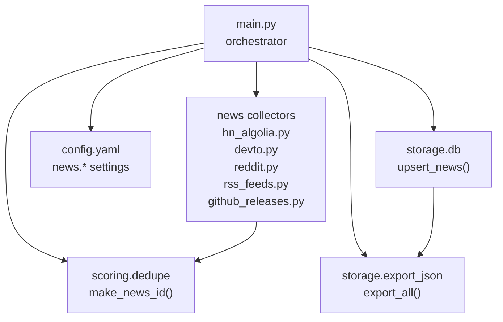
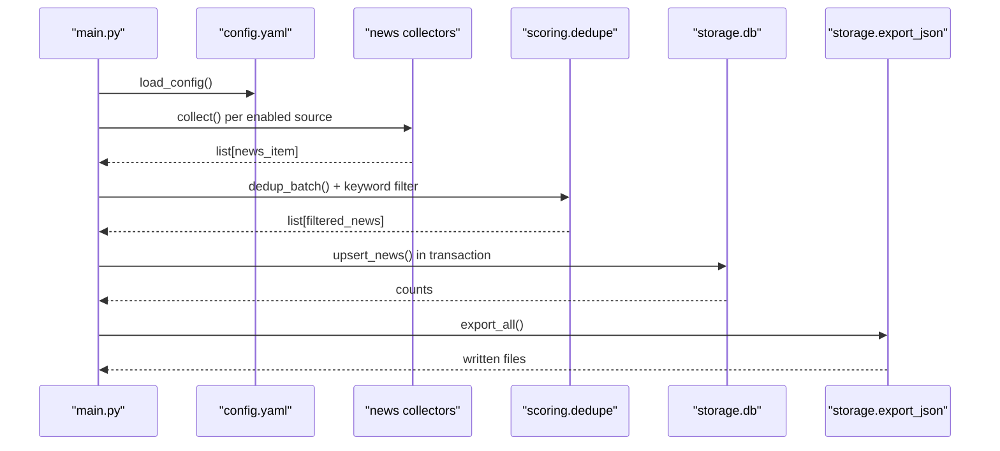
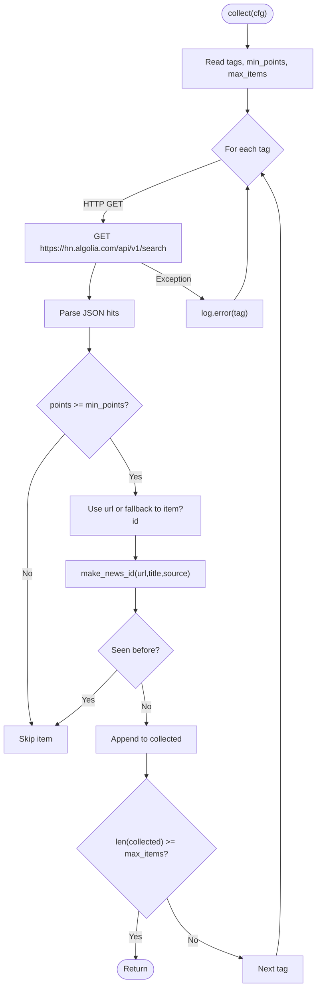
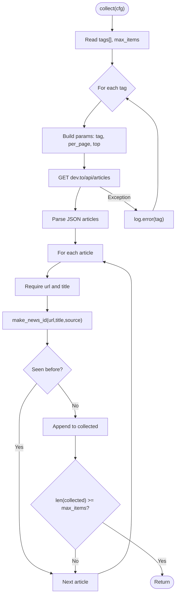
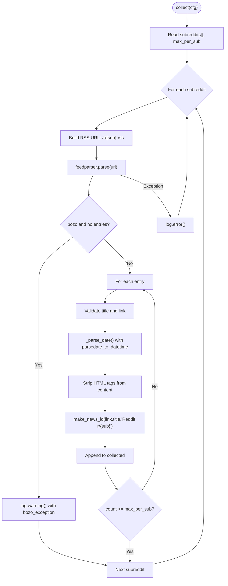
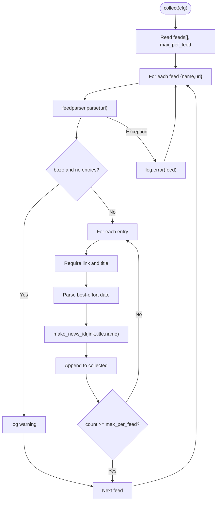
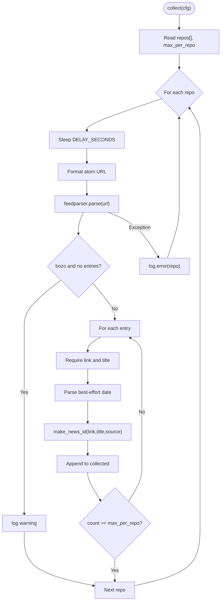
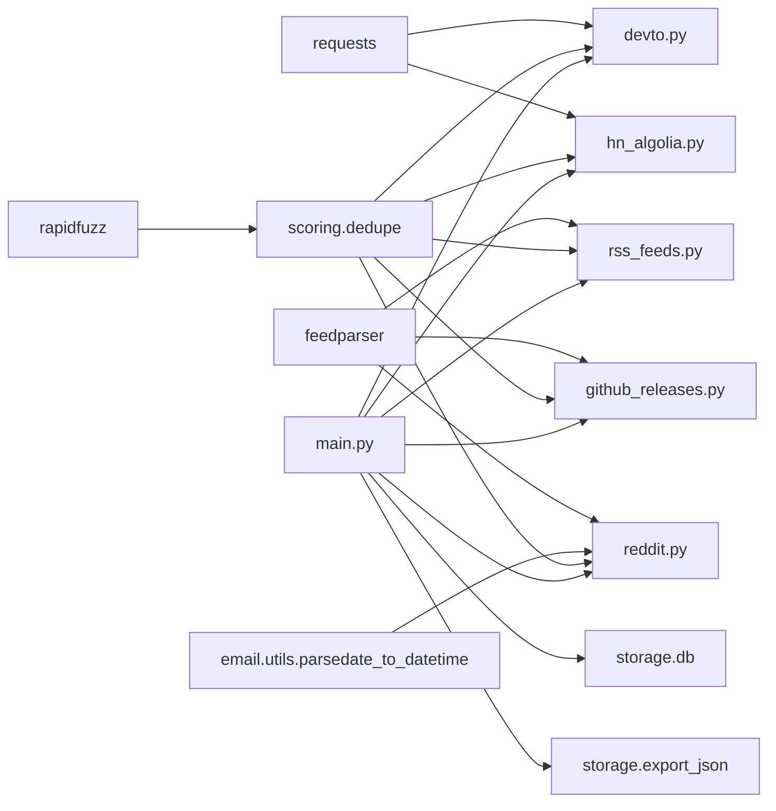
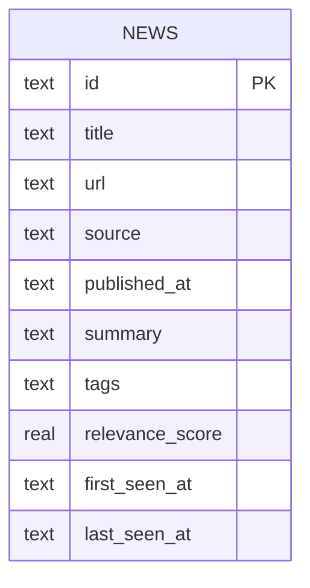

# News Sources

<cite>
**Referenced Files in This Document**
- [main.py](file://worker/main.py)
- [config.yaml](file://worker/config.yaml)
- [devto.py](file://worker/collectors/news/devto.py)
- [github_releases.py](file://worker/collectors/news/github_releases.py)
- [hn_algolia.py](file://worker/collectors/news/hn_algolia.py)
- [reddit.py](file://worker/collectors/news/reddit.py)
- [rss_feeds.py](file://worker/collectors/news/rss_feeds.py)
- [dedupe.py](file://worker/scoring/dedupe.py)
- [db.py](file://worker/storage/db.py)
- [export_json.py](file://worker/storage/export_json.py)
- [requirements.txt](file://worker/requirements.txt)
</cite>

## Update Summary
**Changes Made**
- Updated Reddit section to reflect complete rewrite from JSON API to RSS feeds
- Added new date parsing improvements with email.utils.parsedate_to_datetime
- Enhanced error handling with bozo exception checking
- Improved content extraction with HTML tag stripping
- Updated configuration references to reflect new Reddit implementation
- Revised troubleshooting guidance for Reddit RSS feed issues

## Table of Contents
1. [Introduction](#introduction)
2. [Project Structure](#project-structure)
3. [Core Components](#core-components)
4. [Architecture Overview](#architecture-overview)
5. [Detailed Component Analysis](#detailed-component-analysis)
6. [Dependency Analysis](#dependency-analysis)
7. [Performance Considerations](#performance-considerations)
8. [Troubleshooting Guide](#troubleshooting-guide)
9. [Conclusion](#conclusion)
10. [Appendices](#appendices)

## Introduction
This document explains how the news collection sources are implemented and configured. It covers five distinct sources:
- Hacker News via Algolia
- Dev.to articles
- Reddit posts (RSS feeds)
- RSS/Atom feeds
- GitHub releases

For each source, we describe authentication, rate limiting, data transformation, error handling, and operational reliability. We also provide practical guidance for adding new RSS feeds, customizing Dev.to queries, and adapting to Reddit API changes. Finally, we outline performance optimization and caching strategies.

## Project Structure
The news collectors live under worker/collectors/news and are orchestrated by the main pipeline in worker/main.py. Configuration is centralized in worker/config.yaml. Deduplication and ID generation are handled in worker/scoring/dedupe.py. Persistence and exports are implemented in worker/storage/db.py and worker/storage/export_json.py.

**Diagram sources**
- [main.py:127-171](file://worker/main.py#L127-L171)
- [config.yaml:77-169](file://worker/config.yaml#L77-L169)
- [dedupe.py:20-23](file://worker/scoring/dedupe.py#L20-L23)
- [db.py:116-161](file://worker/storage/db.py#L116-L161)
- [export_json.py:32-92](file://worker/storage/export_json.py#L32-L92)

**Section sources**
- [main.py:42-48](file://worker/main.py#L42-L48)
- [config.yaml:77-169](file://worker/config.yaml#L77-L169)

## Core Components
- Hacker News (Algolia): Queries stories matching configured tags and filters by minimum points. Uses a stable ID generator and deduplication.
- Dev.to: Fetches articles by tags with top timeframe filtering. Applies deduplication and transforms to normalized fields.
- Reddit: **Updated** Pulls hot posts from subreddits using RSS feeds (.rss endpoint) via feedparser with improved date parsing and HTML content extraction.
- RSS/Atom: Generic collector using feedparser with robust date parsing and per-feed caps.
- GitHub Releases: Reads public Atom feeds for repositories with a small polite delay between requests.

**Section sources**
- [hn_algolia.py:21-82](file://worker/collectors/news/hn_algolia.py#L21-L82)
- [devto.py:21-72](file://worker/collectors/news/devto.py#L21-L72)
- [reddit.py:19-20](file://worker/collectors/news/reddit.py#L19-L20)
- [reddit.py:41-47](file://worker/collectors/news/reddit.py#L41-L47)
- [reddit.py:51-71](file://worker/collectors/news/reddit.py#L51-L71)
- [reddit.py:74-75](file://worker/collectors/news/reddit.py#L74-L75)
- [rss_feeds.py:38-89](file://worker/collectors/news/rss_feeds.py#L38-L89)
- [github_releases.py:23-86](file://worker/collectors/news/github_releases.py#L23-L86)

## Architecture Overview
The pipeline loads configuration, collects from enabled news sources, deduplicates, scores, persists to SQLite, exports JSON, and optionally publishes updates.

**Diagram sources**
- [main.py:127-171](file://worker/main.py#L127-L171)
- [config.yaml:77-169](file://worker/config.yaml#L77-L169)
- [dedupe.py:48-76](file://worker/scoring/dedupe.py#L48-L76)
- [db.py:116-161](file://worker/storage/db.py#L116-L161)
- [export_json.py:32-92](file://worker/storage/export_json.py#L32-L92)

## Detailed Component Analysis

### Hacker News Algolia
- Purpose: Retrieve stories matching tags and minimum points threshold.
- Authentication: None; public endpoint.
- Rate limits: No explicit rate limit observed in code; requests are made with timeouts and exceptions are logged.
- Data transformation:
  - Uses a stable ID derived from URL/title/source.
  - Falls back to a timestamp if created_at is missing.
  - Ensures uniqueness via a seen set before appending.
- Error handling: Exceptions per tag are caught and logged; collection continues.
- Reliability: Per-tag loop with early exit when max_items is reached.

**Diagram sources**
- [hn_algolia.py:21-82](file://worker/collectors/news/hn_algolia.py#L21-L82)
- [dedupe.py:20-23](file://worker/scoring/dedupe.py#L20-L23)

**Section sources**
- [hn_algolia.py:17-18](file://worker/collectors/news/hn_algolia.py#L17-L18)
- [hn_algolia.py:35-41](file://worker/collectors/news/hn_algolia.py#L35-L41)
- [hn_algolia.py:46-57](file://worker/collectors/news/hn_algolia.py#L46-L57)
- [hn_algolia.py:74-75](file://worker/collectors/news/hn_algolia.py#L74-L75)

### Dev.to
- Purpose: Fetch articles by tags with top timeframe filtering.
- Authentication: None; public endpoint.
- Rate limits: per_page capped to 30; requests timeout after 15 seconds; exceptions logged.
- Data transformation:
  - Normalizes title and summary length.
  - Uses a stable ID combining URL/title/source.
  - Published timestamp fallback to current UTC if missing.
- Error handling: Tag-scoped try/catch logs failures and continues.

**Diagram sources**
- [devto.py:21-72](file://worker/collectors/news/devto.py#L21-L72)
- [dedupe.py:20-23](file://worker/scoring/dedupe.py#L20-L23)

**Section sources**
- [devto.py:17-18](file://worker/collectors/news/devto.py#L17-L18)
- [devto.py:33-38](file://worker/collectors/news/devto.py#L33-L38)
- [devto.py:42-63](file://worker/collectors/news/devto.py#L42-L63)
- [devto.py:67-68](file://worker/collectors/news/devto.py#L67-L68)

### Reddit
- Purpose: **Updated** Fetch hot posts from subreddits using RSS feeds (.rss endpoint) via feedparser.
- Authentication: None; RSS feeds are public.
- Rate limits: **Updated** No request delay required as RSS feeds are used instead of JSON API.
- Data transformation:
  - **Updated** Builds item ID from URL/title/source using feedparser entries.
  - **Updated** Improved date parsing using email.utils.parsedate_to_datetime for better timezone handling.
  - **Updated** Extracts short summaries by stripping HTML tags from content.
  - **Updated** Uses Reddit RSS endpoint: https://www.reddit.com/r/{sub}/.rss
- Error handling: **Updated** Enhanced with bozo exception checking and detailed error logging.
- Reliability: **Updated** RSS-based approach is more reliable than JSON API which now blocks unauthenticated requests.

**Diagram sources**
- [reddit.py:41-95](file://worker/collectors/news/reddit.py#L41-L95)
- [reddit.py:23-38](file://worker/collectors/news/reddit.py#L23-L38)
- [dedupe.py:20-23](file://worker/scoring/dedupe.py#L20-L23)

**Section sources**
- [reddit.py:19-20](file://worker/collectors/news/reddit.py#L19-L20)
- [reddit.py:41-47](file://worker/collectors/news/reddit.py#L41-L47)
- [reddit.py:51-71](file://worker/collectors/news/reddit.py#L51-L71)
- [reddit.py:74-75](file://worker/collectors/news/reddit.py#L74-L75)

### RSS Feeds
- Purpose: Generic RSS/Atom ingestion via feedparser.
- Authentication: None; supports any public feed.
- Rate limits: No built-in delays; bozo warnings are logged.
- Data transformation:
  - Robust date parsing across multiple attributes and formats.
  - Item ID built from link/title/source.
- Error handling: Feed-scoped try/catch logs failures and continues.

**Diagram sources**
- [rss_feeds.py:38-89](file://worker/collectors/news/rss_feeds.py#L38-L89)
- [rss_feeds.py:19-35](file://worker/collectors/news/rss_feeds.py#L19-L35)
- [dedupe.py:20-23](file://worker/scoring/dedupe.py#L20-L23)

**Section sources**
- [rss_feeds.py:19-35](file://worker/collectors/news/rss_feeds.py#L19-L35)
- [rss_feeds.py:48-57](file://worker/collectors/news/rss_feeds.py#L48-L57)
- [rss_feeds.py:60-78](file://worker/collectors/news/rss_feeds.py#L60-L78)
- [rss_feeds.py:84-85](file://worker/collectors/news/rss_feeds.py#L84-L85)

### GitHub Releases
- Purpose: Monitor public releases for repositories via Atom feeds.
- Authentication: None; public Atom feeds.
- Rate limits: Polite delay between requests.
- Data transformation:
  - Uses updated or published timestamps; falls back to current UTC.
  - Title prefixed with owner/repo for clarity.
  - Item ID includes source name derived from owner.
- Error handling: Repo-scoped try/catch logs failures and continues.

**Diagram sources**
- [github_releases.py:23-86](file://worker/collectors/news/github_releases.py#L23-L86)
- [dedupe.py:20-23](file://worker/scoring/dedupe.py#L20-L23)

**Section sources**
- [github_releases.py:19-20](file://worker/collectors/news/github_releases.py#L19-L20)
- [github_releases.py:33-42](file://worker/collectors/news/github_releases.py#L33-L42)
- [github_releases.py:47-78](file://worker/collectors/news/github_releases.py#L47-L78)
- [github_releases.py:81-82](file://worker/collectors/news/github_releases.py#L81-L82)

## Dependency Analysis
- Collector modules depend on:
  - requests for HTTP calls
  - feedparser for RSS/Atom parsing
  - **Updated** email.utils.parsedate_to_datetime for improved date parsing
  - rapidfuzz for fuzzy deduplication
  - scoring.dedupe for stable IDs and dedup logic
- The orchestrator depends on:
  - config.yaml for source enablement and parameters
  - storage modules for persistence and export

**Diagram sources**
- [requirements.txt:1-11](file://worker/requirements.txt#L1-L11)
- [devto.py:11](file://worker/collectors/news/devto.py#L11)
- [hn_algolia.py:11](file://worker/collectors/news/hn_algolia.py#L11)
- [rss_feeds.py:12](file://worker/collectors/news/rss_feeds.py#L12)
- [github_releases.py:13](file://worker/collectors/news/github_releases.py#L13)
- [reddit.py:11](file://worker/collectors/news/reddit.py#L11)
- [reddit.py:9](file://worker/collectors/news/reddit.py#L9)
- [dedupe.py:12](file://worker/scoring/dedupe.py#L12)
- [main.py:42-48](file://worker/main.py#L42-L48)
- [db.py:116-161](file://worker/storage/db.py#L116-L161)
- [export_json.py:14](file://worker/storage/export_json.py#L14)

**Section sources**
- [requirements.txt:1-11](file://worker/requirements.txt#L1-L11)
- [main.py:42-48](file://worker/main.py#L42-L48)

## Performance Considerations
- HTTP timeouts: All HTTP calls use a 15-second timeout to prevent stalls.
- Request pacing:
  - **Updated** Reddit: No delay required as RSS feeds are used instead of JSON API.
  - GitHub Releases: Fixed delay between requests to be respectful to the API.
- Batch limits:
  - Dev.to: per_page capped to 30; HN Algolia: dynamic per-page based on max_items and tag count.
  - RSS/GitHub/Reddit: per-source or per-feed caps to bound work.
- Deduplication:
  - In-memory seen set plus fuzzy title dedup to reduce repeated items.
- Storage:
  - SQLite WAL mode and indexes improve write/read performance.
- Export:
  - Single-pass export to JSON avoids redundant reads.

## Troubleshooting Guide
- Symptom: Source fails mid-run
  - Action: Review logs around the failing source; each collector logs exceptions per tag/subreddit/feed/repo.
  - Evidence: Try/catch blocks in each collector log errors and continue.
- Symptom: Missing items from a feed
  - Action: Check bozo warnings; some feeds may be malformed.
  - Evidence: RSS and GitHub collectors warn on bozo conditions.
- Symptom: **Updated** Reddit RSS feed issues
  - Action: Check if subreddit RSS endpoint is accessible; verify bozo_exception logs for malformed XML.
  - Evidence: Reddit collector now checks bozo flag and logs detailed exceptions.
- Symptom: **Updated** HTML content appears in Reddit summaries
  - Action: Ensure HTML tag stripping is working; check regex pattern in content extraction.
  - Evidence: Reddit collector strips HTML tags using re.sub(r"<[^>]+>", "", content).
- Symptom: **Updated** Date parsing issues with Reddit items
  - Action: Verify timezone handling; check if parsedate_to_datetime resolves timezone offsets.
  - Evidence: Reddit uses email.utils.parsedate_to_datetime for better timezone parsing.
- Symptom: Too many duplicates
  - Action: Adjust fuzzy threshold or rely on stable IDs; ensure dedup_batch is active.
  - Evidence: Dedup logic uses a stable hash and fuzzy matching.
- Symptom: Slow runs
  - Action: Reduce max_items/max_per_* or increase delays for Reddit/GitHub.
  - Evidence: Configurable caps and delays are exposed in config.yaml.

**Section sources**
- [devto.py:67-68](file://worker/collectors/news/devto.py#L67-L68)
- [hn_algolia.py:74-75](file://worker/collectors/news/hn_algolia.py#L74-L75)
- [reddit.py:55-56](file://worker/collectors/news/reddit.py#L55-L56)
- [reddit.py:91-92](file://worker/collectors/news/reddit.py#L91-L92)
- [rss_feeds.py:55-56](file://worker/collectors/news/rss_feeds.py#L55-L56)
- [github_releases.py:40-42](file://worker/collectors/news/github_releases.py#L40-L42)
- [dedupe.py:48-76](file://worker/scoring/dedupe.py#L48-L76)

## Conclusion
The news collection subsystem is modular, configurable, and resilient. Each source adheres to public APIs or standards, applies robust error handling, and integrates cleanly with deduplication and persistence. **Updated** The Reddit collector has been completely rewritten to use RSS feeds instead of the JSON API, improving reliability and performance. Configuration allows tuning for performance and reliability without code changes.

## Appendices

### Practical Configuration Recipes
- Add a new RSS feed
  - Steps:
    - Add a new entry to news.rss_feeds.feeds with name and url.
    - Optionally adjust max_items_per_feed.
  - Reference: [config.yaml:117-148](file://worker/config.yaml#L117-L148)
- Customize Dev.to queries
  - Steps:
    - Modify news.devto.tags to include desired tag slugs.
    - Adjust max_items to control volume.
  - Reference: [config.yaml:93-102](file://worker/config.yaml#L93-L102)
- **Updated** Configure Reddit RSS feeds
  - Steps:
    - Modify news.reddit.subreddits to include desired subreddit names.
    - Adjust max_items_per_sub to control volume per subreddit.
    - Note: No delay_seconds needed as RSS feeds are used instead of JSON API.
  - Reference: [config.yaml:104-115](file://worker/config.yaml#L104-L115)
- Handle Reddit API changes
  - Steps:
    - **Updated** Reddit now uses RSS feeds (.rss endpoint) instead of JSON API.
    - If RSS feed is unavailable, check subreddit accessibility and bozo_exception logs.
    - No delay_seconds configuration needed.
  - Reference: [reddit.py:19-20](file://worker/collectors/news/reddit.py#L19-L20), [reddit.py:55-56](file://worker/collectors/news/reddit.py#L55-L56)

### Authentication and Rate Limits Summary
- Hacker News (Algolia): No auth; no explicit rate limit observed.
- Dev.to: No auth; per_page capped; timeout enforced.
- **Updated** Reddit: **No auth**; RSS feeds used instead of JSON API; no delay required.
- RSS/Atom: No auth; relies on feedparser robustness.
- GitHub Releases: No auth; polite delay between requests.

**Section sources**
- [hn_algolia.py:42](file://worker/collectors/news/hn_algolia.py#L42)
- [devto.py:37-38](file://worker/collectors/news/devto.py#L37-L38)
- [reddit.py:19-20](file://worker/collectors/news/reddit.py#L19-L20)
- [reddit.py:38](file://worker/collectors/news/reddit.py#L38)
- [github_releases.py:37-38](file://worker/collectors/news/github_releases.py#L37-L38)
- [github_releases.py:20](file://worker/collectors/news/github_releases.py#L20)

### Data Model for News Items

**Diagram sources**
- [db.py:26-37](file://worker/storage/db.py#L26-L37)