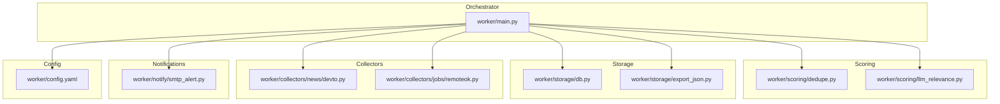
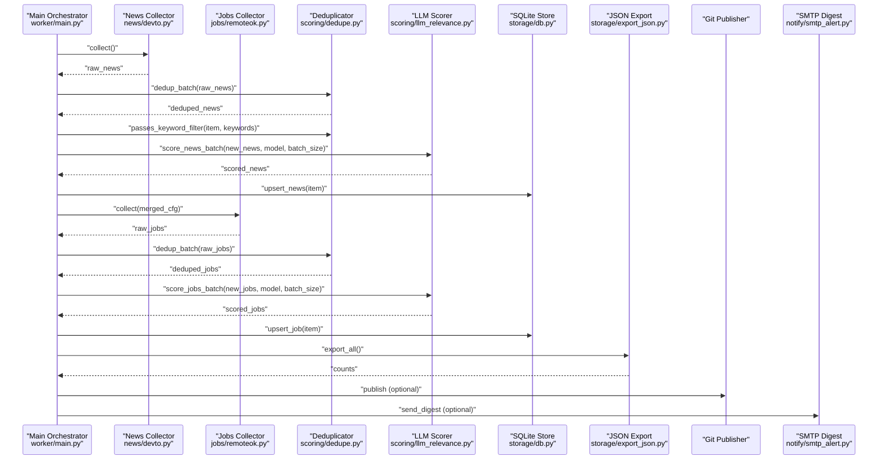
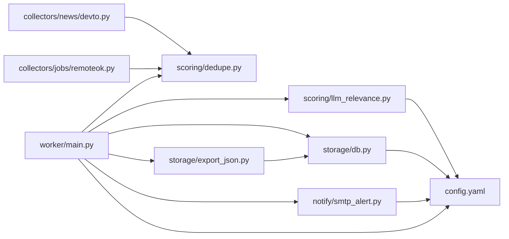
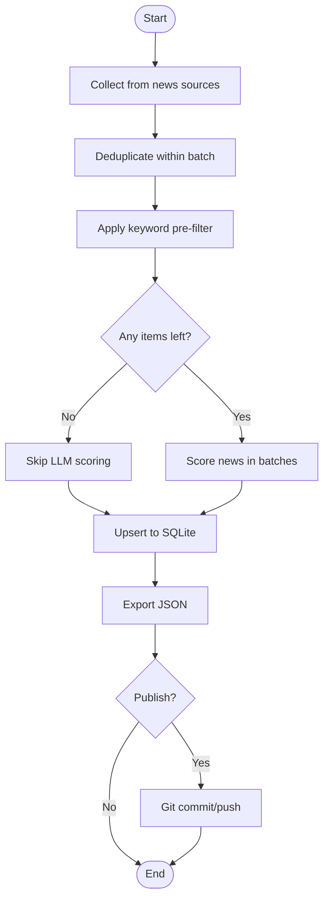
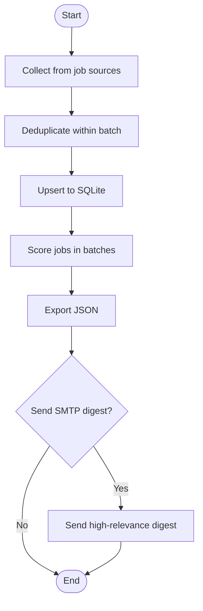

# Content Processing Pipeline

<cite>
**Referenced Files in This Document**
- [main.py](file://worker/main.py)
- [dedupe.py](file://worker/scoring/dedupe.py)
- [llm_relevance.py](file://worker/scoring/llm_relevance.py)
- [config.yaml](file://worker/config.yaml)
- [db.py](file://worker/storage/db.py)
- [export_json.py](file://worker/storage/export_json.py)
- [smtp_alert.py](file://worker/notify/smtp_alert.py)
- [devto.py](file://worker/collectors/news/devto.py)
- [remoteok.py](file://worker/collectors/jobs/remoteok.py)
- [docker-compose.yml](file://worker/docker-compose.yml)
</cite>

## Table of Contents
1. [Introduction](#introduction)
2. [Project Structure](#project-structure)
3. [Core Components](#core-components)
4. [Architecture Overview](#architecture-overview)
5. [Detailed Component Analysis](#detailed-component-analysis)
6. [Dependency Analysis](#dependency-analysis)
7. [Performance Considerations](#performance-considerations)
8. [Troubleshooting Guide](#troubleshooting-guide)
9. [Conclusion](#conclusion)
10. [Appendices](#appendices)

## Introduction
This document explains the content processing pipeline that collects, deduplicates, scores, persists, exports, and optionally publishes curated DevOps and AI-related news and jobs. It focuses on three pillars:
- Keyword pre-filtering to reduce unnecessary LLM calls
- Fuzzy deduplication to remove near-duplicates within batches
- LLM-based relevance scoring via OpenRouter to assign scores, summaries, and tags (news) or categories (jobs)

The pipeline is orchestrated by a single worker entrypoint that coordinates collection, deduplication, scoring, persistence, export, optional Git publishing, and optional SMTP digest delivery.

## Project Structure
The pipeline spans several modules:
- Orchestrator: main pipeline orchestration
- Scoring: deduplication and LLM relevance scoring
- Storage: SQLite schema, transactions, and JSON export
- Collectors: news and jobs sources
- Notifications: optional SMTP digest
- Configuration: YAML-driven configuration for sources, keywords, and LLM settings

**Diagram sources**
- [main.py:127-297](file://worker/main.py#L127-L297)
- [dedupe.py:1-90](file://worker/scoring/dedupe.py#L1-L90)
- [llm_relevance.py:1-178](file://worker/scoring/llm_relevance.py#L1-L178)
- [db.py:1-278](file://worker/storage/db.py#L1-L278)
- [export_json.py:1-93](file://worker/storage/export_json.py#L1-L93)
- [devto.py:1-72](file://worker/collectors/news/devto.py#L1-L72)
- [remoteok.py:1-83](file://worker/collectors/jobs/remoteok.py#L1-L83)
- [config.yaml:1-244](file://worker/config.yaml#L1-L244)

**Section sources**
- [main.py:127-297](file://worker/main.py#L127-L297)
- [config.yaml:1-244](file://worker/config.yaml#L1-L244)

## Core Components
- Keyword pre-filtering: Filters items early using a configurable keyword list to avoid LLM calls when irrelevant.
- Fuzzy deduplication: Removes near-duplicates within a batch using fuzzy string matching.
- LLM relevance scoring: Sends batches to OpenRouter to compute relevance scores and enrich metadata.
- Persistence: Upserts items into SQLite with timestamps and metadata.
- Export: Writes static JSON artifacts for consumption by the frontend.
- Optional Git publish and SMTP digest: Commits and pushes updates, and emails a digest of high-relevance items.

Key implementation references:
- Orchestrator stages and batching: [main.py:127-297](file://worker/main.py#L127-L297)
- Keyword pre-filter and fuzzy dedup: [dedupe.py:79-90](file://worker/scoring/dedupe.py#L79-L90)
- LLM scoring and parsing: [llm_relevance.py:95-178](file://worker/scoring/llm_relevance.py#L95-L178)
- SQLite schema and upserts: [db.py:21-278](file://worker/storage/db.py#L21-L278)
- JSON export: [export_json.py:32-93](file://worker/storage/export_json.py#L32-L93)
- SMTP digest: [smtp_alert.py:64-105](file://worker/notify/smtp_alert.py#L64-L105)

**Section sources**
- [main.py:127-297](file://worker/main.py#L127-L297)
- [dedupe.py:79-90](file://worker/scoring/dedupe.py#L79-L90)
- [llm_relevance.py:95-178](file://worker/scoring/llm_relevance.py#L95-L178)
- [db.py:21-278](file://worker/storage/db.py#L21-L278)
- [export_json.py:32-93](file://worker/storage/export_json.py#L32-L93)
- [smtp_alert.py:64-105](file://worker/notify/smtp_alert.py#L64-L105)

## Architecture Overview
The pipeline follows a strict sequence: collect → deduplicate → keyword pre-filter → LLM scoring → persist → export → optional publish → optional SMTP digest.

**Diagram sources**
- [main.py:127-297](file://worker/main.py#L127-L297)
- [devto.py:21-72](file://worker/collectors/news/devto.py#L21-L72)
- [remoteok.py:32-83](file://worker/collectors/jobs/remoteok.py#L32-L83)
- [dedupe.py:48-90](file://worker/scoring/dedupe.py#L48-L90)
- [llm_relevance.py:95-178](file://worker/scoring/llm_relevance.py#L95-L178)
- [db.py:116-230](file://worker/storage/db.py#L116-L230)
- [export_json.py:32-93](file://worker/storage/export_json.py#L32-L93)
- [smtp_alert.py:64-105](file://worker/notify/smtp_alert.py#L64-L105)

## Detailed Component Analysis

### Keyword Pre-Filtering
Purpose:
- Reduce LLM costs by filtering out items that do not contain configured keywords before scoring.

Mechanics:
- A combined text is built from title, summary, and company fields.
- Items must contain at least one configured keyword to pass the filter.
- Empty keyword list allows all items to pass.

Customization tips:
- Add or remove keywords in the configuration file under the keyword filter section.
- Adjust thresholds or combine with fuzzy dedup to further refine.

Quality assurance:
- Logs indicate whether items passed or were dropped by the filter.
- Can be disabled by leaving the keyword list empty.

References:
- Implementation: [passes_keyword_filter:80-90](file://worker/scoring/dedupe.py#L80-L90)
- Configuration: [keyword_filter:20-76](file://worker/config.yaml#L20-L76)

**Section sources**
- [dedupe.py:80-90](file://worker/scoring/dedupe.py#L80-L90)
- [config.yaml:20-76](file://worker/config.yaml#L20-L76)

### Fuzzy Deduplication
Purpose:
- Remove near-duplicates within a single batch using fuzzy string matching on titles.

Mechanics:
- Maintains a list of seen normalized titles.
- Uses a token-sort ratio threshold to detect near-duplicates.
- Keeps the first occurrence of each near-duplicate group.

Customization tips:
- Tune the fuzzy threshold to be stricter or more permissive.
- Consider adding additional heuristics (e.g., URL overlap) if needed.

Quality assurance:
- Debug logs show matched pairs.
- Removes duplicates without requiring cross-batch comparisons.

References:
- Implementation: [dedup_batch:48-76](file://worker/scoring/dedupe.py#L48-L76)

**Section sources**
- [dedupe.py:48-76](file://worker/scoring/dedupe.py#L48-L76)

### LLM-Based Relevance Scoring
Purpose:
- Assign relevance scores and enrich metadata (summaries/tags for news; categories for jobs) using OpenRouter.

Mechanics:
- Batches items and sends structured prompts to the LLM.
- Parses returned JSON arrays and merges results back into items.
- Gracefully handles partial failures by keeping unscored items.

Batching and cost optimization:
- Batch size is configurable and defaults to a moderate value.
- Pre-filtering keywords reduces the number of items sent to the LLM.
- Environment variables allow overriding model and base URL.

References:
- News scoring: [score_news_batch:95-134](file://worker/scoring/llm_relevance.py#L95-L134)
- Jobs scoring: [score_jobs_batch:136-178](file://worker/scoring/llm_relevance.py#L136-L178)
- Configuration: [llm section:9-18](file://worker/config.yaml#L9-L18)

**Section sources**
- [llm_relevance.py:95-178](file://worker/scoring/llm_relevance.py#L95-L178)
- [config.yaml:9-18](file://worker/config.yaml#L9-L18)

### Persistence and Export
Purpose:
- Persist scored items to SQLite and export static JSON for the frontend.

Mechanics:
- Upsert logic handles insert/update with timestamps and selective field updates.
- Export reads from SQLite, prunes internal fields, and writes news.json, jobs.json, and meta.json.

References:
- Upsert and schema: [db.py:21-230](file://worker/storage/db.py#L21-L230)
- Export: [export_json.py:32-93](file://worker/storage/export_json.py#L32-L93)

**Section sources**
- [db.py:21-230](file://worker/storage/db.py#L21-L230)
- [export_json.py:32-93](file://worker/storage/export_json.py#L32-L93)

### Optional Git Publishing and SMTP Digest
Purpose:
- Commit and push updated JSON files to a repository and optionally email a digest of high-relevance items.

Mechanics:
- Git publish checks for credentials and pushes to a remote.
- SMTP digest filters by a minimum relevance threshold and sends HTML email.

References:
- Git publish: [git_publish:77-124](file://worker/main.py#L77-L124)
- SMTP digest: [send_digest:64-105](file://worker/notify/smtp_alert.py#L64-L105)
- Configuration: [SMTP variables:69-78](file://worker/notify/smtp_alert.py#L69-L78)

**Section sources**
- [main.py:77-124](file://worker/main.py#L77-L124)
- [smtp_alert.py:64-105](file://worker/notify/smtp_alert.py#L64-L105)

## Dependency Analysis
The orchestrator coordinates multiple modules with clear boundaries:
- Collectors depend on shared ID generators for deterministic IDs.
- Deduper depends on fuzzy matching and SQLite seen checks.
- LLM scorer depends on OpenRouter configuration and environment variables.
- Storage depends on SQLite and JSON serialization.
- Export depends on storage getters and filesystem write permissions.

**Diagram sources**
- [main.py:127-297](file://worker/main.py#L127-L297)
- [dedupe.py:1-90](file://worker/scoring/dedupe.py#L1-L90)
- [llm_relevance.py:1-178](file://worker/scoring/llm_relevance.py#L1-L178)
- [db.py:1-278](file://worker/storage/db.py#L1-L278)
- [export_json.py:1-93](file://worker/storage/export_json.py#L1-L93)
- [smtp_alert.py:1-105](file://worker/notify/smtp_alert.py#L1-L105)
- [devto.py:1-72](file://worker/collectors/news/devto.py#L1-L72)
- [remoteok.py:1-83](file://worker/collectors/jobs/remoteok.py#L1-L83)
- [config.yaml:1-244](file://worker/config.yaml#L1-L244)

**Section sources**
- [main.py:127-297](file://worker/main.py#L127-L297)
- [config.yaml:1-244](file://worker/config.yaml#L1-L244)

## Performance Considerations
- Reduce LLM calls:
  - Increase keyword pre-filter coverage to drop irrelevant items earlier.
  - Lower batch size to reduce memory pressure and latency per request.
- Optimize deduplication:
  - Adjust fuzzy threshold to balance recall vs. precision.
  - Consider pre-normalizing titles (e.g., lowercasing, removing punctuation) to improve matching.
- Database efficiency:
  - Use appropriate indexing (already present on timestamps and sources).
  - Batch upserts within transactions to minimize disk I/O.
- Export and publishing:
  - Skip Git publish in dry-run mode to save network time.
  - Disable SMTP digest in low-volume runs to reduce overhead.

[No sources needed since this section provides general guidance]

## Troubleshooting Guide
Common issues and remedies:
- No LLM scoring performed:
  - Verify the OpenRouter API key is set; otherwise, scoring is skipped with a warning.
  - Confirm model and base URL environment variables if overriding defaults.
  - References: [llm_relevance.py:105-107](file://worker/scoring/llm_relevance.py#L105-L107), [config.yaml:9-18](file://worker/config.yaml#L9-L18)
- Items not reaching LLM:
  - Ensure keyword filter matches item text; empty list bypasses filtering.
  - References: [dedupe.py:80-90](file://worker/scoring/dedupe.py#L80-L90), [config.yaml:20-76](file://worker/config.yaml#L20-L76)
- Git publish fails:
  - Check presence of credentials and repository URL; ensure proper PAT injection.
  - References: [main.py:77-124](file://worker/main.py#L77-L124)
- SMTP digest not sent:
  - Ensure all SMTP variables are set and items meet the minimum relevance threshold.
  - References: [smtp_alert.py:64-105](file://worker/notify/smtp_alert.py#L64-L105)
- Export missing data:
  - Confirm retention window and that items were upserted successfully.
  - References: [export_json.py:32-93](file://worker/storage/export_json.py#L32-L93), [db.py:116-230](file://worker/storage/db.py#L116-L230)

**Section sources**
- [llm_relevance.py:105-107](file://worker/scoring/llm_relevance.py#L105-L107)
- [dedupe.py:80-90](file://worker/scoring/dedupe.py#L80-L90)
- [config.yaml:9-18](file://worker/config.yaml#L9-L18)
- [main.py:77-124](file://worker/main.py#L77-L124)
- [smtp_alert.py:64-105](file://worker/notify/smtp_alert.py#L64-L105)
- [export_json.py:32-93](file://worker/storage/export_json.py#L32-L93)
- [db.py:116-230](file://worker/storage/db.py#L116-L230)

## Conclusion
The pipeline is designed for reliability and cost-consciousness: it filters early, deduplicates efficiently, and uses LLMs judiciously. By tuning keyword filters, fuzzy thresholds, and batch sizes, operators can optimize accuracy and throughput while minimizing expenses. The modular architecture supports easy customization of sources, scoring models, and export targets.

[No sources needed since this section summarizes without analyzing specific files]

## Appendices

### Practical Customization Recipes
- Customize scoring model:
  - Set model and base URL via environment variables or adjust configuration.
  - Reference: [llm_relevance.py:16-18](file://worker/scoring/llm_relevance.py#L16-L18), [config.yaml:9-18](file://worker/config.yaml#L9-L18)
- Add new filtering rules:
  - Extend the keyword filter list or implement additional field-based checks in the pre-filter function.
  - Reference: [dedupe.py:80-90](file://worker/scoring/dedupe.py#L80-L90), [config.yaml:20-76](file://worker/config.yaml#L20-L76)
- Optimize performance:
  - Lower batch size for stability; increase keyword coverage to reduce LLM calls.
  - Reference: [llm_relevance.py:13-18](file://worker/scoring/llm_relevance.py#L13-L18), [config.yaml](file://worker/config.yaml#L13)
- Monitor pipeline effectiveness:
  - Inspect run logs for counts, errors, and dedup stats; review exported JSON for freshness and completeness.
  - Reference: [main.py:264-292](file://worker/main.py#L264-L292), [export_json.py:32-93](file://worker/storage/export_json.py#L32-L93)

**Section sources**
- [llm_relevance.py:16-18](file://worker/scoring/llm_relevance.py#L16-L18)
- [config.yaml:9-18](file://worker/config.yaml#L9-L18)
- [dedupe.py:80-90](file://worker/scoring/dedupe.py#L80-L90)
- [main.py:264-292](file://worker/main.py#L264-L292)
- [export_json.py:32-93](file://worker/storage/export_json.py#L32-L93)

### Example Workflows

#### News Collection and Scoring Flow

**Diagram sources**
- [main.py:147-197](file://worker/main.py#L147-L197)
- [dedupe.py:48-90](file://worker/scoring/dedupe.py#L48-L90)
- [llm_relevance.py:95-134](file://worker/scoring/llm_relevance.py#L95-L134)
- [db.py:116-161](file://worker/storage/db.py#L116-L161)
- [export_json.py:32-93](file://worker/storage/export_json.py#L32-L93)

#### Jobs Collection and Scoring Flow

**Diagram sources**
- [main.py:199-253](file://worker/main.py#L199-L253)
- [dedupe.py:48-76](file://worker/scoring/dedupe.py#L48-L76)
- [llm_relevance.py:136-178](file://worker/scoring/llm_relevance.py#L136-L178)
- [db.py:183-230](file://worker/storage/db.py#L183-L230)
- [export_json.py:32-93](file://worker/storage/export_json.py#L32-L93)
- [smtp_alert.py:64-105](file://worker/notify/smtp_alert.py#L64-L105)

### Containerized Execution
The worker can be scheduled externally (e.g., cron) and run in Docker with persistent volumes for SQLite and JSON output.

References:
- [docker-compose.yml:1-47](file://worker/docker-compose.yml#L1-L47)

**Section sources**
- [docker-compose.yml:1-47](file://worker/docker-compose.yml#L1-L47)