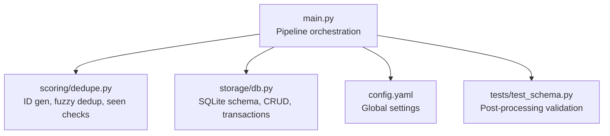
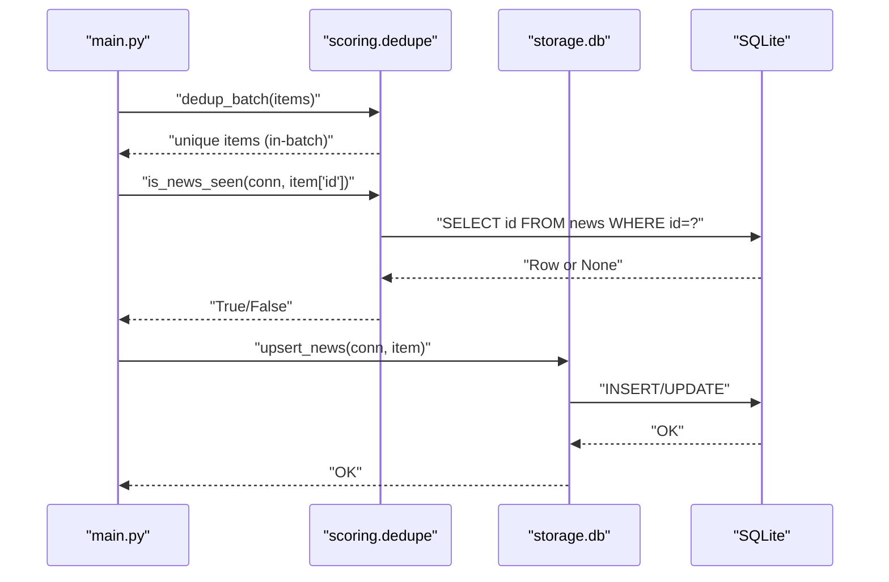
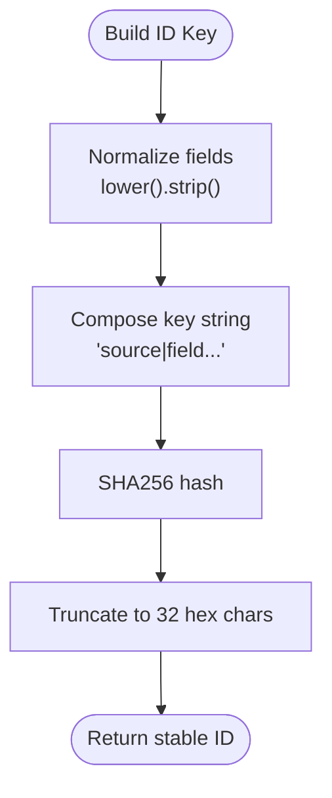
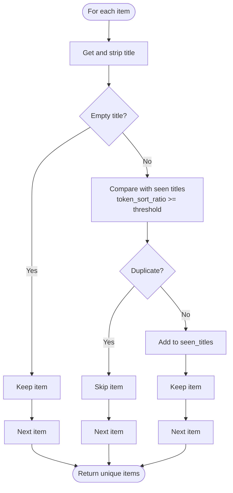
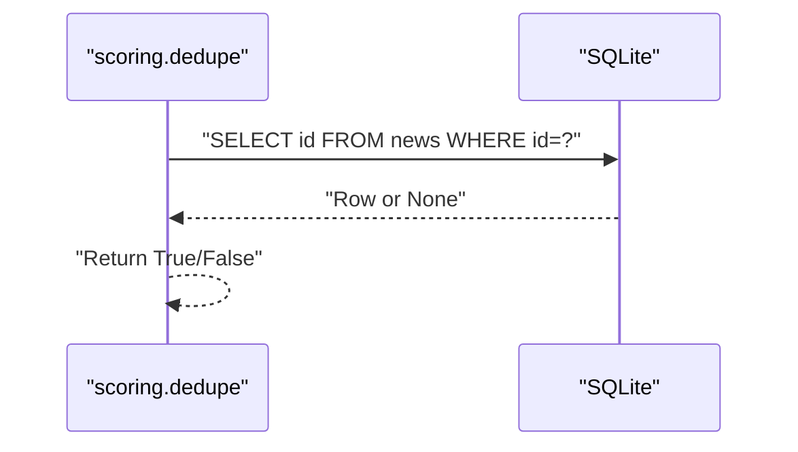
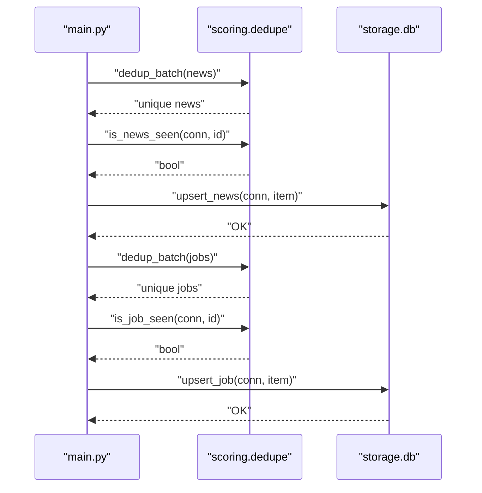
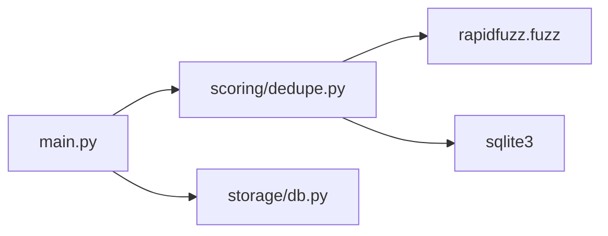

# Fuzzy Deduplication

<cite>
**Referenced Files in This Document**
- [dedupe.py](file://worker/scoring/dedupe.py)
- [db.py](file://worker/storage/db.py)
- [main.py](file://worker/main.py)
- [config.yaml](file://worker/config.yaml)
- [requirements.txt](file://worker/requirements.txt)
- [test_schema.py](file://tests/test_schema.py)
</cite>

## Table of Contents
1. [Introduction](#introduction)
2. [Project Structure](#project-structure)
3. [Core Components](#core-components)
4. [Architecture Overview](#architecture-overview)
5. [Detailed Component Analysis](#detailed-component-analysis)
6. [Dependency Analysis](#dependency-analysis)
7. [Performance Considerations](#performance-considerations)
8. [Troubleshooting Guide](#troubleshooting-guide)
9. [Conclusion](#conclusion)

## Introduction
This document explains the fuzzy deduplication system used to remove near-duplicate content during ingestion. It covers:
- Stable SHA256-based ID generation for reliable deduplication across runs
- In-batch fuzzy-title deduplication using token sort ratio comparisons
- SQLite-backed seen-checks to prevent reprocessing known items
- Threshold configuration and tuning guidance
- Practical examples for adjusting sensitivity and debugging effectiveness
- Performance optimization strategies for large datasets

## Project Structure
The deduplication logic is implemented in the scoring module and integrated into the main pipeline. Supporting database utilities and configuration live in the storage and configuration modules respectively.

**Diagram sources**
- [main.py:127-297](file://worker/main.py#L127-L297)
- [dedupe.py:1-90](file://worker/scoring/dedupe.py#L1-L90)
- [db.py:1-278](file://worker/storage/db.py#L1-L278)
- [config.yaml:1-244](file://worker/config.yaml#L1-L244)
- [test_schema.py:1-136](file://tests/test_schema.py#L1-L136)

**Section sources**
- [main.py:127-297](file://worker/main.py#L127-L297)
- [dedupe.py:1-90](file://worker/scoring/dedupe.py#L1-L90)
- [db.py:1-278](file://worker/storage/db.py#L1-L278)
- [config.yaml:1-244](file://worker/config.yaml#L1-L244)
- [test_schema.py:1-136](file://tests/test_schema.py#L1-L136)

## Core Components
- Stable ID generation: Deterministic SHA256 hashes derived from normalized keys to uniquely identify items across runs.
- In-batch fuzzy deduplication: Removes near-duplicates within a single batch using token sort ratio comparisons.
- SQLite-backed seen checks: Prevents reprocessing items already stored in the database.
- Keyword pre-filter: Reduces LLM calls by filtering items before scoring.

Key implementation references:
- ID generation and seen checks: [make_news_id:20-23](file://worker/scoring/dedupe.py#L20-L23), [make_job_id:26-29](file://worker/scoring/dedupe.py#L26-L29), [is_news_seen:33-37](file://worker/scoring/dedupe.py#L33-L37), [is_job_seen:40-44](file://worker/scoring/dedupe.py#L40-L44)
- In-batch fuzzy dedup: [dedup_batch:48-76](file://worker/scoring/dedupe.py#L48-L76)
- Keyword pre-filter: [passes_keyword_filter:80-89](file://worker/scoring/dedupe.py#L80-L89)
- Pipeline integration: [main.py run():127-297](file://worker/main.py#L127-L297)

**Section sources**
- [dedupe.py:16-89](file://worker/scoring/dedupe.py#L16-L89)
- [main.py:174-237](file://worker/main.py#L174-L237)

## Architecture Overview
The pipeline performs deduplication in two stages:
1. In-batch fuzzy deduplication removes near-duplicates within a single batch.
2. Database-backed seen checks prevent reinsertion of previously seen items.

**Diagram sources**
- [main.py:174-181](file://worker/main.py#L174-L181)
- [main.py:192-197](file://worker/main.py#L192-L197)
- [dedupe.py:33-44](file://worker/scoring/dedupe.py#L33-L44)
- [db.py:116-161](file://worker/storage/db.py#L116-L161)

## Detailed Component Analysis

### Stable SHA256 ID Generation
Purpose:
- Produce a deterministic, stable identifier for each item to enable cross-run deduplication and consistent updates.

Behavior:
- Normalizes the key fields (source, URL, title for news; company included for jobs) to lowercase and strips whitespace.
- Hashes the composite key with SHA256 and truncates to 32 hex characters.

References:
- [make_news_id:20-23](file://worker/scoring/dedupe.py#L20-L23)
- [make_job_id:26-29](file://worker/scoring/dedupe.py#L26-L29)

**Diagram sources**
- [dedupe.py:20-29](file://worker/scoring/dedupe.py#L20-L29)

**Section sources**
- [dedupe.py:20-29](file://worker/scoring/dedupe.py#L20-L29)

### In-Batch Fuzzy Title Deduplication
Purpose:
- Remove near-duplicates within a single batch using fuzzy string matching.

Algorithm:
- Maintains a list of seen titles encountered so far.
- For each incoming item:
  - If title is empty, keep the item.
  - Otherwise, compare the token sort ratio of the current title against all previous titles.
  - If any comparison meets or exceeds the configured threshold, mark as duplicate and skip.
  - Otherwise, append to seen titles and keep the item.

Threshold:
- Default threshold is 88 (Levenshtein ratio 0–100). Adjust to tune sensitivity.

References:
- [FUZZY_THRESHOLD](file://worker/scoring/dedupe.py#L16)
- [dedup_batch:48-76](file://worker/scoring/dedupe.py#L48-L76)

**Diagram sources**
- [dedupe.py:48-76](file://worker/scoring/dedupe.py#L48-L76)

**Section sources**
- [dedupe.py:16](file://worker/scoring/dedupe.py#L16)
- [dedupe.py:48-76](file://worker/scoring/dedupe.py#L48-L76)

### SQLite-Backed Seen Checks
Purpose:
- Prevent reinsertion of items already present in the database.

Mechanism:
- Queries the news or jobs table by ID.
- Returns True if a row is found, False otherwise.

References:
- [is_news_seen:33-37](file://worker/scoring/dedupe.py#L33-L37)
- [is_job_seen:40-44](file://worker/scoring/dedupe.py#L40-L44)
- [Schema:26-52](file://worker/storage/db.py#L26-L52)

**Diagram sources**
- [dedupe.py:33-44](file://worker/scoring/dedupe.py#L33-L44)
- [db.py:26-52](file://worker/storage/db.py#L26-L52)

**Section sources**
- [dedupe.py:33-44](file://worker/scoring/dedupe.py#L33-L44)
- [db.py:26-52](file://worker/storage/db.py#L26-L52)

### Keyword Pre-Filter
Purpose:
- Reduce downstream LLM costs by filtering items before scoring.

Behavior:
- If no keywords are configured, all items pass.
- Otherwise, checks if the item’s title, summary, or company contains any configured keyword (case-insensitive).

References:
- [passes_keyword_filter:80-89](file://worker/scoring/dedupe.py#L80-L89)
- [Keyword filter configuration:20-76](file://worker/config.yaml#L20-L76)

**Section sources**
- [dedupe.py:80-89](file://worker/scoring/dedupe.py#L80-L89)
- [config.yaml:20-76](file://worker/config.yaml#L20-L76)

### Pipeline Integration
The main pipeline orchestrates deduplication and persistence:
- News: collect → deduplicate → seen-check → score → persist → export → run log
- Jobs: collect → deduplicate → seen-check → score → persist → export → run log

References:
- [run():127-297](file://worker/main.py#L127-L297)

**Diagram sources**
- [main.py:174-253](file://worker/main.py#L174-L253)
- [dedupe.py:33-44](file://worker/scoring/dedupe.py#L33-L44)
- [db.py:116-230](file://worker/storage/db.py#L116-L230)

**Section sources**
- [main.py:174-253](file://worker/main.py#L174-L253)

## Dependency Analysis
External libraries:
- rapidfuzz: Provides fuzzy string metrics (token sort ratio).
- sqlite3: Built-in Python library for database operations.

References:
- [requirements.txt](file://worker/requirements.txt#L10)
- [dedupe.py imports:5-12](file://worker/scoring/dedupe.py#L5-L12)

**Diagram sources**
- [requirements.txt:10](file://worker/requirements.txt#L10)
- [dedupe.py:5-12](file://worker/scoring/dedupe.py#L5-L12)
- [main.py:58-66](file://worker/main.py#L58-L66)

**Section sources**
- [requirements.txt:10](file://worker/requirements.txt#L10)
- [dedupe.py:5-12](file://worker/scoring/dedupe.py#L5-L12)
- [main.py:58-66](file://worker/main.py#L58-L66)

## Performance Considerations
Current implementation characteristics:
- In-batch fuzzy dedup uses a list of seen titles and nested loops, resulting in O(n^2) comparisons within a batch.
- SQLite seen checks are single-row lookups with primary key indexing.

Optimization strategies:
- Batch-level dedup scaling:
  - Replace the linear scan with a set-based approach keyed by normalized tokens or fingerprints to reduce comparisons.
  - Consider approximate string matching libraries with indexed token sets for larger batches.
- Database lookups:
  - Ensure IDs are indexed (primary key) and use prepared statements for repeated lookups.
  - Batch upserts with transactions minimize round-trips.
- Memory footprint:
  - Limit the number of seen titles retained per batch or periodically prune the list.
- Threshold tuning:
  - Lower thresholds increase false positives; higher thresholds risk false negatives. Start from the default and adjust based on observed duplicates.

[No sources needed since this section provides general guidance]

## Troubleshooting Guide
Common issues and remedies:
- Duplicate IDs in exported JSON:
  - The post-processing tests enforce uniqueness. If failures occur, inspect deduplication thresholds and ID normalization.
  - References: [test_no_duplicate_ids:93-135](file://tests/test_schema.py#L93-L135)

- Near-duplicates still passing deduplication:
  - Increase the fuzzy threshold to tighten matching.
  - Verify that titles are normalized consistently (lowercase, stripped).
  - References: [FUZZY_THRESHOLD](file://worker/scoring/dedupe.py#L16), [dedup_batch:48-76](file://worker/scoring/dedupe.py#L48-L76)

- Items reappearing across runs:
  - Confirm that IDs are generated deterministically and that seen checks query the correct tables.
  - References: [make_news_id:20-23](file://worker/scoring/dedupe.py#L20-L23), [is_news_seen:33-37](file://worker/scoring/dedupe.py#L33-L37), [Schema:26-52](file://worker/storage/db.py#L26-L52)

- Excessive LLM calls:
  - Enable and tune the keyword pre-filter to reduce scoring workload.
  - References: [passes_keyword_filter:80-89](file://worker/scoring/dedupe.py#L80-L89), [config.yaml:20-76](file://worker/config.yaml#L20-L76)

**Section sources**
- [test_schema.py:93-135](file://tests/test_schema.py#L93-L135)
- [dedupe.py:16](file://worker/scoring/dedupe.py#L16)
- [dedupe.py:20-37](file://worker/scoring/dedupe.py#L20-L37)
- [db.py:26-52](file://worker/storage/db.py#L26-L52)
- [dedupe.py:80-89](file://worker/scoring/dedupe.py#L80-L89)
- [config.yaml:20-76](file://worker/config.yaml#L20-L76)

## Conclusion
The system combines stable SHA256 IDs, in-batch fuzzy deduplication, and SQLite-backed seen checks to reliably remove near-duplicates across news and jobs ingestion. The default fuzzy threshold balances sensitivity and precision, while configuration allows tuning for specific domains. For large-scale ingestion, consider optimizing the fuzzy deduplication algorithm and leveraging database transactions to improve throughput.