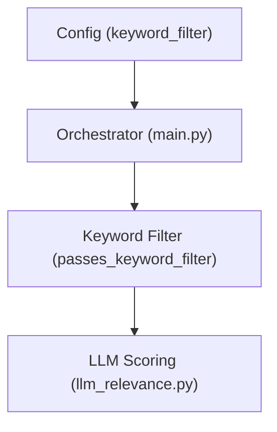
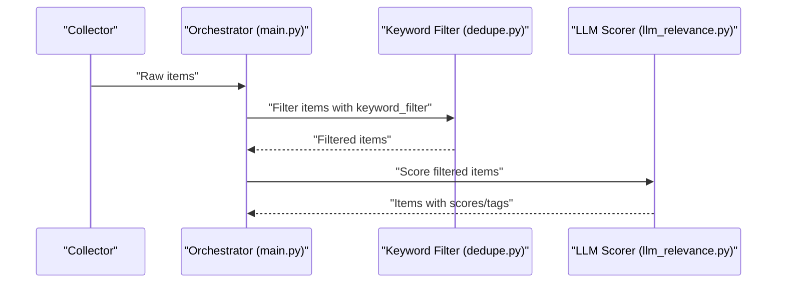
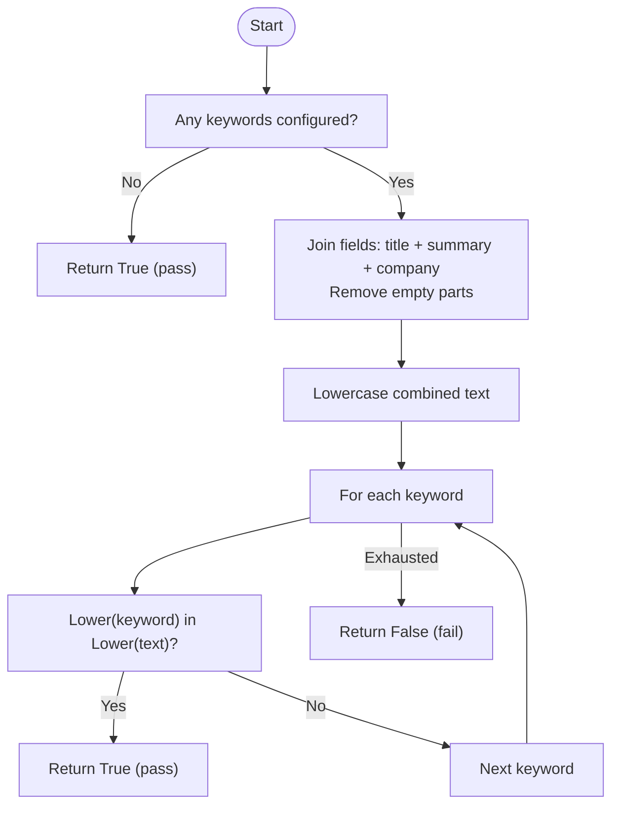
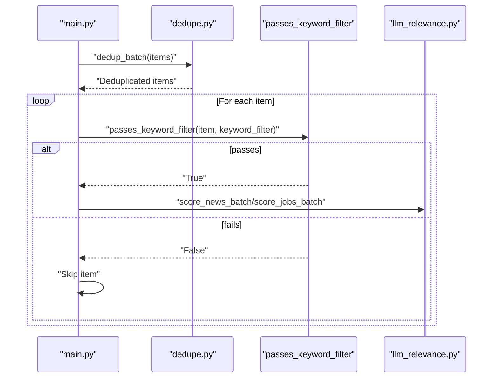
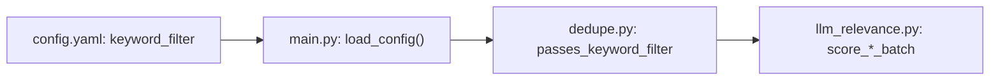

# Keyword Pre-filtering

<cite>
**Referenced Files in This Document**
- [main.py](file://worker/main.py)
- [config.yaml](file://worker/config.yaml)
- [dedupe.py](file://worker/scoring/dedupe.py)
- [llm_relevance.py](file://worker/scoring/llm_relevance.py)
- [hn_whoishiring.py](file://worker/collectors/jobs/hn_whoishiring.py)
- [hn_algolia.py](file://worker/collectors/news/hn_algolia.py)
- [db.py](file://worker/storage/db.py)
</cite>

## Table of Contents
1. [Introduction](#introduction)
2. [Project Structure](#project-structure)
3. [Core Components](#core-components)
4. [Architecture Overview](#architecture-overview)
5. [Detailed Component Analysis](#detailed-component-analysis)
6. [Dependency Analysis](#dependency-analysis)
7. [Performance Considerations](#performance-considerations)
8. [Troubleshooting Guide](#troubleshooting-guide)
9. [Conclusion](#conclusion)

## Introduction
This document explains the keyword pre-filtering system used to reduce false positives and improve processing efficiency before invoking expensive LLM scoring. The mechanism filters incoming items (news and jobs) by checking whether their textual fields match configured keywords. It supports case-insensitive substring matching across multiple fields and is designed to minimize unnecessary LLM calls.

## Project Structure
The keyword pre-filtering spans configuration, orchestration, filtering logic, and downstream LLM scoring:

- Configuration defines keyword lists and enables/disables pre-filtering.
- Orchestration loads configuration and applies the pre-filter during processing.
- Filtering logic performs case-insensitive checks across title, summary, and company fields.
- LLM scoring is gated by the pre-filter to reduce compute costs.

**Diagram sources**
- [config.yaml:20-76](file://worker/config.yaml#L20-L76)
- [main.py:127-297](file://worker/main.py#L127-L297)
- [dedupe.py:79-89](file://worker/scoring/dedupe.py#L79-L89)
- [llm_relevance.py:94-178](file://worker/scoring/llm_relevance.py#L94-L178)

**Section sources**
- [config.yaml:10-76](file://worker/config.yaml#L10-L76)
- [main.py:127-297](file://worker/main.py#L127-L297)

## Core Components
- Keyword configuration: A curated list of terms under keyword_filter configures the pre-filter.
- Pre-filter function: Case-insensitive substring checks across title, summary, and company fields.
- Orchestrator integration: Loads configuration and applies the pre-filter before LLM scoring.

Key behaviors:
- Empty keyword list bypasses filtering (every item passes).
- Matching occurs if at least one configured keyword appears anywhere in the joined text.
- Case-insensitive comparisons are performed consistently.

**Section sources**
- [config.yaml:20-76](file://worker/config.yaml#L20-L76)
- [dedupe.py:79-89](file://worker/scoring/dedupe.py#L79-L89)
- [main.py:127-297](file://worker/main.py#L127-L297)

## Architecture Overview
The keyword pre-filter sits between data ingestion and LLM scoring. It reduces the number of items sent to the LLM by rejecting irrelevant content early.

**Diagram sources**
- [main.py:127-297](file://worker/main.py#L127-L297)
- [dedupe.py:79-89](file://worker/scoring/dedupe.py#L79-L89)
- [llm_relevance.py:94-178](file://worker/scoring/llm_relevance.py#L94-L178)

## Detailed Component Analysis

### Keyword Configuration
- Location: keyword_filter list in the configuration file.
- Purpose: Defines the terms used to gate LLM processing.
- Behavior: If empty, pre-filtering is effectively disabled.

Examples of configured keywords include DevOps, Kubernetes, observability, CI/CD, and cloud providers.

**Section sources**
- [config.yaml:20-76](file://worker/config.yaml#L20-L76)

### Keyword Matching Algorithm
The pre-filter evaluates whether an item matches any configured keyword. It:
- Joins relevant fields (title, summary, company) into a single text buffer.
- Converts the buffer and keywords to lowercase for case-insensitive matching.
- Uses substring containment checks to determine a match.
- Returns True if at least one keyword is found; otherwise False.

**Diagram sources**
- [dedupe.py:79-89](file://worker/scoring/dedupe.py#L79-L89)

**Section sources**
- [dedupe.py:79-89](file://worker/scoring/dedupe.py#L79-L89)

### Case-Insensitive Comparison Logic
- Both the combined text buffer and keywords are lowercased before matching.
- Substring containment is used for matching, ensuring partial matches are detected.

**Section sources**
- [dedupe.py:79-89](file://worker/scoring/dedupe.py#L79-L89)

### Multi-Field Text Processing
- Fields considered: title, summary, company.
- Empty fields are filtered out before joining to avoid introducing extra spaces.
- The resulting string is lowercased to normalize case.

**Section sources**
- [dedupe.py:79-89](file://worker/scoring/dedupe.py#L79-L89)

### Orchestrator Integration
- The orchestrator loads keyword_filter from configuration.
- It applies the pre-filter after deduplication but before LLM scoring.
- Items that fail the pre-filter are excluded from subsequent LLM processing.

**Diagram sources**
- [main.py:127-297](file://worker/main.py#L127-L297)
- [dedupe.py:79-89](file://worker/scoring/dedupe.py#L79-L89)
- [llm_relevance.py:94-178](file://worker/scoring/llm_relevance.py#L94-L178)

**Section sources**
- [main.py:127-297](file://worker/main.py#L127-L297)

### Collector-Specific Keyword Usage
- Some collectors apply keyword filtering at the source level (e.g., HN Who Is Hiring comments).
- These collectors use their own keyword lists to narrow initial candidate sets.

**Section sources**
- [hn_whoishiring.py:55-112](file://worker/collectors/jobs/hn_whoishiring.py#L55-L112)
- [hn_algolia.py:21-82](file://worker/collectors/news/hn_algolia.py#L21-L82)

## Dependency Analysis
- Configuration dependency: The orchestrator reads keyword_filter from config.yaml.
- Runtime dependency: The pre-filter function depends on the presence of configured keywords.
- Downstream dependency: LLM scoring is gated by the pre-filter to reduce cost and latency.

**Diagram sources**
- [config.yaml:20-76](file://worker/config.yaml#L20-L76)
- [main.py:127-297](file://worker/main.py#L127-L297)
- [dedupe.py:79-89](file://worker/scoring/dedupe.py#L79-L89)
- [llm_relevance.py:94-178](file://worker/scoring/llm_relevance.py#L94-L178)

**Section sources**
- [config.yaml:20-76](file://worker/config.yaml#L20-L76)
- [main.py:127-297](file://worker/main.py#L127-L297)
- [dedupe.py:79-89](file://worker/scoring/dedupe.py#L79-L89)
- [llm_relevance.py:94-178](file://worker/scoring/llm_relevance.py#L94-L178)

## Performance Considerations
- Cost reduction: Pre-filtering avoids LLM calls for irrelevant items, reducing API costs and latency.
- Scalability: For large keyword sets, consider:
  - Using normalized forms (e.g., stemming or lemmatization) to broaden matches.
  - Maintaining keywords in a trie or set for faster lookups if performance becomes a concern.
- Memory and CPU: The current implementation is linear in the number of keywords per item; overhead is generally small compared to LLM calls.
- Batch sizing: Tune LLM batch_size to balance throughput and resource usage.

[No sources needed since this section provides general guidance]

## Troubleshooting Guide
Common issues and resolutions:
- No LLM scoring occurs:
  - Verify OPENROUTER_API_KEY is set; otherwise, LLM scoring is skipped.
  - Confirm keyword_filter is not empty if you expect pre-filtering to reduce items.
- Unexpectedly high/Low number of items passed to LLM:
  - Review keyword_filter entries for specificity and coverage.
  - Check field contents (title, summary, company) for missing or inconsistent data.
- Edge cases:
  - Empty keywords: Pre-filter returns True for all items.
  - Special characters: Substring matching treats punctuation as part of tokens; consider normalization if needed.
  - Large keyword sets: Monitor performance and adjust keyword granularity.

Operational references:
- LLM scoring guard and warnings.
- Pre-filter behavior for empty keyword lists.
- Collector-level keyword filtering examples.

**Section sources**
- [llm_relevance.py:94-178](file://worker/scoring/llm_relevance.py#L94-L178)
- [dedupe.py:79-89](file://worker/scoring/dedupe.py#L79-L89)
- [hn_whoishiring.py:55-112](file://worker/collectors/jobs/hn_whoishiring.py#L55-L112)

## Conclusion
The keyword pre-filtering system provides an efficient, configurable gate that dramatically reduces unnecessary LLM work by focusing on relevant content. By combining case-insensitive substring matching across key fields and leveraging curated keyword lists, it improves both accuracy and cost-effectiveness. Proper tuning of keywords and awareness of edge cases ensures optimal performance across diverse content categories.