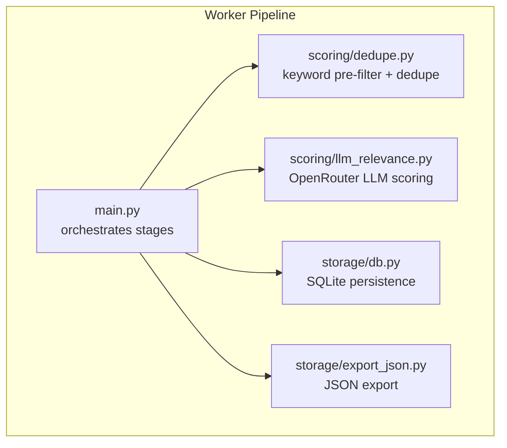
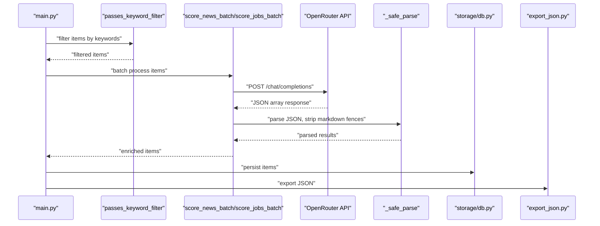
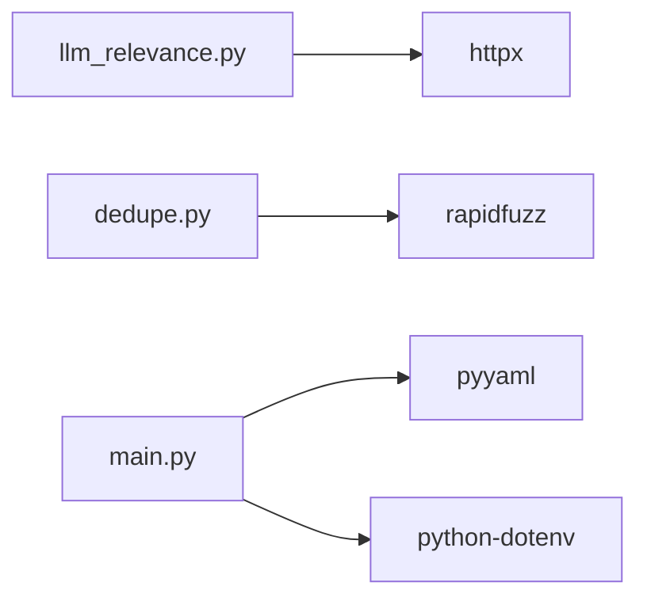

# LLM Relevance Scoring

<cite>
**Referenced Files in This Document**
- [llm_relevance.py](file://worker/scoring/llm_relevance.py)
- [dedupe.py](file://worker/scoring/dedupe.py)
- [main.py](file://worker/main.py)
- [config.yaml](file://worker/config.yaml)
- [db.py](file://worker/storage/db.py)
- [export_json.py](file://worker/storage/export_json.py)
- [requirements.txt](file://worker/requirements.txt)
</cite>

## Table of Contents
1. [Introduction](#introduction)
2. [Project Structure](#project-structure)
3. [Core Components](#core-components)
4. [Architecture Overview](#architecture-overview)
5. [Detailed Component Analysis](#detailed-component-analysis)
6. [Dependency Analysis](#dependency-analysis)
7. [Performance Considerations](#performance-considerations)
8. [Troubleshooting Guide](#troubleshooting-guide)
9. [Conclusion](#conclusion)
10. [Appendices](#appendices)

## Introduction
This document explains the LLM-based relevance scoring system that integrates with OpenRouter to evaluate and enrich content for news and job postings. It covers the OpenRouter integration, prompt engineering strategies, scoring methodology, batch processing, error handling, and operational patterns within the broader processing pipeline. It also provides guidance on customizing prompts, handling API failures, and optimizing cost-effectiveness.

## Project Structure
The relevance scoring system resides in the worker module and participates in a multi-stage pipeline:
- Collection: News and jobs are collected from various sources.
- Deduplication: Duplicate items are removed using deterministic IDs and fuzzy matching.
- Keyword pre-filter: Items are filtered to reduce unnecessary LLM calls.
- LLM scoring: OpenRouter is used to compute relevance scores and extract metadata.
- Persistence: Results are stored in SQLite and exported to static JSON.
- Publication: Optional Git publishing and SMTP notifications.

**Diagram sources**
- [main.py:127-297](file://worker/main.py#L127-L297)
- [llm_relevance.py:95-177](file://worker/scoring/llm_relevance.py#L95-L177)
- [dedupe.py:48-90](file://worker/scoring/dedupe.py#L48-L90)
- [db.py:116-278](file://worker/storage/db.py#L116-L278)
- [export_json.py:32-93](file://worker/storage/export_json.py#L32-L93)

**Section sources**
- [main.py:127-297](file://worker/main.py#L127-L297)
- [config.yaml:1-244](file://worker/config.yaml#L1-L244)

## Core Components
- OpenRouter integration: HTTP client configured with base URL, API key, and request parameters.
- Prompt engineering: Specialized system prompts for news and jobs with strict JSON output requirements.
- Batch processing: Chunking items into batches to minimize API calls while respecting rate limits.
- Error handling: Graceful degradation by preserving original items when LLM calls fail.
- Output enrichment: Adds relevance_score, summary/tags for news; relevance_score, category for jobs.

Key implementation references:
- OpenRouter client and chat endpoint: [llm_relevance.py:52-77](file://worker/scoring/llm_relevance.py#L52-L77)
- News scoring: [llm_relevance.py:95-133](file://worker/scoring/llm_relevance.py#L95-L133)
- Jobs scoring: [llm_relevance.py:136-177](file://worker/scoring/llm_relevance.py#L136-L177)
- Keyword pre-filter: [dedupe.py:80-89](file://worker/scoring/dedupe.py#L80-L89)
- Pipeline orchestration: [main.py:184-245](file://worker/main.py#L184-L245)

**Section sources**
- [llm_relevance.py:16-18](file://worker/scoring/llm_relevance.py#L16-L18)
- [llm_relevance.py:31-48](file://worker/scoring/llm_relevance.py#L31-L48)
- [llm_relevance.py:95-177](file://worker/scoring/llm_relevance.py#L95-L177)
- [dedupe.py:80-89](file://worker/scoring/dedupe.py#L80-L89)
- [main.py:184-245](file://worker/main.py#L184-L245)

## Architecture Overview
The relevance scoring pipeline integrates with OpenRouter to produce structured outputs. The system uses a keyword pre-filter to reduce LLM calls, then batches items for efficient processing. On failure, the system preserves original items to avoid data loss.

**Diagram sources**
- [main.py:184-245](file://worker/main.py#L184-L245)
- [llm_relevance.py:95-177](file://worker/scoring/llm_relevance.py#L95-L177)
- [llm_relevance.py:80-91](file://worker/scoring/llm_relevance.py#L80-L91)
- [db.py:116-230](file://worker/storage/db.py#L116-L230)
- [export_json.py:32-93](file://worker/storage/export_json.py#L32-L93)

## Detailed Component Analysis

### OpenRouter Integration
- Base URL and API key are loaded from environment variables with defaults.
- HTTP client sets Authorization, Content-Type, and referer headers.
- Request payload includes model, messages, max_tokens, and temperature.
- The chat endpoint returns the assistant’s message content.

Implementation references:
- Environment configuration: [llm_relevance.py:16-18](file://worker/scoring/llm_relevance.py#L16-L18)
- HTTP client: [llm_relevance.py:52-61](file://worker/scoring/llm_relevance.py#L52-L61)
- Chat request: [llm_relevance.py:64-77](file://worker/scoring/llm_relevance.py#L64-L77)

**Section sources**
- [llm_relevance.py:16-18](file://worker/scoring/llm_relevance.py#L16-L18)
- [llm_relevance.py:52-77](file://worker/scoring/llm_relevance.py#L52-L77)

### Prompt Engineering Strategies
- News prompt: Defines a technical editor role, requires a JSON array with relevance_score, summary, and tags constrained to predefined categories.
- Jobs prompt: Defines a technical recruiter role, requires a JSON array with relevance_score and category constrained to predefined categories.
- Output constraints: Strictly require JSON arrays, forbid markdown fences, and enforce field presence.

Implementation references:
- News system prompt: [llm_relevance.py:31-39](file://worker/scoring/llm_relevance.py#L31-L39)
- Jobs system prompt: [llm_relevance.py:41-48](file://worker/scoring/llm_relevance.py#L41-L48)
- Tags and categories lists: [llm_relevance.py:20-29](file://worker/scoring/llm_relevance.py#L20-L29)

**Section sources**
- [llm_relevance.py:31-48](file://worker/scoring/llm_relevance.py#L31-L48)
- [llm_relevance.py:20-29](file://worker/scoring/llm_relevance.py#L20-L29)

### Scoring Methodology
- Inputs: News items include title and URL; jobs include title and company.
- Outputs: Enriched items receive relevance_score, summary/tags for news, and relevance_score/category for jobs.
- Parsing: Robust parser strips markdown fences and parses JSON arrays.

Implementation references:
- News batch scoring: [llm_relevance.py:95-133](file://worker/scoring/llm_relevance.py#L95-L133)
- Jobs batch scoring: [llm_relevance.py:136-177](file://worker/scoring/llm_relevance.py#L136-L177)
- Safe parsing: [llm_relevance.py:80-91](file://worker/scoring/llm_relevance.py#L80-L91)

**Section sources**
- [llm_relevance.py:95-133](file://worker/scoring/llm_relevance.py#L95-L133)
- [llm_relevance.py:136-177](file://worker/scoring/llm_relevance.py#L136-L177)
- [llm_relevance.py:80-91](file://worker/scoring/llm_relevance.py#L80-L91)

### Batch Processing Capabilities
- Batching: Items are processed in chunks determined by batch_size.
- Payload construction: Each batch serializes a compact representation of items.
- Failure handling: On exception, the batch logs an error and preserves original items.

Implementation references:
- Batch loop and payload: [llm_relevance.py:112-117](file://worker/scoring/llm_relevance.py#L112-L117)
- News batch handling: [llm_relevance.py:118-131](file://worker/scoring/llm_relevance.py#L118-L131)
- Jobs batch handling: [llm_relevance.py:163-175](file://worker/scoring/llm_relevance.py#L163-L175)

**Section sources**
- [llm_relevance.py:112-131](file://worker/scoring/llm_relevance.py#L112-L131)
- [llm_relevance.py:163-175](file://worker/scoring/llm_relevance.py#L163-L175)

### Confidence Thresholds and Cost Optimization
- Temperature: Set low to encourage deterministic outputs and reduce token usage.
- Max tokens: Controlled via configuration to bound cost and latency.
- Pre-filtering: Keyword-based filtering reduces unnecessary LLM calls.
- Batch size: Tunable to balance throughput and cost.

Implementation references:
- Configuration: [config.yaml:10-19](file://worker/config.yaml#L10-L19)
- Keyword filter: [dedupe.py:80-89](file://worker/scoring/dedupe.py#L80-L89)
- Batch size usage: [main.py:184-245](file://worker/main.py#L184-L245)

**Section sources**
- [config.yaml:10-19](file://worker/config.yaml#L10-L19)
- [dedupe.py:80-89](file://worker/scoring/dedupe.py#L80-L89)
- [main.py:184-245](file://worker/main.py#L184-L245)

### Integration Patterns with the Pipeline
- Keyword pre-filter is applied before LLM scoring to reduce cost and improve throughput.
- Scoring functions are invoked from the orchestrator with model and batch_size from configuration.
- Results are persisted to SQLite and exported to JSON for downstream consumption.

Implementation references:
- Keyword pre-filter and scoring: [main.py:174-190](file://worker/main.py#L174-L190)
- Jobs scoring: [main.py:239-245](file://worker/main.py#L239-L245)
- Persistence and export: [db.py:116-230](file://worker/storage/db.py#L116-L230), [export_json.py:32-93](file://worker/storage/export_json.py#L32-L93)

**Section sources**
- [main.py:174-190](file://worker/main.py#L174-L190)
- [main.py:239-245](file://worker/main.py#L239-L245)
- [db.py:116-230](file://worker/storage/db.py#L116-L230)
- [export_json.py:32-93](file://worker/storage/export_json.py#L32-L93)

## Dependency Analysis
External dependencies relevant to LLM scoring:
- httpx: HTTP client for OpenRouter requests.
- rapidfuzz: Fuzzy matching for deduplication.
- pyyaml and python-dotenv: Configuration loading and environment support.

**Diagram sources**
- [requirements.txt:1-11](file://worker/requirements.txt#L1-L11)
- [llm_relevance.py:12](file://worker/scoring/llm_relevance.py#L12)
- [dedupe.py:12](file://worker/scoring/dedupe.py#L12)

**Section sources**
- [requirements.txt:1-11](file://worker/requirements.txt#L1-L11)

## Performance Considerations
- Batch sizing: Tune batch_size to balance throughput and cost; larger batches reduce API calls but increase memory and latency.
- Pre-filtering: Use keyword_filter to avoid LLM calls for irrelevant items.
- Token limits: Control max_tokens to cap cost and response time.
- Model selection: Choose a smaller model for cost-sensitive scenarios; adjust temperature for determinism.
- Retry/backoff: Not implemented; consider adding retry logic for transient failures.

[No sources needed since this section provides general guidance]

## Troubleshooting Guide
Common issues and remedies:
- Missing API key: If OPENROUTER_API_KEY is unset, LLM scoring is skipped with a warning. Set the environment variable to enable scoring.
- LLM API failures: Exceptions during scoring preserve original items and log errors; investigate network connectivity and quotas.
- JSON parsing errors: The parser strips markdown fences; ensure the LLM adheres to the required JSON format.
- Keyword pre-filter blocking items: Verify keyword_filter configuration and adjust keywords if needed.

Operational references:
- API key guard: [llm_relevance.py:105-107](file://worker/scoring/llm_relevance.py#L105-L107)
- Error logging and fallback: [llm_relevance.py:129-131](file://worker/scoring/llm_relevance.py#L129-L131), [llm_relevance.py:173-175](file://worker/scoring/llm_relevance.py#L173-L175)
- Safe parsing: [llm_relevance.py:80-91](file://worker/scoring/llm_relevance.py#L80-L91)
- Keyword filter: [dedupe.py:80-89](file://worker/scoring/dedupe.py#L80-L89)

**Section sources**
- [llm_relevance.py:105-107](file://worker/scoring/llm_relevance.py#L105-L107)
- [llm_relevance.py:129-131](file://worker/scoring/llm_relevance.py#L129-L131)
- [llm_relevance.py:173-175](file://worker/scoring/llm_relevance.py#L173-L175)
- [llm_relevance.py:80-91](file://worker/scoring/llm_relevance.py#L80-L91)
- [dedupe.py:80-89](file://worker/scoring/dedupe.py#L80-L89)

## Conclusion
The LLM relevance scoring system integrates OpenRouter to produce structured, cost-conscious evaluations of news and jobs. By combining keyword pre-filtering, batching, and strict prompt engineering, it achieves reliable enrichment while minimizing API costs. The design emphasizes resilience through graceful error handling and maintains a clean separation between orchestration, scoring, persistence, and export.

[No sources needed since this section summarizes without analyzing specific files]

## Appendices

### Customizing Scoring Prompts
- Modify NEWS_SYSTEM and JOB_SYSTEM to change roles, constraints, or output fields.
- Adjust tags and categories lists to align with domain taxonomy.
- Ensure the LLM returns strictly formatted JSON arrays as required.

References:
- News prompt: [llm_relevance.py:31-39](file://worker/scoring/llm_relevance.py#L31-L39)
- Jobs prompt: [llm_relevance.py:41-48](file://worker/scoring/llm_relevance.py#L41-L48)
- Tags and categories: [llm_relevance.py:20-29](file://worker/scoring/llm_relevance.py#L20-L29)

**Section sources**
- [llm_relevance.py:31-48](file://worker/scoring/llm_relevance.py#L31-L48)
- [llm_relevance.py:20-29](file://worker/scoring/llm_relevance.py#L20-L29)

### Handling LLM API Failures
- The scoring functions catch exceptions and preserve original items.
- Logs include batch index and error details for diagnostics.
- Consider adding retry logic and circuit breaker patterns for production deployments.

References:
- News batch exception handling: [llm_relevance.py:129-131](file://worker/scoring/llm_relevance.py#L129-L131)
- Jobs batch exception handling: [llm_relevance.py:173-175](file://worker/scoring/llm_relevance.py#L173-L175)

**Section sources**
- [llm_relevance.py:129-131](file://worker/scoring/llm_relevance.py#L129-L131)
- [llm_relevance.py:173-175](file://worker/scoring/llm_relevance.py#L173-L175)

### Optimizing Cost-Effectiveness
- Reduce calls: Use keyword_filter and passes_keyword_filter to gate LLM usage.
- Tune parameters: Lower temperature and max_tokens; select a smaller model.
- Batch efficiently: Increase batch_size to amortize fixed costs.

References:
- Configuration: [config.yaml:10-19](file://worker/config.yaml#L10-L19)
- Keyword filter: [dedupe.py:80-89](file://worker/scoring/dedupe.py#L80-L89)
- Batch usage: [main.py:184-245](file://worker/main.py#L184-L245)

**Section sources**
- [config.yaml:10-19](file://worker/config.yaml#L10-L19)
- [dedupe.py:80-89](file://worker/scoring/dedupe.py#L80-L89)
- [main.py:184-245](file://worker/main.py#L184-L245)