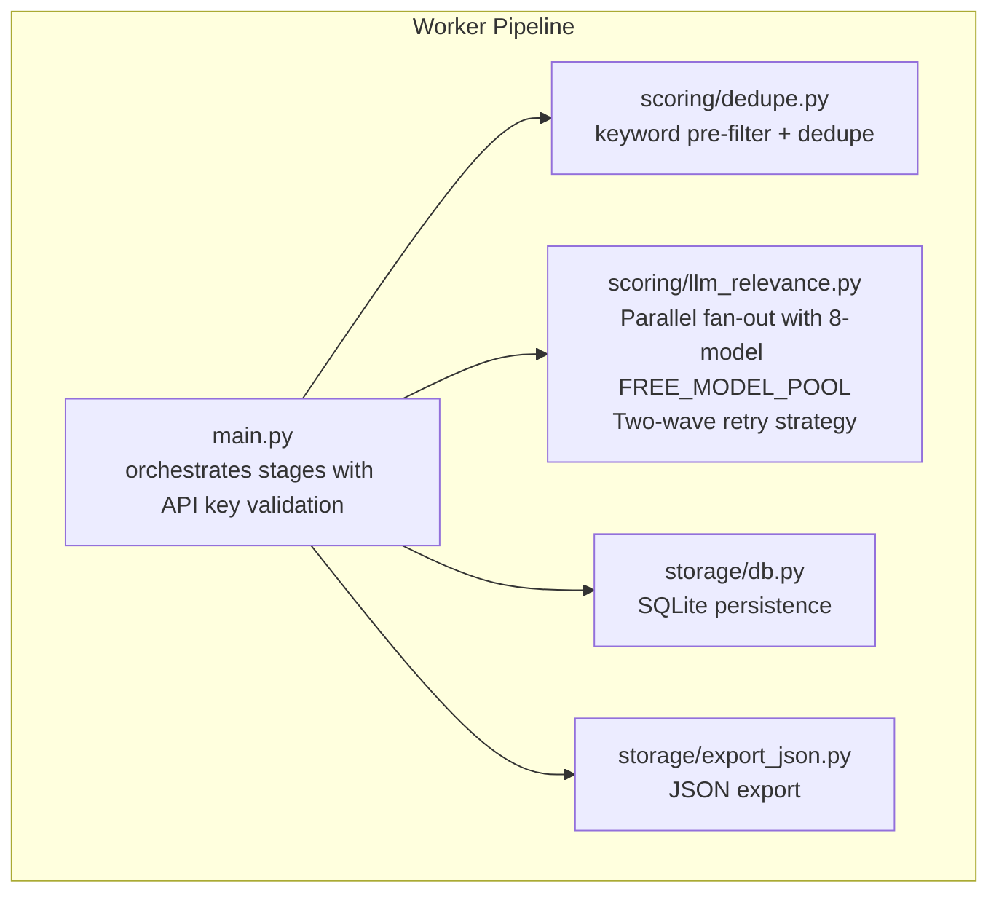
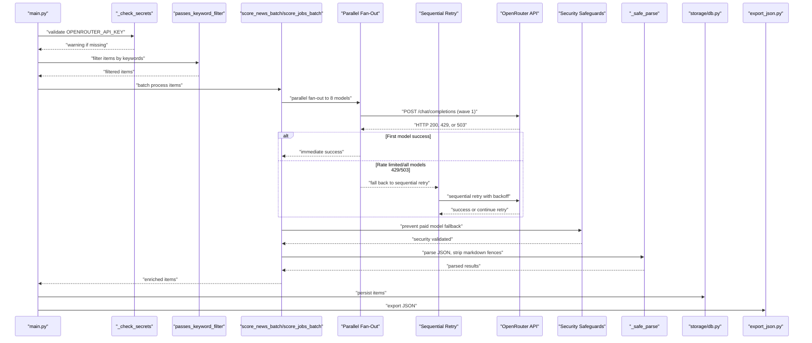
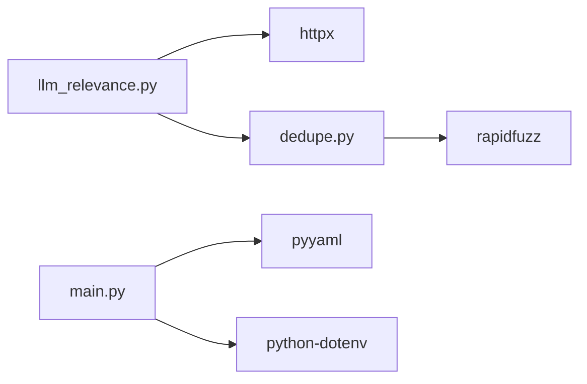

# LLM Relevance Scoring

<cite>
**Referenced Files in This Document**
- [llm_relevance.py](file://worker/scoring/llm_relevance.py)
- [dedupe.py](file://worker/scoring/dedupe.py)
- [main.py](file://worker/main.py)
- [config.yaml](file://worker/config.yaml)
- [db.py](file://worker/storage/db.py)
- [export_json.py](file://worker/storage/export_json.py)
</cite>

## Update Summary
**Changes Made**
- **Major Architectural Enhancement**: Transitioned from single-model to parallel fan-out system with 8-model FREE_MODEL_POOL
- **Two-Wave Strategy**: Implemented parallel fan-out followed by sequential retry with exponential backoff
- **Enhanced Reliability**: Improved error handling for rate limits and service unavailability with better metrics
- **Optimized Retry Logic**: Reduced MAX_RETRIES_PER_MODEL to 1 with sequential retry handling
- **Improved Cost-Effectiveness**: Better utilization of free model pool with intelligent fallback strategies
- **Enhanced Resilience**: Comprehensive retry mechanisms with graceful degradation patterns

## Table of Contents
1. [Introduction](#introduction)
2. [Project Structure](#project-structure)
3. [Core Components](#core-components)
4. [Architecture Overview](#architecture-overview)
5. [Detailed Component Analysis](#detailed-component-analysis)
6. [Dependency Analysis](#dependency-analysis)
7. [Performance Considerations](#performance-considerations)
8. [Troubleshooting Guide](#troubleshooting-guide)
9. [Conclusion](#conclusion)
10. [Appendices](#appendices)

## Introduction
This document explains the LLM-based relevance scoring system that integrates with OpenRouter to evaluate and enrich content for news and job postings. The system has undergone a major architectural transformation from a single-model approach to a sophisticated parallel fan-out system with 8-model FREE_MODEL_POOL, implementing a two-wave strategy (parallel + sequential) for enhanced reliability and cost-effectiveness. It covers the OpenRouter integration, advanced prompt engineering strategies, scoring methodology, batch processing, comprehensive error handling with graceful degradation, and operational patterns within the broader processing pipeline.

## Project Structure
The relevance scoring system resides in the worker module and participates in a multi-stage pipeline with enhanced reliability:
- Collection: News and jobs are collected from various sources.
- Deduplication: Duplicate items are removed using deterministic IDs and fuzzy matching.
- Keyword pre-filter: Items are filtered to reduce unnecessary LLM calls.
- LLM scoring: Advanced parallel fan-out system with 8-model FREE_MODEL_POOL and two-wave retry strategy.
- Persistence: Results are stored in SQLite and exported to static JSON.
- Publication: Optional Git publishing and SMTP notifications.

**Diagram sources**
- [main.py:148-306](file://worker/main.py#L148-L306)
- [llm_relevance.py:115-170](file://worker/scoring/llm_relevance.py#L115-L170)
- [dedupe.py:48-92](file://worker/scoring/dedupe.py#L48-L92)
- [db.py:116-278](file://worker/storage/db.py#L116-L278)
- [export_json.py:32-93](file://worker/storage/export_json.py#L32-L93)

**Section sources**
- [main.py:148-306](file://worker/main.py#L148-L306)
- [config.yaml:1-245](file://worker/config.yaml#L1-L245)

## Core Components
- **Parallel Fan-out System**: 8-model FREE_MODEL_POOL with intelligent parallel request distribution and first-success-wins strategy.
- **Two-Wave Retry Strategy**: Wave 1 (parallel fan-out) followed by Wave 2 (sequential retry with exponential backoff).
- **Enhanced OpenRouter Integration**: HTTP client configured with base URL, API key, and request parameters with comprehensive error handling.
- **Advanced Prompt Engineering**: Specialized system prompts for news and jobs with strict JSON output requirements.
- **Intelligent Model Selection**: Primary model plus 7 backup models ordered by capability, with automatic fallback detection.
- **Comprehensive Error Handling**: Graceful degradation by preserving original items when LLM calls fail, with explicit HTTP 429/503 handling.
- **Optimized Retry Logic**: MAX_RETRIES_PER_MODEL=1 with sequential retry handling, reducing API call waste.
- **Security Protections**: Prevention of paid model fallbacks through route configuration and provider settings.
- **Output Enrichment**: Adds relevance_score, summary/tags for news; relevance_score, category for jobs.
- **Reliability Metrics**: Enhanced logging and monitoring for model performance and fallback events.

Key implementation references:
- 8-model FREE_MODEL_POOL: [llm_relevance.py:21-32](file://worker/scoring/llm_relevance.py#L21-L32)
- Two-wave retry strategy: [llm_relevance.py:115-170](file://worker/scoring/llm_relevance.py#L115-L170)
- Parallel fan-out implementation: [llm_relevance.py:121-143](file://worker/scoring/llm_relevance.py#L121-L143)
- Sequential retry with backoff: [llm_relevance.py:144-169](file://worker/scoring/llm_relevance.py#L144-L169)
- Enhanced error handling: [llm_relevance.py:97-113](file://worker/scoring/llm_relevance.py#L97-L113)
- API key validation: [main.py:35-47](file://worker/main.py#L35-L47)

**Section sources**
- [llm_relevance.py:21-32](file://worker/scoring/llm_relevance.py#L21-L32)
- [llm_relevance.py:115-170](file://worker/scoring/llm_relevance.py#L115-L170)
- [llm_relevance.py:97-113](file://worker/scoring/llm_relevance.py#L97-L113)
- [main.py:35-47](file://worker/main.py#L35-L47)

## Architecture Overview
The relevance scoring pipeline implements a sophisticated parallel fan-out architecture with 8-model FREE_MODEL_POOL, utilizing a two-wave strategy for optimal reliability and cost-effectiveness. The system validates API keys early in the pipeline, uses a keyword pre-filter to reduce LLM calls, then employs parallel fan-out to distribute requests across multiple models. When rate limiting occurs, the system automatically falls back to sequential retry with exponential backoff. The enhanced error handling preserves original items to avoid data loss and provides comprehensive logging for monitoring and debugging.

**Diagram sources**
- [main.py:148-306](file://worker/main.py#L148-L306)
- [llm_relevance.py:115-170](file://worker/scoring/llm_relevance.py#L115-L170)
- [llm_relevance.py:97-113](file://worker/scoring/llm_relevance.py#L97-L113)
- [db.py:116-278](file://worker/storage/db.py#L116-L278)
- [export_json.py:32-93](file://worker/storage/export_json.py#L32-L93)

## Detailed Component Analysis

### Parallel Fan-Out System with 8-Model FREE_MODEL_POOL
- **FREE_MODEL_POOL**: 8 carefully selected free models ordered by capability, including NVIDIA Nemotron series, Google Gemma, Qwen, and others.
- **Parallel Fan-Out**: All models are queried simultaneously using ThreadPoolExecutor with connection pooling for optimal performance.
- **First Success Wins**: The first successful response determines the model used, with automatic cancellation of remaining requests.
- **Fallback Detection**: Logs when primary model is unavailable and alternative model is used.
- **Model Ordering**: Primary model first, followed by capability-ordered backup models.
- **Connection Pooling**: Efficient reuse of HTTP connections across parallel requests.

**Updated** Major architectural enhancement from single-model to parallel fan-out system with 8-model FREE_MODEL_POOL.

Implementation references:
- FREE_MODEL_POOL definition: [llm_relevance.py:21-32](file://worker/scoring/llm_relevance.py#L21-L32)
- Parallel fan-out implementation: [llm_relevance.py:121-143](file://worker/scoring/llm_relevance.py#L121-L143)
- Model ordering and selection: [llm_relevance.py:118-119](file://worker/scoring/llm_relevance.py#L118-L119)

**Section sources**
- [llm_relevance.py:21-32](file://worker/scoring/llm_relevance.py#L21-L32)
- [llm_relevance.py:118-143](file://worker/scoring/llm_relevance.py#L118-L143)

### Two-Wave Retry Strategy Implementation
- **Wave 1: Parallel Fan-Out**: All 8 models queried simultaneously with immediate response handling.
- **Wave 2: Sequential Retry**: If all models rate limit or fail, sequential retry with exponential backoff.
- **Reduced Retry Parameters**: MAX_RETRIES_PER_MODEL=1 to minimize API call waste.
- **Exponential Backoff**: Delays follow 2^n multiplier (5s, 10s, 20s) to reduce server load.
- **Failure Modes**: Handles HTTP 429 (rate limit) and HTTP 503 (service unavailable) specifically.
- **Logging**: Comprehensive logging for both waves with detailed metrics.
- **Resource Management**: Automatic cancellation of pending requests upon first success.

**Updated** Enhanced with two-wave strategy (parallel + sequential) and optimized retry logic.

Implementation references:
- Wave 1 implementation: [llm_relevance.py:121-143](file://worker/scoring/llm_relevance.py#L121-L143)
- Wave 2 implementation: [llm_relevance.py:144-169](file://worker/scoring/llm_relevance.py#L144-L169)
- Retry parameters: [llm_relevance.py:78-79](file://worker/scoring/llm_relevance.py#L78-L79)

**Section sources**
- [llm_relevance.py:121-169](file://worker/scoring/llm_relevance.py#L121-L169)
- [llm_relevance.py:78-79](file://worker/scoring/llm_relevance.py#L78-L79)

### Enhanced API Key Handling and Graceful Degradation
- **Early validation**: The orchestrator validates OPENROUTER_API_KEY at startup and issues warnings instead of hard failures.
- **Per-function guards**: Both news and jobs scoring functions check for API key presence and skip LLM processing with warnings when missing.
- **Data preservation**: When LLM scoring is skipped, original items are returned unchanged, ensuring no data loss.
- **Logging**: Clear warning messages inform users about skipped LLM processing and provide guidance for enabling scoring.
- **Continued operation**: The pipeline continues processing other stages (collection, deduplication, persistence) even without LLM scoring.

**Updated** Enhanced with graceful degradation and improved error management for missing API keys.

Implementation references:
- API key validation in orchestrator: [main.py:35-47](file://worker/main.py#L35-L47)
- API key guard in news scoring: [llm_relevance.py:197-199](file://worker/scoring/llm_relevance.py#L197-L199)
- API key guard in jobs scoring: [llm_relevance.py:238-240](file://worker/scoring/llm_relevance.py#L238-L240)

**Section sources**
- [main.py:35-47](file://worker/main.py#L35-L47)
- [llm_relevance.py:197-199](file://worker/scoring/llm_relevance.py#L197-L199)
- [llm_relevance.py:238-240](file://worker/scoring/llm_relevance.py#L238-L240)

### Enhanced OpenRouter Integration with Comprehensive Error Handling
- **Base URL and API key** are loaded from environment variables with defaults.
- **HTTP client** sets Authorization, Content-Type, and referer headers with 60-second timeout.
- **Request payload** includes model, messages, max_tokens, and temperature with enhanced security configurations.
- **Security safeguards**: Explicit prevention of paid model fallbacks through `"route": "fallback"` and `"provider": {"allow_fallbacks": False}`.
- **Enhanced error handling**: Explicit handling of HTTP 429 (rate limit) and 503 (service unavailable) responses with comprehensive logging.
- **Retry logic**: Configurable MAX_RETRIES_PER_MODEL (1) and RETRY_BASE_DELAY (5 seconds) with exponential backoff.
- **Chat endpoint** returns the assistant's message content or raises specific errors for security compliance.

**Updated** Enhanced with parallel fan-out architecture and comprehensive error handling.

Implementation references:
- Environment configuration: [llm_relevance.py:17-19](file://worker/scoring/llm_relevance.py#L17-L19)
- HTTP client: [llm_relevance.py:66-75](file://worker/scoring/llm_relevance.py#L66-L75)
- Chat request with security: [llm_relevance.py:82-94](file://worker/scoring/llm_relevance.py#L82-L94)

**Section sources**
- [llm_relevance.py:17-19](file://worker/scoring/llm_relevance.py#L17-L19)
- [llm_relevance.py:66-94](file://worker/scoring/llm_relevance.py#L66-L94)

### Prompt Engineering Strategies
- **News prompt**: Defines a technical editor role, requires a JSON array with relevance_score, summary, and tags constrained to predefined categories.
- **Jobs prompt**: Defines a technical recruiter role, requires a JSON array with relevance_score and category constrained to predefined categories.
- **Output constraints**: Strictly require JSON arrays, forbid markdown fences, and enforce field presence.

Implementation references:
- News system prompt: [llm_relevance.py:45-53](file://worker/scoring/llm_relevance.py#L45-L53)
- Jobs system prompt: [llm_relevance.py:55-62](file://worker/scoring/llm_relevance.py#L55-L62)
- Tags and categories lists: [llm_relevance.py:34-44](file://worker/scoring/llm_relevance.py#L34-L44)

**Section sources**
- [llm_relevance.py:45-62](file://worker/scoring/llm_relevance.py#L45-L62)
- [llm_relevance.py:34-44](file://worker/scoring/llm_relevance.py#L34-L44)

### Scoring Methodology
- **Inputs**: News items include title and URL; jobs include title and company.
- **Outputs**: Enriched items receive relevance_score, summary/tags for news, and relevance_score/category for jobs.
- **Parsing**: Robust parser strips markdown fences and parses JSON arrays.
- **Security compliance**: All requests include explicit security configurations to prevent paid model fallbacks.
- **Error resilience**: When LLM calls fail, original items are preserved to maintain data integrity.
- **Retry mechanism**: Automatic exponential backoff retry for transient failures (HTTP 429/503).

**Updated** Enhanced with parallel fan-out architecture and improved error resilience mechanisms.

Implementation references:
- News batch scoring: [llm_relevance.py:187-225](file://worker/scoring/llm_relevance.py#L187-L225)
- Jobs batch scoring: [llm_relevance.py:228-269](file://worker/scoring/llm_relevance.py#L228-L269)
- Safe parsing: [llm_relevance.py:172-183](file://worker/scoring/llm_relevance.py#L172-L183)

**Section sources**
- [llm_relevance.py:187-225](file://worker/scoring/llm_relevance.py#L187-L225)
- [llm_relevance.py:228-269](file://worker/scoring/llm_relevance.py#L228-L269)
- [llm_relevance.py:172-183](file://worker/scoring/llm_relevance.py#L172-L183)

### Batch Processing Capabilities
- **Batching**: Items are processed in chunks determined by batch_size.
- **Payload construction**: Each batch serializes a compact representation of items.
- **Failure handling**: On exception, the batch logs an error and preserves original items.
- **Security enforcement**: Each batch respects security configurations to prevent unauthorized model fallbacks.
- **API key validation**: Each batch checks for API key presence and skips processing if missing.
- **Retry integration**: Each batch operation includes comprehensive retry logic for transient failures.

**Updated** Enhanced with parallel fan-out architecture and comprehensive retry integration.

Implementation references:
- Batch loop and payload: [llm_relevance.py:204-209](file://worker/scoring/llm_relevance.py#L204-L209)
- News batch handling: [llm_relevance.py:210-224](file://worker/scoring/llm_relevance.py#L210-L224)
- Jobs batch handling: [llm_relevance.py:255-268](file://worker/scoring/llm_relevance.py#L255-L268)

**Section sources**
- [llm_relevance.py:204-224](file://worker/scoring/llm_relevance.py#L204-L224)
- [llm_relevance.py:255-268](file://worker/scoring/llm_relevance.py#L255-L268)

### Confidence Thresholds and Cost Optimization
- **Temperature**: Set low to encourage deterministic outputs and reduce token usage.
- **Max tokens**: Controlled via configuration to bound cost and latency.
- **Pre-filtering**: Keyword-based filtering reduces unnecessary LLM calls.
- **Batch size**: Tunable to balance throughput and cost.
- **Security optimization**: Explicit prevention of paid model fallbacks through route configuration.
- **Graceful degradation**: System continues processing even without LLM scoring capabilities.
- **Parallel optimization**: 8-model fan-out reduces individual model load and improves success rates.
- **Retry optimization**: Configurable retry parameters reduce wasted API calls on transient failures.

**Updated** Enhanced with parallel fan-out optimization and comprehensive cost protection strategies.

Implementation references:
- Configuration: [config.yaml:10-19](file://worker/config.yaml#L10-L19)
- Keyword filter: [dedupe.py:80-92](file://worker/scoring/dedupe.py#L80-L92)
- Batch size usage: [main.py:153](file://worker/main.py#L153)
- Retry parameters: [llm_relevance.py:78-79](file://worker/scoring/llm_relevance.py#L78-L79)

**Section sources**
- [config.yaml:10-19](file://worker/config.yaml#L10-L19)
- [dedupe.py:80-92](file://worker/scoring/dedupe.py#L80-L92)
- [main.py:153](file://worker/main.py#L153)
- [llm_relevance.py:78-79](file://worker/scoring/llm_relevance.py#L78-L79)

### Integration Patterns with the Pipeline
- **Early API key validation**: The orchestrator validates secrets before starting processing to provide immediate feedback.
- **Keyword pre-filter** is applied before LLM scoring to reduce cost and improve throughput.
- **Scoring functions** are invoked from the orchestrator with model and batch_size from configuration.
- **Results** are persisted to SQLite and exported to JSON for downstream consumption.
- **Security compliance** is enforced at every stage of the pipeline.
- **Graceful degradation** ensures pipeline completion even without LLM scoring capabilities.
- **Parallel fan-out** provides optimal reliability and cost-effectiveness through intelligent model distribution.

**Updated** Enhanced with parallel fan-out integration and comprehensive reliability patterns.

Implementation references:
- Early API key validation: [main.py:148-149](file://worker/main.py#L148-L149)
- Keyword pre-filter and scoring: [main.py:206-267](file://worker/main.py#L206-L267)
- Jobs scoring: [main.py:262-267](file://worker/main.py#L262-L267)
- Persistence and export: [db.py:116-278](file://worker/storage/db.py#L116-L278), [export_json.py:32-93](file://worker/storage/export_json.py#L32-L93)

**Section sources**
- [main.py:148-149](file://worker/main.py#L148-L149)
- [main.py:206-267](file://worker/main.py#L206-L267)
- [main.py:262-267](file://worker/main.py#L262-L267)
- [db.py:116-278](file://worker/storage/db.py#L116-L278)
- [export_json.py:32-93](file://worker/storage/export_json.py#L32-L93)

## Dependency Analysis
External dependencies relevant to LLM scoring:
- **httpx**: HTTP client for OpenRouter requests with enhanced security features and parallel request capabilities.
- **rapidfuzz**: Fuzzy matching for deduplication.
- **pyyaml and python-dotenv**: Configuration loading and environment support.
- **concurrent.futures**: ThreadPoolExecutor for parallel fan-out architecture.

**Diagram sources**
- [requirements.txt:1-11](file://worker/requirements.txt#L1-L11)
- [llm_relevance.py:13](file://worker/scoring/llm_relevance.py#L13)
- [llm_relevance.py:125-131](file://worker/scoring/llm_relevance.py#L125-L131)

**Section sources**
- [requirements.txt:1-11](file://worker/requirements.txt#L1-L11)

## Performance Considerations
- **Parallel Fan-out Benefits**: 8-model distribution reduces individual model load and improves success rates.
- **Batch sizing**: Tune batch_size to balance throughput and cost; larger batches reduce API calls but increase memory and latency.
- **Pre-filtering**: Use keyword_filter to avoid LLM calls for irrelevant items.
- **Token limits**: Control max_tokens to cap cost and response time.
- **Model selection**: Choose a smaller model for cost-sensitive scenarios; adjust temperature for determinism.
- **Security overhead**: Enhanced security configurations add minimal overhead while providing critical cost protection.
- **Graceful degradation**: System continues processing even without LLM scoring, reducing pipeline downtime.
- **Retry optimization**: Configurable retry parameters reduce wasted API calls on transient failures.
- **Exponential backoff**: Reduces server load during peak usage periods and improves success rates.
- **Connection pooling**: Efficient reuse of HTTP connections across parallel requests.

**Updated** Enhanced with parallel fan-out performance characteristics and comprehensive optimization strategies.

## Troubleshooting Guide
Common issues and remedies:
- **Missing API key**: If OPENROUTER_API_KEY is unset, LLM scoring is skipped with a warning. Set the environment variable to enable scoring. The system continues processing other pipeline stages.
- **Security violations**: If free model fallback is attempted, a RuntimeError is raised to prevent paid model usage. Check model availability and configuration.
- **Rate limiting**: HTTP 429 responses trigger parallel fan-out with immediate fallback to sequential retry with exponential backoff (MAX_RETRIES_PER_MODEL=1).
- **Service unavailability**: HTTP 503 responses trigger comprehensive retry logic with exponential backoff. Monitor service health and consider increasing retry parameters.
- **LLM API failures**: Exceptions during scoring preserve original items and log errors; investigate network connectivity and quotas.
- **JSON parsing errors**: The parser strips markdown fences; ensure the LLM adheres to the required JSON format.
- **Keyword pre-filter blocking items**: Verify keyword_filter configuration and adjust keywords if needed.
- **Graceful degradation**: When API key is missing, items are processed without LLM scoring but with full pipeline functionality.
- **Parallel fan-out failures**: When all 8 models fail, system falls back to sequential retry with exponential backoff.
- **Model fallback detection**: System logs when primary model is unavailable and alternative model is used.

**Updated** Enhanced with parallel fan-out troubleshooting, comprehensive retry logic, and fallback detection guidance.

Operational references:
- API key guard: [llm_relevance.py:197-199](file://worker/scoring/llm_relevance.py#L197-L199), [llm_relevance.py:238-240](file://worker/scoring/llm_relevance.py#L238-L240)
- Early API key validation: [main.py:35-47](file://worker/main.py#L35-L47)
- Security error handling: [llm_relevance.py:105-107](file://worker/scoring/llm_relevance.py#L105-L107)
- Error logging and fallback: [llm_relevance.py:222-223](file://worker/scoring/llm_relevance.py#L222-L223), [llm_relevance.py:266-267](file://worker/scoring/llm_relevance.py#L266-L267)
- Safe parsing: [llm_relevance.py:172-183](file://worker/scoring/llm_relevance.py#L172-L183)
- Keyword filter: [dedupe.py:80-92](file://worker/scoring/dedupe.py#L80-L92)
- Parallel fan-out implementation: [llm_relevance.py:121-143](file://worker/scoring/llm_relevance.py#L121-L143)

**Section sources**
- [llm_relevance.py:197-199](file://worker/scoring/llm_relevance.py#L197-L199)
- [llm_relevance.py:238-240](file://worker/scoring/llm_relevance.py#L238-L240)
- [main.py:35-47](file://worker/main.py#L35-L47)
- [llm_relevance.py:105-107](file://worker/scoring/llm_relevance.py#L105-L107)
- [llm_relevance.py:222-223](file://worker/scoring/llm_relevance.py#L222-L223)
- [llm_relevance.py:266-267](file://worker/scoring/llm_relevance.py#L266-L267)
- [llm_relevance.py:172-183](file://worker/scoring/llm_relevance.py#L172-L183)
- [dedupe.py:80-92](file://worker/scoring/dedupe.py#L80-L92)
- [llm_relevance.py:121-143](file://worker/scoring/llm_relevance.py#L121-L143)

## Conclusion
The LLM relevance scoring system has evolved into a sophisticated parallel fan-out architecture with 8-model FREE_MODEL_POOL, implementing a two-wave strategy (parallel + sequential) for optimal reliability and cost-effectiveness. The system integrates OpenRouter to produce structured, cost-conscious evaluations of news and jobs with comprehensive error handling, graceful degradation, and robust retry logic. By combining early API key validation, keyword pre-filtering, parallel fan-out architecture, strict prompt engineering, explicit security safeguards, and exponential backoff retry mechanisms, it achieves superior reliability while preventing unintended paid model usage. The design emphasizes resilience through intelligent model distribution, comprehensive error handling, security compliance, automatic retry recovery, and maintains a clean separation between orchestration, scoring, persistence, and export. The system now provides exceptional fallback behavior when LLM services encounter transient failures or are unavailable, ensuring pipeline continuity and data integrity through its innovative parallel fan-out architecture.

**Updated** Enhanced with comprehensive parallel fan-out architecture, two-wave retry strategy, and superior reliability mechanisms.

## Appendices

### Customizing Scoring Prompts
- Modify NEWS_SYSTEM and JOB_SYSTEM to change roles, constraints, or output fields.
- Adjust tags and categories lists to align with domain taxonomy.
- Ensure the LLM returns strictly formatted JSON arrays as required.

References:
- News prompt: [llm_relevance.py:45-53](file://worker/scoring/llm_relevance.py#L45-L53)
- Jobs prompt: [llm_relevance.py:55-62](file://worker/scoring/llm_relevance.py#L55-L62)
- Tags and categories: [llm_relevance.py:34-44](file://worker/scoring/llm_relevance.py#L34-L44)

**Section sources**
- [llm_relevance.py:45-62](file://worker/scoring/llm_relevance.py#L45-L62)
- [llm_relevance.py:34-44](file://worker/scoring/llm_relevance.py#L34-L44)

### Enhanced Security Measures
- **Route configuration**: `"route": "fallback"` ensures requests use the specified model path.
- **Provider controls**: `"allow_fallbacks": False` prevents automatic fallback to paid models.
- **Error handling**: Explicit RuntimeError for HTTP 429/503 responses to avoid paid model usage.
- **Cost protection**: Security configurations prevent unexpected charges from model fallbacks.
- **Retry safety**: Retry logic respects security constraints and prevents unauthorized fallback attempts.

**New** Added comprehensive security measures, cost protection strategies, and retry safety mechanisms.

References:
- Security configuration: [llm_relevance.py:91-94](file://worker/scoring/llm_relevance.py#L91-L94)
- Error handling: [llm_relevance.py:105-107](file://worker/scoring/llm_relevance.py#L105-L107)

**Section sources**
- [llm_relevance.py:91-94](file://worker/scoring/llm_relevance.py#L91-L94)
- [llm_relevance.py:105-107](file://worker/scoring/llm_relevance.py#L105-L107)

### Handling LLM API Failures with Parallel Fan-Out Architecture
- The scoring functions catch exceptions and preserve original items.
- **Parallel fan-out**: Immediate parallel request to 8 models with first-success-wins strategy.
- **Sequential retry**: If all models fail, sequential retry with exponential backoff (MAX_RETRIES_PER_MODEL=1).
- **Security compliance**: RuntimeError raised to prevent paid model fallback attempts.
- **Graceful degradation**: When API key is missing, functions return original items with warnings.
- **Enhanced retry mechanism**: Configurable MAX_RETRIES_PER_MODEL (1) and RETRY_BASE_DELAY (5s) with exponential backoff.
- **Automatic recovery**: System automatically retries transient failures without manual intervention.
- **Comprehensive logging**: Includes batch index, error details, retry information, and model fallback detection.
- **Model fallback detection**: Logs when primary model is unavailable and alternative model is used.

**Updated** Enhanced with parallel fan-out architecture, comprehensive retry logic, and model fallback detection.

References:
- News batch exception handling: [llm_relevance.py:222-223](file://worker/scoring/llm_relevance.py#L222-L223)
- Jobs batch exception handling: [llm_relevance.py:266-267](file://worker/scoring/llm_relevance.py#L266-L267)
- API key guard behavior: [llm_relevance.py:197-199](file://worker/scoring/llm_relevance.py#L197-L199), [llm_relevance.py:238-240](file://worker/scoring/llm_relevance.py#L238-L240)
- Security error handling: [llm_relevance.py:105-107](file://worker/scoring/llm_relevance.py#L105-L107)
- Parallel fan-out implementation: [llm_relevance.py:121-143](file://worker/scoring/llm_relevance.py#L121-L143)
- Sequential retry implementation: [llm_relevance.py:144-169](file://worker/scoring/llm_relevance.py#L144-L169)

**Section sources**
- [llm_relevance.py:222-223](file://worker/scoring/llm_relevance.py#L222-L223)
- [llm_relevance.py:266-267](file://worker/scoring/llm_relevance.py#L266-L267)
- [llm_relevance.py:197-199](file://worker/scoring/llm_relevance.py#L197-L199)
- [llm_relevance.py:238-240](file://worker/scoring/llm_relevance.py#L238-L240)
- [llm_relevance.py:105-107](file://worker/scoring/llm_relevance.py#L105-L107)
- [llm_relevance.py:121-143](file://worker/scoring/llm_relevance.py#L121-L143)
- [llm_relevance.py:144-169](file://worker/scoring/llm_relevance.py#L144-L169)

### Optimizing Cost-Effectiveness with Parallel Fan-Out Architecture
- **Parallel optimization**: Use 8-model fan-out to distribute load and improve success rates.
- **Reduce calls**: Use keyword_filter and passes_keyword_filter to gate LLM usage.
- **Tune parameters**: Lower temperature and max_tokens; select a smaller model.
- **Batch efficiently**: Increase batch_size to amortize fixed costs.
- **Security optimization**: Enhanced security configurations prevent unexpected paid model usage.
- **Graceful degradation**: Reduced LLM usage when API key is missing, minimizing costs.
- **Parallel cost benefits**: 8-model distribution reduces individual model load and improves success rates.
- **Retry optimization**: Configurable retry parameters reduce wasted API calls on transient failures.
- **Exponential backoff**: Reduces server load during peak usage periods, improving success rates.
- **Rate limiting awareness**: Built-in handling for HTTP 429 responses with automatic retry recovery.

**Updated** Enhanced with parallel fan-out cost optimization and comprehensive efficiency strategies.

References:
- Configuration: [config.yaml:10-19](file://worker/config.yaml#L10-L19)
- Keyword filter: [dedupe.py:80-92](file://worker/scoring/dedupe.py#L80-L92)
- Batch usage: [main.py:153](file://worker/main.py#L153)
- Retry parameters: [llm_relevance.py:78-79](file://worker/scoring/llm_relevance.py#L78-L79)

**Section sources**
- [config.yaml:10-19](file://worker/config.yaml#L10-L19)
- [dedupe.py:80-92](file://worker/scoring/dedupe.py#L80-L92)
- [main.py:153](file://worker/main.py#L153)
- [llm_relevance.py:78-79](file://worker/scoring/llm_relevance.py#L78-L79)

### API Key Management Best Practices
- **Environment configuration**: Store OPENROUTER_API_KEY in environment variables, not in config.yaml.
- **Early validation**: The system validates API keys at startup and provides clear warnings.
- **Graceful handling**: Missing API keys don't halt the pipeline; processing continues without LLM scoring.
- **Fallback behavior**: Items are processed with relevance_score=0.0 but all other pipeline stages complete successfully.
- **Monitoring**: Clear warning messages help operators understand why LLM scoring is disabled.
- **Graceful degradation**: When API key is missing, the system continues processing with full functionality.

**New** Added comprehensive API key management guidance with emphasis on graceful degradation.

References:
- API key validation: [main.py:35-47](file://worker/main.py#L35-L47)
- API key guard in scoring: [llm_relevance.py:197-199](file://worker/scoring/llm_relevance.py#L197-L199), [llm_relevance.py:238-240](file://worker/scoring/llm_relevance.py#L238-L240)
- Graceful degradation behavior: [llm_relevance.py:222-223](file://worker/scoring/llm_relevance.py#L222-L223), [llm_relevance.py:266-267](file://worker/scoring/llm_relevance.py#L266-L267)

**Section sources**
- [main.py:35-47](file://worker/main.py#L35-L47)
- [llm_relevance.py:197-199](file://worker/scoring/llm_relevance.py#L197-L199)
- [llm_relevance.py:238-240](file://worker/scoring/llm_relevance.py#L238-L240)
- [llm_relevance.py:222-223](file://worker/scoring/llm_relevance.py#L222-L223)
- [llm_relevance.py:266-267](file://worker/scoring/llm_relevance.py#L266-L267)

### Parallel Fan-Out Architecture Configuration and Tuning
- **FREE_MODEL_POOL**: 8 carefully selected free models ordered by capability.
- **Parallel fan-out**: Immediate parallel request to all models with first-success-wins strategy.
- **Model ordering**: Primary model first, followed by capability-ordered backup models.
- **Connection pooling**: Efficient reuse of HTTP connections across parallel requests.
- **Cancellation**: Automatic cancellation of pending requests upon first success.
- **Fallback detection**: Logs when primary model is unavailable and alternative model is used.
- **Wave 1 behavior**: All 8 models queried simultaneously with immediate response handling.
- **Wave 2 behavior**: Sequential retry with exponential backoff if all models fail.
- **Performance impact**: Parallel distribution reduces individual model load and improves success rates.

**New** Added comprehensive parallel fan-out architecture configuration and tuning guidance.

References:
- FREE_MODEL_POOL: [llm_relevance.py:21-32](file://worker/scoring/llm_relevance.py#L21-L32)
- Parallel fan-out implementation: [llm_relevance.py:121-143](file://worker/scoring/llm_relevance.py#L121-L143)
- Sequential retry implementation: [llm_relevance.py:144-169](file://worker/scoring/llm_relevance.py#L144-L169)

**Section sources**
- [llm_relevance.py:21-32](file://worker/scoring/llm_relevance.py#L21-L32)
- [llm_relevance.py:121-143](file://worker/scoring/llm_relevance.py#L121-L143)
- [llm_relevance.py:144-169](file://worker/scoring/llm_relevance.py#L144-L169)

### Retry Logic Configuration and Tuning
- **Configurable parameters**: MAX_RETRIES_PER_MODEL (default: 1) and RETRY_BASE_DELAY (default: 5 seconds).
- **Exponential backoff**: Delays follow 2^n multiplier (5s, 10s, 20s) to reduce server load.
- **Failure modes**: Handles HTTP 429 (rate limit) and HTTP 503 (service unavailable) specifically.
- **Safety checks**: Respects security configurations and prevents unauthorized fallback attempts.
- **Logging**: Provides detailed retry information including attempt numbers and calculated delays.
- **Performance impact**: Reduces wasted API calls on transient failures while maintaining system responsiveness.
- **Wave 1 optimization**: Immediate parallel distribution across 8 models for optimal success rates.
- **Wave 2 optimization**: Sequential retry with exponential backoff for guaranteed fallback.

**New** Added comprehensive retry logic configuration and tuning guidance for the two-wave strategy.

References:
- Retry parameters: [llm_relevance.py:78-79](file://worker/scoring/llm_relevance.py#L78-L79)
- Retry implementation: [llm_relevance.py:144-169](file://worker/scoring/llm_relevance.py#L144-L169)
- Wave 1 implementation: [llm_relevance.py:121-143](file://worker/scoring/llm_relevance.py#L121-L143)

**Section sources**
- [llm_relevance.py:78-79](file://worker/scoring/llm_relevance.py#L78-L79)
- [llm_relevance.py:144-169](file://worker/scoring/llm_relevance.py#L144-L169)
- [llm_relevance.py:121-143](file://worker/scoring/llm_relevance.py#L121-L143)