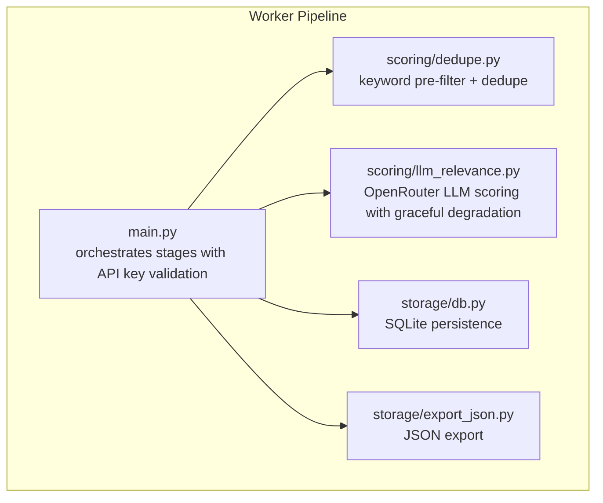
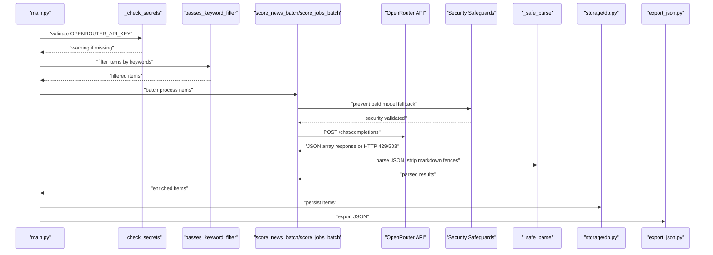
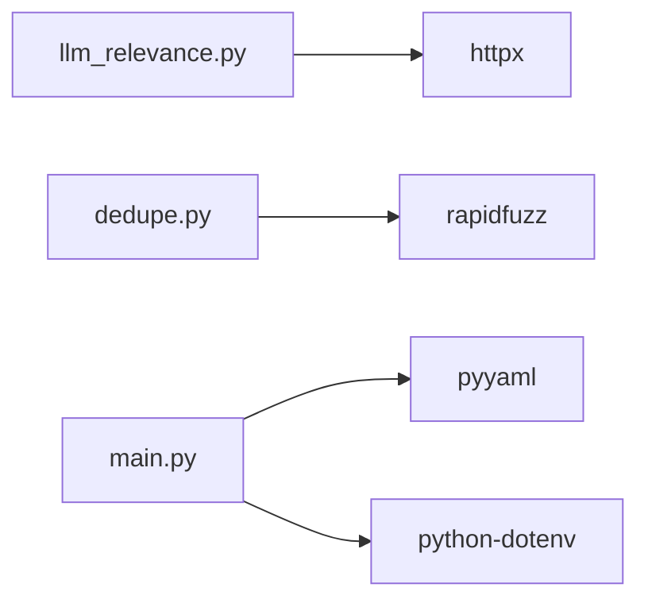

# LLM Relevance Scoring

<cite>
**Referenced Files in This Document**
- [llm_relevance.py](file://worker/scoring/llm_relevance.py)
- [dedupe.py](file://worker/scoring/dedupe.py)
- [main.py](file://worker/main.py)
- [config.yaml](file://worker/config.yaml)
- [db.py](file://worker/storage/db.py)
- [export_json.py](file://worker/storage/export_json.py)
- [requirements.txt](file://worker/requirements.txt)
</cite>

## Update Summary
**Changes Made**
- Enhanced API key handling behavior with graceful degradation when OPENROUTER_API_KEY is missing
- Improved error management with preserved original items during LLM failures
- Updated error handling strategy to warn instead of hard-fail for missing API keys
- Strengthened resilience through graceful degradation patterns

## Table of Contents
1. [Introduction](#introduction)
2. [Project Structure](#project-structure)
3. [Core Components](#core-components)
4. [Architecture Overview](#architecture-overview)
5. [Detailed Component Analysis](#detailed-component-analysis)
6. [Dependency Analysis](#dependency-analysis)
7. [Performance Considerations](#performance-considerations)
8. [Troubleshooting Guide](#troubleshooting-guide)
9. [Conclusion](#conclusion)
10. [Appendices](#appendices)

## Introduction
This document explains the LLM-based relevance scoring system that integrates with OpenRouter to evaluate and enrich content for news and job postings. It covers the OpenRouter integration, prompt engineering strategies, scoring methodology, batch processing, error handling, and operational patterns within the broader processing pipeline. The system now features enhanced API key handling with graceful degradation and improved error management that preserves data integrity even when LLM services are unavailable.

## Project Structure
The relevance scoring system resides in the worker module and participates in a multi-stage pipeline:
- Collection: News and jobs are collected from various sources.
- Deduplication: Duplicate items are removed using deterministic IDs and fuzzy matching.
- Keyword pre-filter: Items are filtered to reduce unnecessary LLM calls.
- LLM scoring: OpenRouter is used to compute relevance scores and extract metadata with enhanced error handling.
- Persistence: Results are stored in SQLite and exported to static JSON.
- Publication: Optional Git publishing and SMTP notifications.

**Diagram sources**
- [main.py:148-306](file://worker/main.py#L148-L306)
- [llm_relevance.py:102-185](file://worker/scoring/llm_relevance.py#L102-L185)
- [dedupe.py:48-92](file://worker/scoring/dedupe.py#L48-L92)
- [db.py:116-278](file://worker/storage/db.py#L116-L278)
- [export_json.py:32-93](file://worker/storage/export_json.py#L32-L93)

**Section sources**
- [main.py:148-306](file://worker/main.py#L148-L306)
- [config.yaml:1-245](file://worker/config.yaml#L1-L245)

## Core Components
- **OpenRouter integration**: HTTP client configured with base URL, API key, and request parameters with enhanced error handling and graceful degradation.
- **Prompt engineering**: Specialized system prompts for news and jobs with strict JSON output requirements.
- **Batch processing**: Chunking items into batches to minimize API calls while respecting rate limits.
- **Enhanced error handling**: Graceful degradation by preserving original items when LLM calls fail, with explicit HTTP 429/503 handling.
- **API key validation**: Graceful handling of missing OPENROUTER_API_KEY with warnings instead of hard failures.
- **Security protections**: Prevention of paid model fallbacks through route configuration and provider settings.
- **Output enrichment**: Adds relevance_score, summary/tags for news; relevance_score, category for jobs.

Key implementation references:
- OpenRouter client and chat endpoint: [llm_relevance.py:52-84](file://worker/scoring/llm_relevance.py#L52-L84)
- News scoring with API key guard: [llm_relevance.py:112-140](file://worker/scoring/llm_relevance.py#L112-L140)
- Jobs scoring with API key guard: [llm_relevance.py:153-184](file://worker/scoring/llm_relevance.py#L153-L184)
- Keyword pre-filter: [dedupe.py:80-92](file://worker/scoring/dedupe.py#L80-L92)
- Pipeline orchestration with API key validation: [main.py:35-47](file://worker/main.py#L35-L47)

**Section sources**
- [llm_relevance.py:16-18](file://worker/scoring/llm_relevance.py#L16-L18)
- [llm_relevance.py:31-48](file://worker/scoring/llm_relevance.py#L31-L48)
- [llm_relevance.py:112-184](file://worker/scoring/llm_relevance.py#L112-L184)
- [dedupe.py:80-92](file://worker/scoring/dedupe.py#L80-L92)
- [main.py:35-47](file://worker/main.py#L35-L47)

## Architecture Overview
The relevance scoring pipeline integrates with OpenRouter to produce structured outputs with enhanced error handling and graceful degradation. The system validates API keys early in the pipeline, uses a keyword pre-filter to reduce LLM calls, then batches items for efficient processing. When LLM services are unavailable or API keys are missing, the system preserves original items to avoid data loss and continues processing with reduced functionality.

**Diagram sources**
- [main.py:148-306](file://worker/main.py#L148-L306)
- [llm_relevance.py:112-184](file://worker/scoring/llm_relevance.py#L112-L184)
- [llm_relevance.py:87-99](file://worker/scoring/llm_relevance.py#L87-L99)
- [db.py:116-278](file://worker/storage/db.py#L116-L278)
- [export_json.py:32-93](file://worker/storage/export_json.py#L32-L93)

## Detailed Component Analysis

### Enhanced API Key Handling and Graceful Degradation
- **Early validation**: The orchestrator validates OPENROUTER_API_KEY at startup and issues warnings instead of hard failures.
- **Per-function guards**: Both news and jobs scoring functions check for API key presence and skip LLM processing with warnings when missing.
- **Data preservation**: When LLM scoring is skipped, original items are returned unchanged, ensuring no data loss.
- **Logging**: Clear warning messages inform users about skipped LLM processing and provide guidance for enabling scoring.
- **Continued operation**: The pipeline continues processing other stages (collection, deduplication, persistence) even without LLM scoring.

**Updated** Enhanced with graceful degradation and improved error management for missing API keys.

Implementation references:
- API key validation in orchestrator: [main.py:35-47](file://worker/main.py#L35-L47)
- API key guard in news scoring: [llm_relevance.py:112-114](file://worker/scoring/llm_relevance.py#L112-L114)
- API key guard in jobs scoring: [llm_relevance.py:153-155](file://worker/scoring/llm_relevance.py#L153-L155)
- Data preservation on LLM failure: [llm_relevance.py:136-138](file://worker/scoring/llm_relevance.py#L136-L138), [llm_relevance.py:180-182](file://worker/scoring/llm_relevance.py#L180-L182)

**Section sources**
- [main.py:35-47](file://worker/main.py#L35-L47)
- [llm_relevance.py:112-114](file://worker/scoring/llm_relevance.py#L112-L114)
- [llm_relevance.py:153-155](file://worker/scoring/llm_relevance.py#L153-L155)
- [llm_relevance.py:136-138](file://worker/scoring/llm_relevance.py#L136-L138)
- [llm_relevance.py:180-182](file://worker/scoring/llm_relevance.py#L180-L182)

### Enhanced OpenRouter Integration
- **Base URL and API key** are loaded from environment variables with defaults.
- **HTTP client** sets Authorization, Content-Type, and referer headers with 60-second timeout.
- **Request payload** includes model, messages, max_tokens, and temperature with enhanced security configurations.
- **Security safeguards**: Explicit prevention of paid model fallbacks through `"route": "fallback"` and `"provider": {"allow_fallbacks": False}`.
- **Enhanced error handling**: Explicit handling of HTTP 429 (rate limit) and 503 (service unavailable) responses with RuntimeError.
- **Chat endpoint** returns the assistant's message content or raises specific errors for security compliance.

**Updated** Enhanced with graceful degradation and improved error handling for API key absence.

Implementation references:
- Environment configuration: [llm_relevance.py:16-18](file://worker/scoring/llm_relevance.py#L16-L18)
- HTTP client: [llm_relevance.py:52-61](file://worker/scoring/llm_relevance.py#L52-L61)
- Chat request with security: [llm_relevance.py:64-84](file://worker/scoring/llm_relevance.py#L64-L84)

**Section sources**
- [llm_relevance.py:16-18](file://worker/scoring/llm_relevance.py#L16-L18)
- [llm_relevance.py:52-84](file://worker/scoring/llm_relevance.py#L52-L84)

### Prompt Engineering Strategies
- **News prompt**: Defines a technical editor role, requires a JSON array with relevance_score, summary, and tags constrained to predefined categories.
- **Jobs prompt**: Defines a technical recruiter role, requires a JSON array with relevance_score and category constrained to predefined categories.
- **Output constraints**: Strictly require JSON arrays, forbid markdown fences, and enforce field presence.

Implementation references:
- News system prompt: [llm_relevance.py:31-39](file://worker/scoring/llm_relevance.py#L31-L39)
- Jobs system prompt: [llm_relevance.py:41-48](file://worker/scoring/llm_relevance.py#L41-L48)
- Tags and categories lists: [llm_relevance.py:20-29](file://worker/scoring/llm_relevance.py#L20-L29)

**Section sources**
- [llm_relevance.py:31-48](file://worker/scoring/llm_relevance.py#L31-L48)
- [llm_relevance.py:20-29](file://worker/scoring/llm_relevance.py#L20-L29)

### Scoring Methodology
- **Inputs**: News items include title and URL; jobs include title and company.
- **Outputs**: Enriched items receive relevance_score, summary/tags for news, and relevance_score/category for jobs.
- **Parsing**: Robust parser strips markdown fences and parses JSON arrays.
- **Security compliance**: All requests include explicit security configurations to prevent paid model fallbacks.
- **Error resilience**: When LLM calls fail, original items are preserved to maintain data integrity.

**Updated** Enhanced with graceful degradation and error resilience mechanisms.

Implementation references:
- News batch scoring: [llm_relevance.py:102-140](file://worker/scoring/llm_relevance.py#L102-L140)
- Jobs batch scoring: [llm_relevance.py:143-184](file://worker/scoring/llm_relevance.py#L143-L184)
- Safe parsing: [llm_relevance.py:87-99](file://worker/scoring/llm_relevance.py#L87-L99)

**Section sources**
- [llm_relevance.py:102-140](file://worker/scoring/llm_relevance.py#L102-L140)
- [llm_relevance.py:143-184](file://worker/scoring/llm_relevance.py#L143-L184)
- [llm_relevance.py:87-99](file://worker/scoring/llm_relevance.py#L87-L99)

### Batch Processing Capabilities
- **Batching**: Items are processed in chunks determined by batch_size.
- **Payload construction**: Each batch serializes a compact representation of items.
- **Failure handling**: On exception, the batch logs an error and preserves original items.
- **Security enforcement**: Each batch respects security configurations to prevent unauthorized model fallbacks.
- **API key validation**: Each batch checks for API key presence and skips processing if missing.

**Updated** Enhanced with API key validation and improved error handling across all batch operations.

Implementation references:
- Batch loop and payload: [llm_relevance.py:119-124](file://worker/scoring/llm_relevance.py#L119-L124)
- News batch handling: [llm_relevance.py:125-140](file://worker/scoring/llm_relevance.py#L125-L140)
- Jobs batch handling: [llm_relevance.py:170-184](file://worker/scoring/llm_relevance.py#L170-L184)

**Section sources**
- [llm_relevance.py:119-140](file://worker/scoring/llm_relevance.py#L119-L140)
- [llm_relevance.py:170-184](file://worker/scoring/llm_relevance.py#L170-L184)

### Confidence Thresholds and Cost Optimization
- **Temperature**: Set low to encourage deterministic outputs and reduce token usage.
- **Max tokens**: Controlled via configuration to bound cost and latency.
- **Pre-filtering**: Keyword-based filtering reduces unnecessary LLM calls.
- **Batch size**: Tunable to balance throughput and cost.
- **Security optimization**: Explicit prevention of paid model fallbacks through route configuration.
- **Graceful degradation**: System continues processing even without LLM scoring capabilities.

**Updated** Enhanced with graceful degradation and cost protection through reduced LLM usage.

Implementation references:
- Configuration: [config.yaml:10-19](file://worker/config.yaml#L10-L19)
- Keyword filter: [dedupe.py:80-92](file://worker/scoring/dedupe.py#L80-L92)
- Batch size usage: [main.py:153](file://worker/main.py#L153)

**Section sources**
- [config.yaml:10-19](file://worker/config.yaml#L10-L19)
- [dedupe.py:80-92](file://worker/scoring/dedupe.py#L80-L92)
- [main.py:153](file://worker/main.py#L153)

### Integration Patterns with the Pipeline
- **Early API key validation**: The orchestrator validates secrets before starting processing to provide immediate feedback.
- **Keyword pre-filter** is applied before LLM scoring to reduce cost and improve throughput.
- **Scoring functions** are invoked from the orchestrator with model and batch_size from configuration.
- **Results** are persisted to SQLite and exported to JSON for downstream consumption.
- **Security compliance** is enforced at every stage of the pipeline.
- **Graceful degradation** ensures pipeline completion even without LLM scoring capabilities.

**Updated** Enhanced with early API key validation and graceful degradation patterns.

Implementation references:
- Early API key validation: [main.py:148-149](file://worker/main.py#L148-L149)
- Keyword pre-filter and scoring: [main.py:206-267](file://worker/main.py#L206-L267)
- Jobs scoring: [main.py:262-267](file://worker/main.py#L262-L267)
- Persistence and export: [db.py:116-278](file://worker/storage/db.py#L116-L278), [export_json.py:32-93](file://worker/storage/export_json.py#L32-L93)

**Section sources**
- [main.py:148-149](file://worker/main.py#L148-L149)
- [main.py:206-267](file://worker/main.py#L206-L267)
- [main.py:262-267](file://worker/main.py#L262-L267)
- [db.py:116-278](file://worker/storage/db.py#L116-L278)
- [export_json.py:32-93](file://worker/storage/export_json.py#L32-L93)

## Dependency Analysis
External dependencies relevant to LLM scoring:
- **httpx**: HTTP client for OpenRouter requests with enhanced security features.
- **rapidfuzz**: Fuzzy matching for deduplication.
- **pyyaml and python-dotenv**: Configuration loading and environment support.

**Diagram sources**
- [requirements.txt:1-11](file://worker/requirements.txt#L1-L11)
- [llm_relevance.py:12](file://worker/scoring/llm_relevance.py#L12)
- [dedupe.py:12](file://worker/scoring/dedupe.py#L12)

**Section sources**
- [requirements.txt:1-11](file://worker/requirements.txt#L1-L11)

## Performance Considerations
- **Batch sizing**: Tune batch_size to balance throughput and cost; larger batches reduce API calls but increase memory and latency.
- **Pre-filtering**: Use keyword_filter to avoid LLM calls for irrelevant items.
- **Token limits**: Control max_tokens to cap cost and response time.
- **Model selection**: Choose a smaller model for cost-sensitive scenarios; adjust temperature for determinism.
- **Security overhead**: Enhanced security configurations add minimal overhead while providing critical cost protection.
- **Graceful degradation**: System continues processing even without LLM scoring, reducing pipeline downtime.
- **Retry/backoff**: Not implemented; consider adding retry logic for transient failures.

**Updated** Enhanced with graceful degradation benefits and cost protection through reduced LLM usage.

## Troubleshooting Guide
Common issues and remedies:
- **Missing API key**: If OPENROUTER_API_KEY is unset, LLM scoring is skipped with a warning. Set the environment variable to enable scoring. The system continues processing other pipeline stages.
- **Security violations**: If free model fallback is attempted, a RuntimeError is raised to prevent paid model usage. Check model availability and configuration.
- **Rate limiting**: HTTP 429 responses trigger RuntimeError with clear messaging to avoid paid fallbacks. Implement backoff strategies.
- **Service unavailability**: HTTP 503 responses trigger RuntimeError with specific error handling. Monitor service health.
- **LLM API failures**: Exceptions during scoring preserve original items and log errors; investigate network connectivity and quotas.
- **JSON parsing errors**: The parser strips markdown fences; ensure the LLM adheres to the required JSON format.
- **Keyword pre-filter blocking items**: Verify keyword_filter configuration and adjust keywords if needed.
- **Graceful degradation**: When API key is missing, items are processed without LLM scoring but with full pipeline functionality.

**Updated** Enhanced with graceful degradation and API key handling guidance.

Operational references:
- API key guard: [llm_relevance.py:112-114](file://worker/scoring/llm_relevance.py#L112-L114), [llm_relevance.py:153-155](file://worker/scoring/llm_relevance.py#L153-L155)
- Early API key validation: [main.py:35-47](file://worker/main.py#L35-L47)
- Security error handling: [llm_relevance.py:81-83](file://worker/scoring/llm_relevance.py#L81-L83)
- Error logging and fallback: [llm_relevance.py:136-138](file://worker/scoring/llm_relevance.py#L136-L138), [llm_relevance.py:180-182](file://worker/scoring/llm_relevance.py#L180-L182)
- Safe parsing: [llm_relevance.py:87-99](file://worker/scoring/llm_relevance.py#L87-L99)
- Keyword filter: [dedupe.py:80-92](file://worker/scoring/dedupe.py#L80-L92)

**Section sources**
- [llm_relevance.py:112-114](file://worker/scoring/llm_relevance.py#L112-L114)
- [llm_relevance.py:153-155](file://worker/scoring/llm_relevance.py#L153-L155)
- [main.py:35-47](file://worker/main.py#L35-L47)
- [llm_relevance.py:81-83](file://worker/scoring/llm_relevance.py#L81-L83)
- [llm_relevance.py:136-138](file://worker/scoring/llm_relevance.py#L136-L138)
- [llm_relevance.py:180-182](file://worker/scoring/llm_relevance.py#L180-L182)
- [llm_relevance.py:87-99](file://worker/scoring/llm_relevance.py#L87-L99)
- [dedupe.py:80-92](file://worker/scoring/dedupe.py#L80-L92)

## Conclusion
The LLM relevance scoring system integrates OpenRouter to produce structured, cost-conscious evaluations of news and jobs with enhanced error handling and graceful degradation. By combining early API key validation, keyword pre-filtering, batching, strict prompt engineering, and explicit security safeguards, it achieves reliable enrichment while preventing unintended paid model usage. The design emphasizes resilience through graceful error handling, security compliance, and maintains a clean separation between orchestration, scoring, persistence, and export. The system now provides robust fallback behavior when LLM services are unavailable, ensuring pipeline continuity and data integrity.

**Updated** Enhanced with graceful degradation and improved error management capabilities.

## Appendices

### Customizing Scoring Prompts
- Modify NEWS_SYSTEM and JOB_SYSTEM to change roles, constraints, or output fields.
- Adjust tags and categories lists to align with domain taxonomy.
- Ensure the LLM returns strictly formatted JSON arrays as required.

References:
- News prompt: [llm_relevance.py:31-39](file://worker/scoring/llm_relevance.py#L31-L39)
- Jobs prompt: [llm_relevance.py:41-48](file://worker/scoring/llm_relevance.py#L41-L48)
- Tags and categories: [llm_relevance.py:20-29](file://worker/scoring/llm_relevance.py#L20-L29)

**Section sources**
- [llm_relevance.py:31-48](file://worker/scoring/llm_relevance.py#L31-L48)
- [llm_relevance.py:20-29](file://worker/scoring/llm_relevance.py#L20-L29)

### Enhanced Security Measures
- **Route configuration**: `"route": "fallback"` ensures requests use the specified model path.
- **Provider controls**: `"allow_fallbacks": False` prevents automatic fallback to paid models.
- **Error handling**: Explicit RuntimeError for HTTP 429/503 responses to avoid paid model usage.
- **Cost protection**: Security configurations prevent unexpected charges from model fallbacks.

**New** Added comprehensive security measures and cost protection strategies.

References:
- Security configuration: [llm_relevance.py:73-78](file://worker/scoring/llm_relevance.py#L73-L78)
- Error handling: [llm_relevance.py:81-83](file://worker/scoring/llm_relevance.py#L81-L83)

**Section sources**
- [llm_relevance.py:73-78](file://worker/scoring/llm_relevance.py#L73-L78)
- [llm_relevance.py:81-83](file://worker/scoring/llm_relevance.py#L81-L83)

### Handling LLM API Failures
- The scoring functions catch exceptions and preserve original items.
- **Enhanced error handling**: Specific handling for HTTP 429/503 responses with clear messaging.
- **Security compliance**: RuntimeError raised to prevent paid model fallback attempts.
- **Graceful degradation**: When API key is missing, functions return original items with warnings.
- Logs include batch index and error details for diagnostics.
- Consider adding retry logic and circuit breaker patterns for production deployments.

**Updated** Enhanced with graceful degradation and API key handling capabilities.

References:
- News batch exception handling: [llm_relevance.py:136-138](file://worker/scoring/llm_relevance.py#L136-L138)
- Jobs batch exception handling: [llm_relevance.py:180-182](file://worker/scoring/llm_relevance.py#L180-L182)
- API key guard behavior: [llm_relevance.py:112-114](file://worker/scoring/llm_relevance.py#L112-L114), [llm_relevance.py:153-155](file://worker/scoring/llm_relevance.py#L153-L155)
- Security error handling: [llm_relevance.py:81-83](file://worker/scoring/llm_relevance.py#L81-L83)

**Section sources**
- [llm_relevance.py:136-138](file://worker/scoring/llm_relevance.py#L136-L138)
- [llm_relevance.py:180-182](file://worker/scoring/llm_relevance.py#L180-L182)
- [llm_relevance.py:112-114](file://worker/scoring/llm_relevance.py#L112-L114)
- [llm_relevance.py:153-155](file://worker/scoring/llm_relevance.py#L153-L155)
- [llm_relevance.py:81-83](file://worker/scoring/llm_relevance.py#L81-L83)

### Optimizing Cost-Effectiveness
- **Reduce calls**: Use keyword_filter and passes_keyword_filter to gate LLM usage.
- **Tune parameters**: Lower temperature and max_tokens; select a smaller model.
- **Batch efficiently**: Increase batch_size to amortize fixed costs.
- **Security optimization**: Enhanced security configurations prevent unexpected paid model usage.
- **Graceful degradation**: Reduced LLM usage when API key is missing, minimizing costs.
- **Rate limiting awareness**: Built-in handling for HTTP 429 responses to avoid retries that could increase costs.

**Updated** Enhanced with graceful degradation and rate limiting cost optimization strategies.

References:
- Configuration: [config.yaml:10-19](file://worker/config.yaml#L10-L19)
- Keyword filter: [dedupe.py:80-92](file://worker/scoring/dedupe.py#L80-L92)
- Batch usage: [main.py:153](file://worker/main.py#L153)

**Section sources**
- [config.yaml:10-19](file://worker/config.yaml#L10-L19)
- [dedupe.py:80-92](file://worker/scoring/dedupe.py#L80-L92)
- [main.py:153](file://worker/main.py#L153)

### API Key Management Best Practices
- **Environment configuration**: Store OPENROUTER_API_KEY in environment variables, not in config.yaml.
- **Early validation**: The system validates API keys at startup and provides clear warnings.
- **Graceful handling**: Missing API keys don't halt the pipeline; processing continues without LLM scoring.
- **Fallback behavior**: Items are processed with relevance_score=0.0 but all other pipeline stages complete successfully.
- **Monitoring**: Clear warning messages help operators understand why LLM scoring is disabled.

**New** Added comprehensive API key management guidance.

References:
- API key validation: [main.py:35-47](file://worker/main.py#L35-L47)
- API key guard in scoring: [llm_relevance.py:112-114](file://worker/scoring/llm_relevance.py#L112-L114), [llm_relevance.py:153-155](file://worker/scoring/llm_relevance.py#L153-L155)
- Graceful degradation behavior: [llm_relevance.py:136-138](file://worker/scoring/llm_relevance.py#L136-L138), [llm_relevance.py:180-182](file://worker/scoring/llm_relevance.py#L180-L182)

**Section sources**
- [main.py:35-47](file://worker/main.py#L35-L47)
- [llm_relevance.py:112-114](file://worker/scoring/llm_relevance.py#L112-L114)
- [llm_relevance.py:153-155](file://worker/scoring/llm_relevance.py#L153-L155)
- [llm_relevance.py:136-138](file://worker/scoring/llm_relevance.py#L136-L138)
- [llm_relevance.py:180-182](file://worker/scoring/llm_relevance.py#L180-L182)