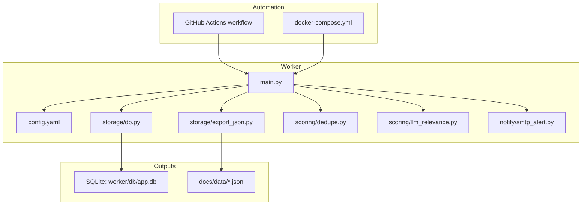
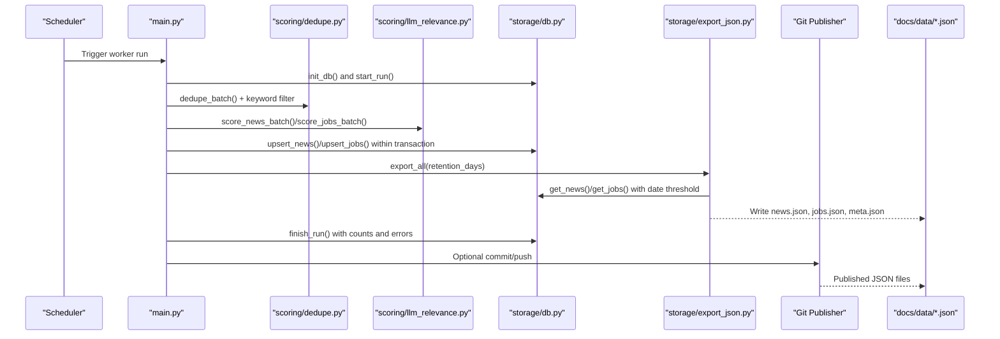
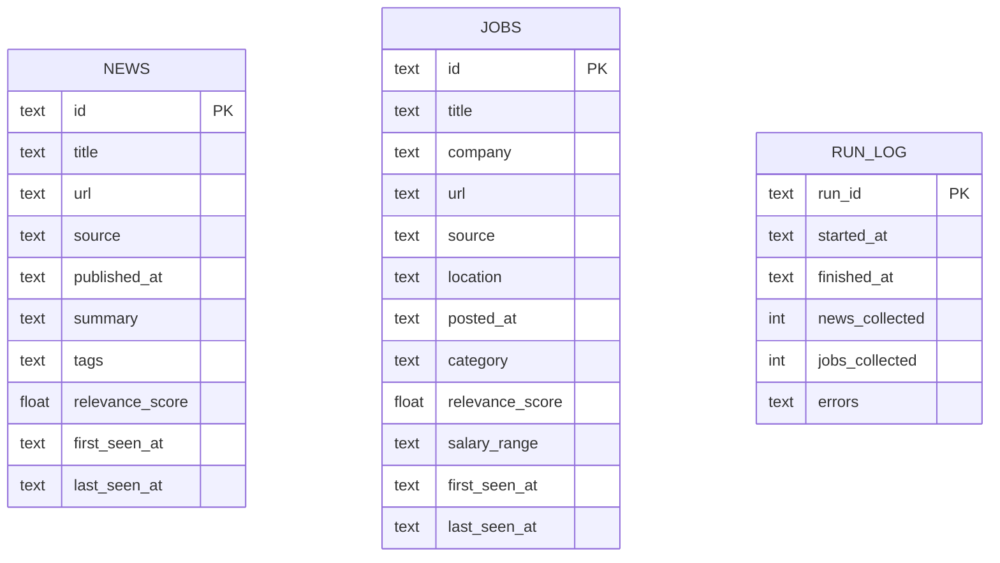
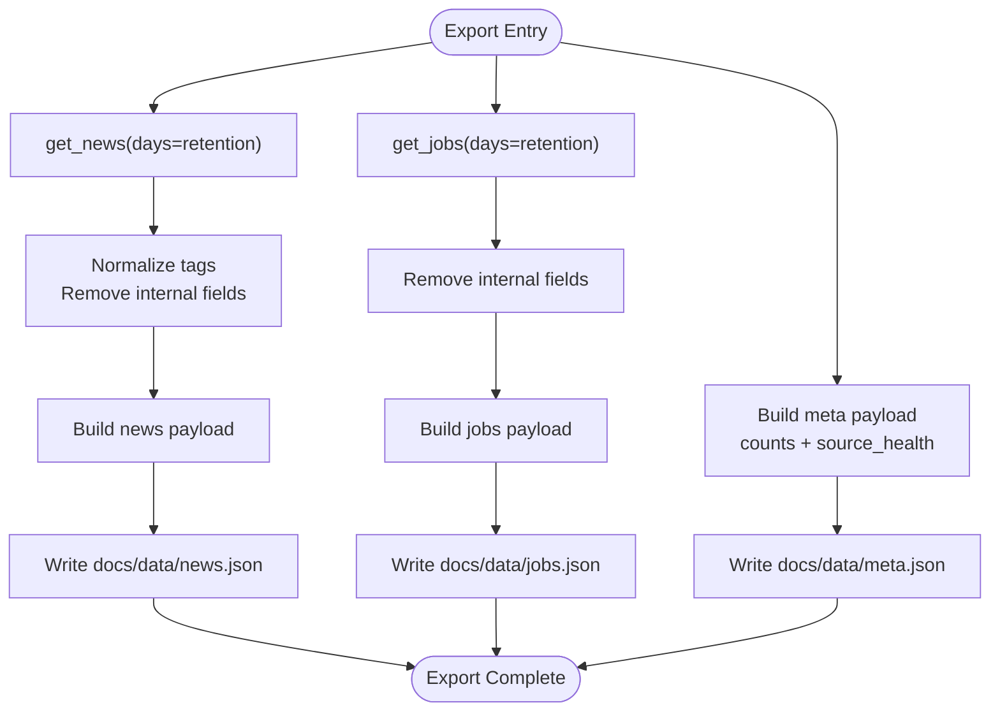
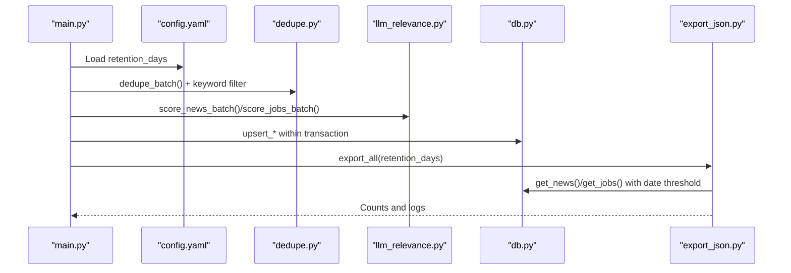
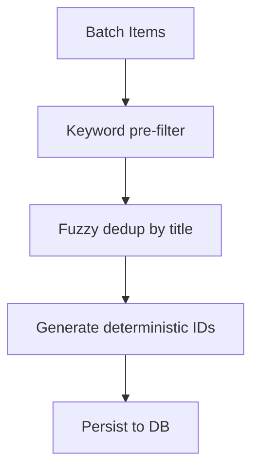
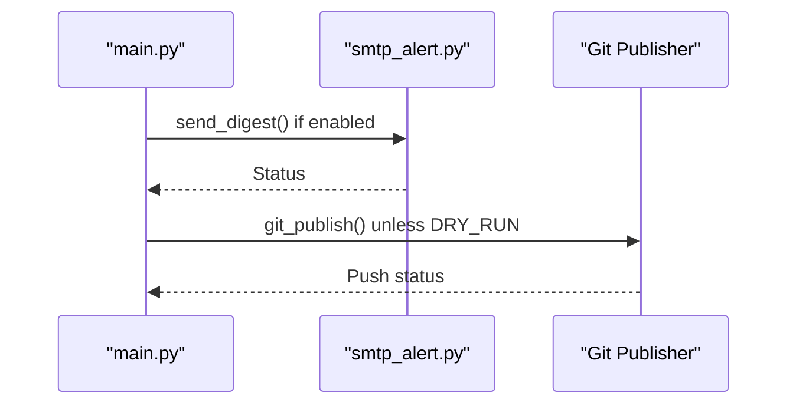
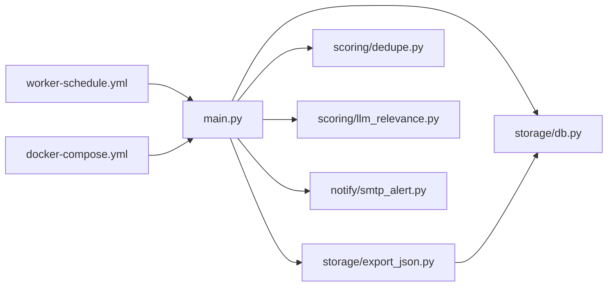

# Data Lifecycle Management

<cite>
**Referenced Files in This Document**
- [worker/storage/db.py](file://worker/storage/db.py)
- [worker/storage/export_json.py](file://worker/storage/export_json.py)
- [worker/main.py](file://worker/main.py)
- [worker/config.yaml](file://worker/config.yaml)
- [worker/scoring/dedupe.py](file://worker/scoring/dedupe.py)
- [worker/scoring/llm_relevance.py](file://worker/scoring/llm_relevance.py)
- [worker/notify/smtp_alert.py](file://worker/notify/smtp_alert.py)
- [.github/workflows/worker-schedule.yml](file://.github/workflows/worker-schedule.yml)
- [docker-compose.yml](file://docker-compose.yml)
- [tests/test_schema.py](file://tests/test_schema.py)
- [worker/requirements.txt](file://worker/requirements.txt)
</cite>

## Table of Contents
1. [Introduction](#introduction)
2. [Project Structure](#project-structure)
3. [Core Components](#core-components)
4. [Architecture Overview](#architecture-overview)
5. [Detailed Component Analysis](#detailed-component-analysis)
6. [Dependency Analysis](#dependency-analysis)
7. [Performance Considerations](#performance-considerations)
8. [Troubleshooting Guide](#troubleshooting-guide)
9. [Conclusion](#conclusion)
10. [Appendices](#appendices)

## Introduction
This document describes the data lifecycle management for the project, focusing on how data is collected, processed, stored, exported, validated, and published. It explains retention policies, automatic cleanup via date thresholds, storage optimization, and database maintenance. It also covers backup and restore approaches, data integrity verification, monitoring, and disaster recovery planning, including migration scenarios.

## Project Structure
The system is organized around a worker that orchestrates collection, deduplication, scoring, persistence, export, and publication. Data is stored in an SQLite database and exported to static JSON files consumed by the documentation site.

**Diagram sources**
- [worker/main.py:127-297](file://worker/main.py#L127-L297)
- [worker/storage/db.py:17-67](file://worker/storage/db.py#L17-L67)
- [worker/storage/export_json.py:32-93](file://worker/storage/export_json.py#L32-L93)
- [worker/config.yaml:6-7](file://worker/config.yaml#L6-L7)
- [worker/scoring/dedupe.py:19-44](file://worker/scoring/dedupe.py#L19-L44)
- [worker/scoring/llm_relevance.py:95-133](file://worker/scoring/llm_relevance.py#L95-L133)
- [worker/notify/smtp_alert.py:64-105](file://worker/notify/smtp_alert.py#L64-L105)
- [.github/workflows/worker-schedule.yml:22-70](file://.github/workflows/worker-schedule.yml#L22-L70)
- [docker-compose.yml:13-47](file://docker-compose.yml#L13-L47)

**Section sources**
- [worker/main.py:127-297](file://worker/main.py#L127-L297)
- [worker/storage/db.py:17-67](file://worker/storage/db.py#L17-L67)
- [worker/storage/export_json.py:32-93](file://worker/storage/export_json.py#L32-L93)
- [worker/config.yaml:6-7](file://worker/config.yaml#L6-L7)
- [docker-compose.yml:13-47](file://docker-compose.yml#L13-L47)
- [.github/workflows/worker-schedule.yml:1-70](file://.github/workflows/worker-schedule.yml#L1-L70)

## Core Components
- Database layer: schema definition, connection helpers, transactions, and CRUD operations for news and jobs, plus a run log.
- Export layer: reads from the database and writes three JSON artifacts for consumption by the documentation site.
- Orchestrator: coordinates collection, deduplication, scoring, persistence, export, run logging, optional publishing, and optional SMTP digest.
- Configuration: retention window, LLM parameters, keyword filters, and source-specific settings.
- Scoring and deduplication: deterministic hashing for IDs, fuzzy deduplication, and keyword pre-filtering.
- Notifications: optional SMTP digest for high-relevance items.
- Automation: scheduled runs via GitHub Actions and local Docker Compose orchestration.

**Section sources**
- [worker/storage/db.py:17-67](file://worker/storage/db.py#L17-L67)
- [worker/storage/export_json.py:32-93](file://worker/storage/export_json.py#L32-L93)
- [worker/main.py:127-297](file://worker/main.py#L127-L297)
- [worker/config.yaml:6-7](file://worker/config.yaml#L6-L7)
- [worker/scoring/dedupe.py:19-44](file://worker/scoring/dedupe.py#L19-L44)
- [worker/scoring/llm_relevance.py:95-133](file://worker/scoring/llm_relevance.py#L95-L133)
- [worker/notify/smtp_alert.py:64-105](file://worker/notify/smtp_alert.py#L64-L105)

## Architecture Overview
The lifecycle spans from collection to export and publication. The retention policy is enforced during export to limit the dataset to recent items.

**Diagram sources**
- [.github/workflows/worker-schedule.yml:14-57](file://.github/workflows/worker-schedule.yml#L14-L57)
- [worker/main.py:127-297](file://worker/main.py#L127-L297)
- [worker/scoring/dedupe.py:48-76](file://worker/scoring/dedupe.py#L48-L76)
- [worker/scoring/llm_relevance.py:95-177](file://worker/scoring/llm_relevance.py#L95-L177)
- [worker/storage/db.py:116-242](file://worker/storage/db.py#L116-L242)
- [worker/storage/export_json.py:32-93](file://worker/storage/export_json.py#L32-L93)
- [worker/notify/smtp_alert.py:64-105](file://worker/notify/smtp_alert.py#L64-L105)

## Detailed Component Analysis

### Database Layer
- Schema: two main tables (news and jobs) with timestamps for first and last seen, plus a run log. Indexes are created on date and source fields to optimize queries.
- Transactions: a context manager ensures atomicity for bulk inserts.
- Upsert logic: updates last_seen_at and selected fields while preserving existing metadata; inserts new records with current timestamps.
- Queries: retrieval functions apply a date threshold to limit results to the configured retention window.

**Diagram sources**
- [worker/storage/db.py:22-67](file://worker/storage/db.py#L22-L67)

**Section sources**
- [worker/storage/db.py:17-67](file://worker/storage/db.py#L17-L67)
- [worker/storage/db.py:116-242](file://worker/storage/db.py#L116-L242)

### Export Pipeline
- Reads from the database using retention-aware getters.
- Writes three JSON files: news.json, jobs.json, and meta.json.
- Removes internal fields prior to export and normalizes tags.
- Emits counts and source health metrics for downstream consumers.

**Diagram sources**
- [worker/storage/export_json.py:32-93](file://worker/storage/export_json.py#L32-L93)
- [worker/storage/db.py:163-242](file://worker/storage/db.py#L163-L242)

**Section sources**
- [worker/storage/export_json.py:32-93](file://worker/storage/export_json.py#L32-L93)
- [worker/storage/db.py:163-242](file://worker/storage/db.py#L163-L242)

### Orchestrator and Retention Policy
- Loads configuration including retention_days.
- Applies keyword pre-filter and fuzzy deduplication before scoring.
- Persists items to the database and exports JSON with the same retention window.
- Records run metadata and optionally publishes to Git and sends SMTP digest.

**Diagram sources**
- [worker/main.py:127-297](file://worker/main.py#L127-L297)
- [worker/config.yaml:6-7](file://worker/config.yaml#L6-L7)
- [worker/scoring/dedupe.py:48-90](file://worker/scoring/dedupe.py#L48-L90)
- [worker/scoring/llm_relevance.py:95-177](file://worker/scoring/llm_relevance.py#L95-L177)
- [worker/storage/db.py:116-242](file://worker/storage/db.py#L116-L242)
- [worker/storage/export_json.py:32-93](file://worker/storage/export_json.py#L32-L93)

**Section sources**
- [worker/main.py:127-297](file://worker/main.py#L127-L297)
- [worker/config.yaml:6-7](file://worker/config.yaml#L6-L7)

### Scoring and Deduplication
- Deterministic IDs derived from stable keys to prevent duplicates across runs.
- Fuzzy title deduplication reduces near-duplicates within a batch.
- Keyword pre-filter reduces LLM calls by limiting processing to relevant items.

**Diagram sources**
- [worker/scoring/dedupe.py:19-76](file://worker/scoring/dedupe.py#L19-L76)
- [worker/scoring/llm_relevance.py:95-133](file://worker/scoring/llm_relevance.py#L95-L133)

**Section sources**
- [worker/scoring/dedupe.py:19-76](file://worker/scoring/dedupe.py#L19-L76)
- [worker/scoring/llm_relevance.py:95-133](file://worker/scoring/llm_relevance.py#L95-L133)

### Notifications and Publication
- Optional SMTP digest for high-relevance items.
- Git publish step commits and pushes updated JSON files when configured.

**Diagram sources**
- [worker/main.py:274-287](file://worker/main.py#L274-L287)
- [worker/notify/smtp_alert.py:64-105](file://worker/notify/smtp_alert.py#L64-L105)

**Section sources**
- [worker/main.py:274-287](file://worker/main.py#L274-L287)
- [worker/notify/smtp_alert.py:64-105](file://worker/notify/smtp_alert.py#L64-L105)

## Dependency Analysis
- The orchestrator depends on the database layer for persistence and retrieval, the export layer for artifact generation, and the scoring/deduplication modules for quality gates.
- The export layer depends on the database getters to enforce retention.
- Automation relies on GitHub Actions or Docker Compose to schedule runs and mount persistent volumes for the database and output directory.

**Diagram sources**
- [worker/main.py:127-297](file://worker/main.py#L127-L297)
- [worker/storage/db.py:17-67](file://worker/storage/db.py#L17-L67)
- [worker/storage/export_json.py:32-93](file://worker/storage/export_json.py#L32-L93)
- [worker/scoring/dedupe.py:19-76](file://worker/scoring/dedupe.py#L19-L76)
- [worker/scoring/llm_relevance.py:95-177](file://worker/scoring/llm_relevance.py#L95-L177)
- [worker/notify/smtp_alert.py:64-105](file://worker/notify/smtp_alert.py#L64-L105)
- [.github/workflows/worker-schedule.yml:22-70](file://.github/workflows/worker-schedule.yml#L22-L70)
- [docker-compose.yml:13-47](file://docker-compose.yml#L13-L47)

**Section sources**
- [worker/main.py:127-297](file://worker/main.py#L127-L297)
- [worker/storage/db.py:17-67](file://worker/storage/db.py#L17-L67)
- [worker/storage/export_json.py:32-93](file://worker/storage/export_json.py#L32-L93)
- [worker/scoring/dedupe.py:19-76](file://worker/scoring/dedupe.py#L19-L76)
- [worker/scoring/llm_relevance.py:95-177](file://worker/scoring/llm_relevance.py#L95-L177)
- [worker/notify/smtp_alert.py:64-105](file://worker/notify/smtp_alert.py#L64-L105)
- [.github/workflows/worker-schedule.yml:22-70](file://.github/workflows/worker-schedule.yml#L22-L70)
- [docker-compose.yml:13-47](file://docker-compose.yml#L13-L47)

## Performance Considerations
- Retention window: The retention_days setting limits query sizes and export payloads, reducing memory and IO overhead.
- Indexes: Date and source indexes improve filtering performance for recent items.
- Batch processing: LLM scoring uses configurable batch sizes to balance throughput and cost.
- Transaction batching: Bulk upserts are wrapped in a single transaction to reduce WAL overhead.
- Keyword pre-filter: Reduces unnecessary LLM calls and speeds processing.
- Storage layout: Persistent SQLite volume and mounted JSON output directory minimize disk churn.

[No sources needed since this section provides general guidance]

## Troubleshooting Guide
- Validation failures: The test suite validates JSON schema and content. Use it to catch malformed outputs.
- Missing environment variables: Ensure required variables are set for OpenRouter, SMTP, and Git publishing.
- Dry-run mode: Use DRY_RUN to skip publishing and preview effects.
- LLM errors: The scoring functions log and continue processing unscored items to avoid partial failure.
- Git publish errors: The publisher logs failures and continues; verify credentials and repository URLs.

**Section sources**
- [tests/test_schema.py:1-136](file://tests/test_schema.py#L1-L136)
- [worker/main.py:274-287](file://worker/main.py#L274-L287)
- [worker/scoring/llm_relevance.py:129-131](file://worker/scoring/llm_relevance.py#L129-L131)
- [worker/notify/smtp_alert.py:101-104](file://worker/notify/smtp_alert.py#L101-L104)

## Conclusion
The system enforces a strict retention window during export, uses deterministic IDs and fuzzy deduplication to maintain data quality, and applies keyword pre-filtering to optimize LLM usage. The database schema supports efficient queries, and the export process produces validated JSON artifacts. Automation via GitHub Actions or Docker Compose enables reliable scheduling, while optional notifications and publishing streamline distribution.

[No sources needed since this section summarizes without analyzing specific files]

## Appendices

### Data Retention and Cleanup Procedures
- Retention policy: Controlled by retention_days in configuration. Export functions filter items older than the retention threshold.
- Automatic cleanup: No explicit pruning script exists; retention is enforced at read/export time.
- Practical examples:
  - Reduce retention_days to shrink dataset size and export time.
  - Increase batch_size to lower API costs at the expense of latency.
  - Adjust keyword_filter to reduce LLM calls and storage growth.

**Section sources**
- [worker/config.yaml:6-7](file://worker/config.yaml#L6-L7)
- [worker/storage/export_json.py:32-93](file://worker/storage/export_json.py#L32-L93)
- [worker/storage/db.py:163-242](file://worker/storage/db.py#L163-L242)

### Storage Optimization Techniques
- Use retention_days to cap dataset size.
- Enable fuzzy deduplication to remove near-duplicates.
- Apply keyword pre-filter to avoid storing irrelevant items.
- Keep SQLite in WAL mode and use indexes for efficient reads.

**Section sources**
- [worker/storage/db.py:22-67](file://worker/storage/db.py#L22-L67)
- [worker/scoring/dedupe.py:48-76](file://worker/scoring/dedupe.py#L48-L76)
- [worker/scoring/llm_relevance.py:95-133](file://worker/scoring/llm_relevance.py#L95-L133)

### Database Maintenance Tasks
- Connection and transactions: Use the provided connection helper and transaction context manager for safe writes.
- Integrity checks: Validate JSON outputs with the test suite to ensure schema compliance.
- Monitoring: Inspect run logs for errors and counts.

**Section sources**
- [worker/storage/db.py:71-95](file://worker/storage/db.py#L71-L95)
- [tests/test_schema.py:1-136](file://tests/test_schema.py#L1-L136)
- [worker/storage/db.py:246-278](file://worker/storage/db.py#L246-L278)

### Backup and Restore Procedures
- Backup: Persist the SQLite database directory and the generated JSON artifacts. The Docker Compose setup mounts the database and output directories for persistence.
- Restore: Rehydrate the database and JSON files from backups; re-run the export to reconcile any inconsistencies.
- Version control: Treat docs/data/*.json as immutable artifacts; rely on Git history for rollbacks.

**Section sources**
- [docker-compose.yml:24-28](file://docker-compose.yml#L24-L28)
- [.github/workflows/worker-schedule.yml:63-70](file://.github/workflows/worker-schedule.yml#L63-L70)

### Data Integrity Verification
- JSON schema validation: The test suite verifies top-level keys, required fields, types, and uniqueness of IDs.
- Post-export checks: Run the validation step after each export to catch regressions early.

**Section sources**
- [tests/test_schema.py:28-136](file://tests/test_schema.py#L28-L136)

### Monitoring Approaches
- Logs: Configure LOG_LEVEL to capture sufficient detail for operational visibility.
- Run logs: The run_log table stores counts and errors per run for auditing.
- Alerts: Optional SMTP digest highlights high-relevance items.

**Section sources**
- [worker/main.py:28-35](file://worker/main.py#L28-L35)
- [worker/storage/db.py:246-278](file://worker/storage/db.py#L246-L278)
- [worker/notify/smtp_alert.py:64-105](file://worker/notify/smtp_alert.py#L64-L105)

### Disaster Recovery Planning
- Recovery from data loss:
  - Recreate the database from scratch by re-running the pipeline; historical JSON remains available for inspection.
  - Restore database and JSON from backups; re-run export to confirm consistency.
- Recovery from configuration drift:
  - Revert to a known-good configuration and re-run the pipeline.
- Recovery from automation failures:
  - Manually trigger a run via GitHub Actions or Docker Compose; inspect logs and run logs.

**Section sources**
- [.github/workflows/worker-schedule.yml:22-70](file://.github/workflows/worker-schedule.yml#L22-L70)
- [docker-compose.yml:13-47](file://docker-compose.yml#L13-L47)
- [worker/storage/db.py:246-278](file://worker/storage/db.py#L246-L278)

### Data Migration Scenarios
- Moving from ephemeral to persistent storage:
  - Mount a persistent volume for the database and output directories; the worker will continue operating seamlessly.
- Changing retention windows:
  - Adjust retention_days; re-run the pipeline to regenerate JSON with the new window.
- Switching automation:
  - Replace GitHub Actions with a cron-based Docker Compose approach or vice versa; ensure environment variables remain consistent.

**Section sources**
- [docker-compose.yml:24-28](file://docker-compose.yml#L24-L28)
- [worker/config.yaml:6-7](file://worker/config.yaml#L6-L7)
- [.github/workflows/worker-schedule.yml:14-57](file://.github/workflows/worker-schedule.yml#L14-L57)