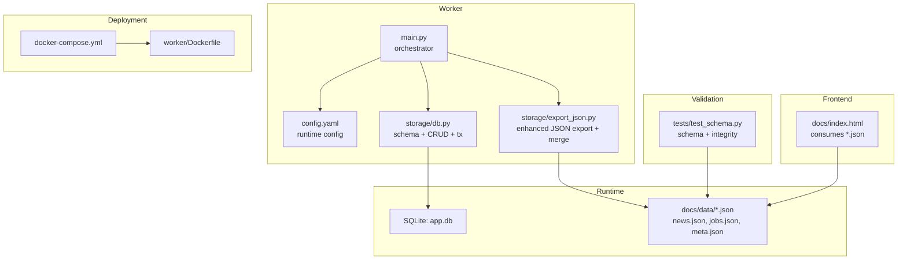
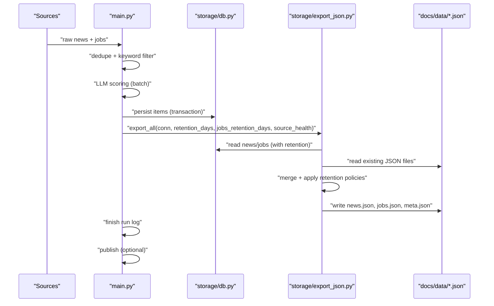
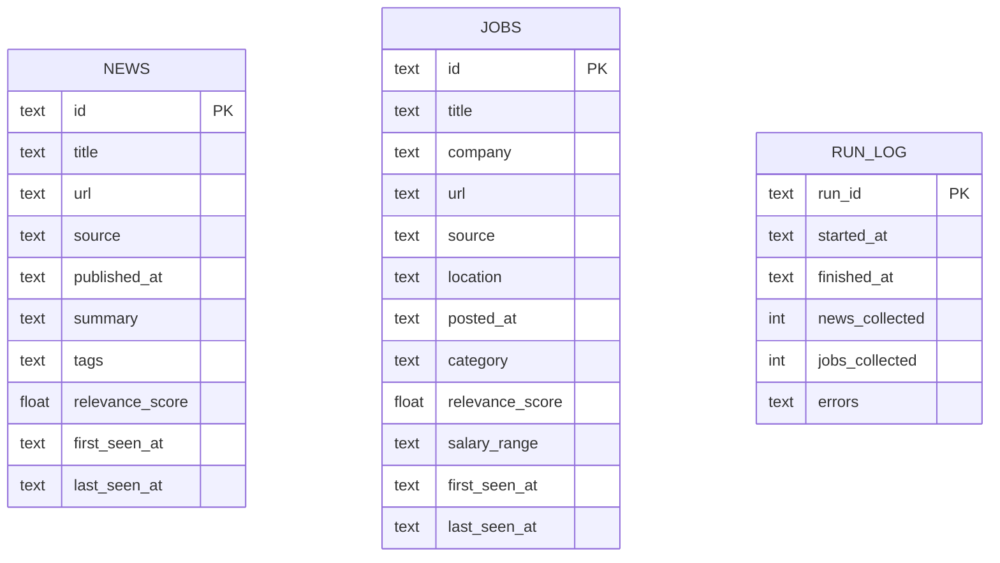
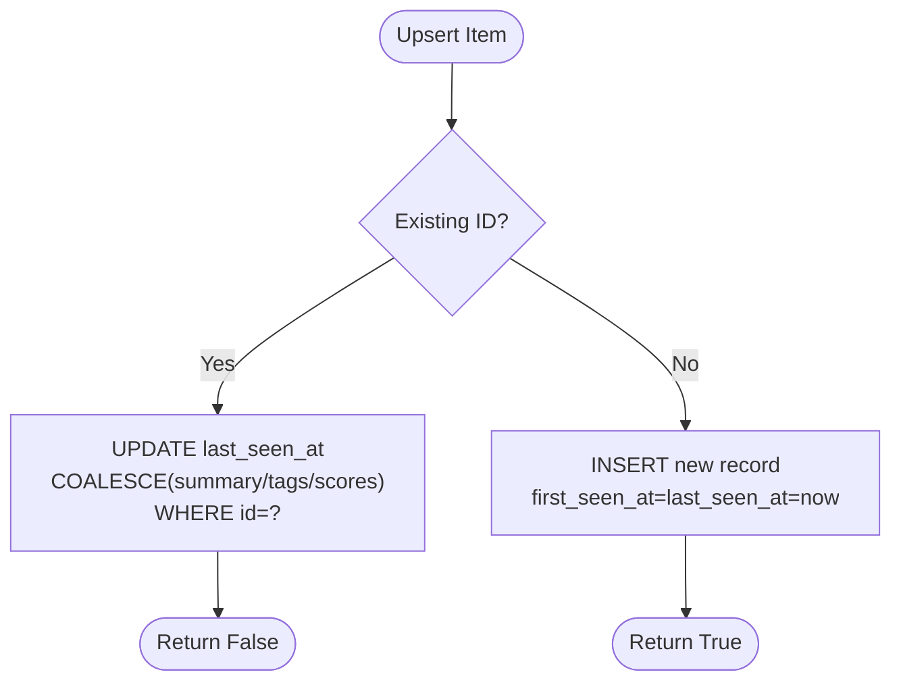
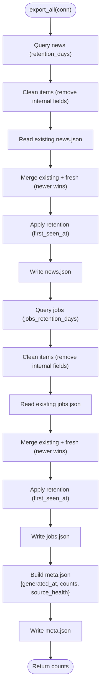
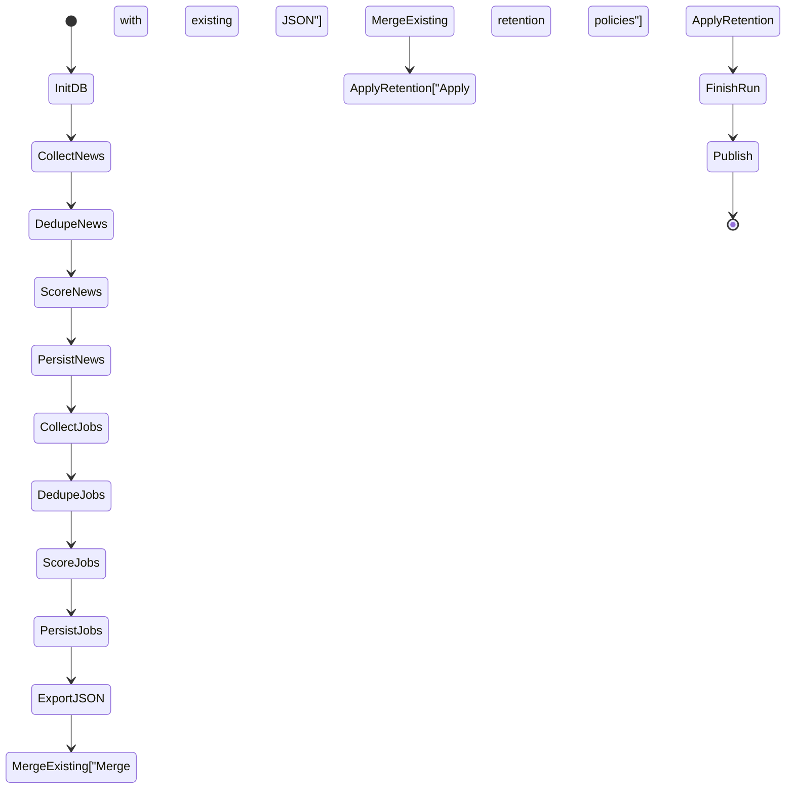
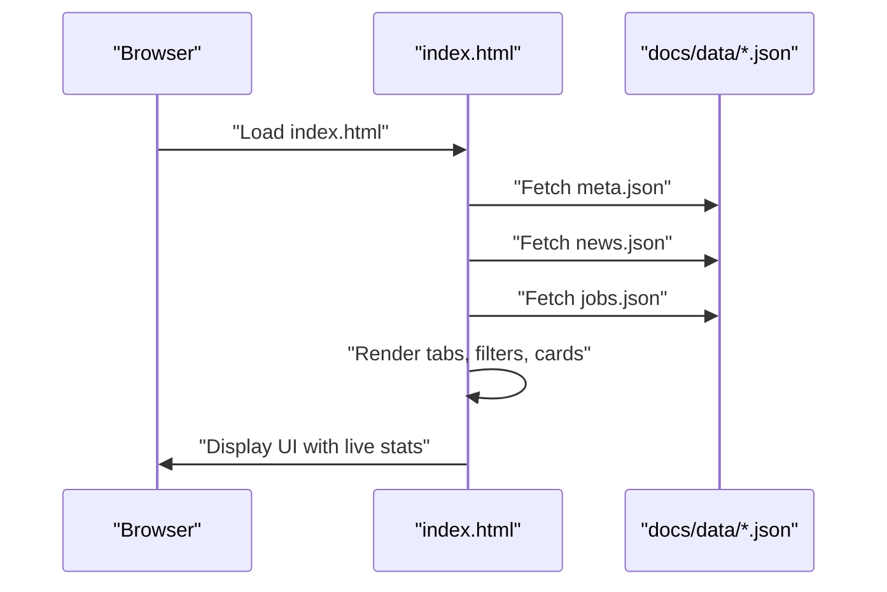
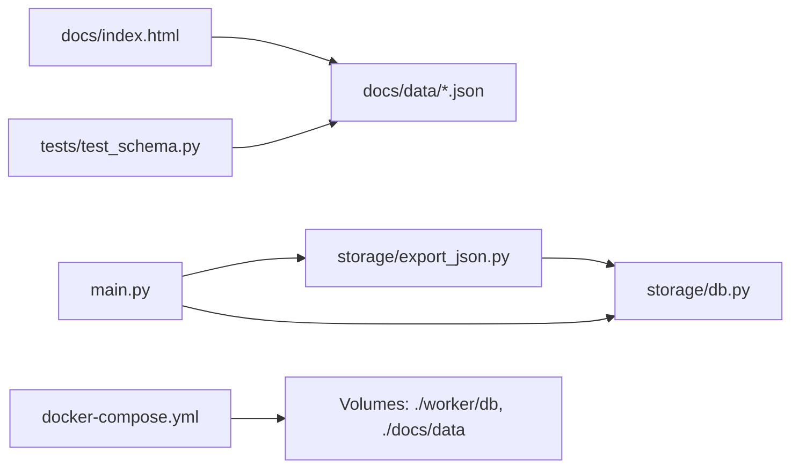

# Data Management

<cite>
**Referenced Files in This Document**
- [db.py](file://worker/storage/db.py)
- [export_json.py](file://worker/storage/export_json.py)
- [main.py](file://worker/main.py)
- [config.yaml](file://worker/config.yaml)
- [docker-compose.yml](file://docker-compose.yml)
- [Dockerfile](file://worker/Dockerfile)
- [test_schema.py](file://tests/test_schema.py)
- [index.html](file://docs/index.html)
- [meta.json](file://docs/data/meta.json)
- [news.json](file://docs/data/news.json)
</cite>

## Update Summary
**Changes Made**
- Enhanced retention system with separate news and jobs retention periods
- Improved export process with JSON merging and expiration logic
- Added sophisticated data lifecycle management with first_seen_at timestamps
- Expanded configuration options for retention policies
- Enhanced data validation and integrity checks

## Table of Contents
1. [Introduction](#introduction)
2. [Project Structure](#project-structure)
3. [Core Components](#core-components)
4. [Architecture Overview](#architecture-overview)
5. [Detailed Component Analysis](#detailed-component-analysis)
6. [Dependency Analysis](#dependency-analysis)
7. [Performance Considerations](#performance-considerations)
8. [Troubleshooting Guide](#troubleshooting-guide)
9. [Conclusion](#conclusion)
10. [Appendices](#appendices)

## Introduction
This document describes the data management system that powers the DevOps & AI Hub. It covers the SQLite database schema, CRUD operations, transactions, and data lifecycle management. The system now features an enhanced retention system with separate policies for news and jobs, improved export processes that merge existing data with new collections, and sophisticated data lifecycle management. It also documents the static JSON export process, file generation patterns, and frontend consumption of the exported data. Practical guidance is included for database maintenance, backups, performance tuning, validation, integrity checks, migrations, scaling, restoration, and monitoring data health.

## Project Structure
The data management stack is organized around a worker that orchestrates collection, processing, persistence, and export. The key areas are:
- Storage: SQLite schema, connection helpers, CRUD, and run logging
- Export: Static JSON generation with intelligent merging and retention for news and jobs
- Orchestration: End-to-end pipeline that wires collection, scoring, persistence, and export
- Configuration: Tunable parameters for retention, LLM behavior, and source enablement
- Packaging and deployment: Containerization and orchestration for repeatable runs
- Validation: Unit tests that enforce JSON schema and integrity
- Frontend: HTML page that consumes the exported JSON

**Diagram sources**
- [main.py:147-297](file://worker/main.py#L147-L297)
- [db.py:21-84](file://worker/storage/db.py#L21-L84)
- [export_json.py:32-93](file://worker/storage/export_json.py#L32-L93)
- [config.yaml:1-244](file://worker/config.yaml#L1-L244)
- [docker-compose.yml:13-35](file://docker-compose.yml#L13-L35)
- [Dockerfile:1-24](file://worker/Dockerfile#L1-L24)
- [test_schema.py:1-136](file://tests/test_schema.py#L1-L136)
- [index.html:1-86](file://docs/index.html#L1-L86)

**Section sources**
- [main.py:147-297](file://worker/main.py#L147-L297)
- [db.py:21-84](file://worker/storage/db.py#L21-L84)
- [export_json.py:32-93](file://worker/storage/export_json.py#L32-L93)
- [config.yaml:1-244](file://worker/config.yaml#L1-L244)
- [docker-compose.yml:13-35](file://docker-compose.yml#L13-L35)
- [Dockerfile:1-24](file://worker/Dockerfile#L1-L24)
- [test_schema.py:1-136](file://tests/test_schema.py#L1-L136)
- [index.html:1-86](file://docs/index.html#L1-L86)

## Core Components
- SQLite schema and connection helpers define the persistent store and provide CRUD operations for news and jobs, plus a run log table for operational visibility.
- Transaction support ensures atomicity across bulk inserts.
- Enhanced static JSON export reads from SQLite, merges with existing JSON files, applies retention policies, and writes three files consumed by the frontend.
- The orchestrator coordinates the full pipeline: collect, deduplicate, score, persist, export, publish, and optional notifications.
- Configuration controls retention windows, LLM behavior, and source enablement with separate policies for news (7 days) and jobs (60 days).
- Deployment uses Docker to run the worker and mount volumes for persistent SQLite and exported JSON.

**Section sources**
- [db.py:21-84](file://worker/storage/db.py#L21-L84)
- [db.py:87-95](file://worker/storage/db.py#L87-L95)
- [export_json.py:32-93](file://worker/storage/export_json.py#L32-L93)
- [main.py:147-297](file://worker/main.py#L147-L297)
- [config.yaml:6-7](file://worker/config.yaml#L6-L7)
- [docker-compose.yml:24-28](file://docker-compose.yml#L24-L28)

## Architecture Overview
The system follows an enhanced pipeline pattern with intelligent data lifecycle management:
- Collection: Multiple sources contribute raw items.
- Deduplication and filtering: Items are deduplicated and filtered by keyword pre-gate.
- Scoring: Relevance scores are computed via LLM batch calls.
- Persistence: Upsert operations maintain a rolling window defined by retention.
- Export: Static JSON files are generated by merging new data with existing files, applying retention policies, and writing to docs/data/.
- Publication: Optionally commits and pushes updated JSON to a repository.
- Monitoring: Run logs capture start/end times, counts, and errors.

**Diagram sources**
- [main.py:147-297](file://worker/main.py#L147-L297)
- [db.py:116-242](file://worker/storage/db.py#L116-L242)
- [export_json.py:32-93](file://worker/storage/export_json.py#L32-L93)

## Detailed Component Analysis

### SQLite Schema and Data Model
The schema defines three primary tables and supporting indexes:
- news: stores article metadata, timestamps, summary, tags, and relevance score
- jobs: stores job metadata, timestamps, category, salary range, and relevance score
- run_log: tracks each run's lifecycle, counts, and errors

Key characteristics:
- Primary keys are text identifiers
- Timestamps are stored as ISO-like text for ordering and retention queries
- Tags and errors are stored as JSON arrays
- Indexes optimize frequent queries by published/posted dates and source
- PRAGMA settings enable WAL mode and foreign key enforcement

**Diagram sources**
- [db.py:26-66](file://worker/storage/db.py#L26-L66)

**Section sources**
- [db.py:21-84](file://worker/storage/db.py#L21-L84)

### CRUD Operations and Transactions
- Connection management: lazy creation of the database directory and row factory for dict-like access
- Initialization: executes schema SQL and sets pragmas
- Transactions: context manager that commits on success and rolls back on exceptions
- Upsert semantics:
  - news: insert new record or update last_seen_at and selected fields; tags normalized to JSON array
  - jobs: insert new record or update last_seen_at and selected fields; relevance_score conditionally updated
- Reads:
  - news: fetch items within retention window ordered by published_at descending
  - jobs: fetch items within retention window ordered by posted_at descending

**Diagram sources**
- [db.py:116-242](file://worker/storage/db.py#L116-L242)

**Section sources**
- [db.py:71-113](file://worker/storage/db.py#L71-L113)
- [db.py:116-242](file://worker/storage/db.py#L116-L242)

### Enhanced Static JSON Export System
The export process now features intelligent merging and retention:
- Reads news and jobs from SQLite using retention-based queries with separate policies
- Merges new items with existing JSON files, giving precedence to newer items
- Applies sophisticated retention logic using first_seen_at timestamps
- Normalizes tags to lists and strips internal fields
- Writes three files:
  - news.json: top-level generated_at and merged items array
  - jobs.json: top-level generated_at and merged items array  
  - meta.json: counts, generated_at, and source_health snapshot
- Uses UTC timestamp formatting for generated_at

**Updated** Enhanced with intelligent merging that preserves historical data while applying retention policies

**Diagram sources**
- [export_json.py:32-93](file://worker/storage/export_json.py#L32-L93)
- [db.py:163-242](file://worker/storage/db.py#L163-L242)

**Section sources**
- [export_json.py:32-93](file://worker/storage/export_json.py#L32-L93)
- [db.py:163-242](file://worker/storage/db.py#L163-L242)

### Enhanced Data Lifecycle Management
- Dual retention policy: configured via retention_days (7 days for news) and jobs_retention_days (60 days for jobs); exports and queries filter items older than the respective retention windows
- Intelligent merging: existing JSON files are read and merged with new data, preserving historical items while applying retention logic
- Sophisticated expiration: uses first_seen_at timestamps (when items were first collected) rather than publication dates, ensuring jobs remain in the dataset even after long posting periods
- Run logging: start_run and finish_run track run lifecycle, counts, and errors
- Data freshness: meta.json includes generated_at; frontend displays last-updated and can warn on staleness
- Operational cadence: orchestrated by external scheduler (cron or sidecar); container restart disabled to ensure one-shot runs

**Updated** Enhanced with dual retention policies and intelligent data merging

**Diagram sources**
- [main.py:147-297](file://worker/main.py#L147-L297)
- [db.py:246-278](file://worker/storage/db.py#L246-L278)

**Section sources**
- [config.yaml:6-7](file://worker/config.yaml#L6-L7)
- [main.py:147-297](file://worker/main.py#L147-L297)
- [db.py:246-278](file://worker/storage/db.py#L246-L278)
- [index.html:17-23](file://docs/index.html#L17-L23)

### Frontend Data Consumption
The frontend loads and renders data from the exported JSON:
- Loads docs/data/news.json and docs/data/jobs.json
- Provides filtering and pagination UI driven by the loaded items
- Displays last-updated timestamp from meta.json and shows a stale banner if data exceeds threshold

**Diagram sources**
- [index.html:1-86](file://docs/index.html#L1-L86)
- [meta.json:1-7](file://docs/data/meta.json#L1-L7)
- [news.json:1-5](file://docs/data/news.json#L1-L5)

**Section sources**
- [index.html:1-86](file://docs/index.html#L1-L86)
- [meta.json:1-7](file://docs/data/meta.json#L1-L7)
- [news.json:1-5](file://docs/data/news.json#L1-L5)

## Dependency Analysis
- Orchestrator depends on storage modules for DB operations and enhanced export
- Export depends on DB read helpers and existing JSON files
- Tests depend on docs/data/* for validation
- Frontend depends on docs/data/* for rendering
- Deployment mounts volumes for persistent SQLite and exported JSON

**Diagram sources**
- [main.py:65-66](file://worker/main.py#L65-L66)
- [export_json.py:14-14](file://worker/storage/export_json.py#L14-L14)
- [test_schema.py:13-24](file://tests/test_schema.py#L13-L24)
- [index.html:83-83](file://docs/index.html#L83-L83)
- [docker-compose.yml:24-28](file://docker-compose.yml#L24-L28)

**Section sources**
- [main.py:65-66](file://worker/main.py#L65-L66)
- [export_json.py:14-14](file://worker/storage/export_json.py#L14-L14)
- [test_schema.py:13-24](file://tests/test_schema.py#L13-L24)
- [index.html:83-83](file://docs/index.html#L83-L83)
- [docker-compose.yml:24-28](file://docker-compose.yml#L24-L28)

## Performance Considerations
- SQLite configuration:
  - WAL mode improves concurrency and write throughput
  - Foreign keys enabled for integrity
- Indexes:
  - Published date and source indexes accelerate news queries
  - Posted date and source indexes accelerate job queries
- Batch operations:
  - LLM scoring uses configurable batch_size to reduce API overhead
  - Keyword pre-filter reduces unnecessary LLM calls
- Enhanced export efficiency:
  - Queries restrict to retention window
  - Intelligent merging minimizes redundant processing
  - Minimal post-processing during export
- Containerization:
  - Persistent volume for SQLite avoids rebuild costs
  - Non-root user and minimal base image for security and portability

Recommendations:
- Monitor SQLite size growth and tune retention_days and jobs_retention_days accordingly
- Consider vacuuming periodically if fragmentation becomes apparent
- Adjust batch_size and pre-filter keywords to balance quality vs. cost
- Use external scheduling (cron or sidecar) to align with workload patterns
- Monitor export performance as merging increases computational overhead

**Section sources**
- [db.py:22-25](file://worker/storage/db.py#L22-L25)
- [db.py:63-66](file://worker/storage/db.py#L63-L66)
- [config.yaml:10-18](file://worker/config.yaml#L10-L18)
- [docker-compose.yml:24-28](file://docker-compose.yml#L24-L28)
- [Dockerfile:16-19](file://worker/Dockerfile#L16-L19)

## Troubleshooting Guide
Common issues and remedies:
- Missing or invalid JSON:
  - Validate with tests to ensure required keys and types
  - Confirm export succeeded and files exist in docs/data/
  - Check for merge conflicts in existing JSON files
- Stale data:
  - Verify generated_at timestamps in meta.json
  - Check scheduler cadence and container logs
  - Monitor retention policy effectiveness
- Export failures:
  - Inspect run logs captured in run_log
  - Review errors recorded during run finish
  - Check for JSON parsing errors in existing files
- Database connectivity:
  - Ensure DB path exists and is writable
  - Confirm WAL mode and indexes are present after init
- Frontend rendering problems:
  - Confirm JSON files are served and accessible
  - Check browser console for network errors
- Retention issues:
  - Verify retention_days and jobs_retention_days configuration
  - Check first_seen_at timestamps in database
  - Monitor expiration logs during export

Operational checks:
- Run validation suite to assert schema compliance
- Inspect run_log entries for errors and counts
- Confirm retention_days and jobs_retention_days align with expectations
- Monitor export performance and memory usage

**Section sources**
- [test_schema.py:28-136](file://tests/test_schema.py#L28-L136)
- [main.py:246-278](file://worker/main.py#L246-L278)
- [db.py:79-84](file://worker/storage/db.py#L79-L84)
- [index.html:17-23](file://docs/index.html#L17-L23)

## Conclusion
The system combines a compact SQLite schema with an enhanced export pipeline that intelligently merges new data with existing datasets while applying sophisticated retention policies. The dual retention system (7 days for news, 60 days for jobs) combined with intelligent merging ensures optimal data freshness while preserving historical context. Its design emphasizes simplicity, configurability, and operability through Docker and external scheduling. Adhering to the enhanced retention policy, validating exports, and monitoring run logs ensures reliable operation at scale.

## Appendices

### Database Maintenance and Backup Strategies
- Backup:
  - Copy the SQLite file while the container is down or detached from the volume
  - Alternatively, snapshot the mounted volume path
- Restore:
  - Replace the SQLite file with a backed-up copy
  - Restart the worker to reinitialize schema if needed
- Integrity checks:
  - Use SQLite PRAGMAs and integrity checks in maintenance windows
  - Validate JSON exports post-restore
  - Monitor retention policy effectiveness

**Section sources**
- [docker-compose.yml:24-28](file://docker-compose.yml#L24-L28)
- [db.py:79-84](file://worker/storage/db.py#L79-L84)

### Migration Procedures
- Schema changes:
  - Add ALTER TABLE statements to SCHEMA_SQL and incrementally apply during init
  - Back up before applying changes
- Data transformations:
  - Use a separate migration script to normalize historical data
  - Validate transformed data with tests before enabling
- Retention policy updates:
  - Monitor impact on existing datasets
  - Consider gradual policy changes to avoid mass expiration

**Section sources**
- [db.py:22-66](file://worker/storage/db.py#L22-L66)
- [test_schema.py:1-136](file://tests/test_schema.py#L1-L136)

### Scaling Considerations
- Concurrency:
  - WAL mode supports concurrent readers/writers
  - Keep the worker single-shot to avoid contention
- Throughput:
  - Increase batch_size cautiously and monitor LLM quotas
  - Tune retention_days and jobs_retention_days to balance dataset size and query performance
  - Monitor export performance as merging complexity increases
- Distribution:
  - Run multiple workers behind a shared filesystem for export
  - Use a reverse proxy to serve docs/data statically
- Memory usage:
  - Monitor memory consumption during JSON merging operations
  - Consider chunking large datasets if memory becomes constrained

**Section sources**
- [db.py:22-25](file://worker/storage/db.py#L22-L25)
- [config.yaml:10-18](file://worker/config.yaml#L10-L18)
- [docker-compose.yml:13-35](file://docker-compose.yml#L13-L35)

### Monitoring Data Health
- Metrics:
  - news_count and jobs_count in meta.json
  - source_health snapshots for each collector
  - run_log for duration, counts, and errors
  - retention statistics and expiration logs
- Alerts:
  - Configure staleness thresholds in the frontend
  - Set up external alerts on run errors and export failures
  - Monitor retention policy effectiveness
- Performance monitoring:
  - Track export duration and memory usage
  - Monitor SQLite database size growth
  - Watch for JSON merge conflicts or parsing errors

**Section sources**
- [export_json.py:77-84](file://worker/storage/export_json.py#L77-L84)
- [main.py:246-278](file://worker/main.py#L246-L278)
- [index.html:17-23](file://docs/index.html#L17-L23)