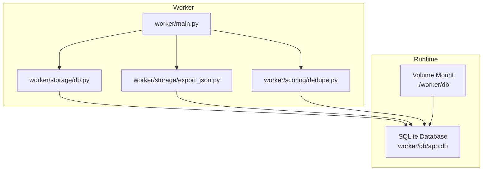
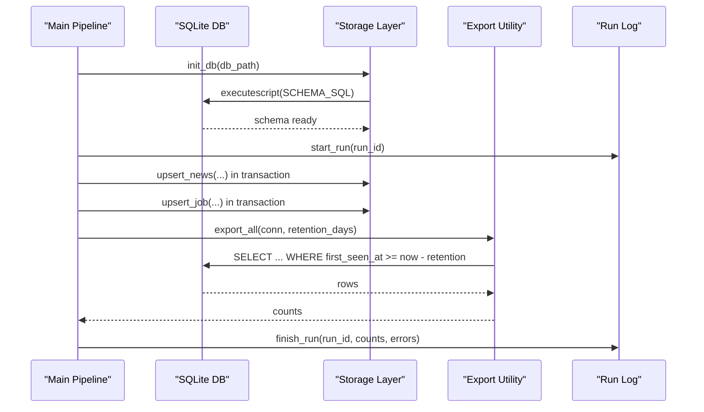
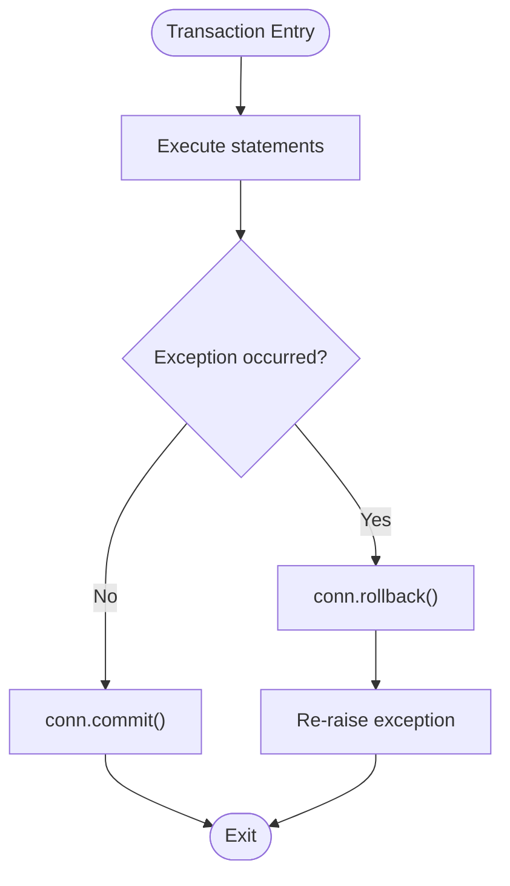
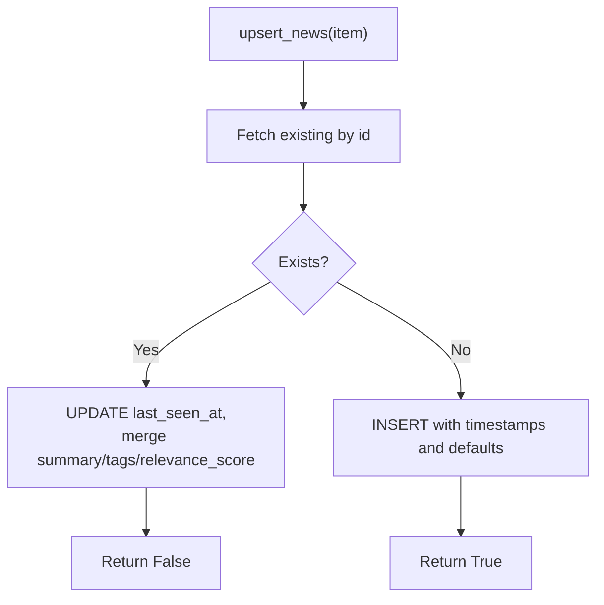
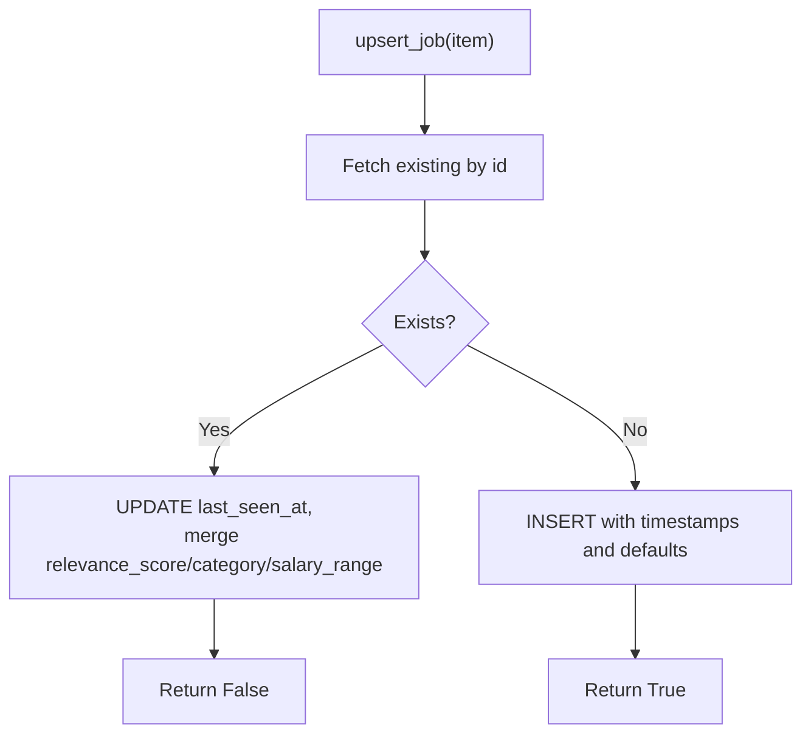
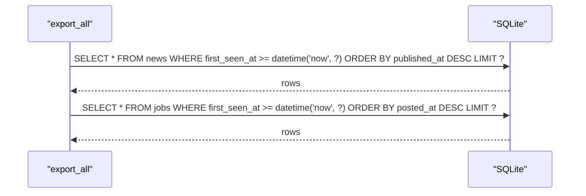
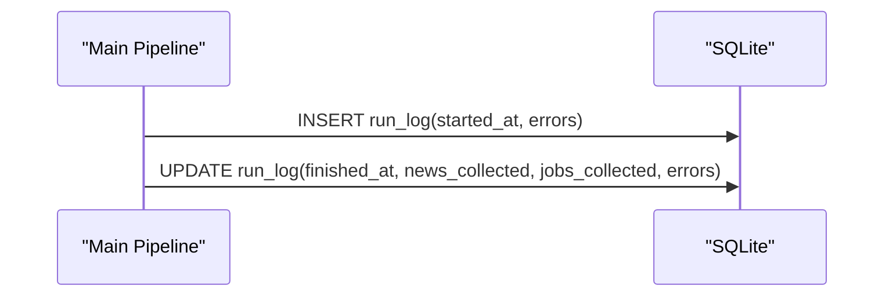
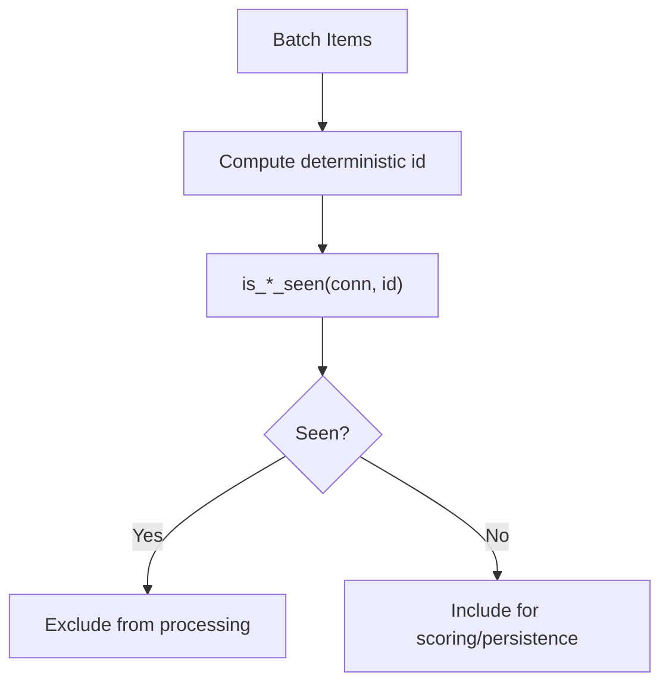
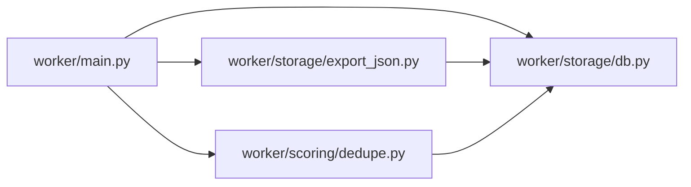
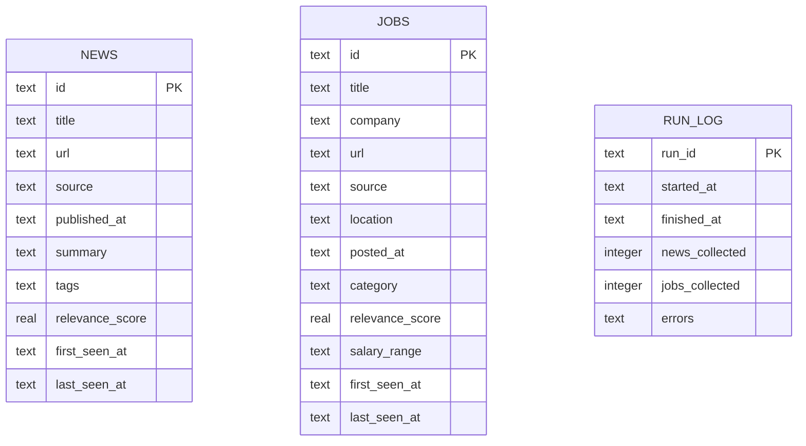

# Database Operations

<cite>
**Referenced Files in This Document**
- [db.py](file://worker/storage/db.py)
- [main.py](file://worker/main.py)
- [export_json.py](file://worker/storage/export_json.py)
- [dedupe.py](file://worker/scoring/dedupe.py)
- [config.yaml](file://worker/config.yaml)
- [docker-compose.yml](file://docker-compose.yml)
- [Dockerfile](file://worker/Dockerfile)
- [requirements.txt](file://worker/requirements.txt)
- [test_schema.py](file://tests/test_schema.py)
</cite>

## Update Summary
**Changes Made**
- Updated retention filtering section to reflect the switch from published_at/posted_at to first_seen_at for consistent date filtering
- Modified query patterns section to explain the new SQLite comparison approach using timezone-aware timestamps
- Updated troubleshooting guide to address timezone offset handling in SQLite comparisons
- Enhanced performance considerations to highlight the benefits of using first_seen_at for retention filtering

## Table of Contents
1. [Introduction](#introduction)
2. [Project Structure](#project-structure)
3. [Core Components](#core-components)
4. [Architecture Overview](#architecture-overview)
5. [Detailed Component Analysis](#detailed-component-analysis)
6. [Dependency Analysis](#dependency-analysis)
7. [Performance Considerations](#performance-considerations)
8. [Troubleshooting Guide](#troubleshooting-guide)
9. [Conclusion](#conclusion)
10. [Appendices](#appendices)

## Introduction
This document provides comprehensive guidance for database operations focused on SQLite within the worker module. It covers schema design, connection management, CRUD operations, transaction handling, error handling, upsert semantics, indexing strategies, query patterns, and practical maintenance and migration workflows. The goal is to help developers and operators reliably manage the SQLite-backed persistence layer used by the worker pipeline.

## Project Structure
The database-related logic is primarily encapsulated in the storage module, orchestrated by the main pipeline, and consumed by the export utilities and scoring modules.

**Diagram sources**
- [main.py:127-297](file://worker/main.py#L127-L297)
- [db.py:79-84](file://worker/storage/db.py#L79-L84)
- [export_json.py:32-93](file://worker/storage/export_json.py#L32-L93)
- [dedupe.py:33-44](file://worker/scoring/dedupe.py#L33-L44)
- [docker-compose.yml:24-28](file://docker-compose.yml#L24-L28)

**Section sources**
- [main.py:127-297](file://worker/main.py#L127-L297)
- [db.py:79-84](file://worker/storage/db.py#L79-L84)
- [export_json.py:32-93](file://worker/storage/export_json.py#L32-L93)
- [dedupe.py:33-44](file://worker/scoring/dedupe.py#L33-L44)
- [docker-compose.yml:24-28](file://docker-compose.yml#L24-L28)

## Core Components
- SQLite schema definition and initialization
- Connection management and context-managed transactions
- Upsert operations for news and jobs
- Query utilities for exporting data
- Seen-check utilities for deduplication
- Run lifecycle logging

Key responsibilities:
- Schema creation and indexing
- Timestamp management and JSON field handling
- Batched persistence with atomic transactions
- Export of filtered datasets to JSON

**Section sources**
- [db.py:22-67](file://worker/storage/db.py#L22-L67)
- [db.py:79-95](file://worker/storage/db.py#L79-L95)
- [db.py:116-161](file://worker/storage/db.py#L116-L161)
- [db.py:183-230](file://worker/storage/db.py#L183-L230)
- [db.py:246-278](file://worker/storage/db.py#L246-L278)
- [export_json.py:32-93](file://worker/storage/export_json.py#L32-L93)
- [dedupe.py:33-44](file://worker/scoring/dedupe.py#L33-L44)

## Architecture Overview
The worker initializes the database, performs collection and scoring, persists items atomically, exports JSON, logs run metadata, and optionally publishes artifacts. The database is mounted as a persistent volume to survive container restarts.

**Diagram sources**
- [main.py:143-144](file://worker/main.py#L143-L144)
- [db.py:22-67](file://worker/storage/db.py#L22-L67)
- [db.py:246-278](file://worker/storage/db.py#L246-L278)
- [export_json.py:32-93](file://worker/storage/export_json.py#L32-L93)

## Detailed Component Analysis

### SQLite Schema Design
- Journal mode WAL and foreign keys enabled for durability and referential integrity.
- Three primary tables:
  - news: stores article-like items with timestamps, summaries, tags, and relevance scores.
  - jobs: stores job listings with company, location, posting dates, categories, and salary ranges.
  - run_log: tracks run lifecycle, counts, and errors.
- Indexes:
  - news.published_at and news.source
  - jobs.posted_at and jobs.source

Field definitions and constraints:
- Primary keys are TEXT and serve as stable identifiers.
- JSON fields stored as TEXT with defaults for arrays.
- Timestamps stored as ISO-format TEXT for simplicity and portability.
- Relevance scores are REAL with default 0.0.

**Section sources**
- [db.py:22-67](file://worker/storage/db.py#L22-L67)

### Connection Management and Transactions
- Connection factory creates a connection with row_factory set to sqlite3.Row for dict-like access.
- init_db executes schema SQL and commits immediately.
- A context manager ensures atomicity: on success, commit; on exception, rollback.
- The worker uses transactions around bulk inserts for news and jobs.

**Diagram sources**
- [db.py:87-95](file://worker/storage/db.py#L87-L95)

**Section sources**
- [db.py:71-84](file://worker/storage/db.py#L71-L84)
- [db.py:87-95](file://worker/storage/db.py#L87-L95)
- [main.py:193-197](file://worker/main.py#L193-L197)
- [main.py:249-253](file://worker/main.py#L249-L253)

### CRUD Operations and Upserts

#### Upsert News
- Detects existing items by id.
- On update: refresh last_seen_at, merge optional fields (summary, tags, relevance_score), preserve existing values when not provided.
- On insert: populate first_seen_at and last_seen_at with current timestamp, initialize relevance_score and tags.

**Diagram sources**
- [db.py:116-161](file://worker/storage/db.py#L116-L161)

**Section sources**
- [db.py:116-161](file://worker/storage/db.py#L116-L161)

#### Upsert Jobs
- Similar pattern: detect by id, update last_seen_at and merge optional fields (relevance_score, category, salary_range), or insert with defaults.

**Diagram sources**
- [db.py:183-230](file://worker/storage/db.py#L183-L230)

**Section sources**
- [db.py:183-230](file://worker/storage/db.py#L183-L230)

#### Queries for Export
- **Updated**: get_news filters by first_seen_at within retention window and orders by descending publication time.
- **Updated**: get_jobs mirrors the same pattern for jobs using first_seen_at for consistent date filtering.

**Diagram sources**
- [export_json.py:50](file://worker/storage/export_json.py#L50)
- [export_json.py:66](file://worker/storage/export_json.py#L66)
- [db.py:163-173](file://worker/storage/db.py#L163-L173)
- [db.py:232-242](file://worker/storage/db.py#L232-L242)

**Section sources**
- [export_json.py:32-93](file://worker/storage/export_json.py#L32-L93)
- [db.py:163-173](file://worker/storage/db.py#L163-L173)
- [db.py:232-242](file://worker/storage/db.py#L232-L242)

### Run Lifecycle Logging
- start_run inserts a new run_log record with started_at and empty error list.
- finish_run updates finished_at, counts, and serializes errors.

**Diagram sources**
- [db.py:246-278](file://worker/storage/db.py#L246-L278)

**Section sources**
- [db.py:246-278](file://worker/storage/db.py#L246-L278)

### Deduplication and Seen Checks
- Deterministic IDs are computed for news and jobs to ensure stable uniqueness across runs.
- is_news_seen and is_job_seen check presence in the database before scoring/persisting.

**Diagram sources**
- [dedupe.py:20-29](file://worker/scoring/dedupe.py#L20-L29)
- [dedupe.py:33-44](file://worker/scoring/dedupe.py#L33-L44)

**Section sources**
- [dedupe.py:20-29](file://worker/scoring/dedupe.py#L20-L29)
- [dedupe.py:33-44](file://worker/scoring/dedupe.py#L33-L44)

## Dependency Analysis
- The main pipeline depends on the storage module for database operations and on the export module for JSON generation.
- The export module depends on the storage module's query functions.
- The deduplication module depends on the storage module for seen checks.

**Diagram sources**
- [main.py:65](file://worker/main.py#L65)
- [export_json.py:14](file://worker/storage/export_json.py#L14)
- [dedupe.py:33-44](file://worker/scoring/dedupe.py#L33-L44)

**Section sources**
- [main.py:65](file://worker/main.py#L65)
- [export_json.py:14](file://worker/storage/export_json.py#L14)
- [dedupe.py:33-44](file://worker/scoring/dedupe.py#L33-L44)

## Performance Considerations
- Indexes: The schema defines indexes on published_at/source for news and posted_at/source for jobs to accelerate filtering and sorting.
- **Updated**: Retention windows: Export queries now use first_seen_at for consistent date filtering across different timestamp formats, improving reliability and eliminating timezone offset issues in SQLite comparisons.
- JSON fields: Tags and errors are stored as JSON strings; conversion helpers handle parsing and serialization.
- WAL mode: Enabled for improved concurrency and durability.
- Transaction batching: Bulk inserts are wrapped in a single transaction to minimize overhead and ensure atomicity.

Practical tips:
- Keep retention_days aligned with operational needs to balance query performance and storage footprint.
- Monitor run_log for error accumulation to proactively address source failures.
- Consider periodically vacuuming the database if long-running containers accumulate significant write amplification.

**Section sources**
- [db.py:22-67](file://worker/storage/db.py#L22-L67)
- [export_json.py:50](file://worker/storage/export_json.py#L50)
- [export_json.py:66](file://worker/storage/export_json.py#L66)

## Troubleshooting Guide
Common issues and resolutions:
- Connection errors: Verify the database path and permissions. The container ensures the db directory exists and is writable.
- Schema mismatches: Re-run initialization to apply schema changes.
- Transaction failures: Inspect exceptions raised by the transaction context manager; the worker logs errors and continues to update run_log with error lists.
- **Updated**: Export anomalies: Confirm retention_days and that timestamps are present and correctly formatted. The system now uses first_seen_at for consistent date filtering, eliminating timezone offset issues in SQLite comparisons.

Operational checks:
- Validate that the SQLite file exists at the mounted path.
- Review run_log entries for timestamps and error lists.
- Ensure the export directory is writable by the container user.

**Section sources**
- [docker-compose.yml:24-28](file://docker-compose.yml#L24-L28)
- [Dockerfile:16-17](file://worker/Dockerfile#L16-L17)
- [db.py:87-95](file://worker/storage/db.py#L87-L95)
- [db.py:246-278](file://worker/storage/db.py#L246-L278)

## Conclusion
The database layer is designed for simplicity, reliability, and performance within a scheduled worker pipeline. It leverages SQLite with WAL mode, explicit indexes, and transactional batches to persist curated news and jobs items. The schema and operations support efficient querying for JSON exports and robust run lifecycle tracking. **The recent update to use first_seen_at for retention filtering ensures consistent date comparisons across different timestamp formats and eliminates timezone offset issues in SQLite comparisons.**

## Appendices

### Appendix A: Configuration Reference
- retention_days controls the retention window for exported data.
- llm configuration influences pre-filtering and scoring behavior upstream of persistence.

**Section sources**
- [config.yaml:7,10-18](file://worker/config.yaml#L7,L10-L18)

### Appendix B: Data Model Diagram

**Diagram sources**
- [db.py:26-61](file://worker/storage/db.py#L26-L61)

### Appendix C: Maintenance and Migration Workflow
- Backup: Periodically copy the SQLite file from the mounted volume to a safe location.
- Restore: Stop the worker, replace the database file, then restart.
- Migration: Apply schema changes via a new init_db call; ensure backward compatibility of JSON fields and timestamps. After applying schema changes, re-run the pipeline to repopulate or reprocess data as needed.

### Appendix D: Validation of Exported JSON Schemas
- The test suite validates that exported JSON files conform to required structures and constraints, including presence of keys, types, and ranges for relevance scores.

**Section sources**
- [test_schema.py:28-51](file://tests/test_schema.py#L28-L51)
- [test_schema.py:53-96](file://tests/test_schema.py#L53-L96)
- [test_schema.py:99-136](file://tests/test_schema.py#L99-L136)

### Appendix E: Timezone Handling and Retention Filtering
**Updated**: The database now uses first_seen_at for consistent retention filtering across different timestamp formats. This approach eliminates timezone offset issues in SQLite comparisons by using a single, standardized timestamp field that captures when items are first encountered in the system.

Key benefits:
- **Consistent filtering**: Uses a single timestamp field (first_seen_at) for all retention calculations
- **Timezone independence**: Eliminates issues with timezone offsets in SQLite comparisons
- **Cross-source compatibility**: Works uniformly across different data sources with varying timestamp formats
- **Reliable date arithmetic**: SQLite's datetime function operates consistently with the stored ISO-format timestamps

**Section sources**
- [db.py:163-173](file://worker/storage/db.py#L163-L173)
- [db.py:232-242](file://worker/storage/db.py#L232-L242)
- [export_json.py:50](file://worker/storage/export_json.py#L50)
- [export_json.py:66](file://worker/storage/export_json.py#L66)