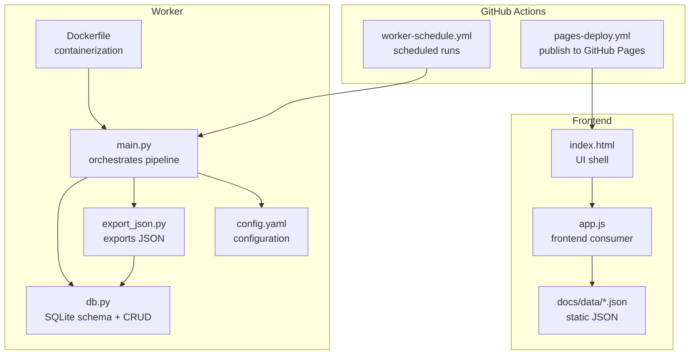
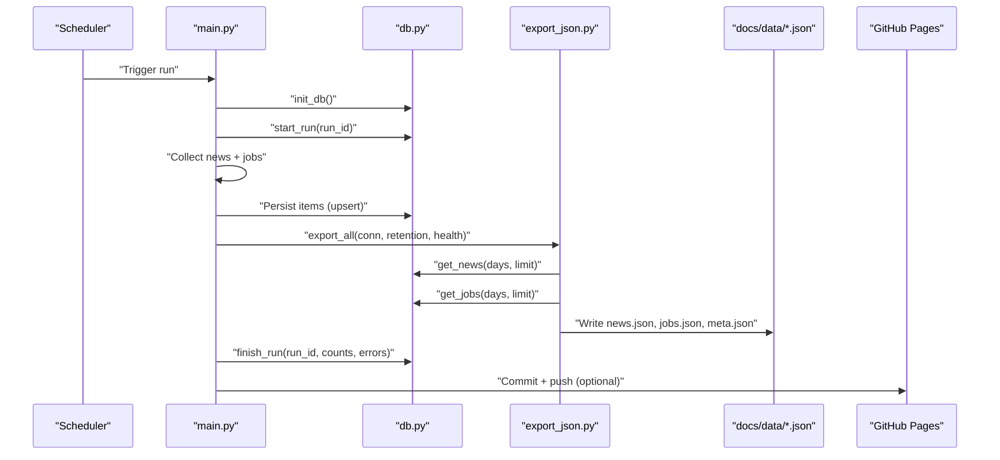
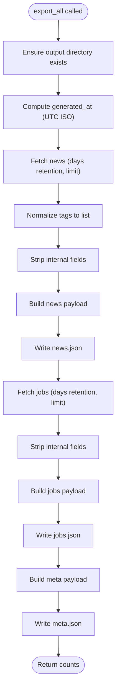
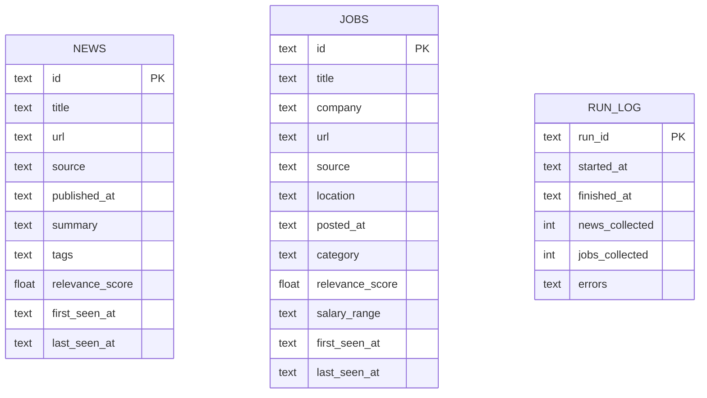
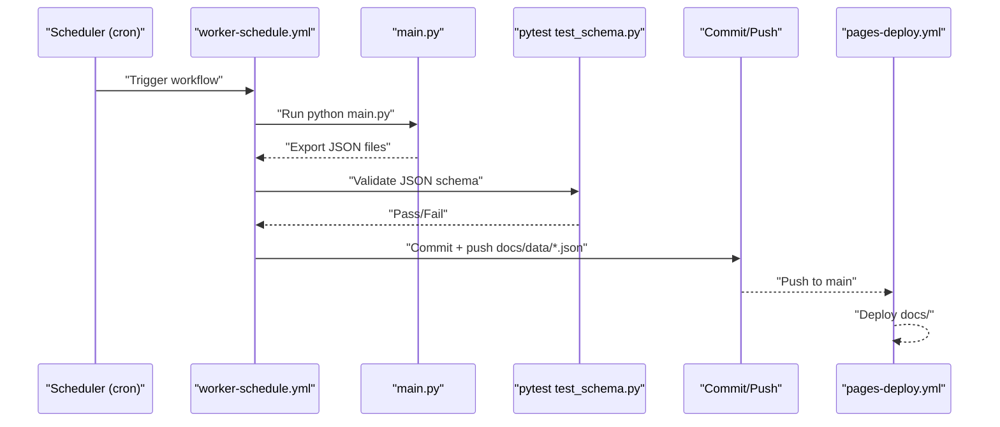
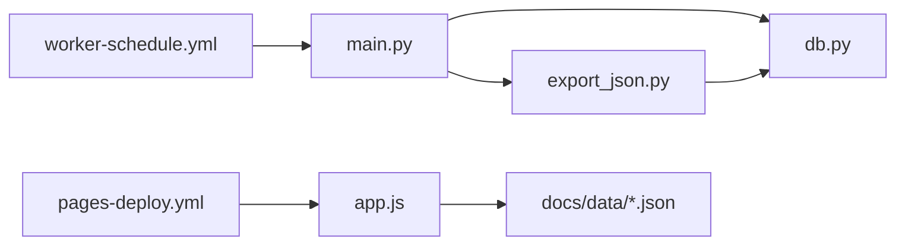

# JSON Export System

<cite>
**Referenced Files in This Document**
- [export_json.py](file://worker/storage/export_json.py)
- [db.py](file://worker/storage/db.py)
- [main.py](file://worker/main.py)
- [config.yaml](file://worker/config.yaml)
- [Dockerfile](file://worker/Dockerfile)
- [worker-schedule.yml](file://github/workflows/worker-schedule.yml)
- [pages-deploy.yml](file://github/workflows/pages-deploy.yml)
- [app.js](file://docs/assets/app.js)
- [news.json](file://docs/data/news.json)
- [jobs.json](file://docs/data/jobs.json)
- [meta.json](file://docs/data/meta.json)
- [test_schema.py](file://tests/test_schema.py)
</cite>

## Table of Contents
1. [Introduction](#introduction)
2. [Project Structure](#project-structure)
3. [Core Components](#core-components)
4. [Architecture Overview](#architecture-overview)
5. [Detailed Component Analysis](#detailed-component-analysis)
6. [Dependency Analysis](#dependency-analysis)
7. [Performance Considerations](#performance-considerations)
8. [Troubleshooting Guide](#troubleshooting-guide)
9. [Conclusion](#conclusion)

## Introduction
This document describes the JSON export system that generates static files for frontend consumption. It explains the export workflow, data transformation from database records to JSON, and file generation patterns. It documents the exported data structures for news and jobs content, including field mappings, data types, and formatting rules. It also covers the static site generation process, file naming conventions, directory structure, frontend consumption patterns, caching strategies, performance considerations, export scheduling, incremental updates, and error handling.

## Project Structure
The JSON export system spans three primary areas:
- Worker orchestration and persistence: collects, deduplicates, scores, persists, exports, and optionally publishes data.
- Storage layer: SQLite schema, connection helpers, and CRUD operations.
- Frontend: static HTML/CSS/JS that consumes the generated JSON files.

**Diagram sources**
- [main.py:127-297](file://worker/main.py#L127-L297)
- [export_json.py:32-93](file://worker/storage/export_json.py#L32-L93)
- [db.py:21-67](file://worker/storage/db.py#L21-L67)
- [config.yaml:1-244](file://worker/config.yaml#L1-L244)
- [Dockerfile:1-24](file://worker/Dockerfile#L1-L24)
- [worker-schedule.yml:1-70](file://github/workflows/worker-schedule.yml#L1-L70)
- [pages-deploy.yml:1-42](file://github/workflows/pages-deploy.yml#L1-L42)
- [index.html:1-86](file://docs/index.html#L1-L86)
- [app.js:101-118](file://docs/assets/app.js#L101-L118)

**Section sources**
- [main.py:127-297](file://worker/main.py#L127-L297)
- [export_json.py:32-93](file://worker/storage/export_json.py#L32-L93)
- [db.py:21-67](file://worker/storage/db.py#L21-L67)
- [config.yaml:1-244](file://worker/config.yaml#L1-L244)
- [Dockerfile:1-24](file://worker/Dockerfile#L1-L24)
- [worker-schedule.yml:1-70](file://github/workflows/worker-schedule.yml#L1-L70)
- [pages-deploy.yml:1-42](file://github/workflows/pages-deploy.yml#L1-L42)
- [index.html:1-86](file://docs/index.html#L1-L86)
- [app.js:101-118](file://docs/assets/app.js#L101-L118)

## Core Components
- Export orchestrator: reads from SQLite and writes static JSON files under docs/data/.
- Database layer: defines schema, connection helpers, transactions, and retrieval functions.
- Frontend consumer: loads JSON files, applies filtering and pagination, and renders cards.
- Scheduling and publishing: GitHub Actions runs the worker on a schedule and deploys to GitHub Pages.

Key responsibilities:
- Export: transform database rows to JSON payload with metadata and lists of items.
- Persistence: maintain normalized SQLite tables and enforce constraints.
- Consumption: parse JSON, compute staleness, and render UI.

**Section sources**
- [export_json.py:32-93](file://worker/storage/export_json.py#L32-L93)
- [db.py:163-242](file://worker/storage/db.py#L163-L242)
- [app.js:101-118](file://docs/assets/app.js#L101-L118)
- [worker-schedule.yml:1-70](file://github/workflows/worker-schedule.yml#L1-L70)

## Architecture Overview
The export system follows a pipeline:
1. Collect news and jobs from enabled sources.
2. Deduplicate and pre-filter items.
3. Score items via LLM (optional pre-filter).
4. Upsert items into SQLite.
5. Export static JSON files (news.json, jobs.json, meta.json).
6. Optionally publish changes and send SMTP digest.

**Diagram sources**
- [main.py:127-297](file://worker/main.py#L127-L297)
- [db.py:163-242](file://worker/storage/db.py#L163-L242)
- [export_json.py:32-93](file://worker/storage/export_json.py#L32-L93)
- [worker-schedule.yml:44-70](file://github/workflows/worker-schedule.yml#L44-L70)
- [pages-deploy.yml:27-42](file://github/workflows/pages-deploy.yml#L27-L42)

## Detailed Component Analysis

### Export Pipeline and Data Transformation
The export process transforms database records into JSON payloads with the following characteristics:
- Output directory: docs/data/ (created if missing).
- Generated timestamp: UTC ISO string included in each payload.
- News payload: {"generated_at": "...", "items": [...]}.
- Jobs payload: {"generated_at": "...", "items": [...]}.
- Meta payload: {"generated_at": "...", "news_count": N, "jobs_count": M, "source_health": {...}}.

Transformation rules:
- Tags normalization: ensure tags is always a list; stored as JSON array in SQLite, retrieved as Python list.
- Internal fields removal: remove first_seen_at and last_seen_at from items before writing.
- Date filtering: queries restrict items to the configured retention window.
- Limits: queries limit returned items to prevent oversized payloads.

**Diagram sources**
- [export_json.py:32-93](file://worker/storage/export_json.py#L32-L93)
- [db.py:163-242](file://worker/storage/db.py#L163-L242)

**Section sources**
- [export_json.py:32-93](file://worker/storage/export_json.py#L32-L93)
- [db.py:163-242](file://worker/storage/db.py#L163-L242)

### Database Schema and Retrieval
SQLite schema defines normalized tables for news and jobs, plus a run log. Retrieval functions:
- get_news(conn, days, limit): selects items with published_at within the retention window, ordered by published_at descending, limited by count.
- get_jobs(conn, days, limit): similar for jobs, ordered by posted_at descending.
- Tags are stored as JSON arrays in SQLite and decoded to Python lists on retrieval.

**Diagram sources**
- [db.py:22-67](file://worker/storage/db.py#L22-L67)

**Section sources**
- [db.py:22-67](file://worker/storage/db.py#L22-L67)
- [db.py:163-242](file://worker/storage/db.py#L163-L242)

### Exported Data Structures

#### News JSON Structure
Top-level keys:
- generated_at: UTC ISO timestamp string.
- items: array of news items.

News item fields:
- id: string, unique identifier.
- title: string.
- url: string.
- source: string.
- published_at: string (ISO timestamp or equivalent).
- summary: string (optional).
- tags: array of strings (normalized).
- relevance_score: number in [0, 1] (optional).
- first_seen_at, last_seen_at: internal fields stripped from JSON.

Validation rules enforced by tests:
- Items must include required fields.
- tags must be a list.
- relevance_score must be numeric and within [0, 1].
- IDs must be unique.

**Section sources**
- [export_json.py:49-63](file://worker/storage/export_json.py#L49-L63)
- [test_schema.py:53-97](file://tests/test_schema.py#L53-L97)
- [news.json:1-5](file://docs/data/news.json#L1-L5)

#### Jobs JSON Structure
Top-level keys:
- generated_at: UTC ISO timestamp string.
- items: array of job items.

Job item fields:
- id: string, unique identifier.
- title: string.
- company: string.
- url: string.
- source: string.
- location: string (optional).
- posted_at: string (ISO timestamp or equivalent).
- category: string (optional).
- relevance_score: number in [0, 1] (optional).
- salary_range: string (optional).
- first_seen_at, last_seen_at: internal fields stripped from JSON.

Validation rules enforced by tests:
- Items must include required fields.
- relevance_score must be numeric and within [0, 1].
- IDs must be unique.

**Section sources**
- [export_json.py:65-75](file://worker/storage/export_json.py#L65-L75)
- [test_schema.py:99-136](file://tests/test_schema.py#L99-L136)
- [jobs.json:1-5](file://docs/data/jobs.json#L1-L5)

#### Meta JSON Structure
Top-level keys:
- generated_at: UTC ISO timestamp string.
- news_count: integer, number of news items.
- jobs_count: integer, number of jobs items.
- source_health: object mapping source name to status string.

**Section sources**
- [export_json.py:77-84](file://worker/storage/export_json.py#L77-L84)
- [meta.json:1-7](file://docs/data/meta.json#L1-L7)

### Static Site Generation and Directory Structure
- Output directory: docs/data/ under the repository root.
- Files produced:
  - news.json
  - jobs.json
  - meta.json
- Directory layout is fixed; the worker ensures the directory exists before writing.

**Section sources**
- [export_json.py:18-45](file://worker/storage/export_json.py#L18-L45)
- [export_json.py:63-84](file://worker/storage/export_json.py#L63-L84)

### Frontend Consumption Patterns
The frontend loads JSON files and renders content:
- Loads meta.json first to show last updated time and detect staleness.
- Concurrently loads news.json and jobs.json.
- Applies client-side filtering by search term, tag/source/category, and date windows.
- Paginates results and renders cards with relevance scores, dates, and badges.

Caching and freshness:
- Adds a cache-busting query parameter when fetching JSON.
- Computes staleness based on generated_at and displays a warning banner after 6 hours.
- Uses local theme preference persisted in localStorage.

**Section sources**
- [app.js:101-118](file://docs/assets/app.js#L101-L118)
- [app.js:132-145](file://docs/assets/app.js#L132-L145)
- [app.js:241-254](file://docs/assets/app.js#L241-L254)
- [app.js:120-129](file://docs/assets/app.js#L120-L129)

### Export Scheduling and Publishing
- Scheduled runs: every 2 hours via GitHub Actions workflow.
- Validation: runs schema tests post-export to ensure correctness.
- Publishing: commits and pushes docs/data/*.json; subsequent push triggers GitHub Pages deployment.

**Diagram sources**
- [worker-schedule.yml:13-70](file://github/workflows/worker-schedule.yml#L13-L70)
- [pages-deploy.yml:27-42](file://github/workflows/pages-deploy.yml#L27-L42)
- [test_schema.py:1-136](file://tests/test_schema.py#L1-L136)

**Section sources**
- [worker-schedule.yml:1-70](file://github/workflows/worker-schedule.yml#L1-L70)
- [pages-deploy.yml:1-42](file://github/workflows/pages-deploy.yml#L1-L42)
- [test_schema.py:1-136](file://tests/test_schema.py#L1-L136)

### Incremental Updates and Retention
- Retention window: controlled by configuration; defaults to 30 days.
- Queries filter items to the retention period and apply limits to keep payloads manageable.
- Deduplication and keyword pre-filter reduce LLM calls and database writes prior to export.

**Section sources**
- [config.yaml:6-7](file://worker/config.yaml#L6-L7)
- [db.py:163-242](file://worker/storage/db.py#L163-L242)
- [main.py:174-181](file://worker/main.py#L174-L181)

### Error Handling During Export
- Source failures: individual news/job collectors report errors and mark source health.
- Export errors: logged; the pipeline continues to completion to produce meta.json with counts.
- Git publish failures: caught and logged; does not block export.
- SMTP digest failures: caught and logged; does not block export.

**Section sources**
- [main.py:151-160](file://worker/main.py#L151-L160)
- [main.py:202-213](file://worker/main.py#L202-L213)
- [main.py:273-278](file://worker/main.py#L273-L278)
- [main.py:281-287](file://worker/main.py#L281-L287)

## Dependency Analysis
The export system exhibits clear separation of concerns:
- main.py orchestrates the pipeline and depends on db.py and export_json.py.
- export_json.py depends on db.py for data retrieval and writes to docs/data/.
- Frontend app.js depends on docs/data/*.json.
- GitHub Actions workflows depend on main.py and the exported artifacts.

**Diagram sources**
- [main.py:64-66](file://worker/main.py#L64-L66)
- [export_json.py:14-14](file://worker/storage/export_json.py#L14-L14)
- [db.py:163-242](file://worker/storage/db.py#L163-L242)
- [app.js:101-118](file://docs/assets/app.js#L101-L118)
- [worker-schedule.yml:44-57](file://github/workflows/worker-schedule.yml#L44-L57)
- [pages-deploy.yml:34-41](file://github/workflows/pages-deploy.yml#L34-L41)

**Section sources**
- [main.py:64-66](file://worker/main.py#L64-L66)
- [export_json.py:14-14](file://worker/storage/export_json.py#L14-L14)
- [db.py:163-242](file://worker/storage/db.py#L163-L242)
- [app.js:101-118](file://docs/assets/app.js#L101-L118)
- [worker-schedule.yml:44-57](file://github/workflows/worker-schedule.yml#L44-L57)
- [pages-deploy.yml:34-41](file://github/workflows/pages-deploy.yml#L34-L41)

## Performance Considerations
- Retention and limits: constrain query result sizes to keep JSON payloads small and fast to load.
- Client-side pagination: reduces DOM rendering overhead and improves perceived performance.
- Staleness detection: avoids unnecessary reloads and informs users about data freshness.
- Batched LLM scoring: pre-filtering reduces cost and latency by limiting LLM calls.
- SQLite WAL mode and indexes: improve concurrency and query performance.

[No sources needed since this section provides general guidance]

## Troubleshooting Guide
Common issues and remedies:
- JSON validation failures: ensure required fields exist, tags are arrays, relevance_score is numeric and in [0,1], and IDs are unique.
- Stale data warnings: confirm export runs are succeeding and pages are being deployed.
- Export errors: check logs for source failures and review source_health in meta.json.
- Git publish failures: verify credentials and repository URL; otherwise, changes remain local.
- Frontend fetch errors: confirm docs/data/*.json are present and accessible; inspect browser network tab.

**Section sources**
- [test_schema.py:28-51](file://tests/test_schema.py#L28-L51)
- [test_schema.py:75-97](file://tests/test_schema.py#L75-L97)
- [test_schema.py:121-136](file://tests/test_schema.py#L121-L136)
- [app.js:110-115](file://docs/assets/app.js#L110-L115)
- [main.py:273-278](file://worker/main.py#L273-L278)

## Conclusion
The JSON export system provides a robust, incremental pipeline that transforms collected data into static JSON files for efficient frontend consumption. It enforces schema compliance, manages retention and limits, and integrates with GitHub Actions for automated scheduling and deployment. The frontend benefits from strong caching, client-side filtering, and pagination, delivering a responsive user experience. Error handling and validation ensure reliable operation across the entire stack.