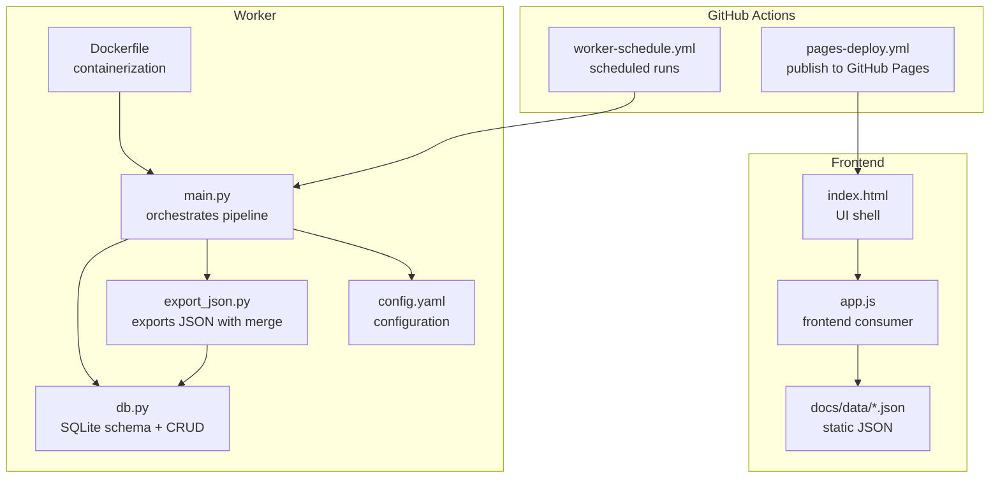
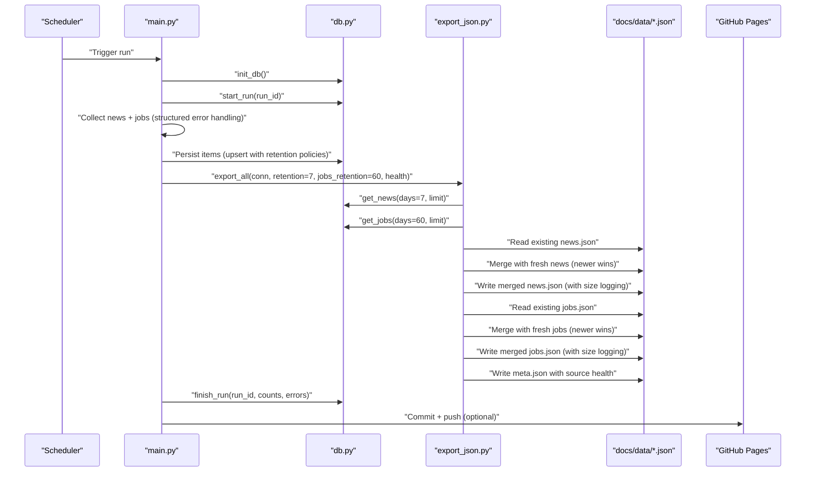
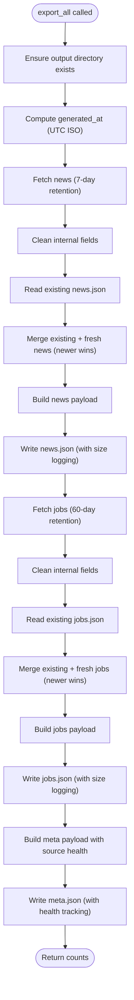
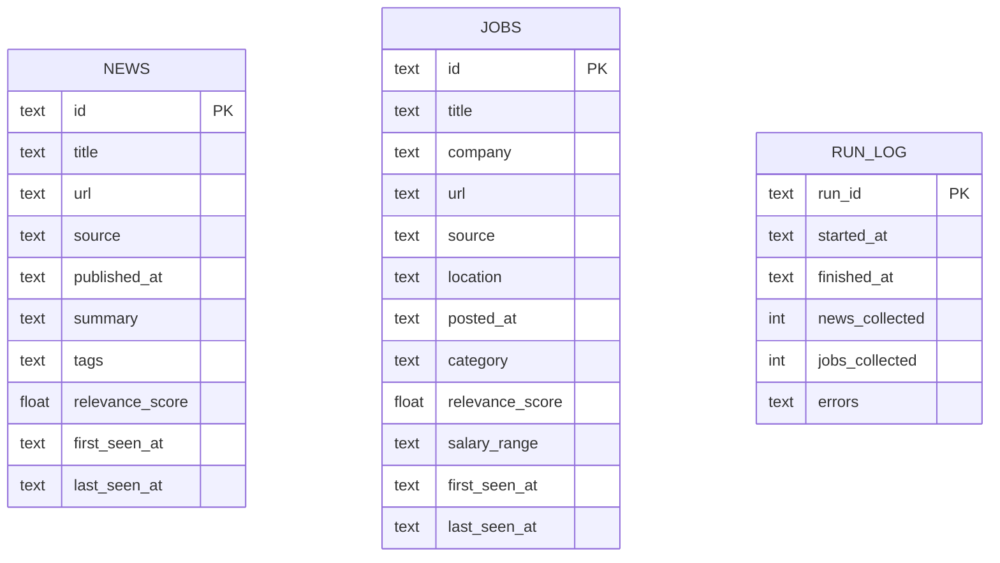
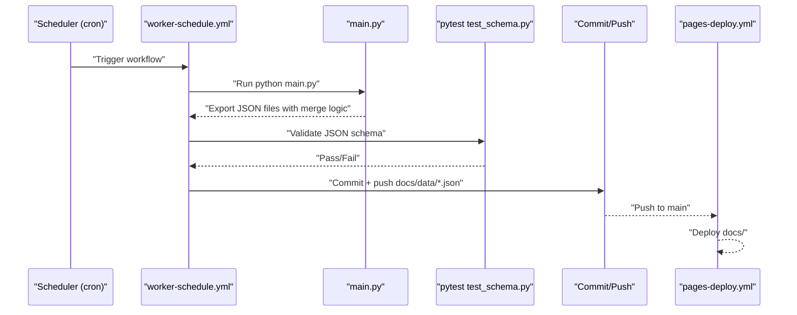
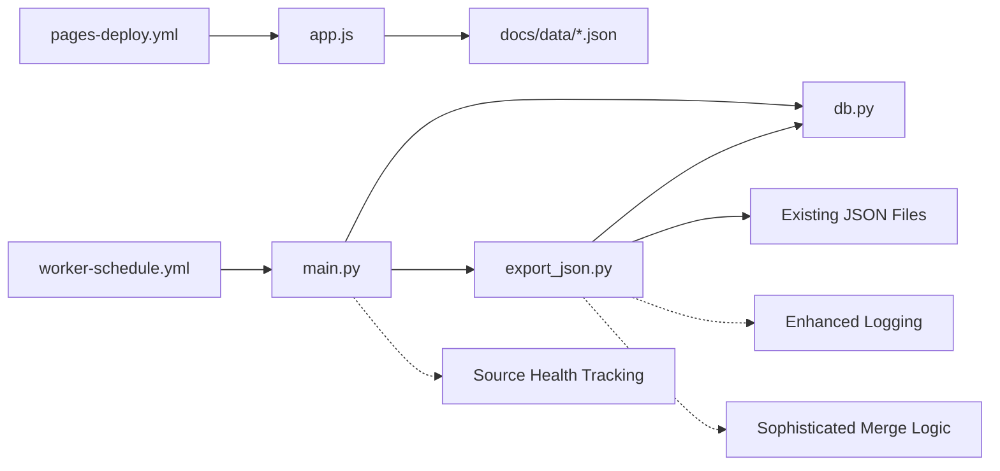

# JSON Export System

<cite>
**Referenced Files in This Document**
- [export_json.py](file://worker/storage/export_json.py)
- [db.py](file://worker/storage/db.py)
- [main.py](file://worker/main.py)
- [config.yaml](file://worker/config.yaml)
- [Dockerfile](file://worker/Dockerfile)
- [worker-schedule.yml](file://github/workflows/worker-schedule.yml)
- [pages-deploy.yml](file://github/workflows/pages-deploy.yml)
- [app.js](file://docs/assets/app.js)
- [news.json](file://docs/data/news.json)
- [jobs.json](file://docs/data/jobs.json)
- [meta.json](file://docs/data/meta.json)
- [test_schema.py](file://tests/test_schema.py)
</cite>

## Update Summary
**Changes Made**
- Enhanced JSON export system with sophisticated merge capabilities that combine new and existing data
- Reduced retention policy from 30 to 7 days for both SQLite storage and JSON output
- Improved error handling with structured logging and source health tracking
- Added comprehensive merge logic that preserves historical data while updating recent items
- Enhanced file writing with detailed logging including file size information
- Implemented separate retention policies for news (7 days) and jobs (60 days) with distinct handling

## Table of Contents
1. [Introduction](#introduction)
2. [Project Structure](#project-structure)
3. [Core Components](#core-components)
4. [Architecture Overview](#architecture-overview)
5. [Detailed Component Analysis](#detailed-component-analysis)
6. [Dependency Analysis](#dependency-analysis)
7. [Performance Considerations](#performance-considerations)
8. [Troubleshooting Guide](#troubleshooting-guide)
9. [Conclusion](#conclusion)

## Introduction
This document describes the JSON export system that generates static files for frontend consumption. The system has been enhanced with sophisticated merge capabilities that combine newly collected data with existing JSON files, preserving historical information while updating recent entries. It explains the export workflow, data transformation from database records to JSON, and file generation patterns. It documents the exported data structures for news and jobs content, including field mappings, data types, and formatting rules. It also covers the static site generation process, file naming conventions, directory structure, frontend consumption patterns, caching strategies, performance considerations, export scheduling, incremental updates, and error handling.

**Updated** Enhanced with sophisticated merge capabilities that combine new and existing data, reduced retention policy to 7 days, improved error handling with structured logging, and comprehensive source health tracking for better monitoring and debugging.

## Project Structure
The JSON export system spans three primary areas:
- Worker orchestration and persistence: collects, deduplicates, scores, persists, exports, and optionally publishes data.
- Storage layer: SQLite schema, connection helpers, and CRUD operations.
- Frontend: static HTML/CSS/JS that consumes the generated JSON files.

**Diagram sources**
- [main.py:148-315](file://worker/main.py#L148-L315)
- [export_json.py:116-177](file://worker/storage/export_json.py#L116-L177)
- [db.py:163-278](file://worker/storage/db.py#L163-L278)
- [config.yaml:6-7](file://worker/config.yaml#L6-L7)
- [Dockerfile:1-24](file://worker/Dockerfile#L1-L24)
- [worker-schedule.yml:1-70](file://github/workflows/worker-schedule.yml#L1-L70)
- [pages-deploy.yml:1-42](file://github/workflows/pages-deploy.yml#L1-L42)
- [index.html:1-86](file://docs/index.html#L1-L86)
- [app.js:101-118](file://docs/assets/app.js#L101-L118)

**Section sources**
- [main.py:148-315](file://worker/main.py#L148-L315)
- [export_json.py:116-177](file://worker/storage/export_json.py#L116-L177)
- [db.py:163-278](file://worker/storage/db.py#L163-L278)
- [config.yaml:6-7](file://worker/config.yaml#L6-L7)
- [Dockerfile:1-24](file://worker/Dockerfile#L1-L24)
- [worker-schedule.yml:1-70](file://github/workflows/worker-schedule.yml#L1-L70)
- [pages-deploy.yml:1-42](file://github/workflows/pages-deploy.yml#L1-L42)
- [index.html:1-86](file://docs/index.html#L1-L86)
- [app.js:101-118](file://docs/assets/app.js#L101-L118)

## Core Components
- **Enhanced Export Orchestrator**: Reads from SQLite and merges with existing JSON files, writing static JSON files under docs/data/ with sophisticated merge logic and detailed logging.
- **Database Layer**: Defines schema, connection helpers, transactions, and retrieval functions with 7-day retention policy for news and 60-day retention for jobs.
- **Frontend Consumer**: Loads JSON files, applies filtering and pagination, and renders cards.
- **Scheduling and Publishing**: GitHub Actions runs the worker on a schedule and deploys to GitHub Pages.

Key responsibilities:
- **Export**: Transform database rows to JSON payload with metadata and lists of items, including sophisticated merge logic that combines new and existing data.
- **Persistence**: Maintain normalized SQLite tables with 7-day retention for news and 60-day retention for jobs, and enforce constraints.
- **Consumption**: Parse JSON, compute staleness, and render UI.
- **Monitoring**: Track source health and provide structured error reporting for debugging.

**Updated** Enhanced with sophisticated merge capabilities that preserve historical data while updating recent entries, reduced retention to 7 days for news and 60 days for jobs, and comprehensive source health tracking for better monitoring.

**Section sources**
- [export_json.py:68-104](file://worker/storage/export_json.py#L68-L104)
- [db.py:163-278](file://worker/storage/db.py#L163-L278)
- [app.js:101-118](file://docs/assets/app.js#L101-L118)
- [worker-schedule.yml:1-70](file://github/workflows/worker-schedule.yml#L1-L70)

## Architecture Overview
The export system follows an enhanced pipeline with sophisticated merge capabilities and monitoring:
1. Collect news and jobs from enabled sources with structured error reporting.
2. Deduplicate and pre-filter items.
3. Score items via LLM (optional pre-filter).
4. Upsert items into SQLite with 7-day retention for news and 60-day retention for jobs.
5. Export static JSON files (news.json, jobs.json, meta.json) with merge logic and detailed logging.
6. Track source health and provide structured error reporting.
7. Optionally publish changes and send SMTP digest.

**Diagram sources**
- [main.py:148-315](file://worker/main.py#L148-L315)
- [db.py:163-278](file://worker/storage/db.py#L163-L278)
- [export_json.py:116-177](file://worker/storage/export_json.py#L116-L177)
- [worker-schedule.yml:44-70](file://github/workflows/worker-schedule.yml#L44-L70)
- [pages-deploy.yml:27-42](file://github/workflows/pages-deploy.yml#L27-L42)

## Detailed Component Analysis

### Enhanced Export Pipeline and Data Transformation
The export process transforms database records into JSON payloads with sophisticated merge capabilities and enhanced error handling:
- **Output directory**: docs/data/ (created if missing).
- **Generated timestamp**: UTC ISO string included in each payload.
- **Merge strategy**: Combine existing JSON data with fresh database data, with newer items winning for duplicates.
- **Retention policy**: 7 days for news items and 60 days for jobs, with separate handling for each type.
- **News payload**: {"generated_at": "...", "items": [...]}.
- **Jobs payload**: {"generated_at": "...", "items": [...]}.
- **Meta payload**: {"generated_at": "...", "news_count": N, "jobs_count": M, "source_health": {...}}.
- **File size logging**: Detailed logging includes file names and byte sizes for monitoring.

**Updated** Enhanced with sophisticated merge logic that preserves historical data while updating recent entries, separate retention policies for news (7 days) and jobs (60 days), and comprehensive logging with file size reporting.

**Diagram sources**
- [export_json.py:116-177](file://worker/storage/export_json.py#L116-L177)
- [db.py:163-278](file://worker/storage/db.py#L163-L278)

**Section sources**
- [export_json.py:68-104](file://worker/storage/export_json.py#L68-L104)
- [export_json.py:116-177](file://worker/storage/export_json.py#L116-L177)
- [db.py:163-278](file://worker/storage/db.py#L163-L278)

### Database Schema and Retrieval
SQLite schema defines normalized tables for news and jobs, plus a run log. Retrieval functions with separate retention policies:
- **get_news(conn, days=7, limit)**: selects news items with first_seen_at within the 7-day retention window, ordered by published_at descending, limited by count.
- **get_jobs(conn, days=60, limit)**: selects jobs with first_seen_at within the 60-day retention window, ordered by posted_at descending, limited by count.
- **Tags are stored as JSON arrays** in SQLite and decoded to Python lists on retrieval.

**Diagram sources**
- [db.py:163-278](file://worker/storage/db.py#L163-L278)

**Section sources**
- [db.py:163-278](file://worker/storage/db.py#L163-L278)
- [config.yaml:6-7](file://worker/config.yaml#L6-L7)

### Exported Data Structures

#### News JSON Structure
Top-level keys:
- **generated_at**: UTC ISO timestamp string.
- **items**: array of news items.

News item fields:
- **id**: string, unique identifier.
- **title**: string.
- **url**: string.
- **source**: string.
- **published_at**: string (ISO timestamp or equivalent).
- **summary**: string (optional).
- **tags**: array of strings (normalized).
- **relevance_score**: number in [0, 1] (optional).
- **first_seen_at, last_seen_at**: internal fields stripped from JSON.

Validation rules enforced by tests:
- Items must include required fields.
- tags must be a list.
- relevance_score must be numeric and within [0, 1].
- IDs must be unique.

**Section sources**
- [export_json.py:141-145](file://worker/storage/export_json.py#L141-L145)
- [test_schema.py:53-97](file://tests/test_schema.py#L53-L97)
- [news.json:1-5](file://docs/data/news.json#L1-L5)

#### Jobs JSON Structure
Top-level keys:
- **generated_at**: UTC ISO timestamp string.
- **items**: array of job items.

Job item fields:
- **id**: string, unique identifier.
- **title**: string.
- **company**: string.
- **url**: string.
- **source**: string.
- **location**: string (optional).
- **posted_at**: string (ISO timestamp or equivalent).
- **category**: string (optional).
- **relevance_score**: number in [0, 1] (optional).
- **salary_range**: string (optional).
- **first_seen_at, last_seen_at**: internal fields stripped from JSON.

Validation rules enforced by tests:
- Items must include required fields.
- relevance_score must be numeric and within [0, 1].
- IDs must be unique.

**Section sources**
- [export_json.py:155-159](file://worker/storage/export_json.py#L155-L159)
- [test_schema.py:99-136](file://tests/test_schema.py#L99-L136)
- [jobs.json:1-5](file://docs/data/jobs.json#L1-L5)

#### Meta JSON Structure
Top-level keys:
- **generated_at**: UTC ISO timestamp string.
- **news_count**: integer, number of news items.
- **jobs_count**: integer, number of jobs items.
- **source_health**: object mapping source name to status string.

**Updated** Enhanced with structured source health tracking that provides detailed status information for each data source.

**Section sources**
- [export_json.py:162-168](file://worker/storage/export_json.py#L162-L168)
- [meta.json:1-6](file://docs/data/meta.json#L1-L6)

### Static Site Generation and Directory Structure
- **Output directory**: docs/data/ under the repository root.
- **Files produced**:
  - news.json (merged with existing data)
  - jobs.json (merged with existing data)
  - meta.json (with counts and source health)
- **Directory layout** is fixed; the worker ensures the directory exists before writing.
- **File size logging**: detailed logging reports file names and byte sizes for monitoring.

**Updated** Enhanced with sophisticated merge logic that preserves historical data while updating recent entries, separate retention policies for different content types, and comprehensive file size reporting in logs.

**Section sources**
- [export_json.py:128-177](file://worker/storage/export_json.py#L128-L177)
- [export_json.py:32-37](file://worker/storage/export_json.py#L32-L37)

### Frontend Consumption Patterns
The frontend loads JSON files and renders content:
- Loads meta.json first to show last updated time and detect staleness.
- Concurrently loads news.json and jobs.json.
- Applies client-side filtering by search term, tag/source/category, and date windows.
- Paginates results and renders cards with relevance scores, dates, and badges.

Caching and freshness:
- Adds a cache-busting query parameter when fetching JSON.
- Computes staleness based on generated_at and displays a warning banner after 6 hours.
- Uses local theme preference persisted in localStorage.

**Section sources**
- [app.js:101-118](file://docs/assets/app.js#L101-L118)
- [app.js:132-145](file://docs/assets/app.js#L132-L145)
- [app.js:241-254](file://docs/assets/app.js#L241-L254)
- [app.js:120-129](file://docs/assets/app.js#L120-L129)

### Export Scheduling and Publishing
- **Scheduled runs**: every 2 hours via GitHub Actions workflow.
- **Validation**: runs schema tests post-export to ensure correctness.
- **Publishing**: commits and pushes docs/data/*.json; subsequent push triggers GitHub Pages deployment.

**Diagram sources**
- [worker-schedule.yml:13-70](file://github/workflows/worker-schedule.yml#L13-L70)
- [pages-deploy.yml:27-42](file://github/workflows/pages-deploy.yml#L27-L42)
- [test_schema.py:1-136](file://tests/test_schema.py#L1-L136)

**Section sources**
- [worker-schedule.yml:1-70](file://github/workflows/worker-schedule.yml#L1-L70)
- [pages-deploy.yml:1-42](file://github/workflows/pages-deploy.yml#L1-L42)
- [test_schema.py:1-136](file://tests/test_schema.py#L1-L136)

### Enhanced Error Handling During Export
- **Source failures**: individual news/job collectors report errors with structured logging and mark source health.
- **Export errors**: logged with detailed file information including sizes; the pipeline continues to completion to produce meta.json with counts.
- **Git publish failures**: caught and logged with descriptive messages; does not block export.
- **SMTP digest failures**: caught and logged; does not block export.
- **Logging consistency**: uniform timestamp format and structured message patterns throughout the pipeline.

**Updated** Enhanced error handling with structured logging, detailed file size reporting, comprehensive source health tracking, and sophisticated merge logic for better monitoring and debugging.

**Section sources**
- [main.py:173-181](file://worker/main.py#L173-L181)
- [main.py:279-284](file://worker/main.py#L279-L284)
- [export_json.py:46-48](file://worker/storage/export_json.py#L46-L48)
- [export_json.py:32-37](file://worker/storage/export_json.py#L32-L37)

## Dependency Analysis
The export system exhibits clear separation of concerns with enhanced monitoring and sophisticated merge capabilities:
- main.py orchestrates the pipeline and depends on db.py and export_json.py.
- export_json.py depends on db.py for data retrieval, reads existing JSON files, performs merge operations, and writes to docs/data/ with detailed logging.
- Frontend app.js depends on docs/data/*.json.
- GitHub Actions workflows depend on main.py and the exported artifacts.
- Source health tracking provides monitoring capabilities across all components.

**Updated** Enhanced dependency tracking with source health monitoring, structured logging integration, and sophisticated merge logic.

**Diagram sources**
- [main.py:148-315](file://worker/main.py#L148-L315)
- [export_json.py:116-177](file://worker/storage/export_json.py#L116-L177)
- [db.py:163-278](file://worker/storage/db.py#L163-L278)
- [app.js:101-118](file://docs/assets/app.js#L101-L118)
- [worker-schedule.yml:44-57](file://github/workflows/worker-schedule.yml#L44-L57)
- [pages-deploy.yml:34-41](file://github/workflows/pages-deploy.yml#L34-L41)

**Section sources**
- [main.py:148-315](file://worker/main.py#L148-L315)
- [export_json.py:116-177](file://worker/storage/export_json.py#L116-L177)
- [db.py:163-278](file://worker/storage/db.py#L163-L278)
- [app.js:101-118](file://docs/assets/app.js#L101-L118)
- [worker-schedule.yml:44-57](file://github/workflows/worker-schedule.yml#L44-L57)
- [pages-deploy.yml:34-41](file://github/workflows/pages-deploy.yml#L34-L41)

## Performance Considerations
- **Reduced retention**: 7-day retention for news and 60-day retention for jobs keeps query result sizes manageable and JSON payloads small.
- **Client-side pagination**: reduces DOM rendering overhead and improves perceived performance.
- **Staleness detection**: avoids unnecessary reloads and informs users about data freshness.
- **Batched LLM scoring**: pre-filtering reduces cost and latency by limiting LLM calls.
- **SQLite WAL mode and indexes**: improve concurrency and query performance.
- **Enhanced logging**: provides monitoring insights without significant performance impact.
- **Merge optimization**: sophisticated merge logic minimizes file I/O by combining data efficiently.
- **Separate retention policies**: optimize storage usage by keeping jobs data longer than news data.

**Updated** Enhanced logging provides monitoring capabilities with minimal performance overhead, sophisticated merge logic optimizes file operations, and separate retention policies improve storage efficiency.

## Troubleshooting Guide
Common issues and remedies:
- **JSON validation failures**: ensure required fields exist, tags are arrays, relevance_score is numeric and in [0,1], and IDs are unique.
- **Stale data warnings**: confirm export runs are succeeding and pages are being deployed.
- **Export errors**: check logs for source failures and review source_health in meta.json.
- **Git publish failures**: verify credentials and repository URL; otherwise, changes remain local.
- **Frontend fetch errors**: confirm docs/data/*.json are present and accessible; inspect browser network tab.
- **Logging issues**: check enhanced logs for file size information and structured error messages.
- **Source health problems**: monitor source_health dictionary for detailed status information.
- **Merge conflicts**: verify that newer items are properly overriding existing entries with the same ID.
- **Retention issues**: check that news items older than 7 days and jobs older than 60 days are being properly filtered.

**Updated** Enhanced troubleshooting with structured logging, source health monitoring, sophisticated merge logic, and separate retention policy management for better debugging capabilities.

**Section sources**
- [test_schema.py:28-51](file://tests/test_schema.py#L28-L51)
- [test_schema.py:75-97](file://tests/test_schema.py#L75-L97)
- [test_schema.py:121-136](file://tests/test_schema.py#L121-L136)
- [app.js:110-115](file://docs/assets/app.js#L110-L115)
- [main.py:279-284](file://worker/main.py#L279-L284)

## Conclusion
The JSON export system provides a robust, incremental pipeline that transforms collected data into static JSON files for efficient frontend consumption. It enforces schema compliance, manages 7-day retention for news and 60-day retention for jobs with separate handling, integrates with GitHub Actions for automated scheduling and deployment, and incorporates sophisticated merge capabilities that preserve historical data while updating recent entries. The enhanced error handling and logging system provides detailed monitoring and debugging capabilities, while the source health tracking offers comprehensive visibility into data source reliability. The frontend benefits from strong caching, client-side filtering, and pagination, delivering a responsive user experience. The improved logging, structured error reporting, sophisticated merge logic, and separate retention policies ensure reliable operation across the entire stack with better observability and debugging support.