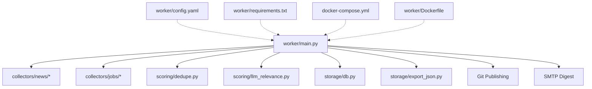
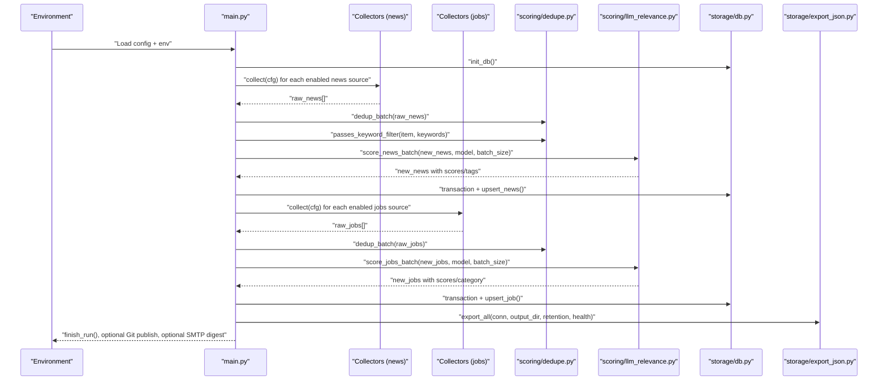
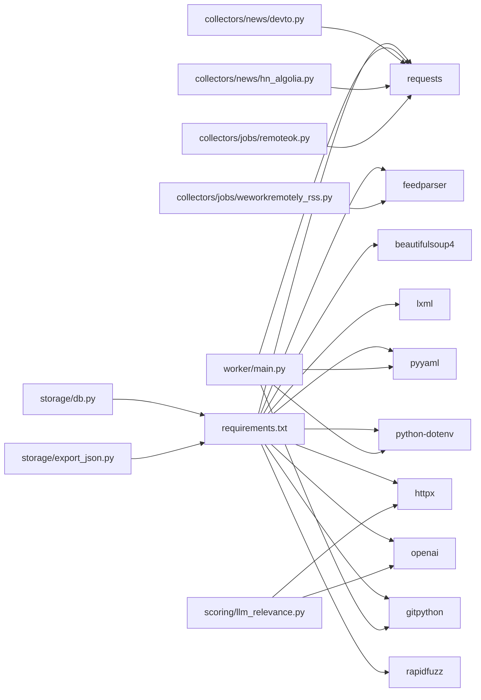

# Development Guide

<cite>
**Referenced Files in This Document**
- [main.py](file://worker/main.py)
- [config.yaml](file://worker/config.yaml)
- [requirements.txt](file://worker/requirements.txt)
- [Dockerfile](file://worker/Dockerfile)
- [docker-compose.yml](file://docker-compose.yml)
- [collectors/news/devto.py](file://worker/collectors/news/devto.py)
- [collectors/news/hn_algolia.py](file://worker/collectors/news/hn_algolia.py)
- [collectors/jobs/remoteok.py](file://worker/collectors/jobs/remoteok.py)
- [collectors/jobs/weworkremotely_rss.py](file://worker/collectors/jobs/weworkremotely_rss.py)
- [scoring/dedupe.py](file://worker/scoring/dedupe.py)
- [scoring/llm_relevance.py](file://worker/scoring/llm_relevance.py)
- [storage/db.py](file://worker/storage/db.py)
- [storage/export_json.py](file://worker/storage/export_json.py)
- [.env.example](file://.env.example)
</cite>

## Table of Contents
1. [Introduction](#introduction)
2. [Project Structure](#project-structure)
3. [Core Components](#core-components)
4. [Architecture Overview](#architecture-overview)
5. [Detailed Component Analysis](#detailed-component-analysis)
6. [Dependency Analysis](#dependency-analysis)
7. [Performance Considerations](#performance-considerations)
8. [Testing Framework and Quality Assurance](#testing-framework-and-quality-assurance)
9. [Contribution Guidelines and Code Standards](#contribution-guidelines-and-code-standards)
10. [Extension Mechanisms](#extension-mechanisms)
11. [Debugging and Profiling](#debugging-and-profiling)
12. [Release Procedures](#release-procedures)
13. [Best Practices for Backward Compatibility](#best-practices-for-backward-compatibility)
14. [Troubleshooting Guide](#troubleshooting-guide)
15. [Conclusion](#conclusion)

## Introduction
This development guide documents how to contribute to the project, extend its capabilities, and operate it reliably. It covers the plugin architecture for collecting news and jobs, customization of processing logic, testing and QA, performance tuning, and operational procedures. The system is designed to be configurable via YAML and environment variables, with a clear separation between data collection, deduplication, scoring, persistence, and export.

## Project Structure
The repository is organized around a worker process that orchestrates a pipeline:
- worker/main.py: Orchestrator that loads configuration, runs collection, deduplication, scoring, persistence, export, optional Git publishing, and optional SMTP digest.
- worker/collectors: Pluggable modules for news and jobs sources.
- worker/scoring: Deduplication and LLM-based relevance scoring.
- worker/storage: SQLite schema, CRUD, transactions, and JSON export.
- worker/config.yaml: Centralized runtime configuration.
- worker/requirements.txt: Python dependencies.
- docker-compose.yml and worker/Dockerfile: Containerization and orchestration.

**Diagram sources**
- [main.py](file://worker/main.py)
- [config.yaml](file://worker/config.yaml)
- [requirements.txt](file://worker/requirements.txt)
- [docker-compose.yml](file://docker-compose.yml)
- [Dockerfile](file://worker/Dockerfile)

**Section sources**
- [main.py](file://worker/main.py)
- [config.yaml](file://worker/config.yaml)
- [requirements.txt](file://worker/requirements.txt)
- [docker-compose.yml](file://docker-compose.yml)
- [Dockerfile](file://worker/Dockerfile)

## Core Components
- Orchestrator (worker/main.py): Loads configuration, initializes database, executes the pipeline, handles errors, exports JSON, optionally publishes via Git, and sends SMTP digest.
- Collectors (worker/collectors): Pluggable modules under news/ and jobs/ packages implementing a uniform collect(cfg) interface.
- Scoring (worker/scoring): Deduplication helpers and LLM-based relevance scoring for news and jobs.
- Storage (worker/storage): SQLite schema, connection helpers, transactions, and JSON export to docs/data.

Key responsibilities:
- Configuration-driven enable/disable and tuning of sources and scoring.
- Deterministic ID generation and fuzzy deduplication to avoid redundant processing.
- Batched LLM calls with pre-filtering to reduce cost and latency.
- Atomic database transactions and WAL mode for concurrency.
- Static JSON export for web publishing.

**Section sources**
- [main.py](file://worker/main.py)
- [scoring/dedupe.py](file://worker/scoring/dedupe.py)
- [scoring/llm_relevance.py](file://worker/scoring/llm_relevance.py)
- [storage/db.py](file://worker/storage/db.py)
- [storage/export_json.py](file://worker/storage/export_json.py)

## Architecture Overview
The pipeline is a linear, event-driven workflow controlled by configuration and environment variables.

**Diagram sources**
- [main.py](file://worker/main.py)
- [scoring/dedupe.py](file://worker/scoring/dedupe.py)
- [scoring/llm_relevance.py](file://worker/scoring/llm_relevance.py)
- [storage/db.py](file://worker/storage/db.py)
- [storage/export_json.py](file://worker/storage/export_json.py)

## Detailed Component Analysis

### Orchestrator (worker/main.py)
- Loads environment variables (.env) and config.yaml.
- Initializes logging and database.
- Iterates over enabled news and jobs collectors, aggregates results, and tracks source health.
- Applies deduplication and keyword pre-filtering.
- Calls LLM scoring in batches with configurable model and batch size.
- Persists to SQLite inside atomic transactions.
- Exports JSON to docs/data and records run metrics.
- Optionally commits and pushes to Git and sends SMTP digest.

Operational controls:
- DRY_RUN disables Git publishing and SMTP digest.
- SMTP_ENABLED toggles SMTP digest sending.
- OPENROUTER_* environment variables configure LLM backend.

**Section sources**
- [main.py](file://worker/main.py)

### Collectors (news and jobs)
- Uniform contract: collect(cfg) returns a list of normalized dictionaries with required fields (id, title, url, source, timestamps, relevance_score, etc.).
- Each module encapsulates source-specific logic (API calls, RSS parsing, rate limiting).
- Uses shared ID generators from scoring.dedupe to ensure deterministic uniqueness.

Examples of implemented collectors:
- News: Dev.to, Hacker News via Algolia, Reddit, RSS feeds, GitHub releases.
- Jobs: RemoteOK, Remotive, WeWorkRemotely RSS, ArbeitenNOW, Who Is Hiring, Greenhouse, Lever.

**Section sources**
- [collectors/news/devto.py](file://worker/collectors/news/devto.py)
- [collectors/news/hn_algolia.py](file://worker/collectors/news/hn_algolia.py)
- [collectors/jobs/remoteok.py](file://worker/collectors/jobs/remoteok.py)
- [collectors/jobs/weworkremotely_rss.py](file://worker/collectors/jobs/weworkremotely_rss.py)

### Deduplication and Keyword Filtering (scoring/dedupe.py)
- Stable deterministic IDs for news and jobs using hashing of normalized fields.
- DB-backed seen checks to avoid reprocessing.
- In-batch fuzzy deduplication using token-sort similarity ratio.
- Keyword pre-filter to gate LLM calls.

Complexity:
- Fuzzy dedup is O(n^2) in worst case; acceptable given batch sizes and pre-filtering.

**Section sources**
- [scoring/dedupe.py](file://worker/scoring/dedupe.py)

### LLM Relevance Scoring (scoring/llm_relevance.py)
- OpenRouter-compatible chat completions for news (scores, summaries, tags) and jobs (scores, categories).
- Batch processing with configurable batch size and model.
- Robust JSON parsing with fenced code block handling.
- Graceful degradation when API key is missing.

**Section sources**
- [scoring/llm_relevance.py](file://worker/scoring/llm_relevance.py)

### Storage (storage/db.py)
- SQLite schema with WAL mode and indices for efficient reads.
- Transactions ensure atomicity; rollback on exceptions.
- Upsert semantics preserve first_seen_at and update last_seen_at.
- Helper queries for recent items and run logs.

**Section sources**
- [storage/db.py](file://worker/storage/db.py)

### Export (storage/export_json.py)
- Reads from SQLite, normalizes fields, writes news.json, jobs.json, meta.json.
- Adds generated_at timestamps and source_health metadata.

**Section sources**
- [storage/export_json.py](file://worker/storage/export_json.py)

## Dependency Analysis
Runtime dependencies are declared in requirements.txt and used across modules.

**Diagram sources**
- [requirements.txt](file://worker/requirements.txt)
- [main.py](file://worker/main.py)
- [collectors/news/devto.py](file://worker/collectors/news/devto.py)
- [collectors/news/hn_algolia.py](file://worker/collectors/news/hn_algolia.py)
- [collectors/jobs/remoteok.py](file://worker/collectors/jobs/remoteok.py)
- [collectors/jobs/weworkremotely_rss.py](file://worker/collectors/jobs/weworkremotely_rss.py)
- [scoring/llm_relevance.py](file://worker/scoring/llm_relevance.py)
- [storage/db.py](file://worker/storage/db.py)
- [storage/export_json.py](file://worker/storage/export_json.py)

**Section sources**
- [requirements.txt](file://worker/requirements.txt)

## Performance Considerations
- LLM pre-filtering and keyword filtering dramatically reduce downstream LLM calls.
- Batched LLM scoring minimizes overhead; tune batch_size for throughput vs. cost.
- SQLite WAL mode improves concurrent writes; ensure adequate disk I/O.
- Rate limits in collectors (e.g., RemoteOK, Reddit) prevent throttling and failures.
- Fuzzy dedup is CPU-intensive; keep batch sizes reasonable and leverage pre-filtering.

[No sources needed since this section provides general guidance]

## Testing Framework and Quality Assurance
Current state:
- Tests directory contains a schema validation test module placeholder.
- No unit tests for collectors, scoring, or storage are present in the repository snapshot.

Recommended QA practices:
- Unit tests for each collector module verifying:
  - collect(cfg) returns normalized items with required fields.
  - Error handling for network failures and malformed responses.
  - Edge cases: empty responses, missing fields, rate-limit simulation.
- Integration tests for the pipeline:
  - End-to-end run with mocked HTTP responses and SQLite in-memory DB.
  - Validate exported JSON structure and counts.
- Linters and formatters:
  - Apply black, flake8, and mypy to enforce style and type safety.
- Security scanning:
  - Dependabot or similar for dependency updates.
- CI/CD:
  - Run linting, tests, and export verification on pull requests.

**Section sources**
- [tests/test_schema.py](file://tests/test_schema.py)

## Contribution Guidelines and Code Standards
- Plugin architecture:
  - Add new collectors under worker/collectors/news or worker/collectors/jobs with a collect(cfg) function returning normalized items.
  - Keep modules self-contained; import shared ID generators from scoring.dedupe.
- Configuration-first design:
  - Prefer adding/updating entries in worker/config.yaml over code changes.
  - Use environment variables for secrets and overrides.
- Logging:
  - Use structured logging with appropriate levels; include source names.
- Error handling:
  - Catch and log exceptions per collector; record errors in run log.
- Backward compatibility:
  - Preserve field names and shapes for news/jobs items.
  - Avoid breaking changes to config keys; deprecate with migration notes.
- Documentation:
  - Add docstrings to new modules and functions.
  - Update this guide when introducing major features.

**Section sources**
- [main.py](file://worker/main.py)
- [config.yaml](file://worker/config.yaml)

## Extension Mechanisms

### Adding a New News Source
Steps:
1. Create worker/collectors/news/mynews.py with a collect(cfg) function.
2. Import the module in worker/main.py and wire it into the news collection loop.
3. Add an entry under news: in worker/config.yaml with enabled flag and source-specific keys.
4. Optionally add tags and limits in config.

Validation:
- Ensure returned items include id, title, url, source, published_at, relevance_score, and optional summary/tags.
- Test with DRY_RUN=true to inspect logs and exported JSON.

**Section sources**
- [main.py](file://worker/main.py)
- [config.yaml](file://worker/config.yaml)

### Adding a New Jobs Source
Steps:
1. Create worker/collectors/jobs/myjobs.py with a collect(cfg) function.
2. Import the module in worker/main.py and wire it into the jobs collection loop.
3. Add an entry under jobs: in worker/config.yaml with enabled flag and source-specific keys.
4. Merge job-level keywords into the collector’s cfg before calling collect.

Validation:
- Returned items must include id, title, url, source, posted_at, relevance_score, and optional category/salary_range.

**Section sources**
- [main.py](file://worker/main.py)
- [config.yaml](file://worker/config.yaml)

### Customizing Processing Logic
- Keyword pre-filter: adjust keyword_filter in config.yaml to gate LLM calls.
- LLM model and batch size: set OPENROUTER_MODEL and llm.batch_size in config.yaml or environment.
- Dedup thresholds: tune fuzzy threshold in scoring/dedupe.py if needed.
- Retention: set retention_days to control exported history.

**Section sources**
- [config.yaml](file://worker/config.yaml)
- [scoring/dedupe.py](file://worker/scoring/dedupe.py)
- [scoring/llm_relevance.py](file://worker/scoring/llm_relevance.py)

### Implementing New Features
- New scoring dimension: extend scoring/llm_relevance.py with a new function and integrate into main.py.
- Additional persistence targets: add new storage functions and export steps in storage/export_json.py.
- New notification channels: implement a new notifier and wire into main.py similarly to SMTP digest.

**Section sources**
- [scoring/llm_relevance.py](file://worker/scoring/llm_relevance.py)
- [storage/export_json.py](file://worker/storage/export_json.py)
- [main.py](file://worker/main.py)

## Debugging and Profiling
Common techniques:
- Increase LOG_LEVEL via environment variable to DEBUG for verbose logs.
- Use DRY_RUN=true to skip Git publishing and SMTP digest while validating pipeline stages.
- Inspect SQLite database (worker/db/app.db) for stored items and run logs.
- Validate exported JSON (docs/data/*.json) for correctness and completeness.
- Profile LLM calls: monitor OPENROUTER_API_KEY presence and response times.

Operational tips:
- Set OPENROUTER_BASE_URL and OPENROUTER_MODEL via environment for testing alternate providers or models.
- For network issues, add retry logic and timeouts in collectors; log exceptions with context.

**Section sources**
- [main.py](file://worker/main.py)
- [scoring/llm_relevance.py](file://worker/scoring/llm_relevance.py)

## Release Procedures
- Prepare environment:
  - Configure .env with secrets (OPENROUTER_API_KEY, optional Git credentials).
  - Verify worker/config.yaml settings for sources and keywords.
- Run locally:
  - docker compose up --build worker to execute a single run.
- Publish:
  - If GH_PAT and GIT_REPO_URL are set, the worker will commit and push docs/data/*.json to the configured branch.
- Preview:
  - docker compose --profile preview up preview to serve docs via Nginx on port 8080.

**Section sources**
- [docker-compose.yml](file://docker-compose.yml)
- [Dockerfile](file://worker/Dockerfile)
- [main.py](file://worker/main.py)

## Best Practices for Backward Compatibility
- Preserve item field shapes and semantics across news/jobs items.
- Avoid renaming or removing config keys; add new keys with defaults.
- When changing collector behavior, maintain the collect(cfg) contract.
- Keep export schema stable; introduce new fields as optional additions.

[No sources needed since this section provides general guidance]

## Troubleshooting Guide
- No items exported:
  - Check retention_days and that collect() returns non-empty lists.
  - Verify export directory permissions and mount points in docker-compose.yml.
- LLM scoring disabled:
  - Ensure OPENROUTER_API_KEY is set; otherwise, scoring is skipped with a warning.
- Git publish not pushing:
  - Confirm GH_PAT and GIT_REPO_URL are both set; otherwise, it logs local commit only.
- SMTP digest errors:
  - Enable SMTP_ENABLED and ensure SMTP_* environment variables are configured; errors are logged and do not fail the run.
- Collector failures:
  - Errors are captured per source and recorded in run_log; check logs for specific source exceptions.

**Section sources**
- [main.py](file://worker/main.py)
- [storage/db.py](file://worker/storage/db.py)

## Conclusion
This guide outlined how to extend the system via plugins, customize processing, operate reliably with containers, and maintain quality through configuration-first design. By following the plugin architecture, configuration patterns, and QA practices described here, contributors can add new sources, refine scoring, and evolve the system safely and efficiently.