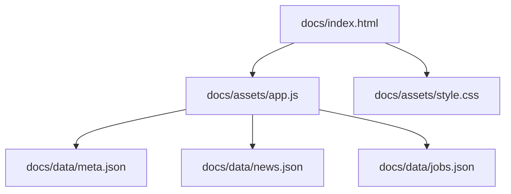
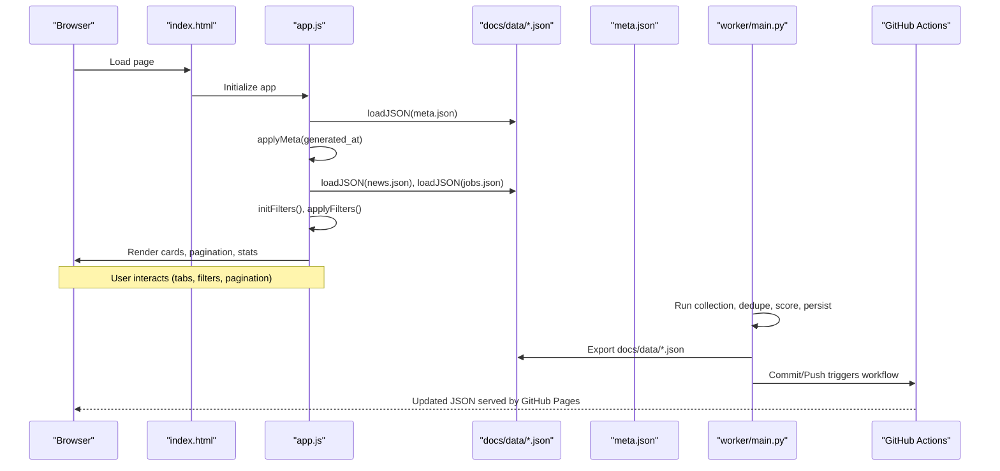
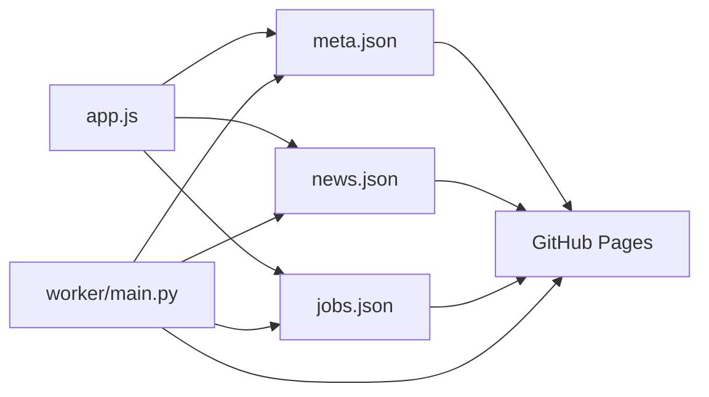

# Frontend Application

<cite>
**Referenced Files in This Document**
- [index.html](file://docs/index.html)
- [app.js](file://docs/assets/app.js)
- [style.css](file://docs/assets/style.css)
- [news.json](file://docs/data/news.json)
- [jobs.json](file://docs/data/jobs.json)
- [meta.json](file://docs/data/meta.json)
- [pages-deploy.yml](file://.github/workflows/pages-deploy.yml)
- [worker-schedule.yml](file://.github/workflows/worker-schedule.yml)
- [docker-compose.yml](file://docker-compose.yml)
- [config.yaml](file://worker/config.yaml)
- [main.py](file://worker/main.py)
- [test_schema.py](file://tests/test_schema.py)
</cite>

## Table of Contents
1. [Introduction](#introduction)
2. [Project Structure](#project-structure)
3. [Core Components](#core-components)
4. [Architecture Overview](#architecture-overview)
5. [Detailed Component Analysis](#detailed-component-analysis)
6. [Dependency Analysis](#dependency-analysis)
7. [Performance Considerations](#performance-considerations)
8. [Troubleshooting Guide](#troubleshooting-guide)
9. [Conclusion](#conclusion)
10. [Appendices](#appendices)

## Introduction
This document describes the static frontend application that renders a DevOps and AI news hub. It covers the HTML structure, JavaScript application logic, and CSS styling. It explains client-side rendering, data consumption patterns, and user interface components. It also documents responsive design, search and filtering, interactive features, customization and extension points, analytics integration, browser compatibility, performance optimization, accessibility, deployment, and CDN strategies.

## Project Structure
The frontend is a pure static site under docs/. It consists of:
- A single HTML entry point that defines the UI shell and tabbed panels for News and Jobs.
- A vanilla JavaScript application that loads JSON data, applies filters, paginates, and renders cards.
- A stylesheet that defines theme-aware tokens, layout, and responsive breakpoints.

**Diagram sources**
- [index.html:1-86](file://docs/index.html#L1-L86)
- [app.js:102-118](file://docs/assets/app.js#L102-L118)
- [meta.json:1-7](file://docs/data/meta.json#L1-L7)
- [news.json:1-5](file://docs/data/news.json#L1-L5)
- [jobs.json:1-5](file://docs/data/jobs.json#L1-L5)

**Section sources**
- [index.html:1-86](file://docs/index.html#L1-L86)
- [app.js:102-118](file://docs/assets/app.js#L102-L118)
- [style.css:1-260](file://docs/assets/style.css#L1-L260)

## Core Components
- HTML Shell: Defines header, tabs, filters, lists, pagination, and footer. Uses ARIA roles and labels for accessibility.
- JavaScript App: Loads data, initializes filters, applies search and date/tag/category filters, paginates, and renders cards. Implements debounced input handling and theme persistence.
- CSS Styles: Provides theme tokens, layout primitives, responsive grid, and component styles for cards, badges, and pagination.

Key responsibilities:
- Data ingestion: Fetches JSON files from docs/data/.
- Filtering: Supports text search, tag/source/date filters, and reset controls.
- Rendering: Builds HTML fragments for news and job cards, updates stats and empty/error states.
- UX: Smooth pagination scrolling, theme toggle with persistent preference, stale banner based on metadata age.

**Section sources**
- [index.html:10-81](file://docs/index.html#L10-L81)
- [app.js:13-24](file://docs/assets/app.js#L13-L24)
- [app.js:108-129](file://docs/assets/app.js#L108-L129)
- [app.js:147-181](file://docs/assets/app.js#L147-L181)
- [app.js:256-290](file://docs/assets/app.js#L256-L290)
- [style.css:6-39](file://docs/assets/style.css#L6-L39)
- [style.css:131-135](file://docs/assets/style.css#L131-L135)

## Architecture Overview
The frontend is a static SPA that loads JSON data and renders UI without a backend server. The worker (in the worker/ directory) periodically regenerates docs/data/*.json and pushes changes to the repository, which triggers GitHub Pages deployment.

**Diagram sources**
- [index.html:1-86](file://docs/index.html#L1-L86)
- [app.js:108-129](file://docs/assets/app.js#L108-L129)
- [app.js:132-145](file://docs/assets/app.js#L132-L145)
- [app.js:241-254](file://docs/assets/app.js#L241-L254)
- [worker-schedule.yml:44-69](file://.github/workflows/worker-schedule.yml#L44-L69)
- [pages-deploy.yml:27-41](file://.github/workflows/pages-deploy.yml#L27-L41)

## Detailed Component Analysis

### HTML Structure and Accessibility
- Header: Branding, last-updated timestamp, theme toggle button with aria-label and title.
- Tabs: Two tab buttons with role="tab" and aria-selected attributes; panels with role="tabpanel".
- Filters Bar: Search inputs and select dropdowns for tag/source/date, plus Reset buttons.
- Panels: Lists rendered as grids, empty and error states, pagination navigation.
- Footer: Static attribution text.

Accessibility features:
- ARIA roles and labels for tabs and pagination.
- aria-live="polite" for dynamic last-updated text.
- Hidden elements use hidden class and are visually hidden.

**Section sources**
- [index.html:10-81](file://docs/index.html#L10-L81)

### JavaScript Application Logic
Application state and helpers:
- State holds separate arrays for news and jobs, with all, filtered, and page indices.
- Helper functions: escaping, date formatting, daysSince, uniqueSorted, populateSelect, scoreLabel, range, debounce.
- DOM helpers: $() selector wrapper.

Theme toggle:
- Reads saved theme from localStorage, sets data-theme on html element, toggles emoji icon, persists preference.

Tab switching:
- Switches active tab class and panel visibility.

Data loading and bootstrapping:
- loadJSON appends cache-busting query param and throws on non-OK responses.
- bootstrap loads meta, applies last-updated and stale banner, then loads news and jobs concurrently.

News pipeline:
- loadNews sorts by published_at descending, populates tag/source selects, attaches debounced input listeners and change listeners, and applies filters.
- applyNewsFilters performs text search across title/summary, tag/source/date filtering, resets page to 1, and renders.
- renderNews computes slice for current page, updates stats, toggles empty state, renders cards, and renders pagination.

Job pipeline mirrors news with category/source/date filters and job-specific card rendering.

Pagination:
- renderPagination builds a compact paginator with ellipses around current page and handles prev/next and page clicks.

Tag click shortcut:
- Clicking a tag badge in the news list sets the tag filter and re-applies filters.

Debounce:
- Utility to rate-limit input handlers.

Boot:
- Calls bootstrap() to initialize.

**Section sources**
- [app.js:13-24](file://docs/assets/app.js#L13-L24)
- [app.js:27-65](file://docs/assets/app.js#L27-L65)
- [app.js:71-84](file://docs/assets/app.js#L71-L84)
- [app.js:87-99](file://docs/assets/app.js#L87-L99)
- [app.js:102-118](file://docs/assets/app.js#L102-L118)
- [app.js:132-145](file://docs/assets/app.js#L132-L145)
- [app.js:147-181](file://docs/assets/app.js#L147-L181)
- [app.js:191-215](file://docs/assets/app.js#L191-L215)
- [app.js:241-254](file://docs/assets/app.js#L241-L254)
- [app.js:256-290](file://docs/assets/app.js#L256-L290)
- [app.js:300-324](file://docs/assets/app.js#L300-L324)
- [app.js:350-381](file://docs/assets/app.js#L350-L381)
- [app.js:390-395](file://docs/assets/app.js#L390-L395)
- [app.js:398-401](file://docs/assets/app.js#L398-L401)
- [app.js:404](file://docs/assets/app.js#L404)

### CSS Styling and Theming
Design tokens:
- CSS custom properties define light/dark theme values for backgrounds, surfaces, borders, text, accents, shadows, radii, and fonts.

Layout:
- Sticky header with brand and controls.
- Tab navigation with active state.
- Filters bar with flexible layout and focus states.
- Grid-based card layout with auto-fill columns.

Components:
- News card: title, summary, source badge, date, tags, relevance score.
- Job card: title, company, source badge, location, category, salary, posted date, relevance score.
- Pagination: centered buttons with hover and active states.
- Empty/error states: centered messages with muted/error colors.

Responsive:
- Mobile-first grid collapses to single column.
- Filters stack vertically on small screens.
- Inputs expand to full width.

**Section sources**
- [style.css:6-39](file://docs/assets/style.css#L6-L39)
- [style.css:52-79](file://docs/assets/style.css#L52-L79)
- [style.css:84-98](file://docs/assets/style.css#L84-L98)
- [style.css:103-127](file://docs/assets/style.css#L103-L127)
- [style.css:131-135](file://docs/assets/style.css#L131-L135)
- [style.css:140-175](file://docs/assets/style.css#L140-L175)
- [style.css:179-214](file://docs/assets/style.css#L179-L214)
- [style.css:218-231](file://docs/assets/style.css#L218-L231)
- [style.css:235-241](file://docs/assets/style.css#L235-L241)
- [style.css:254-260](file://docs/assets/style.css#L254-L260)

### Data Consumption Patterns
- JSON files: meta.json, news.json, jobs.json are loaded from docs/data/.
- Data shape expectations validated by tests:
  - meta.json: generated_at, news_count, jobs_count, source_health.
  - news.json: generated_at, items[], each item requires id, title, url, source, published_at; tags optional list; relevance_score optional numeric [0..1].
  - jobs.json: generated_at, items[], each item requires id, title, company, url, source, posted_at; relevance_score optional numeric [0..1].

Validation ensures consistent rendering and prevents runtime errors.

**Section sources**
- [app.js:102-118](file://docs/assets/app.js#L102-L118)
- [meta.json:1-7](file://docs/data/meta.json#L1-L7)
- [news.json:1-5](file://docs/data/news.json#L1-L5)
- [jobs.json:1-5](file://docs/data/jobs.json#L1-L5)
- [test_schema.py:28-51](file://tests/test_schema.py#L28-L51)
- [test_schema.py:53-97](file://tests/test_schema.py#L53-L97)
- [test_schema.py:99-136](file://tests/test_schema.py#L99-L136)

### User Interface Components
- Header: Branding area, last-updated indicator, theme toggle.
- Tabs: Switch between News and Jobs panels with accessible states.
- Filters: Text search, tag/source/category dropdowns, date range, Reset.
- Cards: News and Jobs cards with links, badges, dates, tags, and optional relevance scores.
- Pagination: Previous/Next and numbered pages with ellipses for long ranges.
- States: Empty and error messages for both panels.

**Section sources**
- [index.html:10-81](file://docs/index.html#L10-L81)
- [app.js:147-181](file://docs/assets/app.js#L147-L181)
- [app.js:256-290](file://docs/assets/app.js#L256-L290)
- [app.js:350-381](file://docs/assets/app.js#L350-L381)
- [style.css:140-175](file://docs/assets/style.css#L140-L175)
- [style.css:179-214](file://docs/assets/style.css#L179-L214)

### Responsive Design Implementation
- Breakpoint at 600px:
  - Header stacks vertically.
  - Card grid becomes single column.
  - Filters switch to stacked layout.
  - Inputs become full-width.

**Section sources**
- [style.css:254-260](file://docs/assets/style.css#L254-L260)

### Search and Filtering Functionality
- News:
  - Text search: case-insensitive substring match on title or summary.
  - Tag filter: single select populated from item tags.
  - Source filter: single select populated from item sources.
  - Date filter: last 24h, 7 days, 30 days; disabled when zero.
  - Debounced input handler for search.
- Jobs:
  - Text search: case-insensitive substring match on title or company.
  - Category filter: single select populated from item categories.
  - Source filter: single select populated from item sources.
  - Date filter: last 24h, 7 days, 30 days; disabled when zero.
  - Debounced input handler for search.
- Reset: clears all filters and re-applies.

**Section sources**
- [app.js:162-181](file://docs/assets/app.js#L162-L181)
- [app.js:271-290](file://docs/assets/app.js#L271-L290)
- [app.js:147-160](file://docs/assets/app.js#L147-L160)
- [app.js:256-269](file://docs/assets/app.js#L256-L269)

### Interactive Features
- Theme toggle: persists preference in localStorage and reflects emoji icon.
- Tab switching: updates active tab and panel visibility.
- Pagination: smooth scroll to top of panel on page change.
- Tag click shortcut: filters news by clicked tag.
- Stale banner: appears when data age exceeds threshold.

**Section sources**
- [app.js:71-84](file://docs/assets/app.js#L71-L84)
- [app.js:87-99](file://docs/assets/app.js#L87-L99)
- [app.js:213](file://docs/assets/app.js#L213)
- [app.js:322](file://docs/assets/app.js#L322)
- [app.js:390-395](file://docs/assets/app.js#L390-L395)
- [app.js:120-129](file://docs/assets/app.js#L120-L129)

### Practical Customization and Extension
- Customize filters:
  - Add new select filters by extending init*Filters() and apply*Filters().
  - Populate selects via populateSelect() with uniqueSorted() values.
- Extend card rendering:
  - Modify newsCardHTML() or jobCardHTML() to include additional fields.
  - Update pagination scroll behavior if needed.
- Integrate analytics:
  - Add event listeners for clicks on cards, filters, and pagination.
  - Emit events to window.dataLayer or a dedicated analytics SDK.
- Add new tabs:
  - Duplicate the News/Jobs pattern: add tab button, panel, filters, and data loading/rendering logic.
- Enhance accessibility:
  - Ensure aria-* attributes remain consistent when adding new controls.
  - Provide keyboard navigation support for pagination and filters.

**Section sources**
- [app.js:147-160](file://docs/assets/app.js#L147-L160)
- [app.js:256-269](file://docs/assets/app.js#L256-L269)
- [app.js:218-238](file://docs/assets/app.js#L218-L238)
- [app.js:326-347](file://docs/assets/app.js#L326-L347)
- [index.html:26-77](file://docs/index.html#L26-L77)

### Browser Compatibility
- Uses modern APIs: fetch, Intl.DateTimeFormat, dataset, addEventListener, localStorage, grid layout, flexbox.
- No build step; vanilla ES5-style code with minimal polyfills.
- Tested on modern browsers; older browsers may require polyfills for:
  - Intl.DateTimeFormat
  - dataset
  - grid layout fallbacks

**Section sources**
- [app.js:33-40](file://docs/assets/app.js#L33-L40)
- [app.js:71-84](file://docs/assets/app.js#L71-L84)
- [style.css:131-135](file://docs/assets/style.css#L131-L135)

### Performance Considerations
- Client-side rendering:
  - Efficient filtering and pagination reduce DOM churn.
  - Debounced input handlers minimize re-renders during typing.
- Data fetching:
  - Cache-busting query parameter prevents stale responses.
  - Parallel loading of news and jobs reduces startup latency.
- Rendering:
  - Slice-based pagination avoids rendering large lists at once.
  - CSS transitions are lightweight; consider prefers-reduced-motion media queries if needed.
- Bundle size:
  - Zero dependencies; minimal footprint.

**Section sources**
- [app.js:102-118](file://docs/assets/app.js#L102-L118)
- [app.js:155](file://docs/assets/app.js#L155)
- [app.js:264](file://docs/assets/app.js#L264)
- [app.js:191-215](file://docs/assets/app.js#L191-L215)
- [app.js:300-324](file://docs/assets/app.js#L300-L324)

### Accessibility Considerations
- ARIA roles and labels:
  - Tabs use role="tablist", role="tab", aria-selected.
  - Panels use role="tabpanel" and aria-labelledby.
  - Buttons have aria-labels and titles.
- Live regions:
  - aria-live="polite" for last-updated text.
- Focus management:
  - Selects and inputs receive focus styles.
- Contrast and readability:
  - Theme tokens adjust text and backgrounds for readability in both modes.

**Section sources**
- [index.html:26-29](file://docs/index.html#L26-L29)
- [index.html:34-53](file://docs/index.html#L34-L53)
- [index.html:58-77](file://docs/index.html#L58-L77)
- [index.html:17-18](file://docs/index.html#L17-L18)
- [style.css:107-116](file://docs/assets/style.css#L107-L116)

### Deployment and CDN Strategies
- GitHub Pages:
  - Workflow uploads docs/ directory as the Pages artifact and deploys to GitHub Pages.
  - Pushes to main branch trigger the workflow.
- Worker-driven refresh:
  - Scheduled workflow runs the worker, validates JSON, and commits/pushes updated docs/data/*.json.
  - This triggers the Pages deployment automatically.
- Local preview:
  - docker-compose provides an Nginx preview service serving docs/.
- CDN integration:
  - GitHub Pages serves from a CDN edge network.
  - For custom domains, configure a CNAME and SSL in GitHub Pages settings.
  - For advanced caching, consider a CDN in front of GitHub Pages (e.g., Cloudflare) and configure cache-control headers.

**Section sources**
- [pages-deploy.yml:27-41](file://.github/workflows/pages-deploy.yml#L27-L41)
- [worker-schedule.yml:14-17](file://.github/workflows/worker-schedule.yml#L14-L17)
- [worker-schedule.yml:44-69](file://.github/workflows/worker-schedule.yml#L44-L69)
- [docker-compose.yml:36-47](file://docker-compose.yml#L36-L47)

## Dependency Analysis
The frontend depends on:
- docs/data/*.json for content.
- GitHub Actions for automated refresh and deployment.
- Optional Docker Compose for local worker execution and preview.

**Diagram sources**
- [app.js:102-118](file://docs/assets/app.js#L102-L118)
- [meta.json:1-7](file://docs/data/meta.json#L1-L7)
- [news.json:1-5](file://docs/data/news.json#L1-L5)
- [jobs.json:1-5](file://docs/data/jobs.json#L1-L5)
- [worker-schedule.yml:44-69](file://.github/workflows/worker-schedule.yml#L44-L69)
- [pages-deploy.yml:27-41](file://.github/workflows/pages-deploy.yml#L27-L41)

**Section sources**
- [app.js:102-118](file://docs/assets/app.js#L102-L118)
- [worker-schedule.yml:44-69](file://.github/workflows/worker-schedule.yml#L44-L69)
- [pages-deploy.yml:27-41](file://.github/workflows/pages-deploy.yml#L27-L41)

## Performance Considerations
- Minimize DOM operations by batching updates (already achieved via innerHTML joins).
- Keep filter logic efficient; consider indexing or memoization for very large datasets.
- Lazy-load images if card summaries include images.
- Use IntersectionObserver for infinite scroll if pagination becomes unwieldy.
- Consider service workers for offline caching of JSON and static assets.

[No sources needed since this section provides general guidance]

## Troubleshooting Guide
Common issues and resolutions:
- Data loading failures:
  - Check network tab for 404/5xx responses from docs/data/*.json.
  - Verify worker ran and updated files; inspect GitHub Actions logs.
- Empty lists:
  - Confirm filters are not too restrictive; use Reset.
  - Ensure items have required fields per schema validation.
- Stale data:
  - Check last-updated timestamp and stale banner; wait for next scheduled run.
- Theme not persisting:
  - Verify localStorage availability and correct emoji icons.
- Pagination not updating:
  - Ensure page button click handlers are attached and onPage callback invoked.

**Section sources**
- [app.js:141-144](file://docs/assets/app.js#L141-L144)
- [app.js:250-253](file://docs/assets/app.js#L250-L253)
- [app.js:120-129](file://docs/assets/app.js#L120-L129)
- [app.js:377-381](file://docs/assets/app.js#L377-L381)
- [test_schema.py:53-97](file://tests/test_schema.py#L53-L97)
- [test_schema.py:99-136](file://tests/test_schema.py#L99-L136)

## Conclusion
The frontend is a lean, accessible, and responsive static application that consumes curated JSON data to present a DevOps and AI news hub. Its vanilla JavaScript implementation keeps bundle size minimal, while robust filtering, pagination, and theming deliver a polished user experience. Automated worker-driven refresh and GitHub Pages deployment ensure fresh content with minimal operational overhead.

[No sources needed since this section summarizes without analyzing specific files]

## Appendices

### Data Model Schemas
- meta.json
  - Keys: generated_at (string), news_count (non-negative integer), jobs_count (non-negative integer), source_health (dict).
- news.json
  - Keys: generated_at (string), items (list).
  - Item keys: id (string), title (string), url (string), source (string), published_at (string), tags (optional list of strings), relevance_score (optional numeric in [0,1]).
- jobs.json
  - Keys: generated_at (string), items (list).
  - Item keys: id (string), title (string), company (string), url (string), source (string), posted_at (string), location (optional string), category (optional string), salary_range (optional string), relevance_score (optional numeric in [0,1]).

**Section sources**
- [meta.json:1-7](file://docs/data/meta.json#L1-L7)
- [news.json:1-5](file://docs/data/news.json#L1-L5)
- [jobs.json:1-5](file://docs/data/jobs.json#L1-L5)
- [test_schema.py:28-51](file://tests/test_schema.py#L28-L51)
- [test_schema.py:53-97](file://tests/test_schema.py#L53-L97)
- [test_schema.py:99-136](file://tests/test_schema.py#L99-L136)

### Worker Configuration Reference
- Retention: days to keep items.
- LLM: model, base_url, batch_size, max_tokens, temperature, prefilter_keywords.
- Keyword filter: list of terms used as pre-filter.
- News sources: Hacker News, Dev.to, Reddit, RSS feeds, GitHub releases with per-source limits and tags.
- Jobs sources: RemoteOK, Remotive, We Work Remotely, ArbeidNOW, Who Is Hiring, Greenhouse, Lever with per-source limits and categories.

**Section sources**
- [config.yaml:6-76](file://worker/config.yaml#L6-L76)
- [config.yaml:77-169](file://worker/config.yaml#L77-L169)
- [config.yaml:170-244](file://worker/config.yaml#L170-L244)