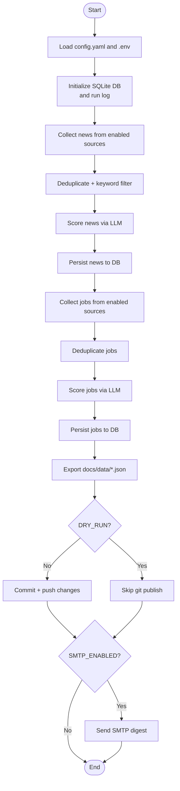
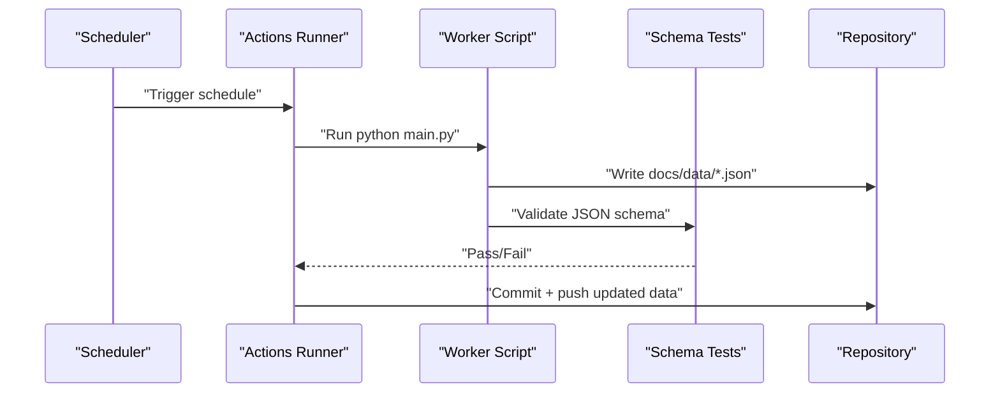

# Getting Started

<cite>
**Referenced Files in This Document**
- [Dockerfile](file://worker/Dockerfile)
- [docker-compose.yml](file://docker-compose.yml)
- [config.yaml](file://worker/config.yaml)
- [main.py](file://worker/main.py)
- [requirements.txt](file://worker/requirements.txt)
- [worker-schedule.yml](file://.github/workflows/worker-schedule.yml)
- [pages-deploy.yml](file://.github/workflows/pages-deploy.yml)
- [index.html](file://docs/index.html)
- [.dockerignore](file://worker/.dockerignore)
- [db.py](file://worker/storage/db.py)
- [test_schema.py](file://tests/test_schema.py)
</cite>

## Update Summary
**Changes Made**
- Enhanced Docker Compose setup documentation with comprehensive volume mounting and environment configuration
- Expanded GitHub Actions integration details with SMTP digest support and workflow optimization
- Added detailed manual deployment options with environment variable management
- Improved environment variable configuration guidance with practical examples
- Updated troubleshooting section with Docker-specific and GitHub Actions-specific issues

## Table of Contents
1. [Introduction](#introduction)
2. [Prerequisites and System Requirements](#prerequisites-and-system-requirements)
3. [Installation Methods](#installation-methods)
4. [Initial Configuration](#initial-configuration)
5. [First Run and Verification](#first-run-and-verification)
6. [Development Environment Setup](#development-environment-setup)
7. [GitHub Actions Scheduling](#github-actions-scheduling)
8. [Basic Usage Patterns](#basic-usage-patterns)
9. [Practical Setup Scenarios](#practical-setup-scenarios)
10. [Troubleshooting Guide](#troubleshooting-guide)
11. [Conclusion](#conclusion)

## Introduction
DevOps & AI Hub is a data aggregation pipeline that collects news and jobs from multiple sources, deduplicates and scores items using an LLM, persists them to a local SQLite database, exports static JSON for a simple web UI, and optionally publishes updates to a repository and sends email digests. It supports three primary deployment modes:
- GitHub Actions-driven scheduling with automatic publishing and page deployment
- Docker-based local or VM scheduling with external cron
- Manual setup for local development and experimentation

## Prerequisites and System Requirements
- Operating system: Windows, macOS, or Linux
- CPU/memory: Minimal resources sufficient for Python and SQLite operations
- Network connectivity: Required for external APIs and feeds
- Optional: Docker Desktop for Docker-based deployment

**Section sources**
- [requirements.txt:1-11](file://worker/requirements.txt#L1-L11)
- [Dockerfile:1-24](file://worker/Dockerfile#L1-L24)

## Installation Methods

### Option A: GitHub Actions (Recommended for most users)
This method automates scheduling, execution, publishing, and deployment with full SMTP digest support.

- Ensure your repository has the workflows under `.github/workflows/`
- Configure repository secrets and variables as described in the GitHub Actions section
- No local installation is required beyond a Git repository clone
- Supports both OpenRouter API key and optional SMTP digest configuration

**Section sources**
- [worker-schedule.yml:1-137](file://.github/workflows/worker-schedule.yml#L1-L137)
- [pages-deploy.yml:1-42](file://.github/workflows/pages-deploy.yml#L1-L42)

### Option B: Docker Compose (Local/VM)
Run the worker inside a container with persistent volumes and optional preview server for comprehensive local development.

- Prerequisites
  - Docker Engine installed and running
  - Git repository cloned locally
- Steps
  1. Copy the environment template to `.env` and edit as needed
  2. Build and run the worker service with `docker compose up --build worker`
  3. Optionally start the preview server profile for local testing with `docker compose --profile preview up preview`
- Notes
  - The container runs once and exits; schedule externally (cron or sidecar)
  - Volumes persist the SQLite database and write JSON directly into the repository
  - Supports both host-based and container-based scheduling approaches

**Section sources**
- [docker-compose.yml:1-47](file://docker-compose.yml#L1-L47)
- [Dockerfile:1-24](file://worker/Dockerfile#L1-L24)
- [.dockerignore:1-6](file://worker/.dockerignore#L1-L6)

### Option C: Manual Setup (Local Development)
Install dependencies and run the worker script directly for development and experimentation.

- Prerequisites
  - Python 3.12+ installed
  - Git repository cloned locally
- Steps
  1. Install dependencies from requirements.txt
  2. Prepare environment variables (see Initial Configuration)
  3. Run the main script from the worker directory
  4. Use `python main.py` for immediate execution
- Notes
  - Ideal for development, testing, and debugging
  - Supports DRY_RUN mode for testing without publishing

**Section sources**
- [requirements.txt:1-11](file://worker/requirements.txt#L1-L11)
- [main.py:318-320](file://worker/main.py#L318-L320)

## Initial Configuration

### Environment Variables
Set these in your environment or `.env` file. The worker loads `.env` from both the worker directory and repository root.

- Logging
  - LOG_LEVEL: Controls verbosity (default: INFO)
- LLM and Scoring
  - OPENROUTER_API_KEY: Required for LLM relevance scoring
  - OPENROUTER_MODEL: Optional override for the model used
- Git Publishing
  - GH_PAT: Personal Access Token for pushing to the repository
  - GIT_REPO_URL: Remote repository URL
  - GIT_BRANCH: Branch to push to (default: main)
  - GIT_USER_NAME: Git author name for commits
  - GIT_USER_EMAIL: Git author email for commits
- Dry Run
  - DRY_RUN: Set to true to skip publishing and git operations
- SMTP Digest
  - SMTP_ENABLED: Set to true to enable email digest
  - SMTP_HOST, SMTP_PORT, SMTP_USER, SMTP_PASSWORD, SMTP_TO: SMTP server credentials

**Updated** Enhanced with comprehensive SMTP digest configuration and improved environment variable management

Notes:
- When using GitHub Actions, secrets and variables are passed via the workflow
- When using Docker or manual setup, define these in your environment or `.env`
- For Docker Compose, environment variables are loaded from the `.env` file and can be overridden in the compose file

**Section sources**
- [main.py:27-32](file://worker/main.py#L27-L32)
- [main.py:108-155](file://worker/main.py#L108-L155)
- [worker-schedule.yml:44-57](file://.github/workflows/worker-schedule.yml#L44-L57)

### Configuration File (config.yaml)
Located at `worker/config.yaml`. Adjust sources, filters, and retention.

Key areas:
- Retention: Days to keep items in the database and exported JSON
- LLM: Model, base URL, batch size, token limits, temperature, and pre-filter keywords
- Keyword Filter: Pre-filter to reduce LLM calls
- News Sources: Enable/disable and configure parameters for each source
- Job Sources: Enable/disable and configure parameters for each job source

Examples of commonly adjusted settings:
- Change retention_days to control data history
- Modify keyword_filter to refine relevance scoring
- Toggle news and jobs source enabled flags
- Adjust max_items and similar caps per source

**Section sources**
- [config.yaml:1-244](file://worker/config.yaml#L1-L244)

## First Run and Verification

### What the Pipeline Does on Each Run
1. Loads configuration and environment
2. Initializes SQLite database and run log
3. Collects news and jobs from enabled sources
4. Deduplicates items and applies keyword filters
5. Scores items via LLM (OpenRouter)
6. Persists items to SQLite
7. Exports static JSON files to docs/data/
8. Commits and pushes changes (unless DRY_RUN is enabled)
9. Optionally sends an SMTP digest

**Diagram sources**
- [main.py:158-316](file://worker/main.py#L158-L316)

### Verification Checklist
- Database
  - Confirm SQLite database initialized at `worker/db/app.db`
- JSON Outputs
  - Verify `docs/data/news.json`, `docs/data/jobs.json`, and `docs/data/meta.json` exist and are valid
- Git Publishing
  - If configured, confirm commits and pushes occurred (or DRY_RUN behavior)
- SMTP Digest
  - If enabled, verify digest emails were sent
- Tests
  - Run the schema validation test to ensure JSON conforms to expected structure

**Section sources**
- [db.py:79-84](file://worker/storage/db.py#L79-L84)
- [main.py:287-316](file://worker/main.py#L287-L316)
- [test_schema.py:1-136](file://tests/test_schema.py#L1-L136)

## Development Environment Setup

### Local Development (Manual)
- Install Python 3.12+ and dependencies
- Clone the repository
- Create and activate a virtual environment
- Install dependencies from requirements.txt
- Prepare .env with required variables
- Run the worker script from the worker directory

**Section sources**
- [requirements.txt:1-11](file://worker/requirements.txt#L1-L11)
- [main.py:318-320](file://worker/main.py#L318-L320)

### Docker Development
- Build and run the worker container
- Mount volumes for persistence and JSON output
- Use .env for environment variables
- Optionally run the preview Nginx container for local browsing
- Supports both host-based and container-based scheduling approaches

**Section sources**
- [docker-compose.yml:13-47](file://docker-compose.yml#L13-L47)
- [Dockerfile:1-24](file://worker/Dockerfile#L1-L24)

## GitHub Actions Scheduling

### Workflow Overview
- worker-schedule.yml
  - Runs every 2 hours via cron
  - Installs dependencies and runs the worker
  - Validates JSON schema via pytest
  - Commits and pushes updated data
  - Supports optional SMTP digest configuration
- pages-deploy.yml
  - Deploys the docs folder to GitHub Pages on push to main

**Diagram sources**
- [worker-schedule.yml:13-137](file://.github/workflows/worker-schedule.yml#L13-L137)
- [pages-deploy.yml:3-42](file://.github/workflows/pages-deploy.yml#L3-L42)

### Required Secrets and Variables
- Secrets
  - OPENROUTER_API_KEY: LLM API key
  - SMTP_*: Optional SMTP credentials for digest emails
- Variables
  - OPENROUTER_MODEL: LLM model override (optional)
  - SMTP_ENABLED: Enable SMTP digest (optional)

**Section sources**
- [worker-schedule.yml:7-11](file://.github/workflows/worker-schedule.yml#L7-L11)
- [worker-schedule.yml:112-123](file://.github/workflows/worker-schedule.yml#L112-L123)

## Basic Usage Patterns

### Typical Daily Operation
- The worker runs on a schedule (GitHub Actions or external cron)
- Each run updates docs/data/* with fresh content
- GitHub Pages serves the static HTML and JavaScript to display the content

**Section sources**
- [index.html:1-86](file://docs/index.html#L1-L86)

### Viewing Locally
- With Docker, start the preview profile to serve docs via Nginx on port 8080
- Without Docker, use any static file server to serve the docs directory

**Section sources**
- [docker-compose.yml:36-47](file://docker-compose.yml#L36-L47)

## Practical Setup Scenarios

### Scenario A: GitHub Actions Only (No Local Deployment)
- Clone the repository
- Add secrets and variables in repository Settings → Secrets and variables
- Wait for scheduled runs to populate docs/data/ and deploy to GitHub Pages

**Section sources**
- [worker-schedule.yml:13-137](file://.github/workflows/worker-schedule.yml#L13-L137)
- [pages-deploy.yml:1-42](file://.github/workflows/pages-deploy.yml#L1-L42)

### Scenario B: Local Docker with External Cron
- Copy .env.example to .env and set variables
- Run docker compose to build and start the worker
- Set up an external scheduler (e.g., host cron) to invoke the container periodically
- Use `crontab -e` → `0 */2 * * * cd /path/to/repo && docker compose up --build worker`

**Section sources**
- [docker-compose.yml:6-11](file://docker-compose.yml#L6-L11)
- [Dockerfile:21-23](file://worker/Dockerfile#L21-L23)

### Scenario C: Manual Setup with SMTP Digest
- Install dependencies
- Set SMTP_* variables
- Enable SMTP_ENABLED
- Run the worker and receive digest emails

**Section sources**
- [requirements.txt:1-11](file://worker/requirements.txt#L1-L11)
- [main.py:318-320](file://worker/main.py#L318-L320)

## Troubleshooting Guide

### Common Issues and Fixes
- Missing OPENROUTER_API_KEY
  - Symptom: LLM scoring fails or is skipped
  - Fix: Add OPENROUTER_API_KEY secret/variable
- Git push blocked
  - Symptom: Local commit succeeds but push fails
  - Fix: Ensure GH_PAT and GIT_REPO_URL are set; verify branch permissions
- Stale data in browser
  - Symptom: Content does not reflect recent runs
  - Fix: Trigger a new run; verify docs/data/* updated; check GitHub Pages deployment status
- JSON schema validation failure
  - Symptom: Tests fail during scheduled run
  - Fix: Inspect docs/data/* for missing required fields; review collector logs
- SMTP digest not sent
  - Symptom: No emails despite SMTP_ENABLED=true
  - Fix: Verify SMTP_* credentials and network access; check worker logs for errors
- Docker volume mounting issues
  - Symptom: Database not persisting or JSON not writing to repository
  - Fix: Verify volume mounts in docker-compose.yml; check file permissions
- Environment variable loading problems
  - Symptom: Variables not recognized in Docker or manual setup
  - Fix: Ensure .env file is properly formatted; verify load order in main.py

**Section sources**
- [worker-schedule.yml:59-61](file://.github/workflows/worker-schedule.yml#L59-L61)
- [test_schema.py:28-136](file://tests/test_schema.py#L28-L136)
- [main.py:35-56](file://worker/main.py#L35-L56)
- [docker-compose.yml:24-28](file://docker-compose.yml#L24-L28)

## Conclusion
You now have multiple paths to deploy and operate DevOps & AI Hub:
- GitHub Actions for fully automated scheduling, publishing, and deployment with SMTP digest support
- Docker Compose for local/VM orchestration with external scheduling and comprehensive volume management
- Manual setup for development and experimentation with full environment variable control

Start with GitHub Actions for simplicity, Docker Compose for deeper control over local deployments, or manual setup for development. Always validate outputs with the schema tests and monitor logs for any failures. The enhanced Docker Compose setup provides the most flexibility for local development with persistent storage and preview capabilities.