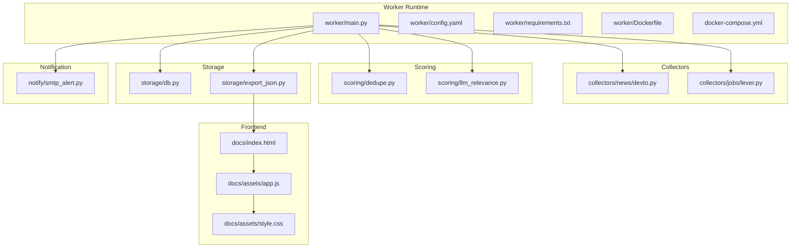
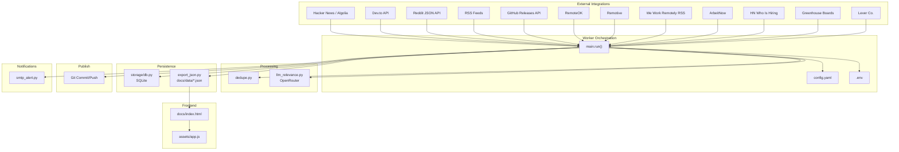
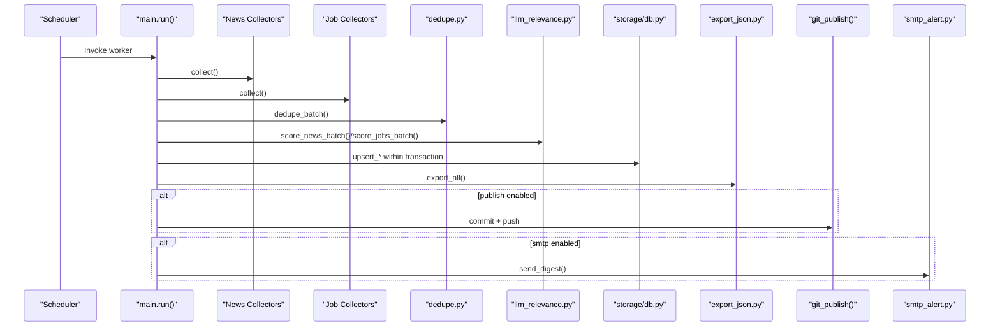
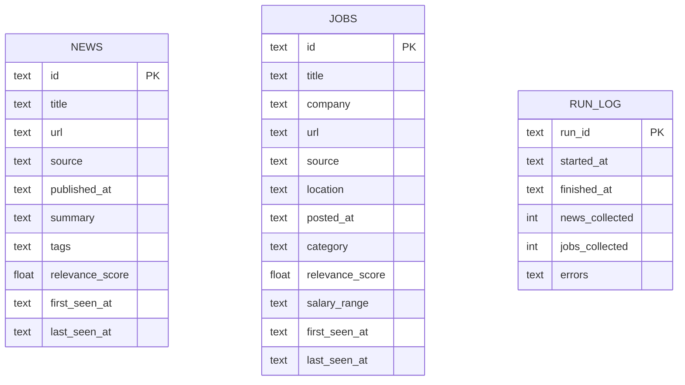
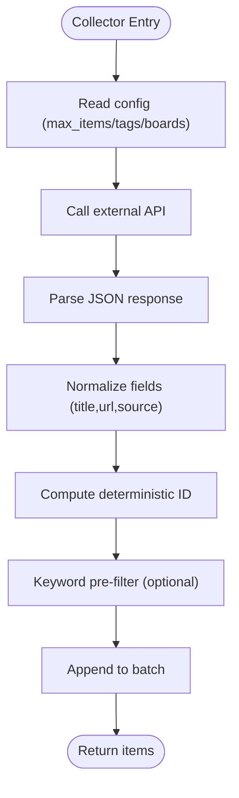
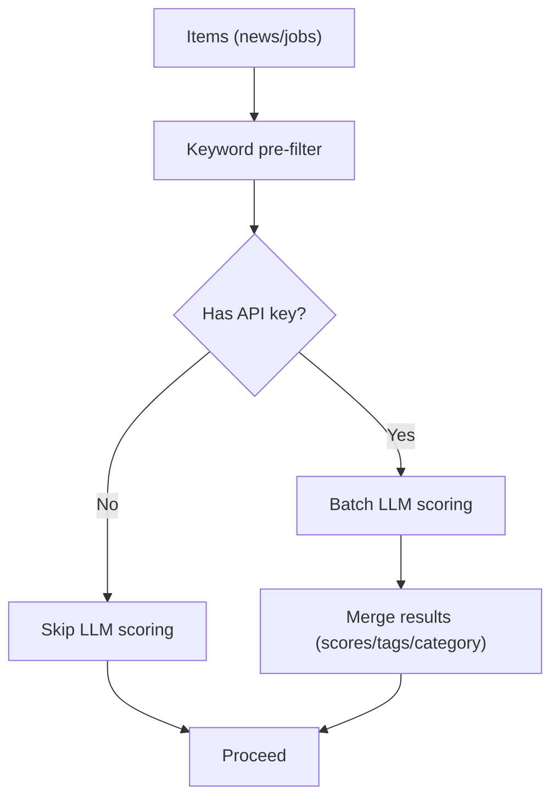
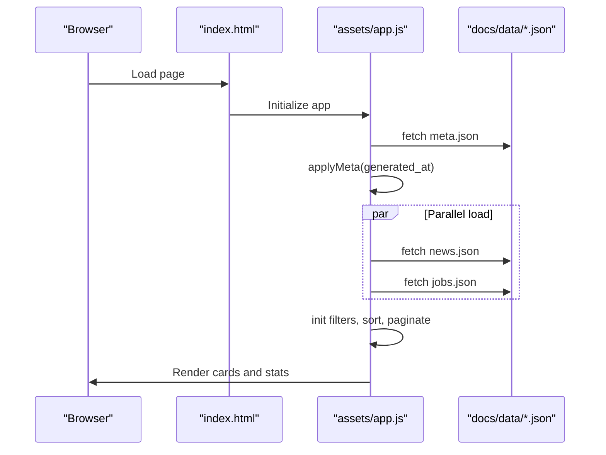
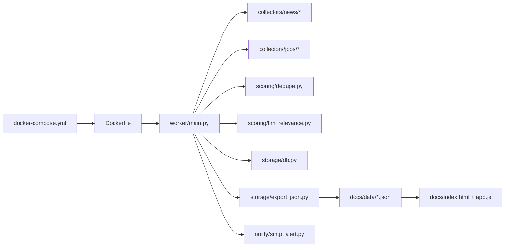

# Architecture Overview

<cite>
**Referenced Files in This Document**
- [worker/main.py](file://worker/main.py)
- [worker/config.yaml](file://worker/config.yaml)
- [worker/Dockerfile](file://worker/Dockerfile)
- [docker-compose.yml](file://docker-compose.yml)
- [worker/requirements.txt](file://worker/requirements.txt)
- [worker/scoring/dedupe.py](file://worker/scoring/dedupe.py)
- [worker/scoring/llm_relevance.py](file://worker/scoring/llm_relevance.py)
- [worker/storage/db.py](file://worker/storage/db.py)
- [worker/storage/export_json.py](file://worker/storage/export_json.py)
- [worker/notify/smtp_alert.py](file://worker/notify/smtp_alert.py)
- [worker/collectors/news/devto.py](file://worker/collectors/news/devto.py)
- [worker/collectors/jobs/lever.py](file://worker/collectors/jobs/lever.py)
- [docs/index.html](file://docs/index.html)
- [docs/assets/app.js](file://docs/assets/app.js)
- [docs/assets/style.css](file://docs/assets/style.css)
</cite>

## Table of Contents
1. [Introduction](#introduction)
2. [Project Structure](#project-structure)
3. [Core Components](#core-components)
4. [Architecture Overview](#architecture-overview)
5. [Detailed Component Analysis](#detailed-component-analysis)
6. [Dependency Analysis](#dependency-analysis)
7. [Performance Considerations](#performance-considerations)
8. [Troubleshooting Guide](#troubleshooting-guide)
9. [Conclusion](#conclusion)
10. [Appendices](#appendices)

## Introduction
This document describes the architecture of the DevOps & AI Hub system, a data aggregation pipeline that collects, processes, scores, stores, and publishes curated DevOps, SRE, and AI/LLM-related content. The backend is a Python-based worker/collector orchestrator that runs periodic collection cycles and produces static JSON datasets. The frontend is a static HTML/JavaScript application that renders the datasets for browsing and filtering. The system integrates with external APIs (OpenRouter for LLM scoring, GitHub for releases, job boards, and news sources) and supports optional notifications and publishing to a Git repository.

## Project Structure
The repository is organized into:
- worker/: Python orchestration, collectors, scoring, storage, and notification modules
- docs/: Static frontend (HTML/CSS/JS) that reads the exported JSON datasets
- docker-compose.yml and Dockerfile: Containerization and local deployment topology
- .github/workflows/: GitHub Actions for automated publishing

**Diagram sources**
- [worker/main.py:127-292](file://worker/main.py#L127-L292)
- [worker/config.yaml:1-244](file://worker/config.yaml#L1-L244)
- [worker/Dockerfile:1-24](file://worker/Dockerfile#L1-L24)
- [docker-compose.yml:13-47](file://docker-compose.yml#L13-L47)
- [worker/collectors/news/devto.py:21-72](file://worker/collectors/news/devto.py#L21-L72)
- [worker/collectors/jobs/lever.py:22-85](file://worker/collectors/jobs/lever.py#L22-L85)
- [worker/scoring/dedupe.py:19-90](file://worker/scoring/dedupe.py#L19-L90)
- [worker/scoring/llm_relevance.py:95-178](file://worker/scoring/llm_relevance.py#L95-L178)
- [worker/storage/db.py:21-278](file://worker/storage/db.py#L21-L278)
- [worker/storage/export_json.py:32-93](file://worker/storage/export_json.py#L32-L93)
- [worker/notify/smtp_alert.py:64-105](file://worker/notify/smtp_alert.py#L64-L105)
- [docs/index.html:1-86](file://docs/index.html#L1-L86)
- [docs/assets/app.js:101-129](file://docs/assets/app.js#L101-L129)
- [docs/assets/style.css:1-260](file://docs/assets/style.css#L1-L260)

**Section sources**
- [worker/main.py:127-292](file://worker/main.py#L127-L292)
- [worker/config.yaml:1-244](file://worker/config.yaml#L1-L244)
- [docker-compose.yml:13-47](file://docker-compose.yml#L13-L47)
- [worker/Dockerfile:1-24](file://worker/Dockerfile#L1-L24)

## Core Components
- Orchestrator (worker/main.py): Loads configuration, coordinates collection, deduplication, LLM scoring, persistence, export, optional Git publish, and optional SMTP digest.
- Collectors: Source-specific modules under workers/collectors/ for news and jobs, each implementing a collect(cfg) function.
- Scoring Engine: Deduplication and keyword pre-filter, plus OpenRouter-backed LLM scoring for relevance and categorization.
- Storage Layer: SQLite schema and CRUD helpers, plus JSON export to docs/data/.
- Notification: Optional SMTP digest of high-relevance items.
- Frontend: Static HTML/JS app that loads news.json, jobs.json, and meta.json for rendering.

**Section sources**
- [worker/main.py:127-292](file://worker/main.py#L127-L292)
- [worker/scoring/dedupe.py:19-90](file://worker/scoring/dedupe.py#L19-L90)
- [worker/scoring/llm_relevance.py:95-178](file://worker/scoring/llm_relevance.py#L95-L178)
- [worker/storage/db.py:21-278](file://worker/storage/db.py#L21-L278)
- [worker/storage/export_json.py:32-93](file://worker/storage/export_json.py#L32-L93)
- [worker/notify/smtp_alert.py:64-105](file://worker/notify/smtp_alert.py#L64-L105)
- [docs/index.html:1-86](file://docs/index.html#L1-L86)
- [docs/assets/app.js:101-129](file://docs/assets/app.js#L101-L129)

## Architecture Overview
The system follows a batch-oriented pipeline executed by the worker container. It is designed for simplicity, low operational overhead, and easy hosting on platforms like GitHub Pages or static hosts.

**Diagram sources**
- [worker/main.py:127-292](file://worker/main.py#L127-L292)
- [worker/config.yaml:77-244](file://worker/config.yaml#L77-L244)
- [worker/scoring/dedupe.py:19-90](file://worker/scoring/dedupe.py#L19-L90)
- [worker/scoring/llm_relevance.py:95-178](file://worker/scoring/llm_relevance.py#L95-L178)
- [worker/storage/db.py:21-278](file://worker/storage/db.py#L21-L278)
- [worker/storage/export_json.py:32-93](file://worker/storage/export_json.py#L32-L93)
- [worker/notify/smtp_alert.py:64-105](file://worker/notify/smtp_alert.py#L64-L105)
- [docs/index.html:1-86](file://docs/index.html#L1-L86)
- [docs/assets/app.js:101-129](file://docs/assets/app.js#L101-L129)

## Detailed Component Analysis

### Pipeline Orchestration (main.run)
The orchestrator coordinates the entire lifecycle:
- Loads configuration and environment
- Iterates enabled collectors for news and jobs
- Deduplicates and applies keyword pre-filter
- Scores items via OpenRouter
- Upserts to SQLite within a transaction
- Exports static JSON datasets
- Optionally commits/pushes to Git and sends SMTP digest

**Diagram sources**
- [worker/main.py:127-292](file://worker/main.py#L127-L292)
- [worker/scoring/dedupe.py:48-77](file://worker/scoring/dedupe.py#L48-L77)
- [worker/scoring/llm_relevance.py:95-178](file://worker/scoring/llm_relevance.py#L95-L178)
- [worker/storage/db.py:116-230](file://worker/storage/db.py#L116-L230)
- [worker/storage/export_json.py:32-93](file://worker/storage/export_json.py#L32-L93)

**Section sources**
- [worker/main.py:127-292](file://worker/main.py#L127-L292)

### Data Model and Storage
The SQLite schema defines three tables: news, jobs, and run_log. Upsert semantics maintain first_seen_at/last_seen_at timestamps and handle JSON-encoded tags.

**Diagram sources**
- [worker/storage/db.py:22-67](file://worker/storage/db.py#L22-L67)

**Section sources**
- [worker/storage/db.py:21-278](file://worker/storage/db.py#L21-L278)

### Collector Modules
Collectors implement a uniform interface and produce normalized items with deterministic IDs. Examples:
- Dev.to news collector: queries the public API by tags and limits per-page/top window.
- Lever jobs collector: iterates company boards and filters by configurable keywords.

**Diagram sources**
- [worker/collectors/news/devto.py:21-72](file://worker/collectors/news/devto.py#L21-L72)
- [worker/collectors/jobs/lever.py:22-85](file://worker/collectors/jobs/lever.py#L22-L85)

**Section sources**
- [worker/collectors/news/devto.py:21-72](file://worker/collectors/news/devto.py#L21-L72)
- [worker/collectors/jobs/lever.py:22-85](file://worker/collectors/jobs/lever.py#L22-L85)

### Scoring Engine
- Keyword pre-filter reduces LLM calls by checking item text against configured keywords.
- OpenRouter chat completions compute relevance scores and tags/categories.
- Batch processing improves throughput; failures are logged and partial results are preserved.

**Diagram sources**
- [worker/scoring/llm_relevance.py:95-178](file://worker/scoring/llm_relevance.py#L95-L178)
- [worker/scoring/dedupe.py:79-90](file://worker/scoring/dedupe.py#L79-L90)

**Section sources**
- [worker/scoring/llm_relevance.py:95-178](file://worker/scoring/llm_relevance.py#L95-L178)
- [worker/scoring/dedupe.py:79-90](file://worker/scoring/dedupe.py#L79-L90)

### Frontend Rendering
The static frontend loads meta.json to show freshness and then loads news.json and jobs.json. It provides tabbed views, filtering, pagination, and theme switching.

**Diagram sources**
- [docs/index.html:1-86](file://docs/index.html#L1-L86)
- [docs/assets/app.js:101-129](file://docs/assets/app.js#L101-L129)
- [docs/assets/app.js:132-190](file://docs/assets/app.js#L132-L190)
- [docs/assets/app.js:241-298](file://docs/assets/app.js#L241-L298)

**Section sources**
- [docs/index.html:1-86](file://docs/index.html#L1-L86)
- [docs/assets/app.js:101-129](file://docs/assets/app.js#L101-L129)
- [docs/assets/style.css:1-260](file://docs/assets/style.css#L1-L260)

## Dependency Analysis
- Internal dependencies: main.py imports collectors, scoring, storage, and notify modules; storage/export_json depends on storage/db; frontend depends on docs/data JSON.
- External dependencies: OpenRouter for LLM, various third-party APIs for news and jobs, GitPython for publishing, and standard libraries for HTTP and parsing.
- Containerization: Dockerfile installs Python dependencies and runs main.py as the entrypoint; docker-compose mounts volumes for persistent DB and exported JSON.

**Diagram sources**
- [worker/main.py:42-67](file://worker/main.py#L42-L67)
- [worker/storage/export_json.py:14-14](file://worker/storage/export_json.py#L14-L14)
- [docker-compose.yml:13-47](file://docker-compose.yml#L13-L47)
- [worker/Dockerfile:1-24](file://worker/Dockerfile#L1-L24)

**Section sources**
- [worker/main.py:42-67](file://worker/main.py#L42-L67)
- [worker/storage/export_json.py:14-14](file://worker/storage/export_json.py#L14-L14)
- [docker-compose.yml:13-47](file://docker-compose.yml#L13-L47)
- [worker/Dockerfile:1-24](file://worker/Dockerfile#L1-L24)

## Performance Considerations
- Batched LLM calls: The scoring engine processes items in configurable batches to reduce API overhead.
- Keyword pre-filter: Reduces unnecessary LLM invocations by filtering items early.
- SQLite WAL mode and indexes: Improves concurrency and query performance for recent items.
- Static export: Serving JSON and HTML statically minimizes runtime overhead and enables CDN-friendly hosting.
- Containerization: Single-shot containers avoid long-running services and simplify scaling.

[No sources needed since this section provides general guidance]

## Troubleshooting Guide
Common areas to inspect:
- Environment variables: Ensure required keys (OpenRouter, Git, SMTP) are set appropriately.
- Network/API rate limits: Some sources impose delays or quotas; adjust configuration accordingly.
- LLM failures: The scoring engine logs and continues; verify API key and model availability.
- Git publish: Authentication via PAT requires proper URL rewriting; confirm credentials and branch settings.
- SMTP digest: Requires complete credential configuration; otherwise the digest is skipped silently.

**Section sources**
- [worker/scoring/llm_relevance.py:105-107](file://worker/scoring/llm_relevance.py#L105-L107)
- [worker/main.py:77-124](file://worker/main.py#L77-L124)
- [worker/notify/smtp_alert.py:69-78](file://worker/notify/smtp_alert.py#L69-L78)

## Conclusion
The DevOps & AI Hub employs a straightforward, modular architecture: a Python worker orchestrates collection, deduplication, LLM scoring, persistence, and export; the frontend consumes static JSON for fast, offline-capable browsing. The design emphasizes simplicity, configurability, and portability across environments.

[No sources needed since this section summarizes without analyzing specific files]

## Appendices

### System Boundaries and External Integrations
- Internal boundary: worker/ modules and docs/ data surface
- External APIs: OpenRouter, Dev.to, Hacker News, Reddit, RSS feeds, GitHub Releases, job board providers
- Publishing: Git repository with optional PAT-based push
- Notifications: SMTP email digest

**Section sources**
- [worker/config.yaml:9-76](file://worker/config.yaml#L9-L76)
- [worker/main.py:77-124](file://worker/main.py#L77-L124)
- [worker/notify/smtp_alert.py:69-78](file://worker/notify/smtp_alert.py#L69-L78)

### Deployment Topology
- Containerized worker: Runs on schedule via cron or GitHub Actions; writes JSON directly into docs/data via mounted volume; persists SQLite in a dedicated volume.
- Optional preview server: Nginx container serves docs/ for local testing.
- Hosting: docs/data and index.html can be hosted statically (e.g., GitHub Pages).

**Section sources**
- [docker-compose.yml:13-47](file://docker-compose.yml#L13-L47)
- [worker/Dockerfile:15-23](file://worker/Dockerfile#L15-L23)