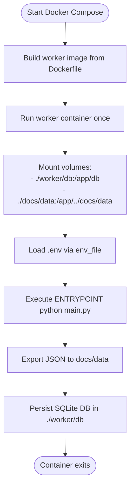
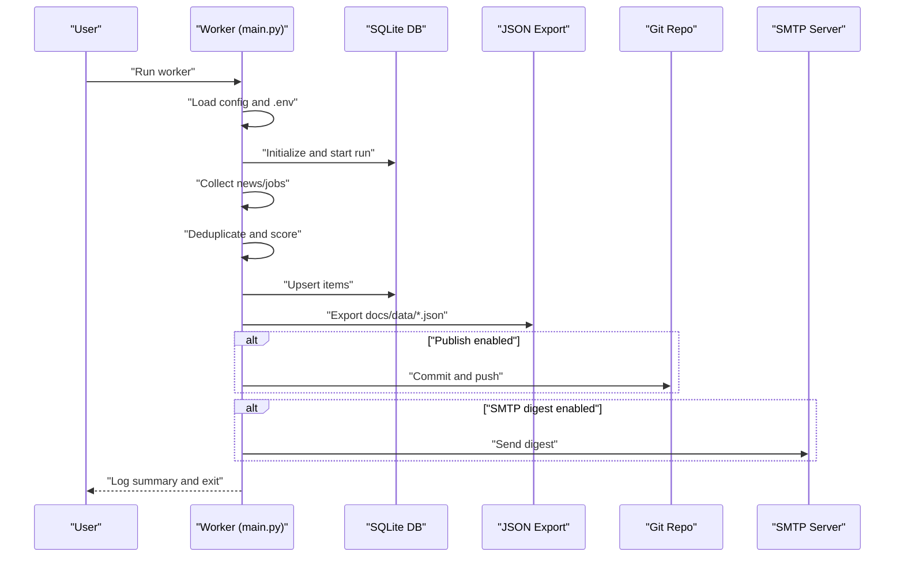
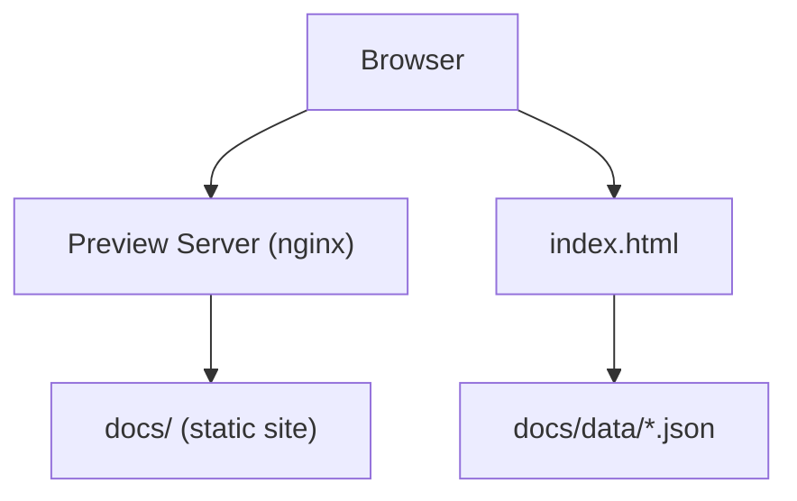

# Getting Started

<cite>
**Referenced Files in This Document**
- [main.py](file://worker/main.py)
- [Dockerfile](file://worker/Dockerfile)
- [docker-compose.yml](file://docker-compose.yml)
- [config.yaml](file://worker/config.yaml)
- [requirements.txt](file://worker/requirements.txt)
- [devto.py](file://worker/collectors/news/devto.py)
- [lever.py](file://worker/collectors/jobs/lever.py)
- [index.html](file://docs/index.html)
</cite>

## Table of Contents
1. [Introduction](#introduction)
2. [Prerequisites](#prerequisites)
3. [Quick Setup](#quick-setup)
4. [Manual Setup](#manual-setup)
5. [Docker Setup](#docker-setup)
6. [Initial Configuration](#initial-configuration)
7. [Running the Worker Locally](#running-the-worker-locally)
8. [Verifying Successful Execution](#verifying-successful-execution)
9. [Accessing Generated Content](#accessing-generated-content)
10. [Common Issues and Troubleshooting](#common-issues-and-troubleshooting)
11. [Next Steps](#next-steps)

## Introduction
This guide helps you install and run the DevOps & AI Hub worker locally using either Docker or a manual Python environment. The worker collects news and jobs from configured sources, deduplicates and scores items using an LLM, persists data to a local SQLite database, exports JSON for the static site, and optionally publishes updates to a Git repository or sends an SMTP digest.

## Prerequisites
- Python 3.8+ installed locally (for manual setup)
- Docker and Docker Compose installed (for Docker setup)
- A GitHub account and a repository to publish updates (optional)
- Network access to external APIs used by collectors (news and jobs)

**Section sources**
- [requirements.txt:1-11](file://worker/requirements.txt#L1-L11)

## Quick Setup
Choose one of the two approaches below to get the worker running quickly.

### Option A: Docker (Recommended for most users)
- Clone or download the repository
- Copy the example environment file to `.env` and edit as needed
- Build and run the worker container with Docker Compose
- Optionally set up a scheduler to run the worker periodically

### Option B: Manual Python Environment
- Clone or download the repository
- Create a Python virtual environment with Python 3.8+
- Install dependencies from the requirements file
- Configure environment variables
- Run the worker script directly

## Manual Setup
Follow these steps to run the worker in a local Python environment.

1. Create and activate a Python virtual environment with Python 3.8+.
2. Install dependencies:
   - Navigate to the repository root and install packages listed in the requirements file.
3. Prepare environment variables:
   - Copy the example environment file to `.env` and configure values as described in Initial Configuration.
4. Run the worker:
   - Execute the main script from the worker directory.

Verification steps are covered in Running the Worker Locally and Verifying Successful Execution.

**Section sources**
- [requirements.txt:1-11](file://worker/requirements.txt#L1-L11)
- [main.py:23-25](file://worker/main.py#L23-L25)

## Docker Setup
Use Docker Compose to run the worker in a containerized environment.

1. Build and run the worker service:
   - From the repository root, use the provided compose file to build and run the worker.
   - The container runs the worker once and exits; schedule periodic runs externally.
2. Volume mounts:
   - The SQLite database persists under the worker directory.
   - The exported JSON files are written directly into the repository’s docs/data directory for immediate preview.
3. Optional preview server:
   - A static preview server is included to browse the generated content locally.

**Diagram sources**
- [docker-compose.yml:13-35](file://docker-compose.yml#L13-L35)
- [Dockerfile:14-23](file://worker/Dockerfile#L14-L23)

**Section sources**
- [docker-compose.yml:1-47](file://docker-compose.yml#L1-L47)
- [Dockerfile:1-24](file://worker/Dockerfile#L1-L24)

## Initial Configuration
Configure the worker using environment variables and the YAML configuration file.

- Environment variables (loaded from `.env`):
  - Required for publishing to a Git repository:
    - `GH_PAT`: GitHub personal access token
    - `GIT_REPO_URL`: Target repository URL
    - `GIT_BRANCH`: Branch to push to (default: main)
    - `GIT_USER_NAME`: Git user name
    - `GIT_USER_EMAIL`: Git user email
  - Optional:
    - `OPENROUTER_MODEL`: Override the default LLM model
    - `LOG_LEVEL`: Logging verbosity (default: INFO)
    - `DRY_RUN`: Set to true to skip publishing and SMTP digest
    - `SMTP_ENABLED`: Set to true to enable sending SMTP digest emails
- Configuration file (`config.yaml`):
  - Adjust retention days, LLM settings, keyword filters, and source enablement.
  - Modify news and job source settings to fit your interests.

Key configuration areas:
- Retention and LLM settings
- Keyword filters for pre-filtering
- Source enablement and parameters for news and jobs
- Job-specific keywords for filtering

**Section sources**
- [main.py:82-86](file://worker/main.py#L82-L86)
- [main.py:136](file://worker/main.py#L136)
- [main.py:280](file://worker/main.py#L280)
- [config.yaml:6-76](file://worker/config.yaml#L6-L76)
- [config.yaml:77-169](file://worker/config.yaml#L77-L169)
- [config.yaml:170-244](file://worker/config.yaml#L170-L244)

## Running the Worker Locally
Choose the method that matches your setup.

- Manual Python:
  - Activate your virtual environment.
  - Ensure `.env` is present and configured.
  - From the worker directory, run the main script.
- Docker:
  - From the repository root, run the compose command to build and execute the worker once.
  - Optionally, set up a scheduler (e.g., cron) to run the container on a schedule.

After execution, review logs to confirm successful completion and check for any errors.

**Section sources**
- [main.py:295-297](file://worker/main.py#L295-L297)
- [docker-compose.yml:6-11](file://docker-compose.yml#L6-L11)

## Verifying Successful Execution
After running the worker, verify the following outcomes.

- Logs:
  - Confirm the run started and completed successfully.
  - Look for messages indicating collected items, deduplication, persistence, export, and optional publish/digest steps.
- Database:
  - The SQLite database is created and updated under the worker directory.
- JSON exports:
  - The `docs/data` directory contains updated JSON files for the static site.
- Git publish:
  - If publishing is enabled and credentials are provided, changes are committed and pushed to the configured repository.
- SMTP digest:
  - If enabled, a digest email is sent according to your SMTP configuration.

**Diagram sources**
- [main.py:127-292](file://worker/main.py#L127-L292)

**Section sources**
- [main.py:145](file://worker/main.py#L145)
- [main.py:288-292](file://worker/main.py#L288-L292)

## Accessing Generated Content
View the generated content locally using the included static preview server or by opening the HTML page directly.

- Static preview server:
  - Start the preview service via Docker Compose profile to serve the docs directory on port 8080.
- Direct browsing:
  - Open the static HTML page in your browser to see the news and jobs tabs, filters, and pagination.

**Diagram sources**
- [docker-compose.yml:36-47](file://docker-compose.yml#L36-L47)
- [index.html:1-86](file://docs/index.html#L1-L86)

**Section sources**
- [docker-compose.yml:36-47](file://docker-compose.yml#L36-L47)
- [index.html:1-86](file://docs/index.html#L1-L86)

## Common Issues and Troubleshooting
- Missing environment variables:
  - Ensure `.env` contains required values for publishing and optional SMTP digest.
- LLM model configuration:
  - Verify the model setting and related parameters in the configuration file.
- Source-specific failures:
  - Some external APIs may rate-limit or change endpoints. Review logs for collector errors and adjust parameters accordingly.
- Git publish failures:
  - Confirm credentials and repository URL are set and reachable.
- SMTP digest failures:
  - Enable SMTP and configure credentials; review logs for errors during digest delivery.
- Permission issues in Docker:
  - The container runs as a non-root user; ensure volume mounts have appropriate permissions.

**Section sources**
- [main.py:82-124](file://worker/main.py#L82-L124)
- [main.py:280-287](file://worker/main.py#L280-L287)
- [devto.py:36-69](file://worker/collectors/news/devto.py#L36-L69)
- [lever.py:32-82](file://worker/collectors/jobs/lever.py#L32-L82)

## Next Steps
- Schedule regular runs:
  - Use a scheduler (e.g., cron) to execute the worker periodically.
- Customize sources and filters:
  - Adjust the configuration file to enable/disable sources and tune keyword filters.
- Extend collectors:
  - Add new collectors following the existing patterns in the collectors packages.
- Monitor and maintain:
  - Watch logs, review database growth, and update secrets and configurations as needed.