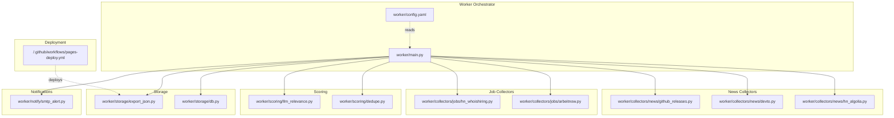
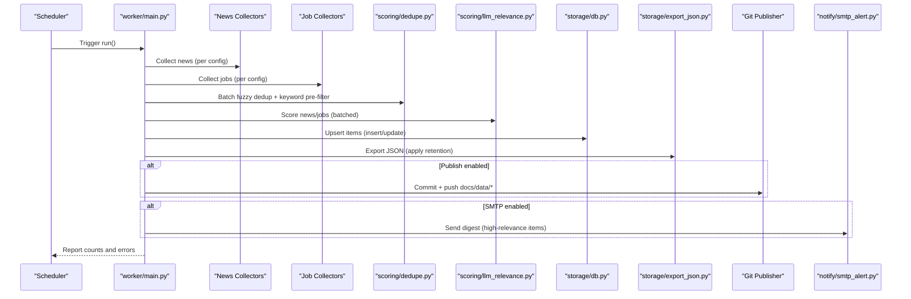
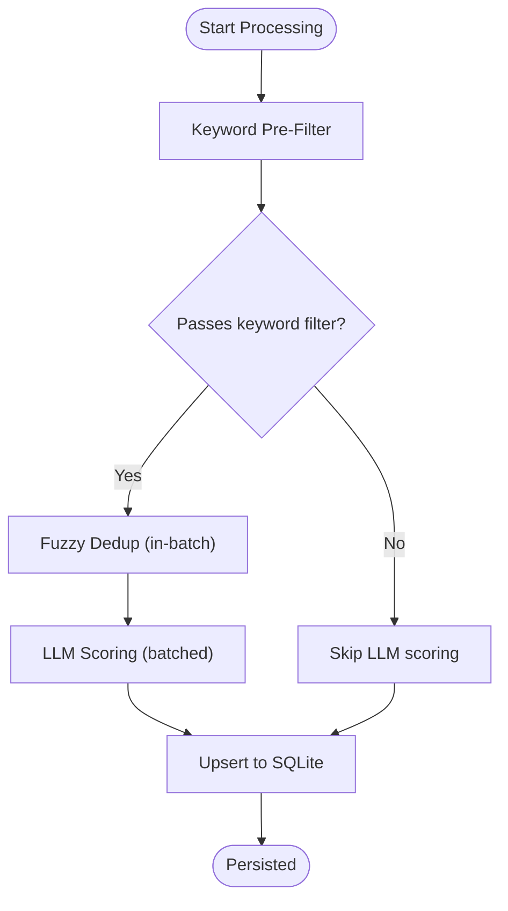
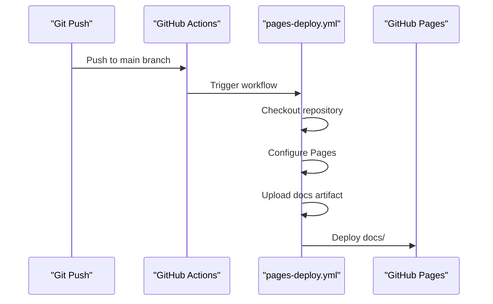
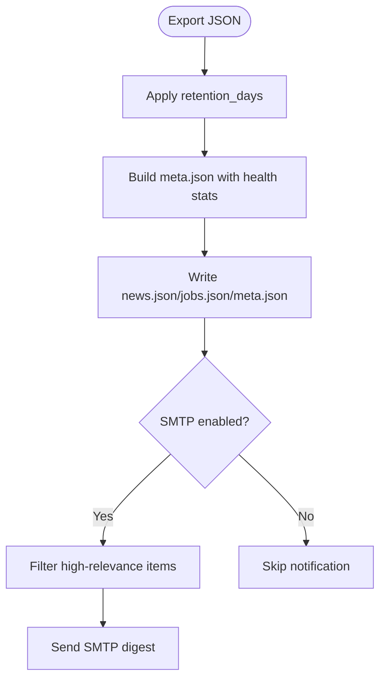
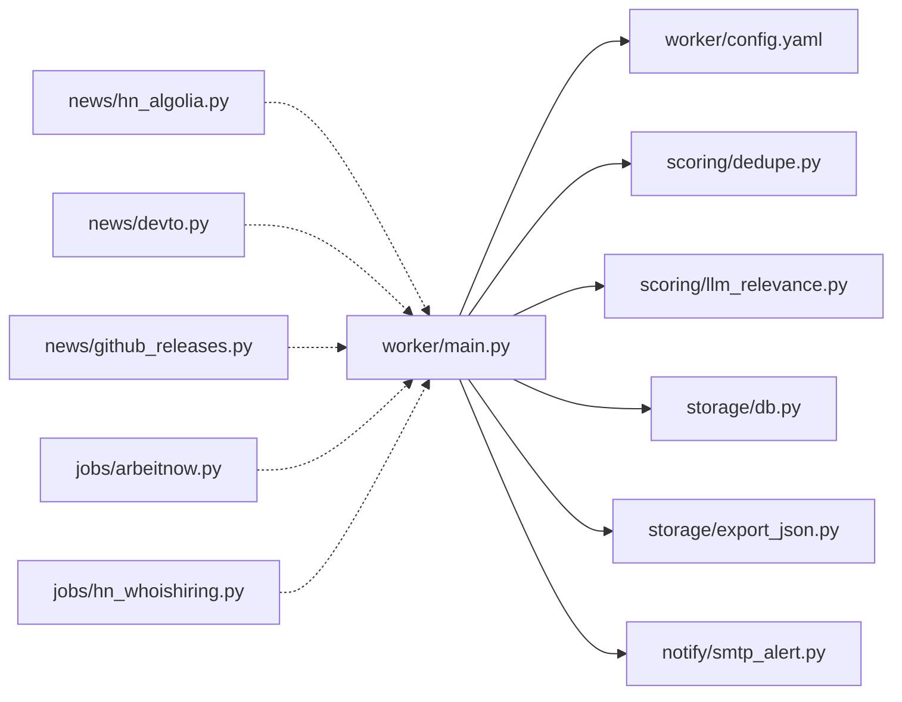

# Key Features

<cite>
**Referenced Files in This Document**
- [main.py](file://worker/main.py)
- [config.yaml](file://worker/config.yaml)
- [dedupe.py](file://worker/scoring/dedupe.py)
- [llm_relevance.py](file://worker/scoring/llm_relevance.py)
- [db.py](file://worker/storage/db.py)
- [export_json.py](file://worker/storage/export_json.py)
- [smtp_alert.py](file://worker/notify/smtp_alert.py)
- [hn_algolia.py](file://worker/collectors/news/hn_algolia.py)
- [devto.py](file://worker/collectors/news/devto.py)
- [github_releases.py](file://worker/collectors/news/github_releases.py)
- [arbeitnow.py](file://worker/collectors/jobs/arbeitnow.py)
- [hn_whoishiring.py](file://worker/collectors/jobs/hn_whoishiring.py)
- [pages-deploy.yml](file://.github/workflows/pages-deploy.yml)
</cite>

## Table of Contents
1. [Introduction](#introduction)
2. [Project Structure](#project-structure)
3. [Core Components](#core-components)
4. [Architecture Overview](#architecture-overview)
5. [Detailed Component Analysis](#detailed-component-analysis)
6. [Dependency Analysis](#dependency-analysis)
7. [Performance Considerations](#performance-considerations)
8. [Troubleshooting Guide](#troubleshooting-guide)
9. [Conclusion](#conclusion)

## Introduction
This document highlights the key features of DevOps & AI Hub, focusing on:
- Multi-source content collection from 10+ news and job platforms
- Intelligent content processing with keyword pre-filtering, fuzzy deduplication, and LLM-based relevance scoring
- Automated deployment via GitHub Actions and static site generation
- Notification system and retention policy management

These features are designed to serve DevOps, Site Reliability Engineers (SRE), and AI/ML engineers by curating high-quality, relevant content and jobs while minimizing noise and effort.

## Project Structure
The system is organized around a worker orchestrator that coordinates collection, processing, persistence, export, and optional publishing and notifications. Configuration is centralized in a YAML file, enabling easy customization without code changes.

**Diagram sources**
- [main.py:127-296](file://worker/main.py#L127-L296)
- [config.yaml:1-244](file://worker/config.yaml#L1-L244)
- [dedupe.py:1-90](file://worker/scoring/dedupe.py#L1-L90)
- [llm_relevance.py:1-178](file://worker/scoring/llm_relevance.py#L1-L178)
- [db.py:1-278](file://worker/storage/db.py#L1-L278)
- [export_json.py:1-93](file://worker/storage/export_json.py#L1-L93)
- [hn_algolia.py:1-82](file://worker/collectors/news/hn_algolia.py#L1-L82)
- [devto.py:1-72](file://worker/collectors/news/devto.py#L1-L72)
- [github_releases.py:1-86](file://worker/collectors/news/github_releases.py#L1-L86)
- [arbeitnow.py:1-74](file://worker/collectors/jobs/arbeitnow.py#L1-L74)
- [hn_whoishiring.py:1-112](file://worker/collectors/jobs/hn_whoishiring.py#L1-L112)
- [pages-deploy.yml:1-42](file://.github/workflows/pages-deploy.yml#L1-L42)

**Section sources**
- [main.py:127-296](file://worker/main.py#L127-L296)
- [config.yaml:1-244](file://worker/config.yaml#L1-L244)

## Core Components
- Multi-source collection: News and jobs are gathered from configurable sources (e.g., Hacker News, Dev.to, Reddit RSS, GitHub Releases, and multiple job boards). Each collector returns normalized items with deterministic IDs, timestamps, and metadata.
- Intelligent processing: Items are pre-filtered by keywords, deduplicated (including fuzzy title matching), and scored via an LLM to compute relevance scores and categorization/tags.
- Persistence and export: Items are upserted into SQLite, then exported to static JSON files for consumption by the frontend.
- Deployment and notifications: Optional Git commit/push and SMTP email digests are supported, with retention policies applied during export.

Practical benefits:
- Reduce time spent scanning scattered sources
- Focus on high-signal content and roles aligned with DevOps/SRE/AI/ML domains
- Automate publishing to GitHub Pages and optionally email distribution

**Section sources**
- [main.py:127-296](file://worker/main.py#L127-L296)
- [config.yaml:77-244](file://worker/config.yaml#L77-L244)
- [dedupe.py:1-90](file://worker/scoring/dedupe.py#L1-L90)
- [llm_relevance.py:1-178](file://worker/scoring/llm_relevance.py#L1-L178)
- [db.py:1-278](file://worker/storage/db.py#L1-L278)
- [export_json.py:1-93](file://worker/storage/export_json.py#L1-L93)
- [smtp_alert.py:1-105](file://worker/notify/smtp_alert.py#L1-L105)

## Architecture Overview
The end-to-end pipeline runs as a single orchestrated process, with clear separation of concerns across collection, deduplication, scoring, persistence, export, and optional publishing/notification.

**Diagram sources**
- [main.py:127-296](file://worker/main.py#L127-L296)
- [dedupe.py:48-90](file://worker/scoring/dedupe.py#L48-L90)
- [llm_relevance.py:95-178](file://worker/scoring/llm_relevance.py#L95-L178)
- [db.py:116-242](file://worker/storage/db.py#L116-L242)
- [export_json.py:32-93](file://worker/storage/export_json.py#L32-L93)
- [smtp_alert.py:64-105](file://worker/notify/smtp_alert.py#L64-L105)

## Detailed Component Analysis

### Multi-Source Content Collection
The orchestrator iterates over enabled news and job sources, invoking each collector’s collect method and aggregating results. Each collector normalizes items and assigns deterministic IDs to support deduplication and upsert semantics.

- News sources include Hacker News (Algolia), Dev.to, Reddit RSS, RSS feeds, and GitHub Releases.
- Job sources include RemoteOK, Remotive, We Work Remotely RSS, Arbeitnow, HN “Who is Hiring,” Greenhouse company boards, and Lever company boards.

Operational examples:
- Enabling/disabling a source and adjusting per-source limits is controlled via configuration.
- Job collectors receive global job keywords from configuration to pre-filter postings.

Benefits:
- Broad coverage across DevOps/SRE/AI/ML ecosystems
- Centralized enablement and tuning without code changes

**Section sources**
- [main.py:147-171](file://worker/main.py#L147-L171)
- [main.py:199-228](file://worker/main.py#L199-L228)
- [config.yaml:77-244](file://worker/config.yaml#L77-L244)
- [hn_algolia.py:21-82](file://worker/collectors/news/hn_algolia.py#L21-L82)
- [devto.py:21-72](file://worker/collectors/news/devto.py#L21-L72)
- [github_releases.py:23-86](file://worker/collectors/news/github_releases.py#L23-L86)
- [arbeitnow.py:21-74](file://worker/collectors/jobs/arbeitnow.py#L21-L74)
- [hn_whoishiring.py:55-112](file://worker/collectors/jobs/hn_whoishiring.py#L55-L112)

### Intelligent Content Processing Pipeline
The pipeline applies three stages to reduce noise and improve signal:
1. Keyword pre-filter: Ensures LLM scoring is only invoked for items containing configured keywords.
2. Fuzzy deduplication: Removes near-duplicates within a batch using fuzzy matching.
3. LLM-based relevance scoring: Assigns relevance scores and tags (news) or categories (jobs) using a structured prompt and batched API calls.

**Diagram sources**
- [dedupe.py:79-90](file://worker/scoring/dedupe.py#L79-L90)
- [llm_relevance.py:95-178](file://worker/scoring/llm_relevance.py#L95-L178)
- [db.py:116-242](file://worker/storage/db.py#L116-L242)

**Section sources**
- [main.py:174-190](file://worker/main.py#L174-L190)
- [main.py:231-246](file://worker/main.py#L231-L246)
- [dedupe.py:48-90](file://worker/scoring/dedupe.py#L48-L90)
- [llm_relevance.py:95-178](file://worker/scoring/llm_relevance.py#L95-L178)

### Automated Deployment Workflow and Static Site Generation
Static JSON artifacts are generated from the database and deployed to GitHub Pages automatically upon changes to the docs directory. The workflow sets up Pages, uploads the docs artifact, and deploys to GitHub Pages.

**Diagram sources**
- [.github/workflows/pages-deploy.yml:1-42](file://.github/workflows/pages-deploy.yml#L1-L42)

**Section sources**
- [export_json.py:32-93](file://worker/storage/export_json.py#L32-L93)
- [.github/workflows/pages-deploy.yml:1-42](file://.github/workflows/pages-deploy.yml#L1-L42)

### Notification System and Retention Policy Management
- Retention policy: Items older than a configured number of days are excluded from exports, ensuring the JSON remains current and manageable.
- SMTP digest: When enabled, the system sends an HTML email digest containing only high-relevance items (above a threshold), reducing inbox clutter.

**Diagram sources**
- [export_json.py:32-93](file://worker/storage/export_json.py#L32-L93)
- [smtp_alert.py:64-105](file://worker/notify/smtp_alert.py#L64-L105)
- [config.yaml:6-7](file://worker/config.yaml#L6-L7)

**Section sources**
- [export_json.py:32-93](file://worker/storage/export_json.py#L32-L93)
- [smtp_alert.py:64-105](file://worker/notify/smtp_alert.py#L64-L105)
- [config.yaml:6-7](file://worker/config.yaml#L6-L7)

## Dependency Analysis
The worker orchestrator depends on modular components that are loosely coupled and replaceable. Configuration drives behavior, enabling experimentation without code changes.

**Diagram sources**
- [main.py:42-67](file://worker/main.py#L42-L67)
- [config.yaml:1-244](file://worker/config.yaml#L1-L244)
- [dedupe.py:1-90](file://worker/scoring/dedupe.py#L1-L90)
- [llm_relevance.py:1-178](file://worker/scoring/llm_relevance.py#L1-L178)
- [db.py:1-278](file://worker/storage/db.py#L1-L278)
- [export_json.py:1-93](file://worker/storage/export_json.py#L1-L93)
- [smtp_alert.py:1-105](file://worker/notify/smtp_alert.py#L1-L105)
- [hn_algolia.py:1-82](file://worker/collectors/news/hn_algolia.py#L1-L82)
- [devto.py:1-72](file://worker/collectors/news/devto.py#L1-L72)
- [github_releases.py:1-86](file://worker/collectors/news/github_releases.py#L1-L86)
- [arbeitnow.py:1-74](file://worker/collectors/jobs/arbeitnow.py#L1-L74)
- [hn_whoishiring.py:1-112](file://worker/collectors/jobs/hn_whoishiring.py#L1-L112)

**Section sources**
- [main.py:42-67](file://worker/main.py#L42-L67)

## Performance Considerations
- Batched LLM calls: The LLM scorer processes items in configurable batches to minimize API overhead and cost.
- Keyword pre-filter reduces unnecessary LLM calls by limiting scoring to items likely to match the target domain.
- Fuzzy deduplication prevents redundant processing and downstream noise.
- SQLite upsert minimizes duplicate writes and maintains a compact history.
- Static JSON export ensures fast client-side rendering and minimal server load.

[No sources needed since this section provides general guidance]

## Troubleshooting Guide
Common operational checks and remedies:
- Source failures: The orchestrator logs individual source errors and continues. Review logs for specific collector exceptions and adjust configuration (e.g., rate limits, timeouts).
- LLM scoring disabled: If the API key is not set, LLM scoring is skipped. Set the appropriate environment variable to enable.
- Git publishing: Publishing requires both repository URL and personal access token. Without them, the run commits locally but does not push.
- SMTP digest: Ensure all SMTP environment variables are set; otherwise, the digest is skipped with a warning.
- Retention mismatch: If exported JSON appears empty or truncated, verify the retention_days setting and database content.

**Section sources**
- [main.py:151-159](file://worker/main.py#L151-L159)
- [main.py:106-124](file://worker/main.py#L106-L124)
- [main.py:280-287](file://worker/main.py#L280-L287)
- [llm_relevance.py:105-107](file://worker/scoring/llm_relevance.py#L105-L107)
- [export_json.py:32-93](file://worker/storage/export_json.py#L32-L93)

## Conclusion
DevOps & AI Hub delivers a robust, configurable pipeline that aggregates, cleans, enriches, and publishes curated content and jobs. Its modular design, strong defaults, and automation make it ideal for DevOps, SRE, and AI/ML practitioners who need timely, relevant signals across diverse ecosystems—without manual effort or vendor lock-in.

[No sources needed since this section summarizes without analyzing specific files]