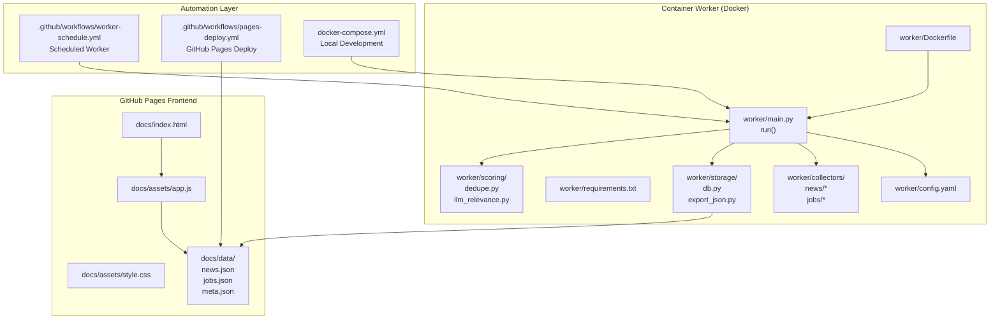
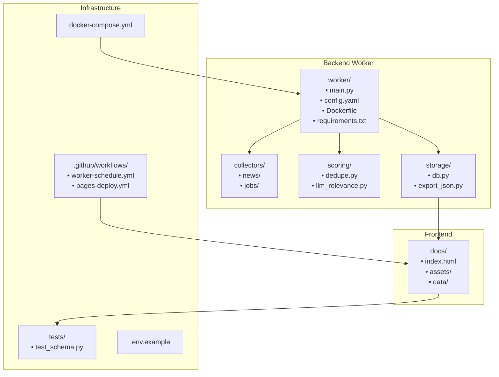
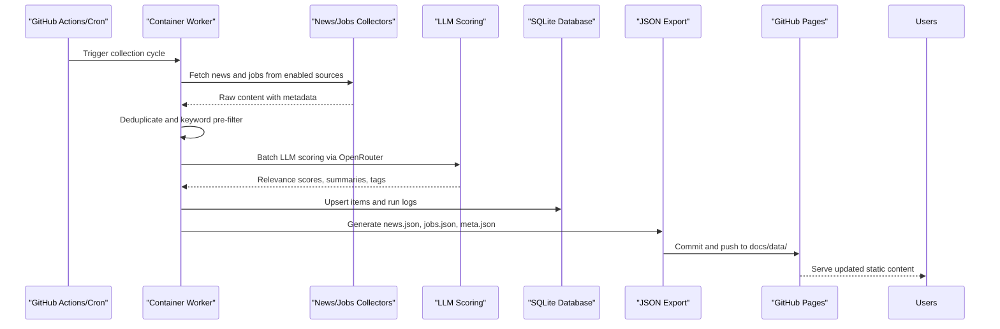
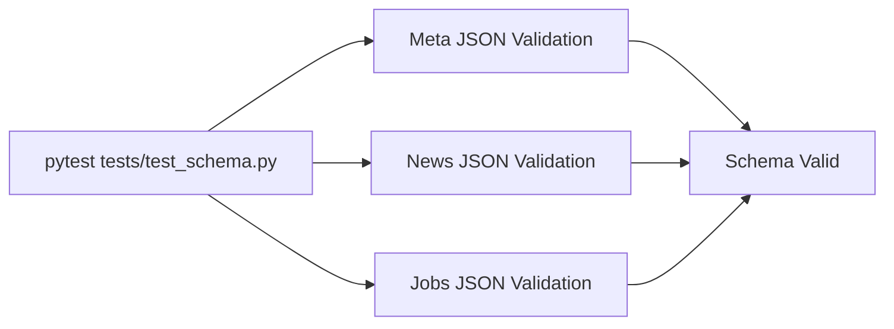

# Project Overview

<cite>
**Referenced Files in This Document**
- [README.md](file://README.md)
- [worker/main.py](file://worker/main.py)
- [worker/config.yaml](file://worker/config.yaml)
- [worker/Dockerfile](file://worker/Dockerfile)
- [docker-compose.yml](file://docker-compose.yml)
- [.github/workflows/worker-schedule.yml](file://.github/workflows/worker-schedule.yml)
- [.github/workflows/pages-deploy.yml](file://.github/workflows/pages-deploy.yml)
- [docs/index.html](file://docs/index.html)
- [docs/assets/app.js](file://docs/assets/app.js)
- [docs/assets/style.css](file://docs/assets/style.css)
- [docs/data/meta.json](file://docs/data/meta.json)
- [docs/data/news.json](file://docs/data/news.json)
- [docs/data/jobs.json](file://docs/data/jobs.json)
- [worker/requirements.txt](file://worker/requirements.txt)
- [worker/scoring/dedupe.py](file://worker/scoring/dedupe.py)
- [worker/scoring/llm_relevance.py](file://worker/scoring/llm_relevance.py)
- [worker/storage/export_json.py](file://worker/storage/export_json.py)
- [worker/collectors/news/devto.py](file://worker/collectors/news/devto.py)
- [worker/collectors/jobs/lever.py](file://worker/collectors/jobs/lever.py)
- [tests/test_schema.py](file://tests/test_schema.py)
</cite>

## Update Summary
**Changes Made**
- Added comprehensive README.md with detailed architecture and deployment documentation
- Enhanced system architecture visualization with containerized worker and GitHub Pages frontend
- Updated configuration management documentation with YAML examples and environment variables
- Improved deployment workflow documentation for both GitHub Actions and self-hosted options
- Added detailed component analysis with enhanced technical specifications

## Table of Contents
1. [Introduction](#introduction)
2. [System Architecture](#system-architecture)
3. [Project Structure](#project-structure)
4. [Core Components](#core-components)
5. [Configuration Management](#configuration-management)
6. [Deployment Options](#deployment-options)
7. [Data Flow and Processing Pipeline](#data-flow-and-processing-pipeline)
8. [Frontend Features](#frontend-features)
9. [Testing and Validation](#testing-and-validation)
10. [Operational Guarantees](#operational-guarantees)
11. [Troubleshooting Guide](#troubleshooting-guide)
12. [Conclusion](#conclusion)

## Introduction
DevOps & AI Hub is a sophisticated two-part system designed to aggregate and present DevOps, Site Reliability Engineering (SRE), Cloud, and AI/LLM content into a fast, static web application hosted on GitHub Pages. The platform serves as an automated content aggregation solution for technical professionals, continuously collecting, processing, and publishing curated content including technical news articles and job openings.

**Key Principle**: No API keys ever reach the frontend. All authenticated calls happen inside the container. The frontend only reads static JSON, ensuring security and performance optimization.

**Target Audience**:
- DevOps/SRE practitioners seeking curated insights and updates
- AI/ML engineers interested in infrastructure, MLOps, and platform engineering
- Hiring managers and recruiters scanning for specialized roles
- Organizations wanting a lightweight, transparent content hub

**Core Benefits**:
- Centralized, real-time discovery of relevant technical content
- Intelligent filtering and scoring to reduce information noise
- Fully static frontend for optimal performance and easy hosting
- Automated deployment pipeline with validation and publishing
- Open-source, highly configurable for diverse technical ecosystems

## System Architecture
The system follows a clean separation of concerns with a containerized backend worker and a static frontend:



**Diagram Sources**
- [README.md:7-27](file://README.md#L7-L27)
- [worker/main.py:158-320](file://worker/main.py#L158-L320)
- [worker/config.yaml:1-244](file://worker/config.yaml#L1-L244)
- [worker/Dockerfile:1-24](file://worker/Dockerfile#L1-L24)
- [docker-compose.yml:1-47](file://docker-compose.yml#L1-L47)
- [.github/workflows/worker-schedule.yml:1-137](file://.github/workflows/worker-schedule.yml#L1-L137)
- [.github/workflows/pages-deploy.yml:1-42](file://.github/workflows/pages-deploy.yml#L1-L42)
- [docs/index.html:1-86](file://docs/index.html#L1-L86)
- [docs/assets/app.js:1-405](file://docs/assets/app.js#L1-L405)

## Project Structure
The repository is organized into distinct, well-defined components:



**Diagram Sources**
- [README.md:35-72](file://README.md#L35-L72)
- [worker/main.py:73-98](file://worker/main.py#L73-L98)
- [docs/index.html:1-86](file://docs/index.html#L1-L86)
- [tests/test_schema.py:1-136](file://tests/test_schema.py#L1-L136)

**Section Sources**
- [README.md:35-72](file://README.md#L35-L72)
- [worker/main.py:73-98](file://worker/main.py#L73-L98)
- [docs/index.html:1-86](file://docs/index.html#L1-L86)
- [tests/test_schema.py:1-136](file://tests/test_schema.py#L1-L136)

## Core Components

### Backend Orchestrator
The central orchestrator coordinates the complete content aggregation pipeline:

- **Multi-source Collection**: News from Hacker News, Dev.to, Reddit, RSS feeds, and GitHub releases; Jobs from RemoteOK, Remotive, WeWorkRemotely, ArbeitenNOW, HN Who is Hiring, Greenhouse, and Lever
- **Intelligent Processing**: Deduplication, keyword pre-filtering, and LLM scoring via OpenRouter
- **Persistent Storage**: SQLite-backed ingestion with run logging and history tracking
- **Static Export**: Generates JSON files for frontend consumption
- **Automated Publishing**: Git commit/push for GitHub Pages deployment

**Section Sources**
- [worker/main.py:158-320](file://worker/main.py#L158-L320)
- [worker/config.yaml:77-244](file://worker/config.yaml#L77-L244)

### Intelligent Processing Pipeline
The pipeline implements sophisticated content processing:

- **Deduplication Strategy**: Hash-based stable IDs combined with fuzzy-title matching for near-duplicates
- **Keyword Pre-filter**: Reduces LLM calls by filtering items that match configured keywords
- **LLM Scoring**: Batched OpenRouter integration for relevance scoring, summaries, and categorization
- **Error Resilience**: Individual source failures don't crash the entire pipeline

**Section Sources**
- [worker/scoring/dedupe.py:1-90](file://worker/scoring/dedupe.py#L1-L90)
- [worker/scoring/llm_relevance.py:1-178](file://worker/scoring/llm_relevance.py#L1-L178)

### Static Frontend Presentation
The frontend provides a modern, responsive user experience:

- **Single-Page Application**: Vanilla JavaScript with no build step
- **Dual-Tab Interface**: Separate tabs for News Feed and Job Openings
- **Advanced Filtering**: Search, tag/category, source, and date range filters
- **Responsive Design**: Mobile-first approach with pagination
- **Theme Support**: Light/dark mode with persistent preferences

**Section Sources**
- [docs/index.html:1-86](file://docs/index.html#L1-L86)
- [docs/assets/app.js:1-405](file://docs/assets/app.js#L1-L405)

## Configuration Management
The system uses a comprehensive YAML-based configuration approach:

### Key Configuration Areas
- **Retention Policy**: Days of data to keep in SQLite and exported JSON
- **LLM Settings**: Model selection, batch size, and OpenRouter integration
- **Keyword Filters**: Pre-LLM relevance gates for both news and jobs
- **Source Management**: Enable/disable individual sources with custom settings

### Configuration Examples
The system supports dynamic source addition without code changes:

**Adding RSS Feeds**:
```yaml
news:
  rss_feeds:
    enabled: true
    feeds:
      - name: "My Blog"
        url: "https://example.com/feed.xml"
```

**Adding Job Boards**:
```yaml
jobs:
  greenhouse:
    enabled: true
    boards:
      - your-company-slug
  lever:
    enabled: true
    boards:
      - your-company-slug
```

**Section Sources**
- [worker/config.yaml:1-244](file://worker/config.yaml#L1-L244)
- [README.md:133-151](file://README.md#L133-L151)

## Deployment Options

### GitHub Actions (Recommended)
Zero-infrastructure deployment using GitHub's managed runners:

1. **Scheduled Execution**: Every 2 hours via cron
2. **Automatic Validation**: JSON schema validation with pytest
3. **Seamless Publishing**: Git commit/push triggers GitHub Pages deployment
4. **Secret Management**: API keys stored as GitHub Secrets

### Self-Hosted Deployment
For organizations preferring on-premises control:

- **Docker Container**: Run worker as a scheduled container
- **External Scheduling**: Use host cron or Kubernetes CronJob
- **Git Integration**: Configure GitHub Personal Access Token for auto-push
- **Environment Variables**: Complete configuration via .env file

**Section Sources**
- [.github/workflows/worker-schedule.yml:1-137](file://.github/workflows/worker-schedule.yml#L1-L137)
- [.github/workflows/pages-deploy.yml:1-42](file://.github/workflows/pages-deploy.yml#L1-L42)
- [docker-compose.yml:1-47](file://docker-compose.yml#L1-L47)

## Data Flow and Processing Pipeline

### End-to-End Content Aggregation


**Diagram Sources**
- [.github/workflows/worker-schedule.yml:44-124](file://.github/workflows/worker-schedule.yml#L44-L124)
- [worker/main.py:158-320](file://worker/main.py#L158-L320)
- [worker/scoring/llm_relevance.py:95-178](file://worker/scoring/llm_relevance.py#L95-L178)
- [worker/storage/export_json.py:32-93](file://worker/storage/export_json.py#L32-L93)

### Processing Pipeline Details
The system implements a robust, multi-stage processing pipeline:

1. **Collection Phase**: Multiple sources with individual error handling
2. **Pre-processing**: Deduplication and keyword filtering
3. **Scoring Phase**: LLM-powered relevance assessment
4. **Persistence Phase**: SQLite storage with run tracking
5. **Export Phase**: Static JSON generation for frontend consumption
6. **Publication Phase**: Git commit/push for deployment

**Section Sources**
- [worker/main.py:179-304](file://worker/main.py#L179-L304)
- [worker/scoring/dedupe.py:48-77](file://worker/scoring/dedupe.py#L48-L77)
- [worker/scoring/llm_relevance.py:95-178](file://worker/scoring/llm_relevance.py#L95-L178)

## Frontend Features
The static frontend provides a comprehensive user experience:

### User Interface Components
- **Dual-Tab Navigation**: Separate sections for news and job listings
- **Advanced Filtering System**: Multi-dimensional filtering with search capabilities
- **Responsive Layout**: Optimized for mobile, tablet, and desktop devices
- **Theme Support**: Dynamic light/dark mode with persistent user preferences
- **Performance Optimization**: Static content delivery with minimal JavaScript

### Filtering Capabilities
- **Text Search**: Real-time search across titles and summaries
- **Category/Tag Filtering**: Hierarchical organization by technology domains
- **Source Filtering**: Filter by content source for provenance tracking
- **Time Range Selection**: Last 24h, 7 days, or 30 days filtering
- **Pagination**: Efficient navigation through large datasets

### Technical Implementation
The frontend uses vanilla JavaScript with no build tools:
- **No Dependencies**: Pure ES6 with modern browser APIs
- **Graceful Degradation**: Handles missing or malformed JSON gracefully
- **Accessibility**: Proper ARIA labels and keyboard navigation support
- **Performance**: Minimal bundle size with efficient DOM manipulation

**Section Sources**
- [docs/index.html:26-77](file://docs/index.html#L26-L77)
- [docs/assets/app.js:108-405](file://docs/assets/app.js#L108-L405)

## Testing and Validation
The system includes comprehensive testing and validation mechanisms:

### Schema Validation
- **PyTest Integration**: Automated validation of generated JSON structure
- **Required Fields**: Ensures all critical fields exist in news and jobs data
- **Type Safety**: Validates data types and ranges for numeric fields
- **Uniqueness Checks**: Prevents duplicate IDs in generated datasets

### Test Coverage


**Diagram Sources**
- [tests/test_schema.py:28-136](file://tests/test_schema.py#L28-L136)

**Section Sources**
- [tests/test_schema.py:1-136](file://tests/test_schema.py#L1-L136)
- [.github/workflows/worker-schedule.yml:52-56](file://.github/workflows/worker-schedule.yml#L52-L56)

## Operational Guarantees
The system provides several operational guarantees:

### Security Guarantees
- **No Secrets in Frontend**: API keys and sensitive data never leave the container
- **Environment-Based Configuration**: All secrets loaded from environment variables
- **Container Isolation**: Complete separation between backend processing and frontend serving

### Reliability Guarantees
- **Idempotent Operations**: Re-running the worker doesn't create duplicate entries
- **Source Resilience**: Individual source failures don't affect overall pipeline
- **Rate Limit Compliance**: Configurable delays for Reddit and GitHub API usage
- **Error Tracking**: Comprehensive logging and health monitoring

### Performance Guarantees
- **Static Delivery**: Zero server-side rendering overhead
- **Efficient Caching**: Browser and CDN caching for optimal performance
- **Minimal Dependencies**: Lightweight container with focused functionality

**Section Sources**
- [README.md:235-241](file://README.md#L235-L241)
- [worker/main.py:183-192](file://worker/main.py#L183-L192)

## Troubleshooting Guide

### Common Issues and Solutions

#### LLM Scoring Configuration
- **Problem**: LLM scoring disabled or failing
- **Solution**: Ensure `OPENROUTER_API_KEY` is set in environment variables
- **Validation**: Check OpenRouter model configuration and API quota status

#### Source Collection Failures
- **Problem**: Individual source collection errors
- **Solution**: Monitor `meta.json.source_health` for detailed error reporting
- **Prevention**: Implement rate limiting and retry logic for external APIs

#### JSON Validation Failures
- **Problem**: Schema validation errors in CI/CD pipeline
- **Solution**: Validate generated JSON against required fields and types
- **Debugging**: Use pytest locally to reproduce and fix validation issues

#### Deployment Issues
- **Problem**: GitHub Pages not updating after successful worker run
- **Solution**: Verify GitHub Actions secrets and permissions
- **Monitoring**: Check workflow logs for commit/push failures

#### Local Development Problems
- **Problem**: Docker container fails to start or process data
- **Solution**: Verify `.env` file configuration and volume mounts
- **Preview**: Use `docker compose --profile preview` for local testing

**Section Sources**
- [worker/scoring/llm_relevance.py:105-131](file://worker/scoring/llm_relevance.py#L105-L131)
- [worker/main.py:183-192](file://worker/main.py#L183-L192)
- [tests/test_schema.py:28-136](file://tests/test_schema.py#L28-L136)
- [docker-compose.yml:13-47](file://docker-compose.yml#L13-L47)

## Conclusion
DevOps & AI Hub represents a mature, production-ready solution for automated content aggregation in technical domains. The comprehensive README.md documentation, combined with the clean separation of concerns between backend processing and frontend presentation, creates a robust foundation for continuous content curation.

**Key Strengths**:
- **Security-First Design**: Complete separation of authentication and presentation layers
- **Configurable Architecture**: Extensive customization through YAML configuration
- **Reliable Operations**: Multiple deployment options with comprehensive monitoring
- **Developer Experience**: Clear documentation and straightforward contribution guidelines
- **Community Focus**: Open-source approach encouraging community contributions

The system successfully addresses the challenges of content discovery in rapidly evolving technical fields while maintaining operational simplicity and security best practices. Whether deployed as a community resource or customized for organizational use, DevOps & AI Hub provides a solid foundation for automated content curation.