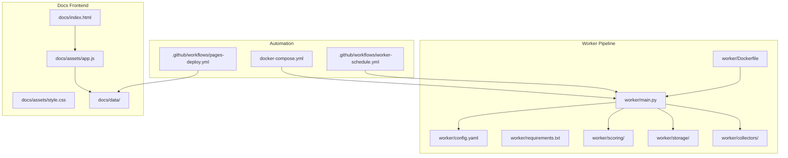
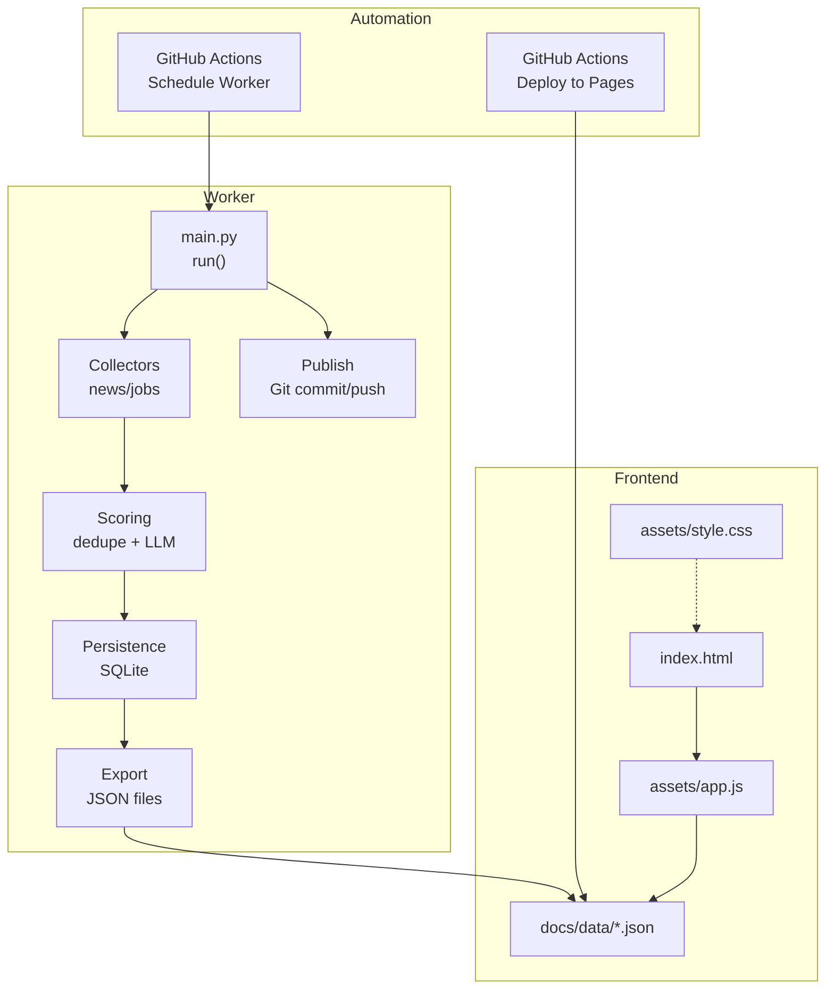
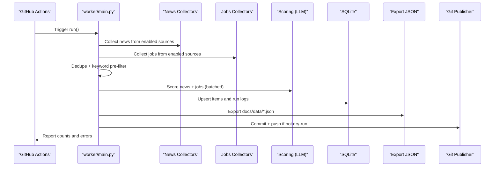
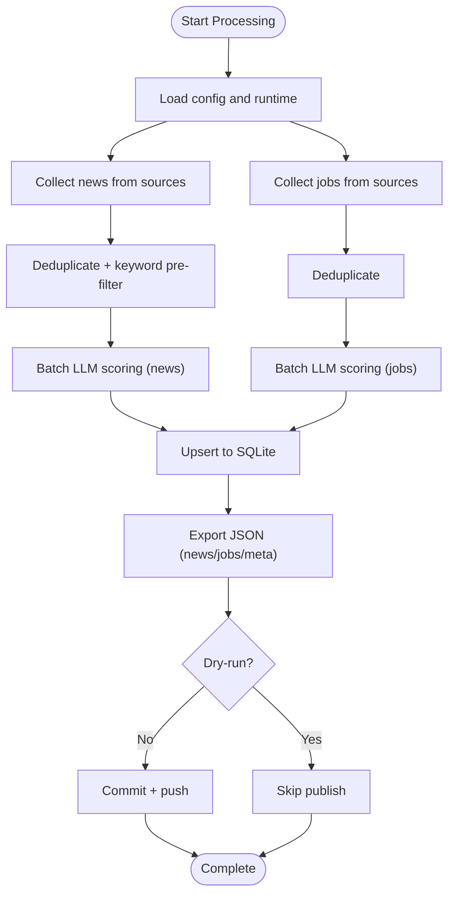
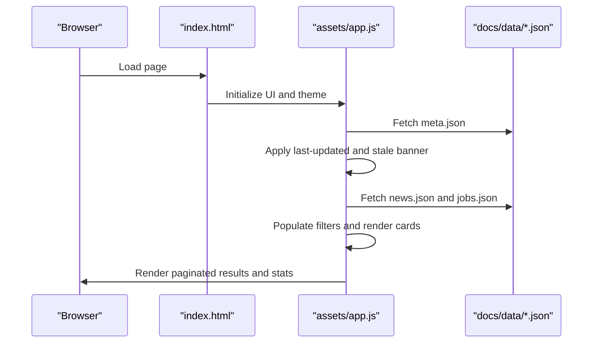
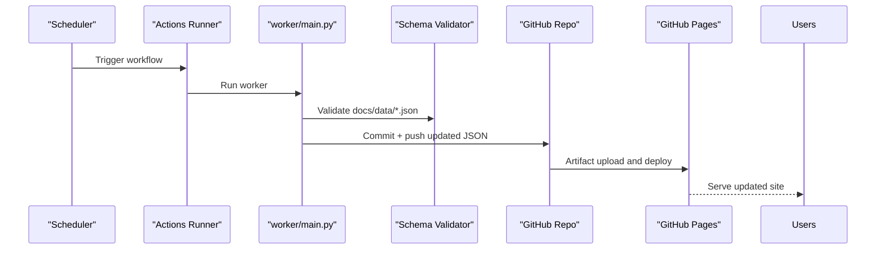
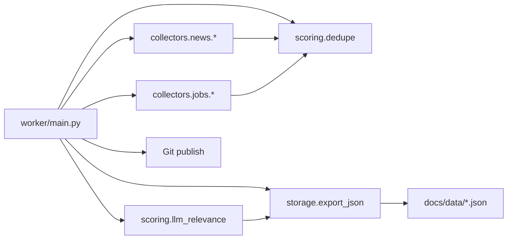

# Project Overview

<cite>
**Referenced Files in This Document**
- [worker/main.py](file://worker/main.py)
- [worker/config.yaml](file://worker/config.yaml)
- [worker/Dockerfile](file://worker/Dockerfile)
- [docker-compose.yml](file://docker-compose.yml)
- [.github/workflows/worker-schedule.yml](file://.github/workflows/worker-schedule.yml)
- [.github/workflows/pages-deploy.yml](file://.github/workflows/pages-deploy.yml)
- [docs/index.html](file://docs/index.html)
- [docs/assets/app.js](file://docs/assets/app.js)
- [docs/assets/style.css](file://docs/assets/style.css)
- [docs/data/meta.json](file://docs/data/meta.json)
- [docs/data/news.json](file://docs/data/news.json)
- [docs/data/jobs.json](file://docs/data/jobs.json)
- [worker/requirements.txt](file://worker/requirements.txt)
- [worker/scoring/dedupe.py](file://worker/scoring/dedupe.py)
- [worker/scoring/llm_relevance.py](file://worker/scoring/llm_relevance.py)
- [worker/storage/export_json.py](file://worker/storage/export_json.py)
- [worker/collectors/news/devto.py](file://worker/collectors/news/devto.py)
- [worker/collectors/jobs/lever.py](file://worker/collectors/jobs/lever.py)
- [tests/test_schema.py](file://tests/test_schema.py)
</cite>

## Table of Contents
1. [Introduction](#introduction)
2. [Project Structure](#project-structure)
3. [Core Components](#core-components)
4. [Architecture Overview](#architecture-overview)
5. [Detailed Component Analysis](#detailed-component-analysis)
6. [Dependency Analysis](#dependency-analysis)
7. [Performance Considerations](#performance-considerations)
8. [Troubleshooting Guide](#troubleshooting-guide)
9. [Conclusion](#conclusion)

## Introduction
DevOps & AI Hub is an automated content aggregation platform designed for DevOps, Site Reliability Engineering (SRE), and AI/ML engineering professionals. It continuously collects, deduplicates, scores, and publishes curated content including technical news and job postings into a static, browsable website. The system emphasizes configurability, reproducibility, and low operational overhead, enabling teams to stay informed about industry trends, tools, and opportunities without manual curation.

Key benefits:
- Centralized, real-time discovery of relevant DevOps, SRE, and AI/ML content
- Intelligent filtering and scoring to reduce noise
- Fully static frontend for fast delivery and easy hosting
- Automated deployment pipeline with validation and publishing
- Open-source, configurable for diverse ecosystems and preferences

Target audience:
- DevOps/SRE practitioners seeking curated insights and updates
- AI/ML engineers interested in infrastructure, MLOps, and platform engineering
- Hiring managers and recruiters scanning for specialized roles
- Organizations wanting a lightweight, transparent content hub

## Project Structure
The repository is organized into two primary areas:
- worker/: Python-based orchestration and processing pipeline
- docs/: Static HTML/JavaScript frontend and generated JSON datasets

**Diagram sources**
- [worker/main.py:127-292](file://worker/main.py#L127-L292)
- [worker/config.yaml:1-244](file://worker/config.yaml#L1-L244)
- [worker/Dockerfile:1-24](file://worker/Dockerfile#L1-L24)
- [docker-compose.yml:1-47](file://docker-compose.yml#L1-L47)
- [.github/workflows/worker-schedule.yml:1-70](file://.github/workflows/worker-schedule.yml#L1-L70)
- [.github/workflows/pages-deploy.yml:1-42](file://.github/workflows/pages-deploy.yml#L1-L42)
- [docs/index.html:1-86](file://docs/index.html#L1-L86)
- [docs/assets/app.js:1-200](file://docs/assets/app.js#L1-L200)

**Section sources**
- [worker/main.py:127-292](file://worker/main.py#L127-L292)
- [worker/config.yaml:1-244](file://worker/config.yaml#L1-L244)
- [worker/Dockerfile:1-24](file://worker/Dockerfile#L1-L24)
- [docker-compose.yml:1-47](file://docker-compose.yml#L1-L47)
- [.github/workflows/worker-schedule.yml:1-70](file://.github/workflows/worker-schedule.yml#L1-L70)
- [.github/workflows/pages-deploy.yml:1-42](file://.github/workflows/pages-deploy.yml#L1-L42)
- [docs/index.html:1-86](file://docs/index.html#L1-L86)
- [docs/assets/app.js:1-200](file://docs/assets/app.js#L1-L200)

## Core Components
- Orchestrator and pipeline runner
  - Coordinates collection, deduplication, scoring, persistence, export, and publication
  - Supports dry-run, SMTP digest notifications, and Git-based publishing
  - See [worker/main.py:127-292](file://worker/main.py#L127-L292)

- Configuration-driven content sources
  - News sources: Hacker News, Dev.to, Reddit, RSS feeds, GitHub releases
  - Jobs sources: RemoteOK, Remotive, We Work Remotely, ArbeitenNOW, Who Is Hiring, Greenhouse, Lever
  - See [worker/config.yaml:77-244](file://worker/config.yaml#L77-L244)

- Intelligent processing pipeline
  - Deduplication: hash-based and fuzzy-title deduplication
  - Keyword pre-filter to reduce LLM calls
  - LLM scoring via OpenRouter for relevance, summaries, and categorization
  - See [worker/scoring/dedupe.py:1-90](file://worker/scoring/dedupe.py#L1-L90), [worker/scoring/llm_relevance.py:1-178](file://worker/scoring/llm_relevance.py#L1-L178)

- Persistent storage and export
  - SQLite-backed ingestion and run logs
  - Static JSON export for news, jobs, and metadata
  - See [worker/storage/export_json.py:1-93](file://worker/storage/export_json.py#L1-L93)

- Static frontend presentation
  - Single-page app rendering news and jobs with filtering, pagination, and theme support
  - Loads data from docs/data/*.json
  - See [docs/index.html:1-86](file://docs/index.html#L1-L86), [docs/assets/app.js:1-200](file://docs/assets/app.js#L1-L200)

- Automated deployment workflow
  - Scheduled worker runs in GitHub Actions, validates JSON, and pushes updates
  - GitHub Pages deployment triggered by changes to docs/**
  - See [.github/workflows/worker-schedule.yml:1-70](file://.github/workflows/worker-schedule.yml#L1-L70), [.github/workflows/pages-deploy.yml:1-42](file://.github/workflows/pages-deploy.yml#L1-L42)

**Section sources**
- [worker/main.py:127-292](file://worker/main.py#L127-L292)
- [worker/config.yaml:77-244](file://worker/config.yaml#L77-L244)
- [worker/scoring/dedupe.py:1-90](file://worker/scoring/dedupe.py#L1-L90)
- [worker/scoring/llm_relevance.py:1-178](file://worker/scoring/llm_relevance.py#L1-L178)
- [worker/storage/export_json.py:1-93](file://worker/storage/export_json.py#L1-L93)
- [docs/index.html:1-86](file://docs/index.html#L1-L86)
- [docs/assets/app.js:1-200](file://docs/assets/app.js#L1-L200)
- [.github/workflows/worker-schedule.yml:1-70](file://.github/workflows/worker-schedule.yml#L1-L70)
- [.github/workflows/pages-deploy.yml:1-42](file://.github/workflows/pages-deploy.yml#L1-L42)

## Architecture Overview
The system follows a clear separation of concerns:
- Backend (worker): Python orchestrator, collectors, scoring, persistence, and export
- Frontend (docs): Static HTML/JS app consuming JSON datasets
- Automation: GitHub Actions for scheduling and publishing; optional Docker Compose for local/VM runs

**Diagram sources**
- [.github/workflows/worker-schedule.yml:1-70](file://.github/workflows/worker-schedule.yml#L1-L70)
- [.github/workflows/pages-deploy.yml:1-42](file://.github/workflows/pages-deploy.yml#L1-L42)
- [worker/main.py:127-292](file://worker/main.py#L127-L292)
- [worker/scoring/dedupe.py:1-90](file://worker/scoring/dedupe.py#L1-L90)
- [worker/scoring/llm_relevance.py:1-178](file://worker/scoring/llm_relevance.py#L1-L178)
- [worker/storage/export_json.py:1-93](file://worker/storage/export_json.py#L1-L93)
- [docs/index.html:1-86](file://docs/index.html#L1-L86)
- [docs/assets/app.js:1-200](file://docs/assets/app.js#L1-L200)

## Detailed Component Analysis

### Backend Orchestration and Multi-Source Collection
The orchestrator coordinates a full cycle:
1. Load configuration and initialize runtime state
2. Collect news and jobs from enabled sources
3. Deduplicate and pre-filter items
4. Score items using LLM (OpenRouter)
5. Persist to SQLite
6. Export static JSON
7. Publish changes and optionally send SMTP digest

**Diagram sources**
- [.github/workflows/worker-schedule.yml:44-57](file://.github/workflows/worker-schedule.yml#L44-L57)
- [worker/main.py:127-292](file://worker/main.py#L127-L292)
- [worker/scoring/llm_relevance.py:95-178](file://worker/scoring/llm_relevance.py#L95-L178)
- [worker/storage/export_json.py:32-93](file://worker/storage/export_json.py#L32-L93)

**Section sources**
- [worker/main.py:127-292](file://worker/main.py#L127-L292)
- [worker/config.yaml:77-244](file://worker/config.yaml#L77-L244)

### Intelligent Processing Pipeline
- Deduplication
  - Stable deterministic IDs for news and jobs
  - DB-backed seen checks and fuzzy-title deduplication within batches
- Keyword pre-filter
  - Reduces LLM calls by filtering items that do not match configured keywords
- LLM scoring
  - Batched scoring for news and jobs via OpenRouter
  - Structured outputs for relevance, summaries, tags, and categories

**Diagram sources**
- [worker/main.py:127-292](file://worker/main.py#L127-L292)
- [worker/scoring/dedupe.py:19-90](file://worker/scoring/dedupe.py#L19-L90)
- [worker/scoring/llm_relevance.py:95-178](file://worker/scoring/llm_relevance.py#L95-L178)
- [worker/storage/export_json.py:32-93](file://worker/storage/export_json.py#L32-L93)

**Section sources**
- [worker/scoring/dedupe.py:1-90](file://worker/scoring/dedupe.py#L1-L90)
- [worker/scoring/llm_relevance.py:1-178](file://worker/scoring/llm_relevance.py#L1-L178)
- [worker/storage/export_json.py:1-93](file://worker/storage/export_json.py#L1-L93)

### Static Frontend Presentation
The frontend is a vanilla JavaScript SPA that:
- Loads meta, news, and jobs JSON
- Renders tabbed views for news and jobs
- Provides filtering by search term, tag/source/date, and pagination
- Displays last-updated timestamp and stale banner
- Supports light/dark theme with persistent preference

**Diagram sources**
- [docs/index.html:1-86](file://docs/index.html#L1-L86)
- [docs/assets/app.js:108-200](file://docs/assets/app.js#L108-L200)
- [docs/assets/app.js:132-190](file://docs/assets/app.js#L132-L190)

**Section sources**
- [docs/index.html:1-86](file://docs/index.html#L1-L86)
- [docs/assets/app.js:1-200](file://docs/assets/app.js#L1-L200)

### Automated Deployment Workflow
- Scheduled worker run
  - Runs inside a Docker-built container
  - Validates exported JSON schema
  - Commits and pushes updated docs/data/*.json
- Pages deployment
  - Automatically deploys docs/** to GitHub Pages on push

**Diagram sources**
- [.github/workflows/worker-schedule.yml:14-17](file://.github/workflows/worker-schedule.yml#L14-L17)
- [.github/workflows/worker-schedule.yml:44-70](file://.github/workflows/worker-schedule.yml#L44-L70)
- [.github/workflows/pages-deploy.yml:20-42](file://.github/workflows/pages-deploy.yml#L20-L42)

**Section sources**
- [.github/workflows/worker-schedule.yml:1-70](file://.github/workflows/worker-schedule.yml#L1-L70)
- [.github/workflows/pages-deploy.yml:1-42](file://.github/workflows/pages-deploy.yml#L1-L42)

## Dependency Analysis
- Runtime dependencies
  - HTTP clients, YAML parsing, environment loading, Git operations, and LLM client libraries
- Internal module dependencies
  - main.py depends on collectors, scoring, storage, and notification modules
  - Collectors depend on shared dedup ID helpers
  - Export module depends on storage queries

**Diagram sources**
- [worker/main.py:42-66](file://worker/main.py#L42-L66)
- [worker/requirements.txt:1-11](file://worker/requirements.txt#L1-L11)

**Section sources**
- [worker/main.py:42-66](file://worker/main.py#L42-L66)
- [worker/requirements.txt:1-11](file://worker/requirements.txt#L1-L11)

## Performance Considerations
- Batched LLM scoring reduces API costs and latency
- Keyword pre-filter minimizes unnecessary LLM calls
- Fuzzy deduplication reduces redundant items early
- Static JSON export eliminates server-side rendering overhead
- Lightweight container and minimal dependencies optimize startup and memory footprint

## Troubleshooting Guide
Common issues and resolutions:
- LLM scoring disabled or failing
  - Ensure OPENROUTER_API_KEY is set in environment
  - Verify OPENROUTER_MODEL and base URL configuration
  - Review logs for batch failures; unscored items are preserved
  - See [worker/scoring/llm_relevance.py:105-131](file://worker/scoring/llm_relevance.py#L105-L131)

- Source collection errors
  - Check individual source health reported in meta.json and logs
  - Confirm network connectivity and rate limits
  - See [worker/main.py:151-160](file://worker/main.py#L151-L160)

- JSON schema validation failures
  - Validate docs/data/*.json against required fields and types
  - Duplicate IDs or missing required keys will cause tests to fail
  - See [tests/test_schema.py:28-136](file://tests/test_schema.py#L28-L136)

- Dry-run mode
  - Set DRY_RUN=true to skip Git publishing and SMTP digest
  - Useful for testing without affecting production data
  - See [worker/main.py:136](file://worker/main.py#L136)

- Local development and preview
  - Use docker-compose to run the worker and preview with nginx
  - Mount docs/data for live updates during development
  - See [docker-compose.yml:13-47](file://docker-compose.yml#L13-L47)

**Section sources**
- [worker/scoring/llm_relevance.py:105-131](file://worker/scoring/llm_relevance.py#L105-L131)
- [worker/main.py:151-160](file://worker/main.py#L151-L160)
- [tests/test_schema.py:28-136](file://tests/test_schema.py#L28-L136)
- [docker-compose.yml:13-47](file://docker-compose.yml#L13-L47)

## Conclusion
DevOps & AI Hub delivers a robust, automated pipeline that aggregates and presents relevant content for DevOps, SRE, and AI/ML engineering audiences. Its modular design, configurable sources, intelligent processing, and static frontend make it easy to operate and extend. The GitHub Actions-driven deployment ensures fresh content with minimal maintenance, while the schema validation guarantees data quality. Whether you are curating resources for your team or building a community hub, the project offers a solid foundation to scale and customize.