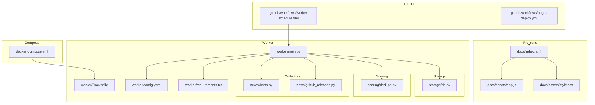
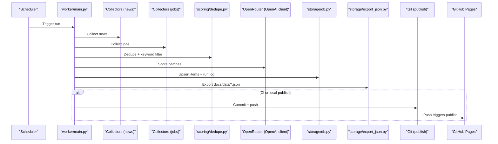
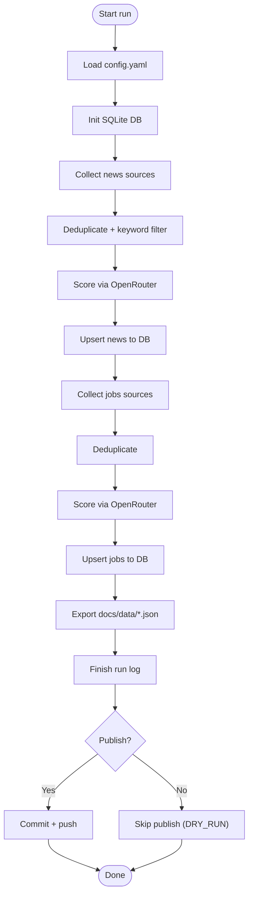
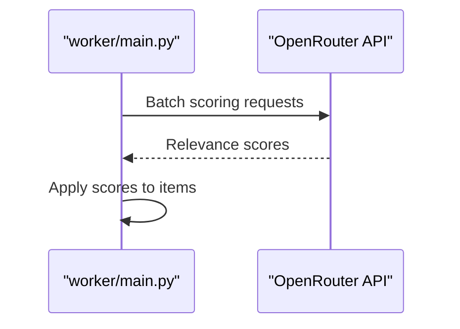
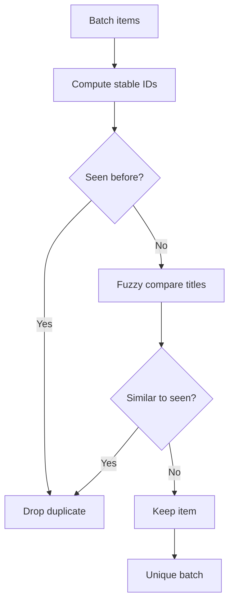
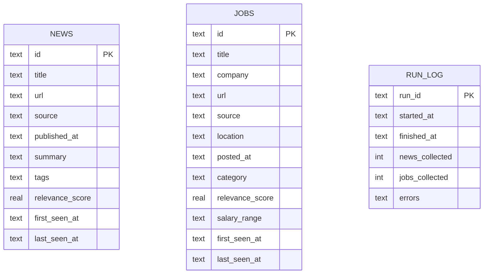
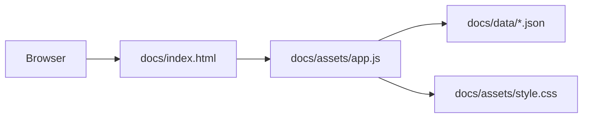
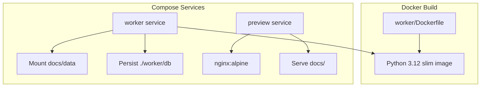
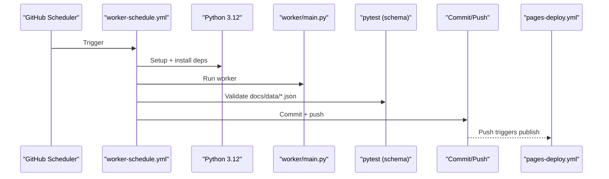
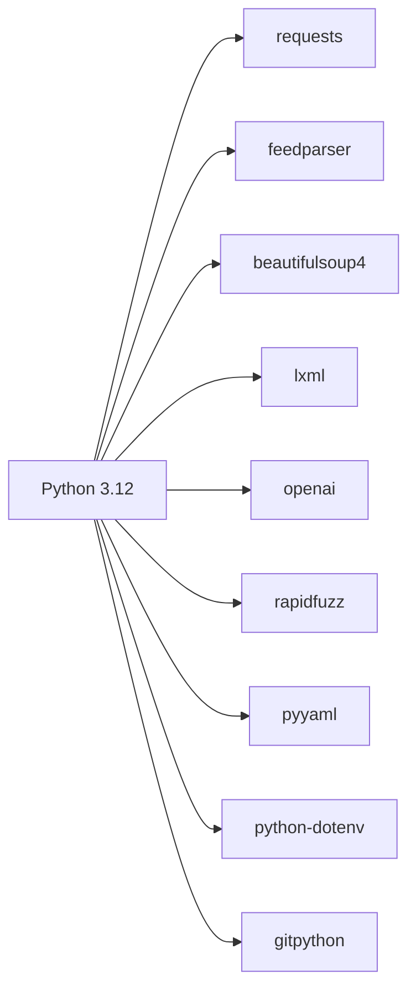

# Technical Stack

<cite>
**Referenced Files in This Document**
- [requirements.txt](file://worker/requirements.txt)
- [Dockerfile](file://worker/Dockerfile)
- [docker-compose.yml](file://docker-compose.yml)
- [main.py](file://worker/main.py)
- [config.yaml](file://worker/config.yaml)
- [app.js](file://docs/assets/app.js)
- [style.css](file://docs/assets/style.css)
- [index.html](file://docs/index.html)
- [test_schema.py](file://tests/test_schema.py)
- [devto.py](file://worker/collectors/news/devto.py)
- [github_releases.py](file://worker/collectors/news/github_releases.py)
- [dedupe.py](file://worker/scoring/dedupe.py)
- [db.py](file://worker/storage/db.py)
- [pages-deploy.yml](file://.github/workflows/pages-deploy.yml)
- [worker-schedule.yml](file://.github/workflows/worker-schedule.yml)
</cite>

## Table of Contents
1. [Introduction](#introduction)
2. [Project Structure](#project-structure)
3. [Core Components](#core-components)
4. [Architecture Overview](#architecture-overview)
5. [Detailed Component Analysis](#detailed-component-analysis)
6. [Dependency Analysis](#dependency-analysis)
7. [Performance Considerations](#performance-considerations)
8. [Troubleshooting Guide](#troubleshooting-guide)
9. [Conclusion](#conclusion)
10. [Appendices](#appendices)

## Introduction
This document describes the technical stack powering the DevOps & AI Hub. It covers the Python-based backend orchestrator, key libraries for HTTP, parsing, and AI scoring, the static frontend built with vanilla HTML, CSS, and JavaScript, and the containerization and deployment approach using Docker and Docker Compose. It also documents CI/CD workflows, testing, environment setup, and operational guidance.

## Project Structure
The repository is organized into:
- worker/: Python orchestration, collectors, scoring, storage, and packaging
- docs/: Static site assets and content served by a lightweight preview server
- tests/: JSON schema validation tests
- .github/workflows/: GitHub Actions for scheduled refresh and publishing
- docker-compose.yml: Local orchestration for the worker and optional preview server

**Diagram sources**
- [main.py](file://worker/main.py)
- [config.yaml](file://worker/config.yaml)
- [requirements.txt](file://worker/requirements.txt)
- [Dockerfile](file://worker/Dockerfile)
- [devto.py](file://worker/collectors/news/devto.py)
- [github_releases.py](file://worker/collectors/news/github_releases.py)
- [dedupe.py](file://worker/scoring/dedupe.py)
- [db.py](file://worker/storage/db.py)
- [index.html](file://docs/index.html)
- [app.js](file://docs/assets/app.js)
- [style.css](file://docs/assets/style.css)
- [worker-schedule.yml](file://.github/workflows/worker-schedule.yml)
- [pages-deploy.yml](file://.github/workflows/pages-deploy.yml)
- [docker-compose.yml](file://docker-compose.yml)

**Section sources**
- [docker-compose.yml](file://docker-compose.yml)
- [main.py](file://worker/main.py)
- [config.yaml](file://worker/config.yaml)
- [requirements.txt](file://worker/requirements.txt)
- [Dockerfile](file://worker/Dockerfile)
- [index.html](file://docs/index.html)
- [app.js](file://docs/assets/app.js)
- [style.css](file://docs/assets/style.css)
- [worker-schedule.yml](file://.github/workflows/worker-schedule.yml)
- [pages-deploy.yml](file://.github/workflows/pages-deploy.yml)

## Core Components
- Python 3.12 runtime in containers and CI
- HTTP clients: requests, httpx
- Parsing and feeds: feedparser, beautifulsoup4, lxml
- AI/LLM integration: OpenRouter via OpenAI client
- Scoring and deduplication: rapidfuzz
- Persistence: SQLite with WAL mode and indices
- Static site: HTML, CSS, vanilla JavaScript
- Packaging and orchestration: Docker, Docker Compose
- CI/CD: GitHub Actions for scheduling and publishing

**Section sources**
- [Dockerfile](file://worker/Dockerfile)
- [requirements.txt](file://worker/requirements.txt)
- [main.py](file://worker/main.py)
- [config.yaml](file://worker/config.yaml)
- [db.py](file://worker/storage/db.py)
- [dedupe.py](file://worker/scoring/dedupe.py)
- [devto.py](file://worker/collectors/news/devto.py)
- [github_releases.py](file://worker/collectors/news/github_releases.py)
- [index.html](file://docs/index.html)
- [app.js](file://docs/assets/app.js)
- [style.css](file://docs/assets/style.css)
- [worker-schedule.yml](file://.github/workflows/worker-schedule.yml)
- [pages-deploy.yml](file://.github/workflows/pages-deploy.yml)

## Architecture Overview
The system runs a scheduled worker that:
1. Loads configuration
2. Collects news and jobs from multiple sources
3. Deduplicates and applies keyword pre-filtering
4. Scores items via OpenRouter (via OpenAI client)
5. Persists to SQLite
6. Exports static JSON consumed by the frontend
7. Optionally commits and pushes updates (local dry-run or via CI)
8. Optionally sends an SMTP digest

**Diagram sources**
- [main.py](file://worker/main.py)
- [config.yaml](file://worker/config.yaml)
- [dedupe.py](file://worker/scoring/dedupe.py)
- [db.py](file://worker/storage/db.py)
- [worker-schedule.yml](file://.github/workflows/worker-schedule.yml)
- [pages-deploy.yml](file://.github/workflows/pages-deploy.yml)

## Detailed Component Analysis

### Python Orchestration and Pipeline
- Orchestrator entrypoint coordinates collection, deduplication, scoring, persistence, export, and optional publish/smtp.
- Environment variables drive behavior (logging, dry-run, smtp, git credentials).
- Configuration is YAML-driven and enables/disables sources and sets keywords and limits.

**Diagram sources**
- [main.py](file://worker/main.py)
- [config.yaml](file://worker/config.yaml)
- [db.py](file://worker/storage/db.py)

**Section sources**
- [main.py](file://worker/main.py)
- [config.yaml](file://worker/config.yaml)

### HTTP Clients and Parsing Libraries
- requests: Used by news collectors for REST APIs.
- httpx: Included for async/alternative HTTP needs.
- feedparser: Parses GitHub releases Atom feeds.
- beautifulsoup4 + lxml: Included for robust HTML/XML parsing.

**Section sources**
- [devto.py](file://worker/collectors/news/devto.py)
- [github_releases.py](file://worker/collectors/news/github_releases.py)
- [requirements.txt](file://worker/requirements.txt)

### AI/LLM Integration (OpenRouter)
- The pipeline uses an OpenAI-compatible client configured to call OpenRouter endpoints.
- Model selection and batch sizing are configurable; a keyword pre-filter reduces LLM calls.
- Environment variables supply API key and model overrides.

**Diagram sources**
- [main.py](file://worker/main.py)
- [config.yaml](file://worker/config.yaml)

**Section sources**
- [main.py](file://worker/main.py)
- [config.yaml](file://worker/config.yaml)

### Deduplication and Keyword Filtering
- Deterministic hashing for stable IDs.
- Fuzzy title deduplication using rapidfuzz thresholds.
- Keyword pre-filtering on title/summary/company to reduce LLM calls.

**Diagram sources**
- [dedupe.py](file://worker/scoring/dedupe.py)

**Section sources**
- [dedupe.py](file://worker/scoring/dedupe.py)
- [config.yaml](file://worker/config.yaml)

### Storage and Persistence (SQLite)
- WAL mode and indices optimize reads/writes.
- JSON fields store tags and errors.
- Upsert semantics maintain first/last seen timestamps and scores.

**Diagram sources**
- [db.py](file://worker/storage/db.py)

**Section sources**
- [db.py](file://worker/storage/db.py)

### Frontend: Static Site (HTML/CSS/JS)
- Single-page app loads JSON from docs/data and renders cards with filtering, pagination, and theme switching.
- No build step; vanilla JavaScript and CSS.

**Diagram sources**
- [index.html](file://docs/index.html)
- [app.js](file://docs/assets/app.js)
- [style.css](file://docs/assets/style.css)

**Section sources**
- [index.html](file://docs/index.html)
- [app.js](file://docs/assets/app.js)
- [style.css](file://docs/assets/style.css)

### Containerization and Deployment
- Dockerfile builds a non-root Python 3.12 slim image, installs pinned requirements, and runs main.py as the entrypoint.
- docker-compose defines:
  - worker service: builds from worker/, mounts docs/data for JSON export, persists SQLite under ./worker/db, and supports optional cron sidecar.
  - preview service: nginx to serve docs locally.

**Diagram sources**
- [Dockerfile](file://worker/Dockerfile)
- [docker-compose.yml](file://docker-compose.yml)

**Section sources**
- [Dockerfile](file://worker/Dockerfile)
- [docker-compose.yml](file://docker-compose.yml)

### CI/CD Workflows
- Scheduled worker run via GitHub Actions:
  - Checks out repo, sets up Python 3.12, installs requirements, runs worker with environment variables, validates JSON schema, and commits/pushes changes.
- Pages deployment:
  - On docs changes, publishes to GitHub Pages.

**Diagram sources**
- [worker-schedule.yml](file://.github/workflows/worker-schedule.yml)
- [pages-deploy.yml](file://.github/workflows/pages-deploy.yml)
- [test_schema.py](file://tests/test_schema.py)

**Section sources**
- [worker-schedule.yml](file://.github/workflows/worker-schedule.yml)
- [pages-deploy.yml](file://.github/workflows/pages-deploy.yml)
- [test_schema.py](file://tests/test_schema.py)

## Dependency Analysis
Key runtime dependencies and their roles:
- requests: REST clients for news sources
- feedparser: RSS/Atom parsing for releases
- beautifulsoup4 + lxml: HTML/XML parsing
- httpx: Alternative HTTP client
- openai: OpenRouter client
- rapidfuzz: Fuzzy string matching for deduplication
- pyyaml: YAML config loading
- python-dotenv: Environment loading
- gitpython: Optional Git operations for publishing

**Diagram sources**
- [requirements.txt](file://worker/requirements.txt)
- [main.py](file://worker/main.py)

**Section sources**
- [requirements.txt](file://worker/requirements.txt)
- [main.py](file://worker/main.py)

## Performance Considerations
- LLM cost and latency control:
  - Keyword pre-filter and batch sizes reduce calls.
  - Adjust batch_size and prefilter_keywords in config.
- Deduplication:
  - Rapidfuzz threshold can be tuned to balance recall/precision.
- Database:
  - WAL mode and indices improve concurrency and query performance.
- Network:
  - Respectful delays for public feeds; timeouts configured in collectors.
- Frontend:
  - Pagination and debounced search reduce rendering overhead.

[No sources needed since this section provides general guidance]

## Troubleshooting Guide
- Missing or invalid docs/data JSON:
  - Run schema tests to validate structure and required fields.
- OpenRouter failures:
  - Verify OPENROUTER_API_KEY and model configuration.
- Git publish issues:
  - Ensure GH_PAT and GIT_REPO_URL are set; confirm branch and credentials.
- SMTP digest:
  - Enable SMTP_ENABLED and configure host/port/user/password/to.
- Local preview:
  - Use docker-compose profile to start nginx preview service.

**Section sources**
- [test_schema.py](file://tests/test_schema.py)
- [config.yaml](file://worker/config.yaml)
- [main.py](file://worker/main.py)
- [docker-compose.yml](file://docker-compose.yml)

## Conclusion
The DevOps & AI Hub combines a lean Python orchestrator, robust HTTP and parsing libraries, efficient SQLite storage, and a responsive static frontend. Containerization and GitHub Actions deliver reliable scheduling and publishing, while configuration-driven features enable flexible source management and AI scoring.

[No sources needed since this section summarizes without analyzing specific files]

## Appendices

### Version and Compatibility Notes
- Python: 3.12 used in Dockerfile and CI; Python 3.8+ requirement is satisfied.
- Dependencies pinned via requirements.txt; upgrade carefully to preserve compatibility.
- OpenRouter integration uses OpenAI client library; ensure API key and model alignment with OpenRouter’s expectations.

**Section sources**
- [Dockerfile](file://worker/Dockerfile)
- [requirements.txt](file://worker/requirements.txt)
- [config.yaml](file://worker/config.yaml)

### Environment Setup and Dependency Management
- Local:
  - Use docker-compose to run the worker and optionally preview.
  - Mount docs/data and worker/db for persistent state.
- CI:
  - GitHub Actions sets Python 3.12, installs requirements, runs worker, validates JSON, and pushes updates.
- Testing:
  - Run pytest against tests/test_schema.py to validate JSON schema compliance.

**Section sources**
- [docker-compose.yml](file://docker-compose.yml)
- [worker-schedule.yml](file://.github/workflows/worker-schedule.yml)
- [test_schema.py](file://tests/test_schema.py)