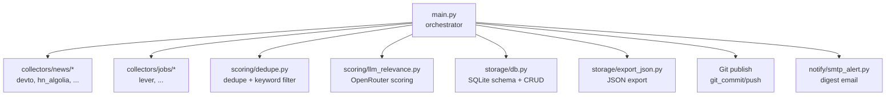
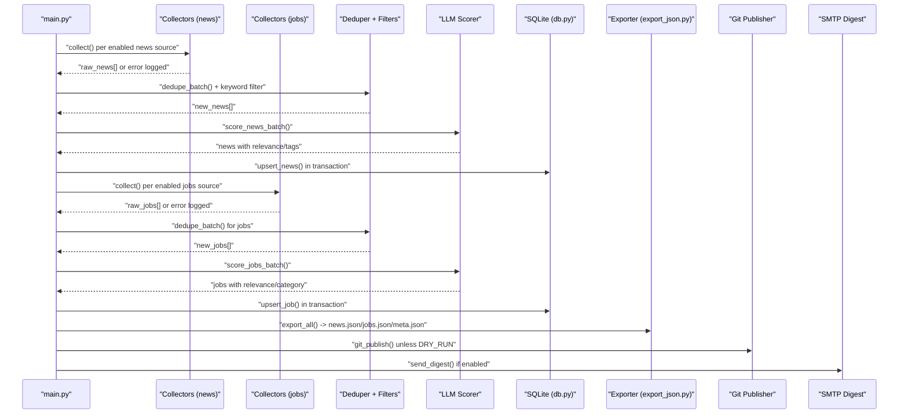
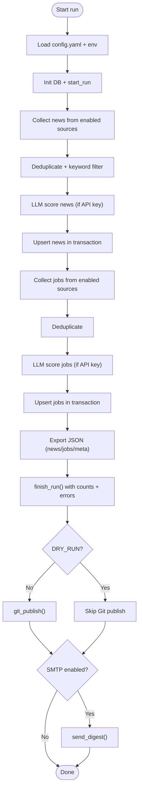
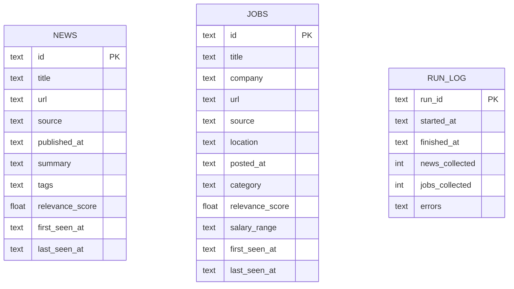
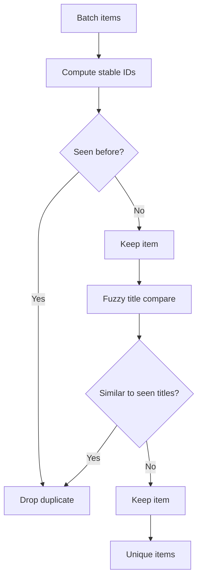
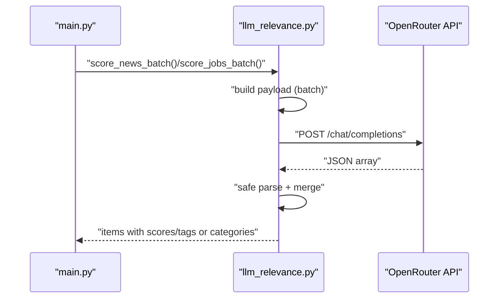
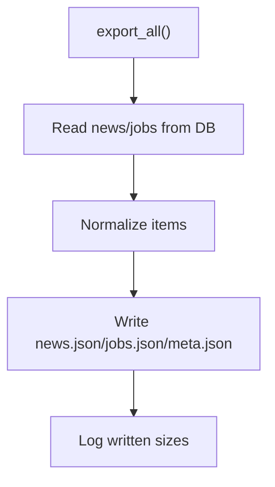
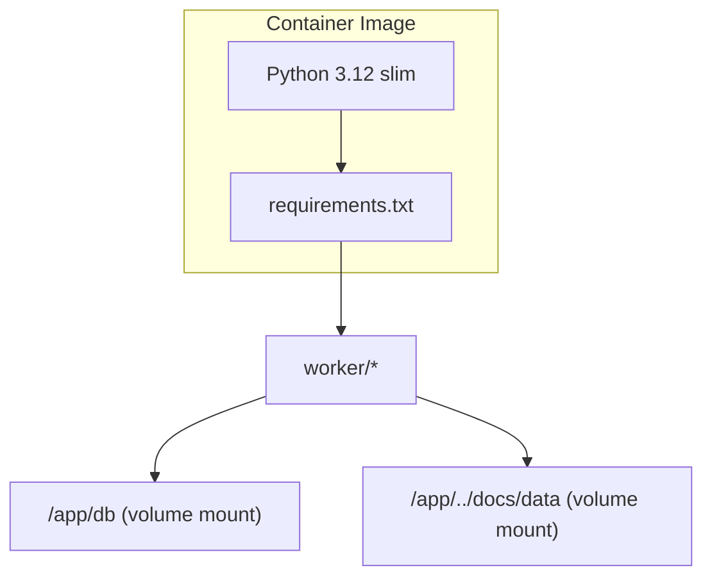

# Troubleshooting and FAQ

<cite>
**Referenced Files in This Document**
- [main.py](file://worker/main.py)
- [config.yaml](file://worker/config.yaml)
- [db.py](file://worker/storage/db.py)
- [export_json.py](file://worker/storage/export_json.py)
- [dedupe.py](file://worker/scoring/dedupe.py)
- [llm_relevance.py](file://worker/scoring/llm_relevance.py)
- [smtp_alert.py](file://worker/notify/smtp_alert.py)
- [devto.py](file://worker/collectors/news/devto.py)
- [hn_algolia.py](file://worker/collectors/news/hn_algolia.py)
- [lever.py](file://worker/collectors/jobs/lever.py)
- [Dockerfile](file://worker/Dockerfile)
- [docker-compose.yml](file://docker-compose.yml)
- [.gitignore](file://.gitignore)
- [.dockerignore](file://worker/.dockerignore)
</cite>

## Table of Contents
1. [Introduction](#introduction)
2. [Project Structure](#project-structure)
3. [Core Components](#core-components)
4. [Architecture Overview](#architecture-overview)
5. [Detailed Component Analysis](#detailed-component-analysis)
6. [Dependency Analysis](#dependency-analysis)
7. [Performance Considerations](#performance-considerations)
8. [Troubleshooting Guide](#troubleshooting-guide)
9. [Monitoring and Alerting](#monitoring-and-alerting)
10. [System Health Checks](#system-health-checks)
11. [Preventive Maintenance](#preventive-maintenance)
12. [Security Considerations](#security-considerations)
13. [Rate Limiting and Resource Optimization](#rate-limiting-and-resource-optimization)
14. [FAQ](#faq)
15. [Conclusion](#conclusion)

## Introduction
This document provides comprehensive troubleshooting guidance for the worker pipeline that collects news and jobs, deduplicates, scores, persists to SQLite, exports JSON, optionally publishes via Git, and sends SMTP digests. It covers common collection failures, processing errors, deployment issues, performance bottlenecks, logging interpretation, debugging techniques, monitoring/alerting strategies, system health checks, preventive maintenance, security, rate limiting, and environment/configuration FAQs.

## Project Structure
The worker orchestrates a multi-stage pipeline:
- Configuration-driven collection from multiple news and job sources
- Deduplication and keyword pre-filtering
- LLM-based scoring and tagging
- SQLite persistence and JSON export
- Optional Git publishing and SMTP digest

**Diagram sources**
- [main.py](file://worker/main.py)
- [db.py](file://worker/storage/db.py)
- [export_json.py](file://worker/storage/export_json.py)
- [dedupe.py](file://worker/scoring/dedupe.py)
- [llm_relevance.py](file://worker/scoring/llm_relevance.py)
- [smtp_alert.py](file://worker/notify/smtp_alert.py)
- [devto.py](file://worker/collectors/news/devto.py)
- [hn_algolia.py](file://worker/collectors/news/hn_algolia.py)
- [lever.py](file://worker/collectors/jobs/lever.py)

**Section sources**
- [main.py](file://worker/main.py)
- [config.yaml](file://worker/config.yaml)

## Core Components
- Orchestrator: loads config, initializes DB, runs collection, dedupe, scoring, persistence, export, optional Git publish, optional SMTP digest.
- Storage: SQLite schema, transactions, run logs, and helpers for news/jobs.
- Scoring: fuzzy dedupe, keyword pre-filter, OpenRouter-based relevance scoring.
- Export: reads from DB and writes JSON files under docs/data.
- Notifications: SMTP digest with threshold filtering.
- Collectors: news and jobs sources with per-source error handling.

**Section sources**
- [main.py](file://worker/main.py)
- [db.py](file://worker/storage/db.py)
- [export_json.py](file://worker/storage/export_json.py)
- [dedupe.py](file://worker/scoring/dedupe.py)
- [llm_relevance.py](file://worker/scoring/llm_relevance.py)
- [smtp_alert.py](file://worker/notify/smtp_alert.py)
- [devto.py](file://worker/collectors/news/devto.py)
- [hn_algolia.py](file://worker/collectors/news/hn_algolia.py)
- [lever.py](file://worker/collectors/jobs/lever.py)

## Architecture Overview
End-to-end pipeline flow with error handling and optional steps.

**Diagram sources**
- [main.py](file://worker/main.py)
- [db.py](file://worker/storage/db.py)
- [export_json.py](file://worker/storage/export_json.py)
- [dedupe.py](file://worker/scoring/dedupe.py)
- [llm_relevance.py](file://worker/scoring/llm_relevance.py)
- [smtp_alert.py](file://worker/notify/smtp_alert.py)

## Detailed Component Analysis

### Orchestrator and Pipeline Flow
Key stages and error handling:
- Loads configuration and environment variables.
- Initializes DB and starts run logging.
- Iterates over enabled news and job collectors; each logs errors and marks source health.
- Deduplication and keyword filtering reduce LLM workload.
- LLM scoring is skipped if API key is missing; otherwise batches are processed with safe parsing.
- Transactions wrap DB inserts; run logs record counts and errors.
- JSON export writes three files and attaches source health.
- Optional Git publish pushes only if credentials are provided.
- Optional SMTP digest filters by threshold and sends HTML email.

**Diagram sources**
- [main.py](file://worker/main.py)
- [db.py](file://worker/storage/db.py)
- [export_json.py](file://worker/storage/export_json.py)
- [llm_relevance.py](file://worker/scoring/llm_relevance.py)
- [smtp_alert.py](file://worker/notify/smtp_alert.py)

**Section sources**
- [main.py](file://worker/main.py)

### Storage Layer (SQLite)
- WAL mode and indices improve concurrency and query performance.
- Transactions ensure atomicity; rollback on exceptions.
- Upsert logic handles updates vs inserts and preserves existing fields when values are absent.
- Run log tracks run lifecycle, counts, and errors.

**Diagram sources**
- [db.py](file://worker/storage/db.py)

**Section sources**
- [db.py](file://worker/storage/db.py)

### Deduplication and Keyword Filtering
- Deterministic IDs prevent duplicates across runs.
- In-batch fuzzy dedup reduces near-duplicates using a configurable threshold.
- Keyword pre-filter reduces LLM calls by skipping irrelevant items.

**Diagram sources**
- [dedupe.py](file://worker/scoring/dedupe.py)

**Section sources**
- [dedupe.py](file://worker/scoring/dedupe.py)

### LLM Relevance Scoring
- Uses OpenRouter chat completions with environment overrides.
- Batch processing with safe JSON parsing; on error, keeps original items to avoid data loss.
- Separate prompts for news and jobs; tags/categories constrained to predefined sets.

**Diagram sources**
- [llm_relevance.py](file://worker/scoring/llm_relevance.py)
- [main.py](file://worker/main.py)

**Section sources**
- [llm_relevance.py](file://worker/scoring/llm_relevance.py)

### Export and Git Publishing
- Export reads from DB, normalizes fields, and writes JSON files.
- Git publish commits and pushes only if credentials are provided; otherwise logs local commit intent.

**Diagram sources**
- [export_json.py](file://worker/storage/export_json.py)

**Section sources**
- [export_json.py](file://worker/storage/export_json.py)
- [main.py](file://worker/main.py)

### SMTP Digest
- Sends HTML digest only when enabled and fully configured; filters by relevance threshold.

**Section sources**
- [smtp_alert.py](file://worker/notify/smtp_alert.py)
- [main.py](file://worker/main.py)

## Dependency Analysis
- Runtime dependencies include HTTP clients, YAML, dotenv, SQLite, fuzzy matching, and GitPython.
- Containerization ensures non-root operation and persistent DB volume mounting.

**Diagram sources**
- [Dockerfile](file://worker/Dockerfile)
- [docker-compose.yml](file://docker-compose.yml)

**Section sources**
- [requirements.txt](file://worker/requirements.txt)
- [Dockerfile](file://worker/Dockerfile)
- [docker-compose.yml](file://docker-compose.yml)

## Performance Considerations
- LLM batching: tune batch size to balance throughput and cost; default is moderate.
- Keyword pre-filter: configure keywords to reduce unnecessary LLM calls.
- Deduplication: fuzzy threshold can be adjusted to trade off recall precision.
- SQLite: WAL mode improves concurrency; ensure adequate disk I/O and indexing.
- Network timeouts: collectors and LLM client have explicit timeouts to avoid hangs.
- Export size: retention window controls dataset size and export time.

[No sources needed since this section provides general guidance]

## Troubleshooting Guide

### Collection Failures
Symptoms:
- Zero items collected from a source.
- Errors logged for specific sources.

Common causes and fixes:
- Network/API issues: verify connectivity and endpoint availability; retry later.
- Missing or invalid API keys: ensure credentials are set for sources requiring auth.
- Rate limits: sources impose delays or quotas; reduce frequency or adjust per-source settings.
- Unexpected response formats: inspect collector logs and confirm expected fields.

Diagnostic steps:
- Enable higher log level temporarily to capture detailed logs.
- Test individual collector endpoints manually.
- Verify source-specific configuration (e.g., tags, boards, feeds).

**Section sources**
- [main.py](file://worker/main.py)
- [devto.py](file://worker/collectors/news/devto.py)
- [hn_algolia.py](file://worker/collectors/news/hn_algolia.py)
- [lever.py](file://worker/collectors/jobs/lever.py)

### Processing Errors (Dedup, LLM, Persistence)
Symptoms:
- Items not appearing after dedup.
- LLM scoring skipped or failing.
- DB insert/update errors.

Common causes and fixes:
- Missing LLM API key: set OPENROUTER_API_KEY to enable scoring.
- JSON parsing failures: LLM responses sanitized; if malformed, scorer falls back to original items.
- DB constraint violations: ensure item IDs are deterministic and unique.
- Transaction failures: check for concurrent access or disk space issues.

Diagnostic steps:
- Review run log entries for error lists.
- Inspect DB state and recent run entries.
- Temporarily disable LLM scoring to isolate DB issues.

**Section sources**
- [main.py](file://worker/main.py)
- [dedupe.py](file://worker/scoring/dedupe.py)
- [llm_relevance.py](file://worker/scoring/llm_relevance.py)
- [db.py](file://worker/storage/db.py)

### Deployment Issues (Docker, Compose)
Symptoms:
- Container fails to start.
- JSON files not written to docs/data.
- DB not persisting across runs.

Common causes and fixes:
- Volume mounts: ensure ./docs/data and ./worker/db are mounted correctly.
- Permissions: container runs as non-root; verify directory ownership and permissions.
- Entrypoint: container runs once and exits; schedule externally.

Diagnostic steps:
- Confirm compose profile and environment variables.
- Check container logs for permission or path errors.
- Validate .env presence and required variables.

**Section sources**
- [docker-compose.yml](file://docker-compose.yml)
- [Dockerfile](file://worker/Dockerfile)
- [main.py](file://worker/main.py)

### Performance Bottlenecks
Symptoms:
- Long run duration.
- High CPU/memory usage.
- Slow export or Git publish.

Common causes and fixes:
- Too many sources enabled: disable unused sources.
- Large batch size: reduce llm.batch_size.
- Excessive retention: lower retention_days.
- Network latency: increase timeouts or reduce parallelism.

Diagnostic steps:
- Monitor logs for slow stages.
- Profile run durations per stage.
- Adjust configuration gradually and measure impact.

**Section sources**
- [main.py](file://worker/main.py)
- [config.yaml](file://worker/config.yaml)

### Logging Interpretation
Typical log categories:
- Source collection: “collected X items” and “failed: …”.
- Deduplication: fuzzy dedup removal count.
- LLM scoring: batch number and error messages.
- DB operations: upsert counts and timestamps.
- Export: file sizes and counts.
- Git publish: commit/push outcomes or local commit notice.
- SMTP digest: sent counts or skip reasons.

Actions:
- Use LOG_LEVEL to increase verbosity during diagnostics.
- Correlate timestamps with run log entries.

**Section sources**
- [main.py](file://worker/main.py)
- [db.py](file://worker/storage/db.py)
- [export_json.py](file://worker/storage/export_json.py)
- [llm_relevance.py](file://worker/scoring/llm_relevance.py)
- [smtp_alert.py](file://worker/notify/smtp_alert.py)

### Debugging Techniques
- Dry-run mode: set DRY_RUN=true to skip Git publish and SMTP while validating pipeline.
- Environment isolation: run inside container to match production runtime.
- Incremental testing: enable one source at a time to pinpoint failures.
- Temporary config overrides: adjust batch size, keywords, and limits.

**Section sources**
- [main.py](file://worker/main.py)
- [config.yaml](file://worker/config.yaml)

## Monitoring and Alerting
- Built-in run log captures counts and errors per run.
- Optional SMTP digest provides high-relevance summaries.
- Consider external monitoring to track:
  - Run duration and success rates.
  - Source health indicators.
  - Disk usage and DB file sizes.
  - Git push success/failure.

[No sources needed since this section provides general guidance]

## System Health Checks
- DB connectivity and schema readiness.
- Exported JSON sizes and timestamps.
- Git repository status and remote push capability.
- SMTP delivery status.

[No sources needed since this section provides general guidance]

## Preventive Maintenance
- Regularly prune old items using retention_days.
- Monitor disk usage for DB and exported JSON.
- Rotate secrets and review API key usage.
- Periodically validate collector endpoints.

**Section sources**
- [config.yaml](file://worker/config.yaml)
- [export_json.py](file://worker/storage/export_json.py)
- [db.py](file://worker/storage/db.py)

## Security Considerations
- Secrets management: store credentials in environment variables, not code.
- SMTP credentials: ensure secure transport and minimal scope.
- OpenRouter API key: restrict usage and monitor consumption.
- Container hardening: non-root user and minimal privileges.

**Section sources**
- [smtp_alert.py](file://worker/notify/smtp_alert.py)
- [llm_relevance.py](file://worker/scoring/llm_relevance.py)
- [Dockerfile](file://worker/Dockerfile)

## Rate Limiting and Resource Optimization
- Collector delays: some sources specify delays; respect them.
- LLM rate limits: align batch size and frequency with provider quotas.
- Network timeouts: adjust timeouts for unstable networks.
- Resource limits: constrain memory/CPU via container settings.

**Section sources**
- [config.yaml](file://worker/config.yaml)
- [devto.py](file://worker/collectors/news/devto.py)
- [llm_relevance.py](file://worker/scoring/llm_relevance.py)

## FAQ

Q1: How do I enable/disable a news or job source?
- Set the respective “enabled” flag in config.yaml for the desired source.

Q2: Why are my items not being scored by the LLM?
- Ensure OPENROUTER_API_KEY is set; otherwise scoring is skipped.

Q3: How can I reduce LLM costs?
- Increase keyword_filter and/or reduce llm.batch_size.

Q4: Why does the container fail to write JSON files?
- Verify docs/data is mounted as a volume and writable by the container user.

Q5: How do I prevent Git publishing in dry runs?
- Set DRY_RUN=true to skip Git publish while keeping other steps.

Q6: How often should I run the worker?
- Schedule via cron or a cron-sidecar; adjust interval based on source rate limits.

Q7: How do I troubleshoot SMTP digest issues?
- Confirm SMTP_* variables are set and SMTP_ENABLED=true; check logs for send failures.

Q8: How do I inspect the database state?
- Connect to the SQLite file under worker/db/app.db; review run_log and recent items.

Q9: How do I increase logging verbosity?
- Set LOG_LEVEL to DEBUG or TRACE in environment.

Q10: How do I reset or prune data?
- Lower retention_days to prune older items; DB schema supports pruning via queries.

**Section sources**
- [config.yaml](file://worker/config.yaml)
- [main.py](file://worker/main.py)
- [db.py](file://worker/storage/db.py)
- [docker-compose.yml](file://docker-compose.yml)
- [Dockerfile](file://worker/Dockerfile)
- [smtp_alert.py](file://worker/notify/smtp_alert.py)
- [.gitignore](file://.gitignore)
- [.dockerignore](file://worker/.dockerignore)

## Conclusion
This guide consolidates actionable steps to diagnose and resolve common issues across collection, processing, deployment, and performance. By leveraging structured logging, run logs, and incremental testing, most problems can be isolated quickly. Adopt the recommended monitoring, maintenance, and security practices to sustain reliable operations.